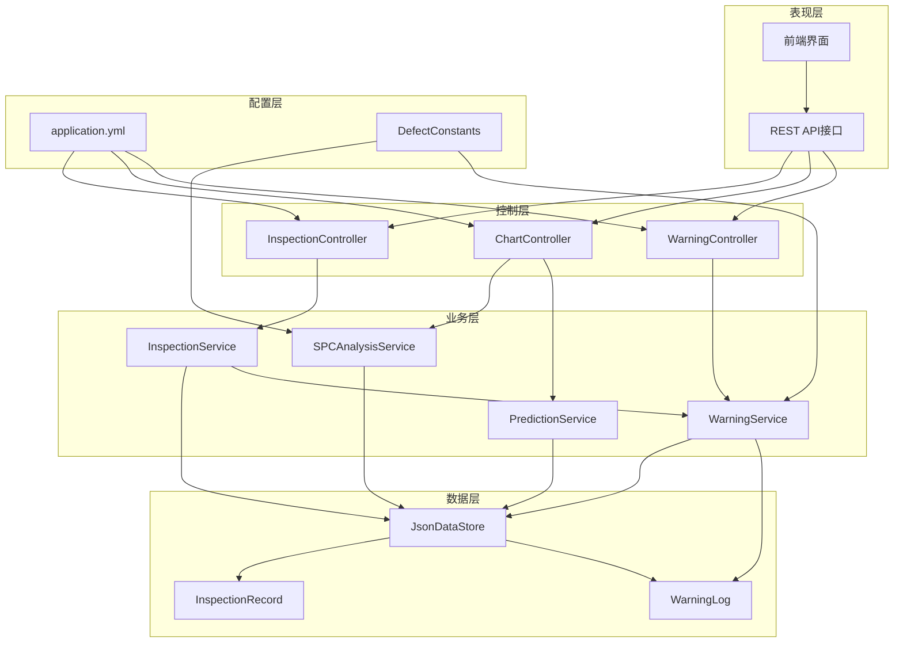
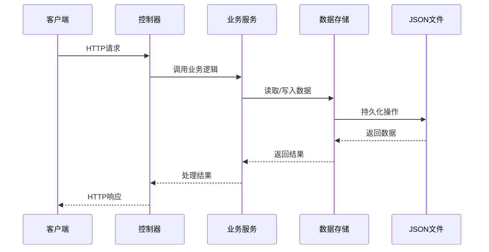
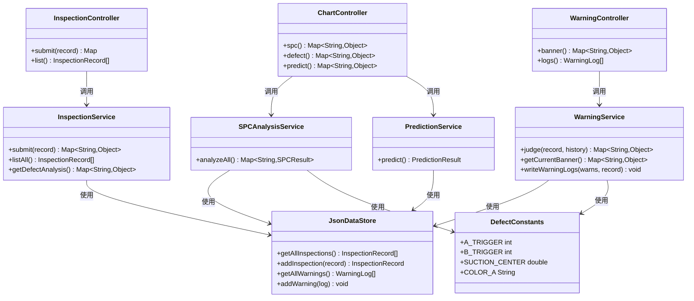

# API接口文档

<cite>
**本文档引用的文件**
- [QualityApplication.java](file://src/main/java/com/zjzy/quality/QualityApplication.java)
- [application.yml](file://src/main/resources/application.yml)
- [InspectionController.java](file://src/main/java/com/zjzy/quality/controller/InspectionController.java)
- [ChartController.java](file://src/main/java/com/zjzy/quality/controller/ChartController.java)
- [WarningController.java](file://src/main/java/com/zjzy/quality/controller/WarningController.java)
- [InspectionService.java](file://src/main/java/com/zjzy/quality/service/InspectionService.java)
- [SPCAnalysisService.java](file://src/main/java/com/zjzy/quality/service/SPCAnalysisService.java)
- [PredictionService.java](file://src/main/java/com/zjzy/quality/service/PredictionService.java)
- [WarningService.java](file://src/main/java/com/zjzy/quality/service/WarningService.java)
- [JsonDataStore.java](file://src/main/java/com/zjzy/quality/util/JsonDataStore.java)
- [InspectionRecord.java](file://src/main/java/com/zjzy/quality/entity/InspectionRecord.java)
- [WarningLog.java](file://src/main/java/com/zjzy/quality/entity/WarningLog.java)
- [DefectConstants.java](file://src/main/java/com/zjzy/quality/constant/DefectConstants.java)
</cite>

## 目录
1. [简介](#简介)
2. [项目结构](#项目结构)
3. [核心组件](#核心组件)
4. [架构概览](#架构概览)
5. [详细接口分析](#详细接口分析)
6. [依赖关系分析](#依赖关系分析)
7. [性能考虑](#性能考虑)
8. [故障排除指南](#故障排除指南)
9. [结论](#结论)

## 简介
卷烟全维度质检智能预警预判系统是一个基于Spring Boot构建的质量管理平台，提供完整的质量检测、预警分析和预测功能。系统通过RESTful API接口为前端提供数据支持，包括质检数据提交、历史查询、SPC图表分析、缺陷分析和AI预测等功能。

## 项目结构
系统采用经典的三层架构设计，主要分为以下层次：



**图表来源**
- [QualityApplication.java:12-24](file://src/main/java/com/zjzy/quality/QualityApplication.java#L12-L24)
- [application.yml:4-24](file://src/main/resources/application.yml#L4-L24)

**章节来源**
- [QualityApplication.java:12-24](file://src/main/java/com/zjzy/quality/QualityApplication.java#L12-L24)
- [application.yml:4-24](file://src/main/resources/application.yml#L4-L24)

## 核心组件
系统的核心组件包括四个控制器、五个服务类、两个实体类和一个常量配置类：

### 控制器层
- **InspectionController**: 质检数据相关接口
- **ChartController**: 图表数据分析接口  
- **WarningController**: 预警状态查询接口

### 服务层
- **InspectionService**: 质检数据业务逻辑处理
- **SPCAnalysisService**: 统计过程控制分析
- **PredictionService**: AI预测分析
- **WarningService**: 预警判定和日志管理

### 数据模型
- **InspectionRecord**: 质检记录实体
- **WarningLog**: 预警日志实体

### 工具类
- **JsonDataStore**: JSON数据持久化工具
- **DefectConstants**: 缺陷分级和质量标准常量

**章节来源**
- [InspectionController.java:13-34](file://src/main/java/com/zjzy/quality/controller/InspectionController.java#L13-L34)
- [ChartController.java:17-105](file://src/main/java/com/zjzy/quality/controller/ChartController.java#L17-L105)
- [WarningController.java:16-37](file://src/main/java/com/zjzy/quality/controller/WarningController.java#L16-L37)

## 架构概览
系统采用MVC架构模式，通过RESTful API提供服务。数据存储采用JSON文件格式，支持Mock数据生成和真实数据持久化。



**图表来源**
- [InspectionController.java:21-33](file://src/main/java/com/zjzy/quality/controller/InspectionController.java#L21-L33)
- [JsonDataStore.java:66-92](file://src/main/java/com/zjzy/quality/util/JsonDataStore.java#L66-L92)

**章节来源**
- [JsonDataStore.java:20-62](file://src/main/java/com/zjzy/quality/util/JsonDataStore.java#L20-L62)

## 详细接口分析

### 数据提交接口
**HTTP方法**: POST
**URL模式**: `/api/inspection/submit`

#### 请求参数
请求体为JSON格式的InspectionRecord对象，包含以下字段：

| 字段名 | 类型 | 必填 | 描述 | 示例值 |
|--------|------|------|------|--------|
| id | Long | 否 | 主键ID | null |
| date | String | 是 | 日期 | "2026-06-11" |
| shift | String | 是 | 班次 | "早班" |
| machineId | String | 是 | 机台编号 | "1#" |
| team | String | 是 | 班组 | "甲班" |
| totalInspected | Integer | 是 | 总抽检数量 | 120 |
| suction | Double | 否 | 吸阻(Pa) | 1085.0 |
| weight | Double | 否 | 单支重量(g) | 0.895 |
| circumference | Double | 否 | 圆周(mm) | 24.45 |
| cigaretteA | Integer | 否 | 烟支A类缺陷 | 0 |
| cigaretteB | Integer | 否 | 烟支B类缺陷 | 1 |
| cigaretteC | Integer | 否 | 烟支C类缺陷 | 2 |
| cigaretteD | Integer | 否 | 烟支D类缺陷 | 3 |
| boxSmallA | Integer | 否 | 小盒A类缺陷 | 0 |
| boxSmallB | Integer | 否 | 小盒B类缺陷 | 0 |
| boxSmallC | Integer | 否 | 小盒C类缺陷 | 1 |
| boxSmallD | Integer | 否 | 小盒D类缺陷 | 2 |
| cartonA | Integer | 否 | 条盒A类缺陷 | 0 |
| cartonB | Integer | 否 | 条盒B类缺陷 | 0 |
| cartonC | Integer | 否 | 条盒C类缺陷 | 1 |
| cartonD | Integer | 否 | 条盒D类缺陷 | 1 |
| caseAa | Integer | 否 | 箱装A类缺陷 | 0 |
| caseAb | Integer | 否 | 箱装B类缺陷 | 0 |
| caseAc | Integer | 否 | 箱装C类缺陷 | 0 |
| caseAd | Integer | 否 | 箱装D类缺陷 | 1 |
| riskLevel | String | 否 | 风险等级 | "平稳" |

#### 参数验证规则
- **必填字段**: date、shift、machineId、team、totalInspected
- **数值范围**: 
  - totalInspected ≥ 0
  - suction: 800-1400 Pa
  - weight: 0.7-1.0 g
  - circumference: 23.5-25.5 mm
- **枚举值**: shift必须为"早班"、"中班"或"晚班"

#### 响应格式
```json
{
  "success": true,
  "riskLevel": "高风险",
  "bannerText": "检出A类严重缺陷，高风险，立即复核",
  "bannerColor": "#FF3B30",
  "warnings": [
    {
      "level": "A",
      "count": 1,
      "desc": "检出A类严重缺陷1个，高风险，立即复核"
    }
  ],
  "message": "数据提交成功，风险等级：高风险"
}
```

#### 错误码说明
- **200**: 成功提交数据
- **400**: 请求参数验证失败
- **500**: 服务器内部错误

**章节来源**
- [InspectionController.java:21-24](file://src/main/java/com/zjzy/quality/controller/InspectionController.java#L21-L24)
- [InspectionService.java:19-44](file://src/main/java/com/zjzy/quality/service/InspectionService.java#L19-L44)
- [InspectionRecord.java:7-154](file://src/main/java/com/zjzy/quality/entity/InspectionRecord.java#L7-L154)

### 历史查询接口
**HTTP方法**: GET
**URL模式**: `/api/inspection/list`

#### 请求参数
无参数

#### 响应格式
返回InspectionRecord对象数组，每个对象包含完整的质检历史数据。

#### 错误码说明
- **200**: 成功获取历史数据
- **500**: 服务器内部错误

**章节来源**
- [InspectionController.java:30-33](file://src/main/java/com/zjzy/quality/controller/InspectionController.java#L30-L33)
- [InspectionService.java:49-51](file://src/main/java/com/zjzy/quality/service/InspectionService.java#L49-L51)

### SPC图表数据接口
**HTTP方法**: GET
**URL模式**: `/api/chart/spc`

#### 请求参数
无参数

#### 响应格式
```json
{
  "suction": {
    "label": "吸阻",
    "values": [1085.0, 1110.0, 1098.0],
    "center": 1100.0,
    "ucl": 1300.0,
    "lcl": 900.0,
    "severe": [
      {
        "index": 2,
        "desc": "规则1:超出3σ控制限"
      }
    ],
    "mild": []
  },
  "weight": {
    "label": "单支重量",
    "values": [0.895, 0.905, 0.898],
    "center": 0.900,
    "ucl": 0.980,
    "lcl": 0.820,
    "severe": [],
    "mild": []
  },
  "circumference": {
    "label": "圆周",
    "values": [24.45, 24.52, 24.48],
    "center": 24.50,
    "ucl": 24.90,
    "lcl": 24.10,
    "severe": [],
    "mild": []
  },
  "colorA": "#FF3B30",
  "colorC": "#FFCC00"
}
```

#### 错误码说明
- **200**: 成功获取SPC分析数据
- **500**: 服务器内部错误

**章节来源**
- [ChartController.java:25-70](file://src/main/java/com/zjzy/quality/controller/ChartController.java#L25-L70)
- [SPCAnalysisService.java:45-74](file://src/main/java/com/zjzy/quality/service/SPCAnalysisService.java#L45-L74)

### 缺陷分析接口
**HTTP方法**: GET
**URL模式**: `/api/chart/defect`

#### 请求参数
无参数

#### 响应格式
```json
{
  "pie": {
    "a": 150,
    "b": 200,
    "c": 180,
    "d": 120
  },
  "line": {
    "labels": ["06-11 早班", "06-11 中班", "06-11 晚班"],
    "a": [10, 15, 8],
    "b": [12, 18, 15],
    "c": [8, 12, 10],
    "d": [5, 8, 7]
  },
  "colorA": "#FF3B30",
  "colorB": "#FF9500",
  "colorC": "#FFCC00",
  "colorD": "#C7C7CC"
}
```

#### 错误码说明
- **200**: 成功获取缺陷分析数据
- **500**: 服务器内部错误

**章节来源**
- [ChartController.java:76-84](file://src/main/java/com/zjzy/quality/controller/ChartController.java#L76-L84)
- [InspectionService.java:56-100](file://src/main/java/com/zjzy/quality/service/InspectionService.java#L56-L100)

### AI预测接口
**HTTP方法**: GET
**URL模式**: `/api/chart/predict`

#### 请求参数
无参数

#### 响应格式
```json
{
  "historyDates": ["2026-06-11", "2026-06-12", "2026-06-13"],
  "historyRates": [1.2, 1.5, 1.8],
  "predDates": ["2026-06-21", "2026-06-22", "2026-06-23"],
  "predYhat": [2.1, 2.3, 2.5],
  "predUpper": [2.8, 3.0, 3.2],
  "predLower": [1.4, 1.6, 1.8],
  "hasRisk": true,
  "riskMsg": "预判存在批量质量风险",
  "colorA": "#FF3B30"
}
```

#### 错误码说明
- **200**: 成功获取预测数据
- **500**: 服务器内部错误

**章节来源**
- [ChartController.java:89-104](file://src/main/java/com/zjzy/quality/controller/ChartController.java#L89-L104)
- [PredictionService.java:50-159](file://src/main/java/com/zjzy/quality/service/PredictionService.java#L50-L159)

### 预警状态接口
**HTTP方法**: GET
**URL模式**: `/api/warning/banner`

#### 请求参数
无参数

#### 响应格式
```json
{
  "riskLevel": "高风险",
  "bannerText": "检出A类严重缺陷，高风险，立即复核",
  "bannerColor": "#FF3B30"
}
```

#### 错误码说明
- **200**: 成功获取预警状态
- **500**: 服务器内部错误

**章节来源**
- [WarningController.java:24-27](file://src/main/java/com/zjzy/quality/controller/WarningController.java#L24-L27)
- [WarningService.java:126-138](file://src/main/java/com/zjzy/quality/service/WarningService.java#L126-L138)

### 预警日志接口
**HTTP方法**: GET
**URL模式**: `/api/warning/logs`

#### 请求参数
无参数

#### 响应格式
返回WarningLog对象数组，包含所有A/B/C类预警日志。

#### 错误码说明
- **200**: 成功获取预警日志
- **500**: 服务器内部错误

**章节来源**
- [WarningController.java:33-36](file://src/main/java/com/zjzy/quality/controller/WarningController.java#L33-L36)
- [JsonDataStore.java:84-92](file://src/main/java/com/zjzy/quality/util/JsonDataStore.java#L84-L92)

## 依赖关系分析



**图表来源**
- [InspectionController.java:13-34](file://src/main/java/com/zjzy/quality/controller/InspectionController.java#L13-L34)
- [ChartController.java:17-105](file://src/main/java/com/zjzy/quality/controller/ChartController.java#L17-L105)
- [WarningController.java:16-37](file://src/main/java/com/zjzy/quality/controller/WarningController.java#L16-L37)

**章节来源**
- [InspectionService.java:12-101](file://src/main/java/com/zjzy/quality/service/InspectionService.java#L12-L101)
- [SPCAnalysisService.java:14-241](file://src/main/java/com/zjzy/quality/service/SPCAnalysisService.java#L14-L241)
- [PredictionService.java:14-169](file://src/main/java/com/zjzy/quality/service/PredictionService.java#L14-L169)
- [WarningService.java:15-140](file://src/main/java/com/zjzy/quality/service/WarningService.java#L15-L140)

## 性能考虑
系统采用内存缓存机制提高数据访问性能：

1. **内存缓存**: JsonDataStore使用ArrayList缓存质检记录和预警日志
2. **并发安全**: 所有数据操作都使用synchronized关键字保证线程安全
3. **延迟初始化**: 数据存储在应用启动时初始化，避免首次请求延迟
4. **Mock数据**: 首次启动自动生成30条Mock数据，确保系统可用性

## 故障排除指南

### 常见问题及解决方案

#### 1. 数据提交失败
**症状**: POST /api/inspection/submit 返回400错误
**原因**: 请求参数验证失败
**解决方案**:
- 检查必填字段是否完整
- 验证数值范围是否在允许范围内
- 确认班次字段值为"早班"、"中班"或"晚班"

#### 2. 图表数据为空
**症状**: GET /api/chart/* 接口返回空数据
**原因**: 数据文件损坏或不存在
**解决方案**:
- 检查data目录下的JSON文件是否存在
- 删除损坏的JSON文件，重启应用自动生成Mock数据
- 确认文件权限正确

#### 3. 预测功能异常
**症状**: GET /api/chart/predict 返回空结果
**原因**: 历史数据不足
**解决方案**:
- 确保至少有2条历史质检记录
- 检查数据文件完整性
- 验证数据格式正确性

#### 4. 应用启动失败
**症状**: 应用无法启动
**原因**: 端口被占用或配置错误
**解决方案**:
- 检查application.yml中的端口设置
- 确认8080端口未被其他程序占用
- 验证JVM版本兼容性

**章节来源**
- [JsonDataStore.java:46-62](file://src/main/java/com/zjzy/quality/util/JsonDataStore.java#L46-L62)
- [application.yml:4-24](file://src/main/resources/application.yml#L4-L24)

## 结论
本API接口文档详细描述了卷烟全维度质检智能预警预判系统的RESTful API规范。系统提供了完整的质量检测、预警分析和预测功能，具有以下特点：

1. **完整的功能覆盖**: 包含质检数据提交、历史查询、SPC分析、缺陷分析、AI预测等核心功能
2. **清晰的接口设计**: 采用RESTful风格，参数和响应格式标准化
3. **灵活的配置**: 通过DefectConstants类轻松调整质量标准和阈值
4. **可靠的数据持久化**: 支持JSON文件存储和Mock数据生成
5. **良好的扩展性**: 模块化设计便于功能扩展和维护

建议在生产环境中：
- 配置适当的日志级别
- 设置合理的数据备份策略
- 考虑迁移到关系型数据库
- 添加API访问频率限制
- 实现更完善的错误处理机制