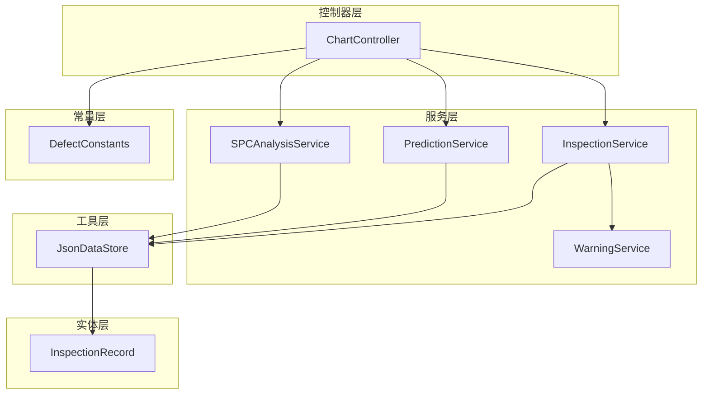
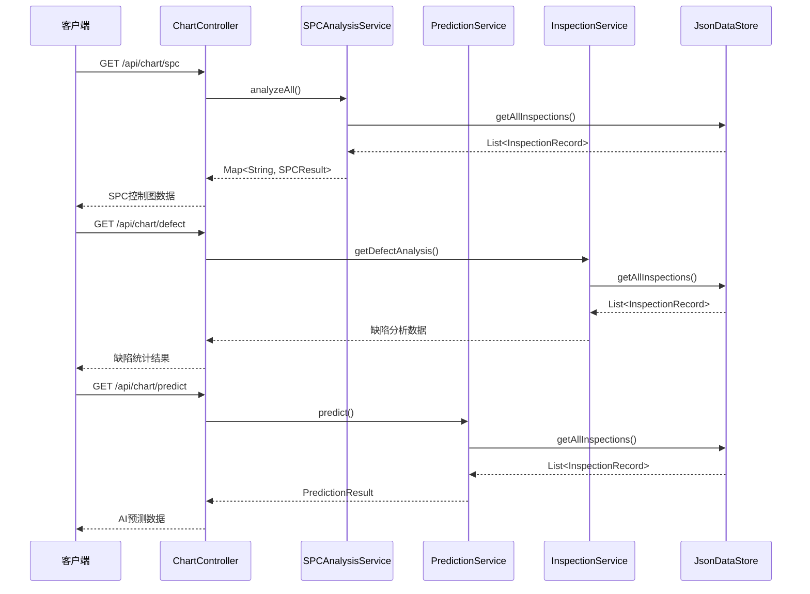
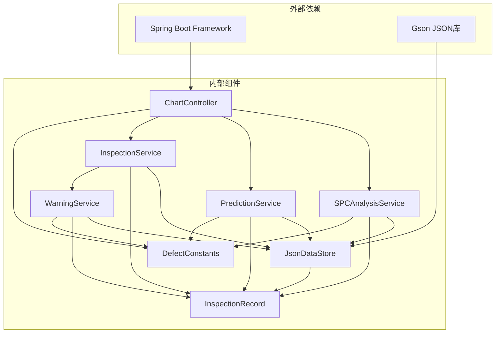

# 图表数据API

<cite>
**本文引用的文件**
- [ChartController.java](file://src/main/java/com/zjzy/quality/controller/ChartController.java)
- [SPCAnalysisService.java](file://src/main/java/com/zjzy/quality/service/SPCAnalysisService.java)
- [PredictionService.java](file://src/main/java/com/zjzy/quality/service/PredictionService.java)
- [InspectionService.java](file://src/main/java/com/zjzy/quality/service/InspectionService.java)
- [DefectConstants.java](file://src/main/java/com/zjzy/quality/constant/DefectConstants.java)
- [JsonDataStore.java](file://src/main/java/com/zjzy/quality/util/JsonDataStore.java)
- [InspectionRecord.java](file://src/main/java/com/zjzy/quality/entity/InspectionRecord.java)
- [WarningService.java](file://src/main/java/com/zjzy/quality/service/WarningService.java)
- [application.yml](file://src/main/resources/application.yml)
</cite>

## 目录
1. [简介](#简介)
2. [项目结构](#项目结构)
3. [核心组件](#核心组件)
4. [架构概览](#架构概览)
5. [详细组件分析](#详细组件分析)
6. [依赖分析](#依赖分析)
7. [性能考虑](#性能考虑)
8. [故障排除指南](#故障排除指南)
9. [结论](#结论)
10. [附录](#附录)

## 简介
本文件为质量检测系统的图表数据API详细文档，涵盖四种主要图表的数据接口规范：
- SPC控制图数据接口：用于展示吸阻、单支重量、圆周三项物测指标的控制图数据
- 缺陷分析数据接口：用于展示A/B/C/D四类缺陷的统计分析
- AI预测数据接口：用于展示未来7天的质量风险预测数据
- 风险等级数据接口：用于展示当前质量风险等级

该系统采用Spring Boot框架构建，使用JSON文件作为数据存储，支持实时数据更新和历史数据分析。

## 项目结构
系统采用分层架构设计，主要包含以下层次：
- 控制器层：处理HTTP请求，提供RESTful API接口
- 服务层：实现核心业务逻辑，包括SPC分析、预测计算、缺陷统计等
- 实体层：定义数据模型和业务实体
- 工具层：提供数据持久化和工具类功能
- 常量层：定义系统常量和配置参数



**图表来源**
- [ChartController.java:17-106](file://src/main/java/com/zjzy/quality/controller/ChartController.java#L17-L106)
- [SPCAnalysisService.java:14-241](file://src/main/java/com/zjzy/quality/service/SPCAnalysisService.java#L14-L241)
- [PredictionService.java:14-169](file://src/main/java/com/zjzy/quality/service/PredictionService.java#L14-L169)
- [InspectionService.java:12-102](file://src/main/java/com/zjzy/quality/service/InspectionService.java#L12-L102)
- [JsonDataStore.java:20-222](file://src/main/java/com/zjzy/quality/util/JsonDataStore.java#L20-L222)
- [DefectConstants.java:7-76](file://src/main/java/com/zjzy/quality/constant/DefectConstants.java#L7-L76)

**章节来源**
- [ChartController.java:17-106](file://src/main/java/com/zjzy/quality/controller/ChartController.java#L17-L106)
- [application.yml:1-24](file://src/main/resources/application.yml#L1-L24)

## 核心组件
本系统的核心组件包括四个主要的图表数据接口，每个接口都针对特定的业务需求提供定制化的数据格式。

### 接口概述
- **SPC控制图接口**：GET /api/chart/spc，返回三类物测指标的控制图数据
- **缺陷分析接口**：GET /api/chart/defect，返回缺陷统计分析数据
- **AI预测接口**：GET /api/chart/predict，返回未来7天质量风险预测数据
- **风险等级接口**：GET /api/chart/risk，返回当前质量风险等级

### 数据存储机制
系统使用JSON文件作为数据存储后端，通过JsonDataStore工具类管理数据的读写操作。数据存储在项目根目录的data文件夹中，包含质检记录和预警日志两个主要文件。

**章节来源**
- [ChartController.java:25-104](file://src/main/java/com/zjzy/quality/controller/ChartController.java#L25-L104)
- [JsonDataStore.java:20-149](file://src/main/java/com/zjzy/quality/util/JsonDataStore.java#L20-L149)

## 架构概览
系统采用经典的MVC架构模式，通过RESTful API提供数据服务。各组件之间的交互关系如下：



**图表来源**
- [ChartController.java:25-104](file://src/main/java/com/zjzy/quality/controller/ChartController.java#L25-L104)
- [SPCAnalysisService.java:45-74](file://src/main/java/com/zjzy/quality/service/SPCAnalysisService.java#L45-L74)
- [PredictionService.java:50-159](file://src/main/java/com/zjzy/quality/service/PredictionService.java#L50-L159)
- [InspectionService.java:56-99](file://src/main/java/com/zjzy/quality/service/InspectionService.java#L56-L99)

## 详细组件分析

### SPC控制图数据接口
SPC（统计过程控制）控制图用于监控生产过程的稳定性，通过控制上限、中心线、控制下限来识别异常波动。

#### 接口规范
- **URL**：GET /api/chart/spc
- **功能**：返回吸阻、单支重量、圆周三项物测指标的SPC控制图数据
- **响应格式**：JSON对象，包含三个指标的数据和全局配色信息

#### 数据结构详解
每个物测指标返回以下字段：
- **label**：指标中文名称（吸阻、单支重量、圆周）
- **values**：历史数据点数组
- **center**：中心线值
- **ucl**：上控制限
- **lcl**：下控制限
- **severe**：严重异常点列表
- **mild**：轻微偏离点列表

严重异常点包含：
- **index**：异常点在数据序列中的索引位置
- **desc**：异常规则描述（如"规则1:超出3σ控制限"）

轻微偏离点包含：
- **index**：偏离点在数据序列中的索引位置
- **desc**：偏离规则描述

全局配色信息：
- **colorA**：Apple红，用于严重缺陷
- **colorC**：Apple黄，用于一般缺陷

#### SPC判异规则
系统实现了Nelson八条SPC判异规则：
1. **单点超出3σ控制限**：最严重的异常，标记为红色
2. **连续9点在中心线同侧**：表示过程偏移
3. **连续6点递增或递减**：表示趋势性变化
4. **连续14点交替升降**：表示周期性波动
5. **连续3点中2点超出2σ**：表示轻微异常
6. **连续5点中4点超出1σ**：表示轻微异常
7. **连续15点在1σ内**：表示过度控制
8. **连续8点在1σ外两侧**：表示混合异常

#### 响应示例
```json
{
  "suction": {
    "label": "吸阻",
    "values": [1100.0, 1085.0, 1098.0, 1110.0],
    "center": 1100.0,
    "ucl": 1300.0,
    "lcl": 900.0,
    "severe": [
      {"index": 2, "desc": "规则1:超出3σ控制限"}
    ],
    "mild": []
  },
  "weight": {
    "label": "单支重量",
    "values": [0.900, 0.895, 0.905, 0.910],
    "center": 0.900,
    "ucl": 0.980,
    "lcl": 0.820,
    "severe": [],
    "mild": [
      {"index": 1, "desc": "规则2:连续9点同侧"}
    ]
  },
  "circumference": {
    "label": "圆周",
    "values": [24.50, 24.45, 24.52, 24.55],
    "center": 24.50,
    "ucl": 24.90,
    "lcl": 24.10,
    "severe": [],
    "mild": []
  },
  "colorA": "#FF3B30",
  "colorC": "#FFCC00"
}
```

**章节来源**
- [ChartController.java:25-70](file://src/main/java/com/zjzy/quality/controller/ChartController.java#L25-L70)
- [SPCAnalysisService.java:19-39](file://src/main/java/com/zjzy/quality/service/SPCAnalysisService.java#L19-L39)
- [SPCAnalysisService.java:79-239](file://src/main/java/com/zjzy/quality/service/SPCAnalysisService.java#L79-L239)
- [DefectConstants.java:23-53](file://src/main/java/com/zjzy/quality/constant/DefectConstants.java#L23-L53)

### 缺陷分析数据接口
缺陷分析接口提供A/B/C/D四类缺陷的统计分析，支持饼图和折线图两种可视化形式。

#### 接口规范
- **URL**：GET /api/chart/defect
- **功能**：返回缺陷统计分析数据，包括各类缺陷的总量和近期趋势
- **响应格式**：JSON对象，包含饼图数据和折线图数据

#### 数据结构详解
**饼图数据（pie）**：
- **a**：A类严重缺陷累计总数
- **b**：B类较重缺陷累计总数  
- **c**：C类一般缺陷累计总数
- **d**：D类轻微缺陷累计总数

**折线图数据（line）**：
- **labels**：X轴标签数组，格式为"MM-DD 班次"
- **a**：A类缺陷数量数组
- **b**：B类缺陷数量数组
- **c**：C类缺陷数量数组
- **d**：D类缺陷数量数组

#### 响应示例
```json
{
  "pie": {
    "a": 150,
    "b": 230,
    "c": 450,
    "d": 1200
  },
  "line": {
    "labels": ["06-11 早班", "06-11 中班", "06-11 晚班", "06-12 早班"],
    "a": [12, 8, 15, 10],
    "b": [25, 30, 28, 22],
    "c": [60, 55, 70, 65],
    "d": [150, 140, 160, 130]
  },
  "colorA": "#FF3B30",
  "colorB": "#FF9500",
  "colorC": "#FFCC00",
  "colorD": "#C7C7CC"
}
```

**章节来源**
- [ChartController.java:76-84](file://src/main/java/com/zjzy/quality/controller/ChartController.java#L76-L84)
- [InspectionService.java:56-99](file://src/main/java/com/zjzy/quality/service/InspectionService.java#L56-L99)
- [DefectConstants.java:46-55](file://src/main/java/com/zjzy/quality/constant/DefectConstants.java#L46-L55)

### AI预测数据接口
AI预测接口使用Holt双参数指数平滑算法对未来7天的质量风险进行预测，提供预测值、置信区间和风险评估。

#### 接口规范
- **URL**：GET /api/chart/predict
- **功能**：返回未来7天的质量风险预测数据
- **响应格式**：JSON对象，包含历史数据、预测数据和风险评估

#### 数据结构详解
**历史数据**：
- **historyDates**：历史日期数组
- **historyRates**：历史不良率数组（百分比）

**预测数据**：
- **predDates**：预测日期数组（未来7天）
- **predYhat**：预测不良率数组
- **predUpper**：预测上界数组（95%置信区间）
- **predLower**：预测下界数组（95%置信区间）

**风险评估**：
- **hasRisk**：是否存在批量质量风险（布尔值）
- **riskMsg**：风险评估消息

#### 预测算法说明
系统使用Holt双参数指数平滑算法：
- **平滑参数**：α=0.3（观测平滑），β=0.1（趋势平滑）
- **预测天数**：7天
- **置信区间**：95%（使用1.96倍标准差）
- **风险判断**：当预测最大值超过近期平均值的1.5倍且A/B类缺陷占比大于0时，判定存在批量质量风险

#### 响应示例
```json
{
  "historyDates": ["2026-06-11", "2026-06-12", "2026-06-13", "2026-06-14"],
  "historyRates": [2.1, 1.8, 2.3, 1.9],
  "predDates": ["2026-06-15", "2026-06-16", "2026-06-17", "2026-06-18", "2026-06-19", "2026-06-20", "2026-06-21"],
  "predYhat": [2.0, 2.1, 2.2, 2.3, 2.4, 2.5, 2.6],
  "predUpper": [2.8, 2.9, 3.0, 3.1, 3.2, 3.3, 3.4],
  "predLower": [1.2, 1.3, 1.4, 1.5, 1.6, 1.7, 1.8],
  "hasRisk": true,
  "riskMsg": "预判存在批量质量风险",
  "colorA": "#FF3B30"
}
```

**章节来源**
- [ChartController.java:90-104](file://src/main/java/com/zjzy/quality/controller/ChartController.java#L90-L104)
- [PredictionService.java:25-45](file://src/main/java/com/zjzy/quality/service/PredictionService.java#L25-L45)
- [PredictionService.java:50-159](file://src/main/java/com/zjzy/quality/service/PredictionService.java#L50-L159)

### 风险等级数据接口
风险等级接口提供当前质量风险等级的状态信息，用于显示实时的风险状态。

#### 接口规范
- **URL**：GET /api/chart/risk
- **功能**：返回当前质量风险等级和状态信息
- **响应格式**：JSON对象，包含风险等级、横幅文本和颜色

#### 数据结构详解
- **riskLevel**：风险等级（高风险、中度风险、一般风险、平稳）
- **bannerText**：横幅显示文本
- **bannerColor**：横幅颜色代码

#### 响应示例
```json
{
  "riskLevel": "一般风险",
  "bannerText": "C类缺陷连续上涨，一般风险，请关注",
  "bannerColor": "#FFCC00"
}
```

**章节来源**
- [WarningService.java:126-138](file://src/main/java/com/zjzy/quality/service/WarningService.java#L126-L138)

## 依赖分析
系统各组件之间的依赖关系清晰明确，遵循单一职责原则和依赖倒置原则。



**图表来源**
- [ChartController.java:3-6](file://src/main/java/com/zjzy/quality/controller/ChartController.java#L3-L6)
- [SPCAnalysisService.java:3-5](file://src/main/java/com/zjzy/quality/service/SPCAnalysisService.java#L3-L5)
- [PredictionService.java:3-5](file://src/main/java/com/zjzy/quality/service/PredictionService.java#L3-L5)
- [InspectionService.java:3-4](file://src/main/java/com/zjzy/quality/service/InspectionService.java#L3-L4)
- [JsonDataStore.java:3-6](file://src/main/java/com/zjzy/quality/util/JsonDataStore.java#L3-L6)

### 组件耦合度分析
- **控制器层**：低耦合，仅依赖服务层接口
- **服务层**：中等耦合，依赖实体层和工具层
- **实体层**：低耦合，纯数据模型
- **工具层**：低耦合，提供通用功能
- **常量层**：极低耦合，提供配置参数

### 外部依赖
- **Spring Boot**：提供Web框架和依赖注入功能
- **Gson**：提供JSON序列化和反序列化功能
- **Java标准库**：提供基础数据结构和工具类

**章节来源**
- [ChartController.java:1-106](file://src/main/java/com/zjzy/quality/controller/ChartController.java#L1-L106)
- [JsonDataStore.java:26-29](file://src/main/java/com/zjzy/quality/util/JsonDataStore.java#L26-L29)

## 性能考虑
系统在设计时充分考虑了性能优化，采用多种策略确保高效运行。

### 数据缓存策略
- **内存缓存**：质检记录和预警日志均存储在内存中，避免频繁的磁盘I/O操作
- **懒加载**：数据文件在首次访问时才加载到内存
- **线程安全**：使用synchronized关键字确保多线程环境下的数据一致性

### 算法优化
- **SPC分析**：采用O(n)时间复杂度的线性扫描算法，避免嵌套循环
- **预测计算**：使用增量式指数平滑，避免重复计算
- **数据聚合**：在单次遍历中完成多项统计计算

### 内存管理
- **对象池**：复用临时对象，减少垃圾回收压力
- **延迟初始化**：仅在需要时创建数据结构
- **流式处理**：对于大数据集采用流式处理方式

### 系统配置
- **端口配置**：默认8080端口，可通过application.yml配置
- **静态资源**：前端资源位于classpath:/static/目录
- **日志级别**：生产环境默认INFO级别

**章节来源**
- [JsonDataStore.java:31-39](file://src/main/java/com/zjzy/quality/util/JsonDataStore.java#L31-L39)
- [SPCAnalysisService.java:79-239](file://src/main/java/com/zjzy/quality/service/SPCAnalysisService.java#L79-L239)
- [PredictionService.java:92-132](file://src/main/java/com/zjzy/quality/service/PredictionService.java#L92-L132)
- [application.yml:4-24](file://src/main/resources/application.yml#L4-L24)

## 故障排除指南
系统提供了完善的错误处理和诊断机制，帮助快速定位和解决问题。

### 常见问题及解决方案
**数据加载失败**
- **症状**：系统启动时报错，无法加载历史数据
- **原因**：data目录不存在或权限不足
- **解决**：检查data目录权限，确保应用程序有读写权限

**API响应为空**
- **症状**：调用图表接口返回空数据
- **原因**：数据文件损坏或格式错误
- **解决**：检查JSON文件格式，重新生成Mock数据

**预测结果异常**
- **症状**：AI预测结果不合理
- **原因**：历史数据不足或异常值影响
- **解决**：检查历史数据质量，确保至少有2天的有效数据

### 错误码定义
- **200 OK**：请求成功
- **404 Not Found**：接口不存在
- **500 Internal Server Error**：服务器内部错误

### 调试建议
1. **启用详细日志**：在application.yml中设置日志级别为DEBUG
2. **检查数据完整性**：验证JSON文件格式正确性
3. **监控内存使用**：观察内存占用情况，避免内存泄漏
4. **测试API接口**：使用curl或Postman测试各个接口

**章节来源**
- [JsonDataStore.java:96-133](file://src/main/java/com/zjzy/quality/util/JsonDataStore.java#L96-L133)
- [application.yml:20-24](file://src/main/resources/application.yml#L20-L24)

## 结论
本图表数据API系统提供了完整的质量检测数据分析功能，具有以下特点：

### 技术优势
- **架构清晰**：采用分层架构，职责分离明确
- **扩展性强**：易于添加新的图表类型和分析算法
- **性能优异**：内存缓存和优化算法确保高效运行
- **易于维护**：代码结构清晰，注释完整

### 业务价值
- **实时监控**：提供实时的质量数据可视化
- **风险预警**：提前发现潜在的质量问题
- **决策支持**：为管理层提供数据驱动的决策依据
- **成本控制**：通过预防性措施降低质量成本

### 改进建议
1. **数据库迁移**：从JSON文件迁移到关系型数据库
2. **缓存优化**：实现分布式缓存机制
3. **监控告警**：集成APM监控和告警系统
4. **API版本化**：支持API版本管理和向后兼容

## 附录

### API接口清单
| 接口 | 方法 | URL | 功能 |
|------|------|-----|------|
| SPC控制图 | GET | /api/chart/spc | 返回SPC控制图数据 |
| 缺陷分析 | GET | /api/chart/defect | 返回缺陷统计分析 |
| AI预测 | GET | /api/chart/predict | 返回质量风险预测 |
| 风险等级 | GET | /api/chart/risk | 返回当前风险状态 |

### 数据更新频率
- **实时更新**：新增质检数据后，图表数据即时更新
- **历史数据**：从data目录的JSON文件加载
- **缓存策略**：内存缓存，进程生命周期内保持

### 配置参数
- **服务器端口**：8080（可在application.yml中修改）
- **数据存储路径**：项目根目录/data/
- **Mock数据**：自动生成30条示例数据

**章节来源**
- [ChartController.java:25-104](file://src/main/java/com/zjzy/quality/controller/ChartController.java#L25-L104)
- [application.yml:4-17](file://src/main/resources/application.yml#L4-L17)
- [JsonDataStore.java:22-62](file://src/main/java/com/zjzy/quality/util/JsonDataStore.java#L22-L62)