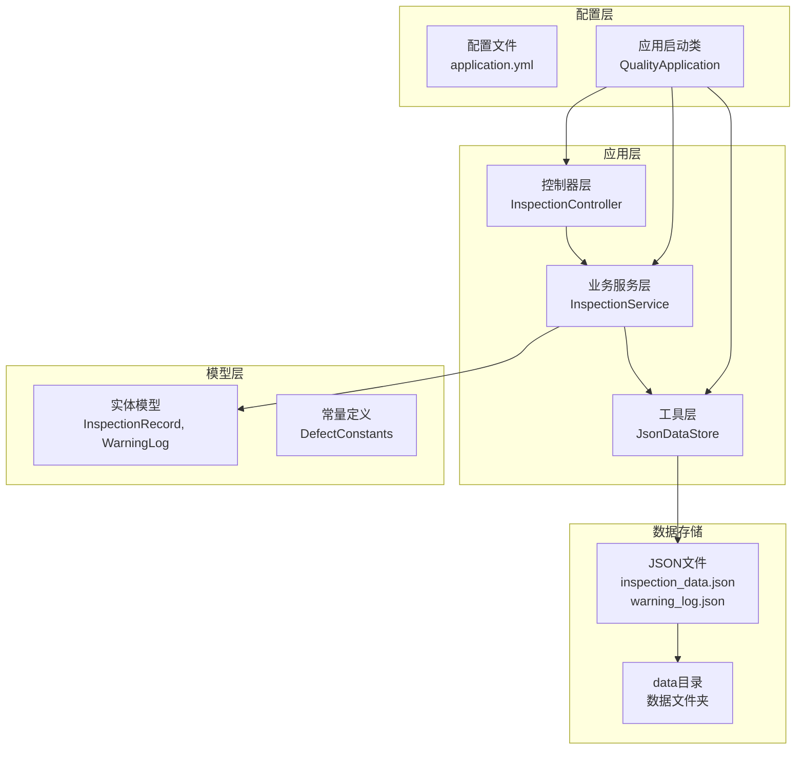
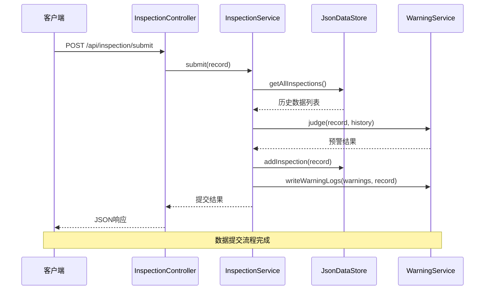
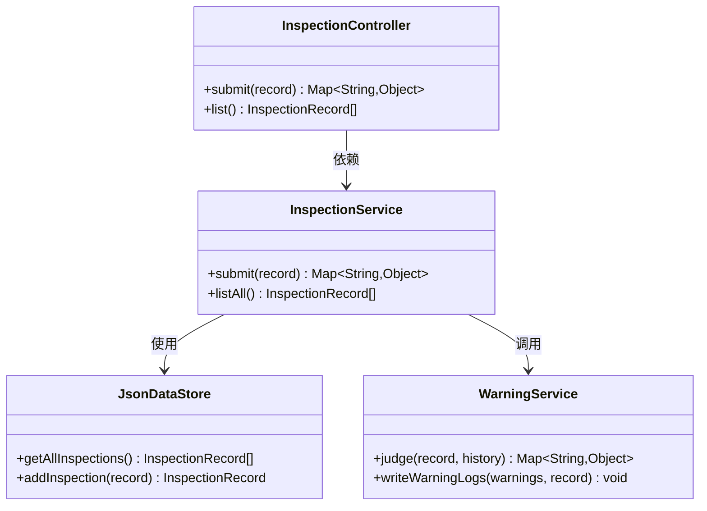
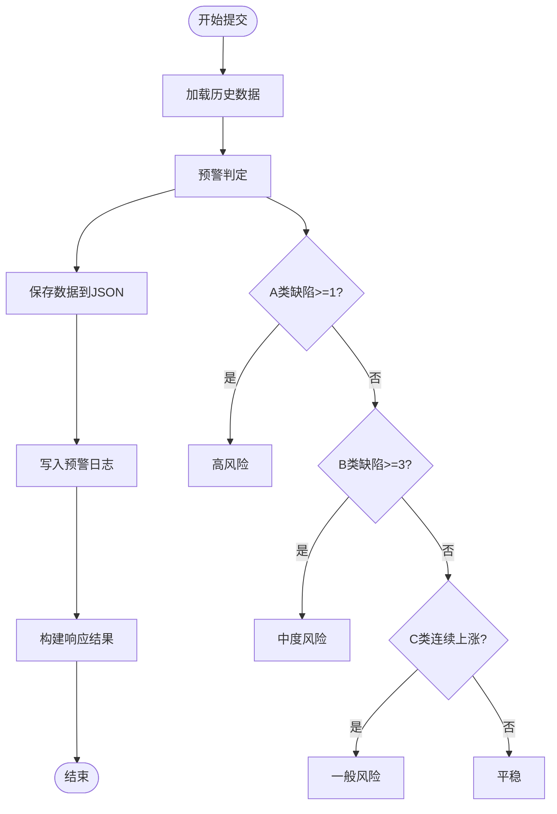
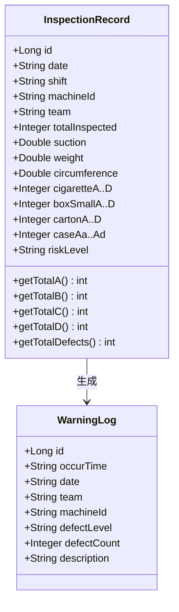
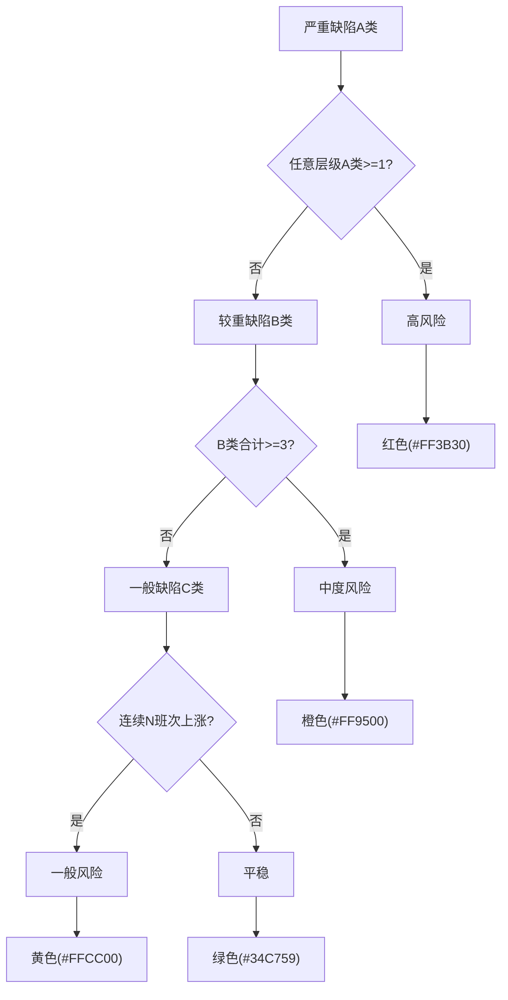
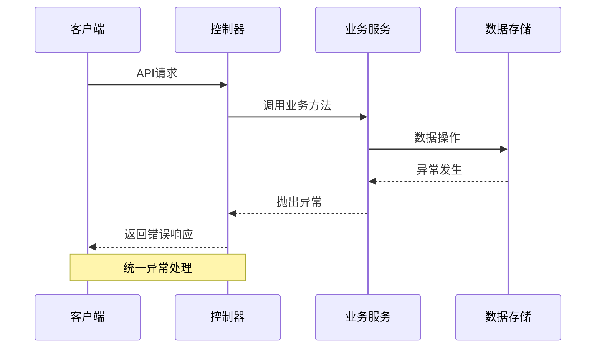

# 质检数据API

<cite>
**本文档引用的文件**
- [InspectionController.java](file://src/main/java/com/zjzy/quality/controller/InspectionController.java)
- [InspectionService.java](file://src/main/java/com/zjzy/quality/service/InspectionService.java)
- [InspectionRecord.java](file://src/main/java/com/zjzy/quality/entity/InspectionRecord.java)
- [WarningService.java](file://src/main/java/com/zjzy/quality/service/WarningService.java)
- [DefectConstants.java](file://src/main/java/com/zjzy/quality/constant/DefectConstants.java)
- [JsonDataStore.java](file://src/main/java/com/zjzy/quality/util/JsonDataStore.java)
- [WarningLog.java](file://src/main/java/com/zjzy/quality/entity/WarningLog.java)
- [application.yml](file://src/main/resources/application.yml)
- [QualityApplication.java](file://src/main/java/com/zjzy/quality/QualityApplication.java)
- [pom.xml](file://pom.xml)
</cite>

## 目录
1. [简介](#简介)
2. [项目结构](#项目结构)
3. [核心组件](#核心组件)
4. [架构概览](#架构概览)
5. [详细组件分析](#详细组件分析)
6. [API规范详解](#api规范详解)
7. [数据验证与规则](#数据验证与规则)
8. [错误处理与异常](#错误处理与异常)
9. [性能考虑](#性能考虑)
10. [故障排除指南](#故障排除指南)
11. [最佳实践](#最佳实践)
12. [结论](#结论)

## 简介

卷烟全维度质检智能预警预判系统是一个基于Spring Boot构建的Web应用程序，专门用于卷烟生产过程中的质量检测数据管理。该系统提供了完整的质检数据提交、历史查询和智能预警功能，支持A/B/C/D四级缺陷分类和SPC统计过程控制分析。

系统采用JSON文件作为数据持久化层，支持实时图表展示和智能预警，为卷烟生产企业提供数字化的质量管理解决方案。

## 项目结构

该项目采用标准的Spring Boot项目结构，主要分为以下几个层次：



**图表来源**
- [QualityApplication.java:12-24](file://src/main/java/com/zjzy/quality/QualityApplication.java#L12-L24)
- [InspectionController.java:13-34](file://src/main/java/com/zjzy/quality/controller/InspectionController.java#L13-L34)
- [JsonDataStore.java:20-62](file://src/main/java/com/zjzy/quality/util/JsonDataStore.java#L20-L62)

**章节来源**
- [application.yml:1-24](file://src/main/resources/application.yml#L1-L24)
- [pom.xml:1-77](file://pom.xml#L1-L77)

## 核心组件

系统的核心组件包括：

### 控制器层
- **InspectionController**: REST API入口点，提供质检数据的提交和查询接口
- **ChartController**: 图表数据接口（用于前端可视化展示）

### 业务服务层
- **InspectionService**: 质检数据业务逻辑处理，包含数据验证、预警判定和日志记录
- **WarningService**: 预警判定服务，基于缺陷分级标准进行风险评估
- **SPCAnalysisService**: 统计过程控制分析服务
- **PredictionService**: 质量预测服务

### 实体模型层
- **InspectionRecord**: 质检记录实体，包含完整的质量检测数据
- **WarningLog**: 预警日志实体，记录触发的预警信息

### 工具层
- **JsonDataStore**: JSON文件持久化工具，负责数据的读写和缓存管理

**章节来源**
- [InspectionController.java:10-34](file://src/main/java/com/zjzy/quality/controller/InspectionController.java#L10-L34)
- [InspectionService.java:8-102](file://src/main/java/com/zjzy/quality/service/InspectionService.java#L8-L102)

## 架构概览

系统采用分层架构设计，实现了清晰的关注点分离：



**图表来源**
- [InspectionController.java:21-24](file://src/main/java/com/zjzy/quality/controller/InspectionController.java#L21-L24)
- [InspectionService.java:20-44](file://src/main/java/com/zjzy/quality/service/InspectionService.java#L20-L44)
- [JsonDataStore.java:66-75](file://src/main/java/com/zjzy/quality/util/JsonDataStore.java#L66-L75)
- [WarningService.java:23-99](file://src/main/java/com/zjzy/quality/service/WarningService.java#L23-L99)

## 详细组件分析

### InspectionController 分析

InspectionController是系统的主要API入口，提供了两个核心接口：



**图表来源**
- [InspectionController.java:13-34](file://src/main/java/com/zjzy/quality/controller/InspectionController.java#L13-L34)
- [InspectionService.java:12-102](file://src/main/java/com/zjzy/quality/service/InspectionService.java#L12-L102)
- [JsonDataStore.java:20-92](file://src/main/java/com/zjzy/quality/util/JsonDataStore.java#L20-L92)
- [WarningService.java:15-140](file://src/main/java/com/zjzy/quality/service/WarningService.java#L15-L140)

**章节来源**
- [InspectionController.java:10-34](file://src/main/java/com/zjzy/quality/controller/InspectionController.java#L10-L34)

### InspectionService 分析

InspectionService是业务逻辑的核心，负责完整的数据处理流程：



**图表来源**
- [InspectionService.java:19-44](file://src/main/java/com/zjzy/quality/service/InspectionService.java#L19-L44)
- [WarningService.java:23-99](file://src/main/java/com/zjzy/quality/service/WarningService.java#L23-L99)

**章节来源**
- [InspectionService.java:14-44](file://src/main/java/com/zjzy/quality/service/InspectionService.java#L14-L44)

### 数据模型分析

InspectionRecord实体类包含了完整的质检数据结构：



**图表来源**
- [InspectionRecord.java:7-154](file://src/main/java/com/zjzy/quality/entity/InspectionRecord.java#L7-L154)
- [WarningLog.java:7-44](file://src/main/java/com/zjzy/quality/entity/WarningLog.java#L7-L44)

**章节来源**
- [InspectionRecord.java:16-154](file://src/main/java/com/zjzy/quality/entity/InspectionRecord.java#L16-L154)

## API规范详解

### POST /api/inspection/submit 接口

#### 请求参数格式

提交质检数据的请求体必须包含以下字段：

| 字段名 | 类型 | 必填 | 描述 | 取值范围 |
|--------|------|------|------|----------|
| date | String | 是 | 日期 | 格式：YYYY-MM-DD |
| shift | String | 是 | 班次 | 早班/中班/晚班 |
| machineId | String | 是 | 机台编号 | 例如："1#" |
| team | String | 是 | 班组 | 例如："甲班" |
| totalInspected | Integer | 是 | 总抽检数量 | > 0 |
| suction | Double | 是 | 吸阻(Pa) | 800-1500 |
| weight | Double | 是 | 单支重量(g) | 0.7-1.2 |
| circumference | Double | 是 | 圆周(mm) | 23.5-25.5 |
| cigaretteA-D | Integer | 是 | 烟支外观缺陷数量 | ≥ 0 |
| boxSmallA-D | Integer | 是 | 小盒外观缺陷数量 | ≥ 0 |
| cartonA-D | Integer | 是 | 条盒外观缺陷数量 | ≥ 0 |
| caseAa-Ad | Integer | 是 | 箱装外观缺陷数量 | ≥ 0 |

#### 成功响应格式

```json
{
  "success": true,
  "riskLevel": "平稳",
  "bannerText": "数据提交成功，风险等级：平稳",
  "bannerColor": "#34C759",
  "warnings": [],
  "message": "数据提交成功，风险等级：平稳"
}
```

#### 失败响应格式

```json
{
  "success": false,
  "error": "参数校验失败",
  "message": "吸阻值超出正常范围"
}
```

### GET /api/inspection/list 接口

#### 响应数据结构

该接口返回完整的质检历史数据列表，每个元素包含以下字段：

| 字段名 | 类型 | 描述 |
|--------|------|------|
| id | Long | 数据记录ID |
| date | String | 日期 |
| shift | String | 班次 |
| machineId | String | 机台编号 |
| team | String | 班组 |
| totalInspected | Integer | 总抽检数量 |
| suction | Double | 吸阻(Pa) |
| weight | Double | 单支重量(g) |
| circumference | Double | 圆周(mm) |
| cigaretteA-D | Integer | 烟支缺陷数量 |
| boxSmallA-D | Integer | 小盒缺陷数量 |
| cartonA-D | Integer | 条盒缺陷数量 |
| caseAa-Ad | Integer | 箱装缺陷数量 |
| riskLevel | String | 风险等级 |

#### 分页机制

当前实现采用全量返回策略，未实现分页功能。对于大量历史数据，建议客户端进行分页处理或使用数据库存储替代方案。

**章节来源**
- [InspectionController.java:17-33](file://src/main/java/com/zjzy/quality/controller/InspectionController.java#L17-L33)
- [InspectionService.java:49-51](file://src/main/java/com/zjzy/quality/service/InspectionService.java#L49-L51)

## 数据验证与规则

### 缺陷分级标准

系统采用A/B/C/D四级缺陷分类标准：



**图表来源**
- [WarningService.java:23-99](file://src/main/java/com/zjzy/quality/service/WarningService.java#L23-L99)
- [DefectConstants.java:11-18](file://src/main/java/com/zjzy/quality/constant/DefectConstants.java#L11-L18)

### 物测指标内控标准

系统内置了严格的物测指标控制限：

| 指标类型 | 中心线 | 上控制限(UCL) | 下控制限(LCL) | 正常范围 |
|----------|--------|---------------|---------------|----------|
| 吸阻(Pa) | 1100.0 | 1300.0 | 900.0 | 900-1300 |
| 单支重量(g) | 0.900 | 0.980 | 0.820 | 0.820-0.980 |
| 圆周(mm) | 24.50 | 24.90 | 24.10 | 24.10-24.90 |

### 预警触发条件

1. **A类缺陷**: 任意层级A类缺陷≥1个，立即触发高风险预警
2. **B类缺陷**: 所有层级B类缺陷合计≥3个，触发中度风险预警  
3. **C类缺陷**: 连续3班次C类总数呈严格递增趋势，触发一般风险预警
4. **D类缺陷**: 仅统计不预警

**章节来源**
- [DefectConstants.java:20-42](file://src/main/java/com/zjzy/quality/constant/DefectConstants.java#L20-L42)
- [WarningService.java:26-73](file://src/main/java/com/zjzy/quality/service/WarningService.java#L26-L73)

## 错误处理与异常

### 异常处理机制

系统采用统一的异常处理策略：



**图表来源**
- [JsonDataStore.java:96-149](file://src/main/java/com/zjzy/quality/util/JsonDataStore.java#L96-L149)

### 错误码定义

| 错误码 | 错误类型 | 描述 | 建议解决方案 |
|--------|----------|------|-------------|
| 200 | 成功 | 请求处理成功 | 正常业务流程 |
| 400 | 参数错误 | 请求参数格式或值不正确 | 检查请求参数格式 |
| 500 | 服务器错误 | 系统内部异常 | 检查服务器日志 |
| 503 | 数据加载失败 | JSON文件读取异常 | 检查数据文件完整性 |

### 数据持久化异常

系统在数据读写过程中可能遇到的异常情况：

1. **文件不存在**: 自动生成Mock数据
2. **JSON解析失败**: 清空缓存并重新加载
3. **文件写入失败**: 记录错误日志但不影响系统运行

**章节来源**
- [JsonDataStore.java:46-62](file://src/main/java/com/zjzy/quality/util/JsonDataStore.java#L46-L62)
- [JsonDataStore.java:96-149](file://src/main/java/com/zjzy/quality/util/JsonDataStore.java#L96-L149)

## 性能考虑

### 数据存储优化

1. **内存缓存**: 使用ArrayList缓存所有质检记录，避免频繁文件IO
2. **延迟写入**: 数据变更后异步写入文件，提高响应速度
3. **自增ID**: 使用AtomicLong确保ID唯一性且性能优异

### 并发处理

- 所有数据操作都使用`synchronized`关键字确保线程安全
- 读写操作分离，减少锁竞争
- 缓存机制避免重复解析JSON文件

### 扩展性考虑

1. **数据迁移**: 支持从JSON文件迁移到MySQL数据库
2. **监控集成**: 可扩展添加性能监控和日志分析
3. **缓存策略**: 可根据实际需求调整缓存大小和策略

## 故障排除指南

### 常见问题及解决方案

#### 1. API请求超时
**症状**: 客户端收到超时错误
**原因**: 数据量过大导致文件读取缓慢
**解决方案**: 
- 优化数据结构，减少不必要的字段
- 考虑使用数据库存储替代JSON文件
- 实现分页查询功能

#### 2. 数据提交失败
**症状**: 返回"数据提交失败"错误
**原因**: JSON文件写入权限不足或磁盘空间不足
**解决方案**:
- 检查data目录写入权限
- 确保磁盘有足够的可用空间
- 重启应用服务

#### 3. 预警判定异常
**症状**: 预警结果不符合预期
**原因**: 缺陷阈值设置不当或历史数据异常
**解决方案**:
- 检查DefectConstants中的阈值设置
- 清理异常的历史数据
- 重新计算统计指标

### 调试建议

1. **查看应用日志**: 关注启动时的数据加载信息
2. **检查数据文件**: 确认inspection_data.json内容格式正确
3. **验证网络连接**: 确保客户端能够正常访问API端点

**章节来源**
- [JsonDataStore.java:46-62](file://src/main/java/com/zjzy/quality/util/JsonDataStore.java#L46-L62)
- [QualityApplication.java:14-23](file://src/main/java/com/zjzy/quality/QualityApplication.java#L14-L23)

## 最佳实践

### API调用最佳实践

1. **参数验证**: 在客户端先进行参数格式验证
2. **错误处理**: 实现重试机制和错误恢复策略
3. **批量提交**: 对于大量数据，考虑批量提交而非单条提交
4. **并发控制**: 避免同时向同一机台提交多个请求

### 数据管理最佳实践

1. **定期备份**: 定期备份inspection_data.json和warning_log.json
2. **数据清理**: 定期清理过期的历史数据
3. **监控告警**: 建立数据完整性监控机制
4. **版本升级**: 升级时做好数据迁移和兼容性测试

### 性能优化建议

1. **缓存策略**: 根据实际使用情况调整缓存大小
2. **索引优化**: 为常用查询字段建立索引
3. **连接池**: 配置合适的数据库连接池参数
4. **异步处理**: 对耗时操作采用异步处理模式

## 结论

卷烟全维度质检智能预警预判系统是一个功能完整、架构清晰的质量管理解决方案。系统通过标准化的API接口、完善的预警机制和灵活的数据存储方案，为企业提供了高效的质检数据管理能力。

系统的主要优势包括：
- **标准化接口**: 提供RESTful API，易于集成和扩展
- **智能预警**: 基于统计学原理的缺陷分级预警
- **数据持久化**: JSON文件存储，简单可靠
- **可视化支持**: 内置图表展示，便于数据分析

未来可以考虑的改进方向：
- 实现数据库存储替代JSON文件
- 添加用户认证和权限控制
- 增加API版本管理和向后兼容性
- 扩展移动端支持和离线功能