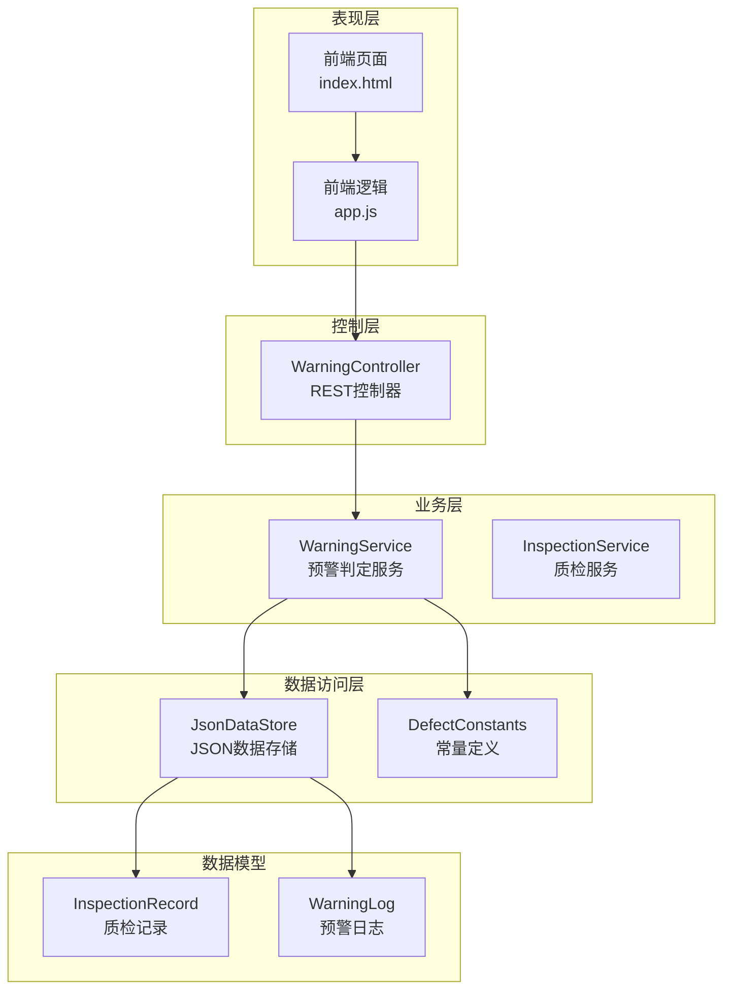
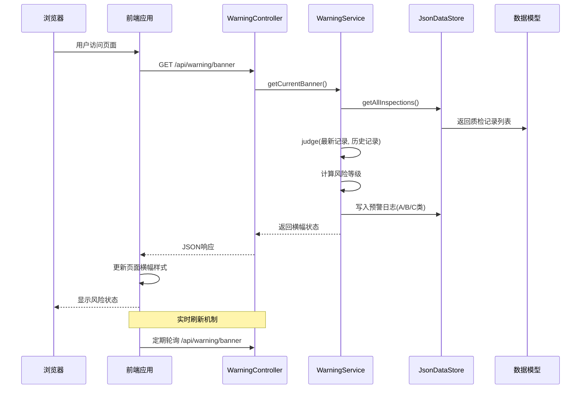
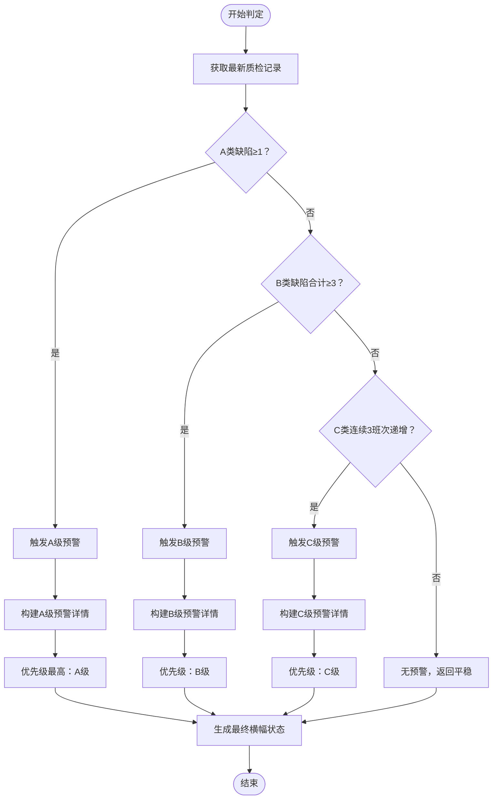
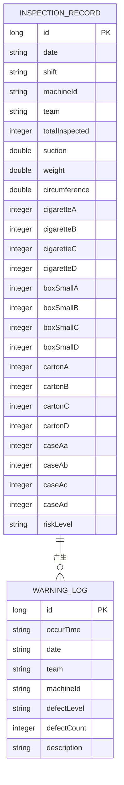
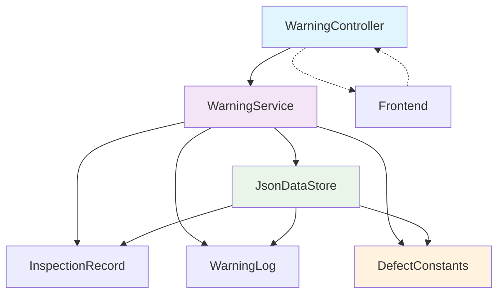

# 预警状态API

<cite>
**本文档引用的文件**
- [WarningController.java](file://src/main/java/com/zjzy/quality/controller/WarningController.java)
- [WarningService.java](file://src/main/java/com/zjzy/quality/service/WarningService.java)
- [DefectConstants.java](file://src/main/java/com/zjzy/quality/constant/DefectConstants.java)
- [JsonDataStore.java](file://src/main/java/com/zjzy/quality/util/JsonDataStore.java)
- [InspectionRecord.java](file://src/main/java/com/zjzy/quality/entity/InspectionRecord.java)
- [WarningLog.java](file://src/main/java/com/zjzy/quality/entity/WarningLog.java)
- [app.js](file://src/main/resources/static/js/app.js)
- [index.html](file://src/main/resources/static/index.html)
- [application.yml](file://src/main/resources/application.yml)
</cite>

## 目录
1. [简介](#简介)
2. [项目结构](#项目结构)
3. [核心组件](#核心组件)
4. [架构概览](#架构概览)
5. [详细组件分析](#详细组件分析)
6. [依赖关系分析](#依赖关系分析)
7. [性能考虑](#性能考虑)
8. [故障排除指南](#故障排除指南)
9. [结论](#结论)

## 简介

预警状态API是卷烟全维度质检智能预警预判系统的核心功能模块，主要负责实时计算和返回当前的风险状态横幅信息。该API通过分析最新的质检数据，按照严格的A/B/C/D四级缺陷标准进行风险评估，并以直观的颜色编码和文本描述形式向用户展示当前的质量风险状况。

本系统采用Spring Boot框架构建，使用JSON文件作为数据存储介质，实现了从数据录入到风险预警的完整闭环。前端通过AJAX请求实时获取预警状态，在页面顶部显示永久置顶的风险提示横幅。

## 项目结构

系统采用经典的三层架构设计，主要分为以下层次：



**图表来源**
- [WarningController.java:16-37](file://src/main/java/com/zjzy/quality/controller/WarningController.java#L16-L37)
- [WarningService.java:15-139](file://src/main/java/com/zjzy/quality/service/WarningService.java#L15-L139)
- [JsonDataStore.java:20-222](file://src/main/java/com/zjzy/quality/util/JsonDataStore.java#L20-L222)

**章节来源**
- [application.yml:1-24](file://src/main/resources/application.yml#L1-L24)
- [index.html:1-179](file://src/main/resources/static/index.html#L1-L179)

## 核心组件

### 预警控制器 (WarningController)

预警控制器是API的入口点，提供了两个核心接口：
- `GET /api/warning/banner` - 获取当前风险横幅状态
- `GET /api/warning/logs` - 查询全部预警日志（仅A/B/C类）

### 预警服务 (WarningService)

预警服务是系统的核心业务逻辑实现，负责：
- 解析最新的质检记录
- 执行A/B/C/D四级缺陷判定规则
- 生成风险等级和横幅显示信息
- 写入预警日志

### 数据存储 (JsonDataStore)

JSON数据存储提供了完整的数据持久化功能：
- 质检记录的增删改查操作
- 预警日志的管理
- Mock数据生成和初始化
- JSON文件的读写和序列化

**章节来源**
- [WarningController.java:16-37](file://src/main/java/com/zjzy/quality/controller/WarningController.java#L16-L37)
- [WarningService.java:15-139](file://src/main/java/com/zjzy/quality/service/WarningService.java#L15-L139)
- [JsonDataStore.java:20-222](file://src/main/java/com/zjzy/quality/util/JsonDataStore.java#L20-L222)

## 架构概览

系统采用RESTful API设计模式，遵循HTTP协议的最佳实践：



**图表来源**
- [WarningController.java:24-27](file://src/main/java/com/zjzy/quality/controller/WarningController.java#L24-L27)
- [WarningService.java:126-138](file://src/main/java/com/zjzy/quality/service/WarningService.java#L126-L138)
- [JsonDataStore.java:66-75](file://src/main/java/com/zjzy/quality/util/JsonDataStore.java#L66-L75)

## 详细组件分析

### GET /api/warning/banner 接口详解

#### 接口规范

| 属性 | 描述 |
|------|------|
| 方法 | GET |
| 路径 | `/api/warning/banner` |
| 功能 | 获取当前风险横幅状态 |

#### 响应格式

接口返回一个包含风险状态信息的JSON对象，具体字段如下：

```json
{
  "riskLevel": "高风险",
  "bannerText": "检出A类严重缺陷，高风险，立即复核",
  "bannerColor": "#FF3B30",
  "warnings": [
    {
      "level": "A",
      "count": 2,
      "desc": "检出A类严重缺陷2个，高风险，立即复核"
    }
  ]
}
```

#### 响应字段说明

| 字段名 | 类型 | 必填 | 描述 | 示例值 |
|--------|------|------|------|--------|
| riskLevel | string | 是 | 风险等级文本 | "高风险" |
| bannerText | string | 是 | 横幅显示文本 | "检出A类严重缺陷，高风险，立即复核" |
| bannerColor | string | 是 | 颜色编码（十六进制） | "#FF3B30" |
| warnings | array | 否 | 触发的预警详情列表 | [] |

#### 预警状态计算逻辑

系统根据A/B/C/D四级缺陷标准进行风险评估，优先级顺序为：A > B > C > 平稳。

##### A类缺陷（高风险）
- **触发条件**：任意层级A类缺陷数量 ≥ 1
- **颜色标识**：#FF3B30（Apple红）
- **风险等级**：高风险
- **建议措施**：立即复核，停止生产

##### B类缺陷（中度风险）
- **触发条件**：所有层级B类缺陷合计数量 ≥ 3
- **颜色标识**：#FF9500（Apple橙）
- **风险等级**：中度风险
- **建议措施**：及时排查，加强监控

##### C类缺陷（一般风险）
- **触发条件**：连续3班次C类缺陷总数呈严格递增趋势
- **颜色标识**：#FFCC00（Apple黄）
- **风险等级**：一般风险
- **建议措施**：关注变化，预防恶化

##### D类缺陷（轻微风险）
- **触发条件**：D类缺陷数量增加但不触发预警
- **颜色标识**：#C7C7CC（Apple灰）
- **风险等级**：平稳
- **建议措施**：正常监控

**章节来源**
- [WarningController.java:24-27](file://src/main/java/com/zjzy/quality/controller/WarningController.java#L24-L27)
- [WarningService.java:23-99](file://src/main/java/com/zjzy/quality/service/WarningService.java#L23-L99)
- [DefectConstants.java:44-66](file://src/main/java/com/zjzy/quality/constant/DefectConstants.java#L44-L66)

### 预警判定算法流程



**图表来源**
- [WarningService.java:23-99](file://src/main/java/com/zjzy/quality/service/WarningService.java#L23-L99)

### 数据来源和更新机制

#### 数据存储结构

系统使用JSON文件进行数据持久化，主要包含两个数据文件：



**图表来源**
- [InspectionRecord.java:7-153](file://src/main/java/com/zjzy/quality/entity/InspectionRecord.java#L7-L153)
- [WarningLog.java:7-43](file://src/main/java/com/zjzy/quality/entity/WarningLog.java#L7-L43)

#### 数据更新时机

1. **实时查询**：每次调用`/api/warning/banner`接口时，系统会重新读取最新的质检数据
2. **数据持久化**：新录入的质检数据会立即写入JSON文件
3. **Mock数据**：系统启动时自动生成30条示例数据用于演示

#### 前端集成实现

前端通过jQuery的`$.get()`方法定期调用预警接口：

```javascript
function loadBanner() {
    $.get('/api/warning/banner', function (res) {
        var $banner = $('#banner');
        $banner.css({
            'color': res.bannerColor,
            'background': hexToRgba(res.bannerColor, 0.08),
            'border-bottom-color': res.bannerColor
        });
        $('#bannerText').text(res.bannerText);
    });
}
```

**章节来源**
- [JsonDataStore.java:96-149](file://src/main/java/com/zjzy/quality/util/JsonDataStore.java#L96-L149)
- [app.js:86-96](file://src/main/resources/static/js/app.js#L86-L96)

### 预警触发条件和解除机制

#### 触发条件

| 风险等级 | 触发条件 | 颜色标识 | 建议措施 |
|----------|----------|----------|----------|
| 高风险 | A类缺陷≥1 | #FF3B30 | 立即复核，停止生产 |
| 中度风险 | B类缺陷合计≥3 | #FF9500 | 及时排查，加强监控 |
| 一般风险 | 连续3班次C类总数递增 | #FFCC00 | 关注变化，预防恶化 |
| 平稳 | 无A/B/C类缺陷 | #34C759 | 正常监控 |

#### 解除机制

预警状态会在满足以下条件时自动解除：
- A类缺陷被完全消除且连续多个班次无新增
- B类缺陷数量降至3以下
- C类缺陷连续班次不再递增或出现下降趋势
- D类缺陷数量恢复正常水平

### 前端展示逻辑和用户交互

#### 横幅展示逻辑

前端页面顶部的永久置顶横幅具有以下特性：

1. **动态颜色变化**：根据风险等级实时改变颜色
2. **文本内容更新**：显示相应的风险提示信息
3. **样式增强**：使用半透明背景和边框突出显示

#### 用户交互说明

1. **数据录入**：用户通过表单录入质检数据
2. **实时反馈**：提交后立即显示风险等级
3. **状态监控**：页面顶部横幅实时反映当前风险状态
4. **历史查看**：可通过日志接口查看历史预警记录

**章节来源**
- [index.html:21-24](file://src/main/resources/static/index.html#L21-L24)
- [app.js:86-96](file://src/main/resources/static/js/app.js#L86-L96)

## 依赖关系分析

系统各组件之间的依赖关系清晰明确：



**图表来源**
- [WarningController.java:3-6](file://src/main/java/com/zjzy/quality/controller/WarningController.java#L3-L6)
- [WarningService.java:3-6](file://src/main/java/com/zjzy/quality/service/WarningService.java#L3-L6)
- [JsonDataStore.java:3-7](file://src/main/java/com/zjzy/quality/util/JsonDataStore.java#L3-L7)

### 外部依赖

系统使用的主要外部库：
- **Spring Boot Web**：提供RESTful API支持
- **Gson**：JSON序列化和反序列化
- **jQuery**：前端JavaScript库
- **Plotly.js**：数据可视化图表库

**章节来源**
- [WarningController.java:1-12](file://src/main/java/com/zjzy/quality/controller/WarningController.java#L1-L12)
- [JsonDataStore.java:3-4](file://src/main/java/com/zjzy/quality/util/JsonDataStore.java#L3-L4)

## 性能考虑

### 数据访问优化

1. **内存缓存**：质检记录和预警日志在内存中缓存，减少磁盘I/O
2. **延迟加载**：系统启动时才初始化数据存储
3. **原子性操作**：使用`synchronized`确保并发安全

### 前端性能优化

1. **定时刷新**：前端采用合理的轮询间隔，避免过度请求
2. **样式缓存**：颜色转换结果缓存，减少重复计算
3. **增量更新**：只更新必要的DOM元素

### 存储性能

1. **文件分割**：质检数据和预警日志分离存储
2. **批量写入**：数据变更后统一写入文件
3. **Mock数据**：开发环境使用内存数据，提高响应速度

## 故障排除指南

### 常见问题及解决方案

#### 1. API响应为空

**症状**：`/api/warning/banner`返回空数据
**原因**：系统尚未有质检数据
**解决**：先录入至少一条质检数据

#### 2. 颜色显示异常

**症状**：横幅颜色不正确
**原因**：前端颜色转换函数错误
**解决**：检查`hexToRgba`函数实现

#### 3. 数据持久化失败

**症状**：重启后数据丢失
**原因**：data目录权限问题
**解决**：确保应用程序有写入权限

#### 4. 预警判定错误

**症状**：风险等级与预期不符
**原因**：缺陷阈值设置不当
**解决**：调整`DefectConstants`中的阈值参数

**章节来源**
- [JsonDataStore.java:46-62](file://src/main/java/com/zjzy/quality/util/JsonDataStore.java#L46-L62)
- [DefectConstants.java:11-18](file://src/main/java/com/zjzy/quality/constant/DefectConstants.java#L11-L18)

### 调试建议

1. **启用详细日志**：在`application.yml`中调整日志级别
2. **检查数据文件**：验证data目录下的JSON文件完整性
3. **测试API接口**：使用curl或Postman验证接口响应
4. **监控内存使用**：观察系统内存占用情况

## 结论

预警状态API为卷烟全维度质检系统提供了实时的风险监控能力。通过严格的A/B/C/D四级缺陷标准和直观的颜色编码，系统能够帮助质量管理人员快速识别和处理潜在的质量问题。

该API的设计充分考虑了易用性和可维护性：
- **简洁的接口设计**：单一入口提供完整的风险状态信息
- **清晰的业务逻辑**：基于实际生产需求制定的判定规则
- **良好的扩展性**：常量配置便于调整阈值参数
- **完善的前端集成**：实时反馈和可视化展示

未来可以考虑的改进方向：
- 添加数据库支持，提高数据处理能力
- 实现WebSocket推送，减少轮询开销
- 增加预警统计分析功能
- 扩展移动端适配