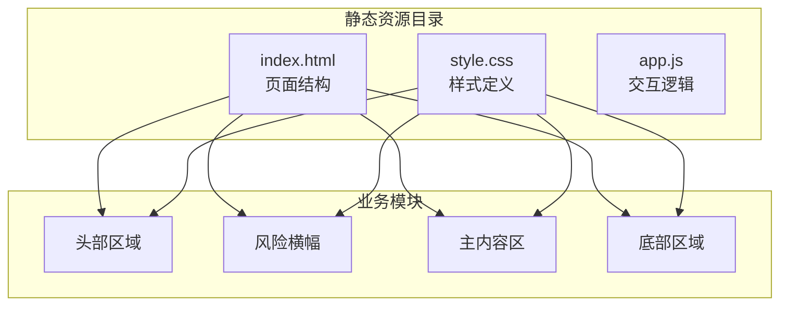
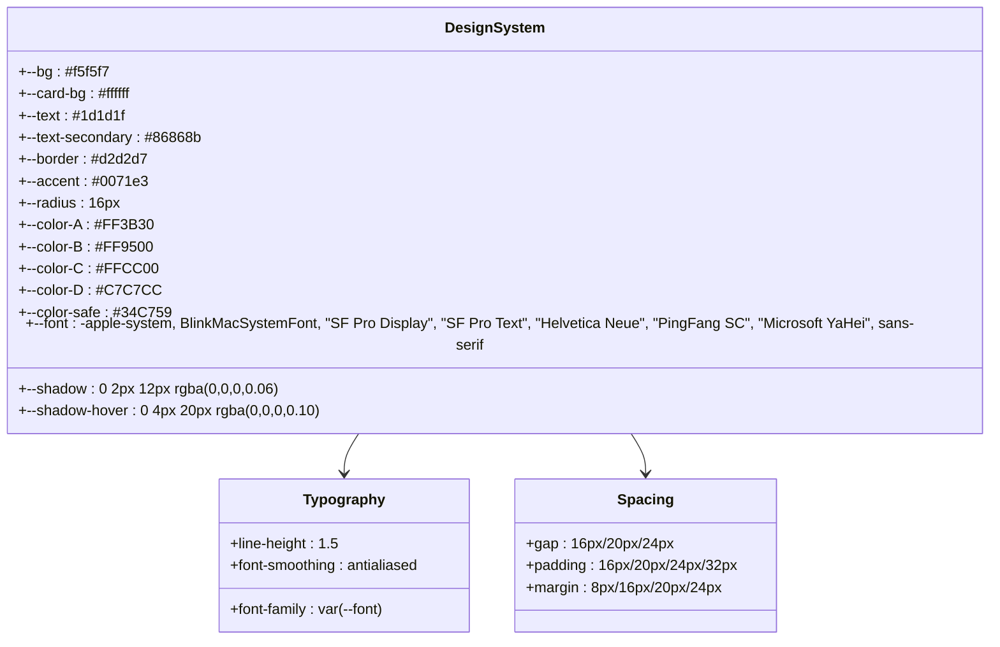
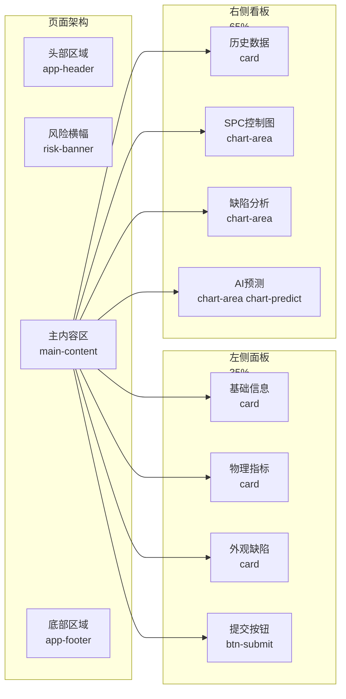
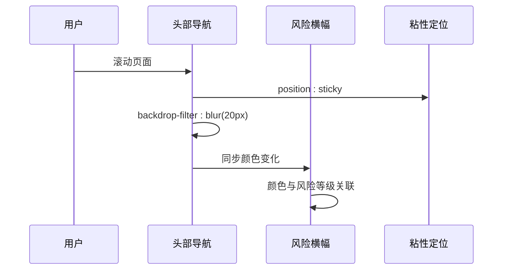
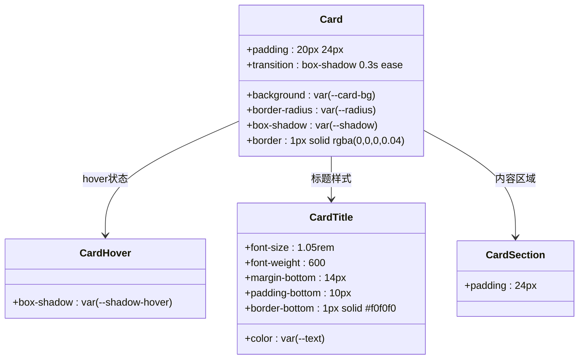
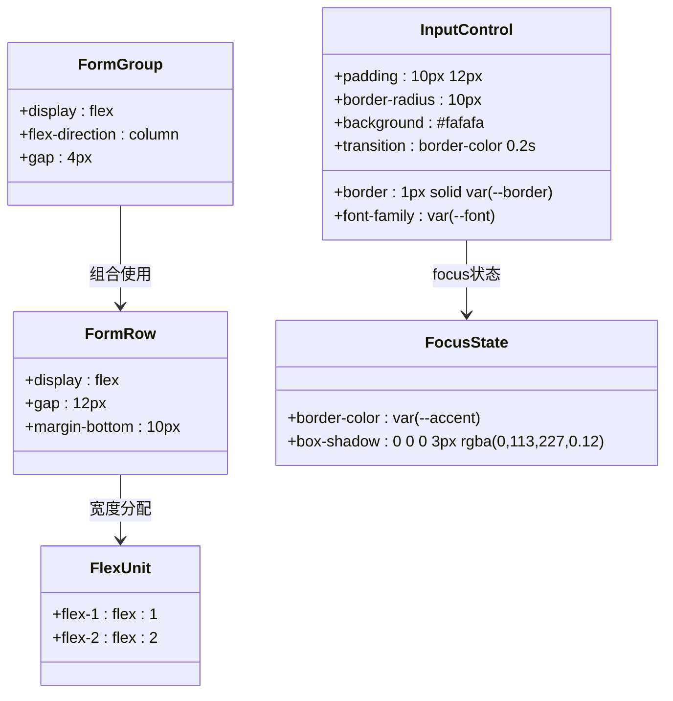
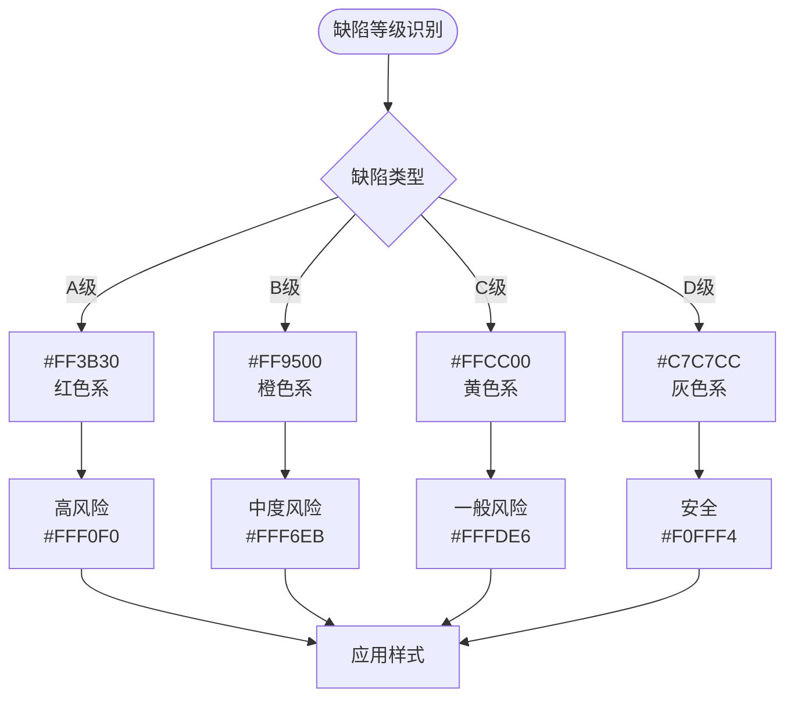
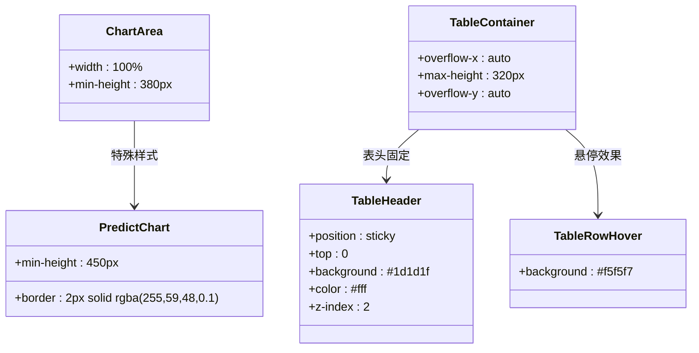
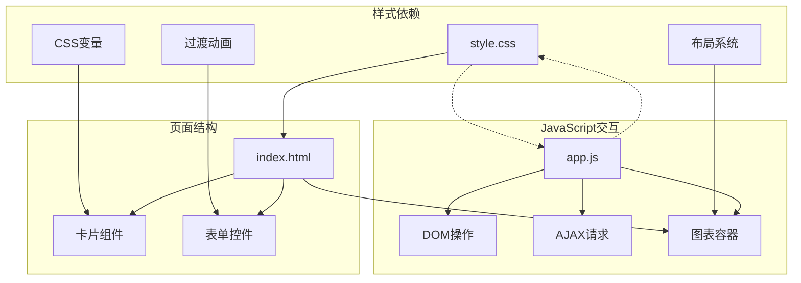

# CSS样式设计

<cite>
**本文档引用的文件**
- [style.css](file://src/main/resources/static/css/style.css)
- [index.html](file://src/main/resources/static/index.html)
- [app.js](file://src/main/resources/static/js/app.js)
</cite>

## 目录
1. [简介](#简介)
2. [项目结构](#项目结构)
3. [核心组件](#核心组件)
4. [架构概览](#架构概览)
5. [详细组件分析](#详细组件分析)
6. [依赖关系分析](#依赖关系分析)
7. [性能考虑](#性能考虑)
8. [故障排除指南](#故障排除指南)
9. [结论](#结论)

## 简介

本CSS样式设计文档针对卷烟全维度质检智能预警预判系统的前端样式架构进行全面分析。该系统采用苹果官网同款的"乔布斯极简风格"设计语言，强调大留白、毛玻璃效果、圆角卡片和SF字体的视觉体验。

系统整体设计遵循以下核心理念：
- **极简主义设计**：通过大量留白营造清爽的视觉空间
- **毛玻璃效果**：使用backdrop-filter实现半透明背景
- **圆角卡片**：统一的16px圆角设计语言
- **层级化色彩**：基于A/B/C/D缺陷等级的色彩体系

## 项目结构

该项目采用前后端分离的静态资源组织方式，CSS样式文件位于`src/main/resources/static/css/style.css`，与HTML页面和JavaScript逻辑文件共同构成完整的前端界面。

**图表来源**
- [index.html:1-179](file://src/main/resources/static/index.html#L1-L179)
- [style.css:1-336](file://src/main/resources/static/css/style.css#L1-L336)

**章节来源**
- [index.html:1-179](file://src/main/resources/static/index.html#L1-L179)
- [style.css:1-336](file://src/main/resources/static/css/style.css#L1-L336)

## 核心组件

### 设计系统基础

系统采用CSS自定义属性（CSS变量）构建统一的设计系统，确保设计元素的一致性和可维护性。

**图表来源**
- [style.css:13-30](file://src/main/resources/static/css/style.css#L13-L30)

### 视觉设计风格

系统采用苹果官方设计语言，具有以下特征：
- **色彩方案**：以浅灰背景(#f5f5f7)为主色调，配合白色卡片背景
- **字体选择**：优先使用系统字体链，确保跨平台一致性
- **间距规范**：采用16px基准网格，形成清晰的视觉层次
- **阴影系统**：基础阴影和悬停阴影的渐变过渡

**章节来源**
- [style.css:13-44](file://src/main/resources/static/css/style.css#L13-L44)

## 架构概览

系统采用响应式双栏布局，左侧为数据录入面板(35%)，右侧为可视化看板(65%)。整体架构体现了现代数据可视化应用的设计模式。

**图表来源**
- [index.html:27-169](file://src/main/resources/static/index.html#L27-L169)
- [style.css:95-121](file://src/main/resources/static/css/style.css#L95-L121)

## 详细组件分析

### 头部导航系统

头部采用粘性定位和毛玻璃效果，实现悬浮在内容上方的视觉效果。

**图表来源**
- [style.css:47-92](file://src/main/resources/static/css/style.css#L47-L92)
- [index.html:14-24](file://src/main/resources/static/index.html#L14-L24)

### 卡片式设计系统

系统采用统一的卡片设计语言，每个卡片都具备相同的视觉特征：

**图表来源**
- [style.css:124-148](file://src/main/resources/static/css/style.css#L124-L148)

### 表单控件统一规范

表单系统采用Flexbox布局，支持不同宽度比例的组合：

**图表来源**
- [style.css:155-194](file://src/main/resources/static/css/style.css#L155-L194)

### 缺陷等级色彩体系

系统为四种缺陷等级(A/B/C/D)建立了完整的色彩标识系统：

**图表来源**
- [style.css:223-301](file://src/main/resources/static/css/style.css#L223-L301)

### 图表容器设计

图表区域采用统一的容器设计，支持不同类型的可视化展示：

**图表来源**
- [style.css:304-329](file://src/main/resources/static/css/style.css#L304-L329)

### 移动端适配策略

虽然系统主要面向桌面端应用，但通过以下机制确保基本的移动设备兼容性：

- **最小宽度限制**：body设置min-width: 1200px，确保桌面端最佳体验
- **视口配置**：HTML包含viewport meta标签，支持响应式缩放
- **Flexbox布局**：自动适应不同屏幕尺寸的弹性布局
- **滚动优化**：自定义滚动条样式，提升移动端滚动体验

**章节来源**
- [style.css:43](file://src/main/resources/static/css/style.css#L43)
- [index.html:5](file://src/main/resources/static/index.html#L5)

## 依赖关系分析

系统样式与JavaScript逻辑之间存在紧密的协作关系：

**图表来源**
- [style.css:1-336](file://src/main/resources/static/css/style.css#L1-L336)
- [app.js:1-420](file://src/main/resources/static/js/app.js#L1-L420)

**章节来源**
- [app.js:16-83](file://src/main/resources/static/js/app.js#L16-L83)
- [index.html:13-169](file://src/main/resources/static/index.html#L13-L169)

## 性能考虑

### 样式性能优化

系统在样式层面采用了多项性能优化策略：

1. **CSS变量缓存**：通过`:root`定义的CSS变量减少重复计算
2. **硬件加速**：合理使用transform和opacity属性触发GPU加速
3. **过渡动画优化**：仅对关键属性应用transition，避免不必要的重排
4. **选择器优化**：使用类选择器而非复杂选择器，提升渲染性能

### JavaScript集成优化

前端JavaScript与CSS的协同优化：

- **事件委托**：减少事件监听器数量
- **防抖处理**：对resize等高频事件进行防抖
- **懒加载**：图表按需加载，提升初始渲染速度

### 兼容性处理

系统采用渐进增强的兼容性策略：

- **前缀处理**：为backdrop-filter添加-webkit-前缀
- **降级方案**：在不支持某些特性的浏览器中提供基础样式
- **特性检测**：通过JavaScript检测浏览器支持情况

**章节来源**
- [style.css:49](file://src/main/resources/static/css/style.css#L49)
- [app.js:414-420](file://src/main/resources/static/js/app.js#L414-L420)

## 故障排除指南

### 常见问题诊断

1. **样式不生效**
   - 检查CSS文件路径是否正确
   - 确认CSS优先级是否被覆盖
   - 验证浏览器是否支持相关CSS特性

2. **布局异常**
   - 检查Flexbox属性是否正确设置
   - 确认容器宽度计算是否符合预期
   - 验证响应式断点设置

3. **交互问题**
   - 检查JavaScript事件绑定是否正常
   - 确认AJAX请求是否返回预期数据
   - 验证图表库是否正确加载

### 调试建议

- 使用浏览器开发者工具检查元素样式
- 通过网络面板验证CSS文件加载状态
- 在不同设备上测试响应式效果
- 关注控制台是否有JavaScript错误

**章节来源**
- [style.css:1-336](file://src/main/resources/static/css/style.css#L1-L336)
- [app.js:57-74](file://src/main/resources/static/js/app.js#L57-L74)

## 结论

本CSS样式设计文档全面分析了卷烟全维度质检智能预警预判系统的前端样式架构。系统采用现代化的设计语言和工程化的开发方法，通过CSS变量、Flexbox布局和组件化设计实现了高度一致且易于维护的视觉系统。

主要特点包括：
- **统一的设计系统**：基于CSS变量的完整色彩和间距体系
- **优雅的交互体验**：流畅的过渡动画和悬停效果
- **专业的视觉呈现**：毛玻璃效果和圆角卡片的精致设计
- **良好的扩展性**：模块化的组件设计便于功能扩展

该系统为工业数据可视化应用提供了优秀的前端样式参考，展现了现代Web技术在专业领域的应用价值。