# HTML页面结构

<cite>
**本文档引用的文件**
- [index.html](file://src/main/resources/static/index.html)
- [style.css](file://src/main/resources/static/css/style.css)
- [app.js](file://src/main/resources/static/js/app.js)
- [InspectionController.java](file://src/main/java/com/zjzy/quality/controller/InspectionController.java)
- [InspectionService.java](file://src/main/java/com/zjzy/quality/service/InspectionService.java)
- [InspectionRecord.java](file://src/main/java/com/zjzy/quality/entity/InspectionRecord.java)
</cite>

## 目录
1. [引言](#引言)
2. [项目结构概览](#项目结构概览)
3. [整体布局设计](#整体布局设计)
4. [头部区域设计](#头部区域设计)
5. [左侧数据录入面板](#左侧数据录入面板)
6. [右侧可视化看板](#右侧可视化看板)
7. [响应式设计实现](#响应式设计实现)
8. [语义化标签与可访问性](#语义化标签与可访问性)
9. [技术架构分析](#技术架构分析)
10. [总结](#总结)

## 引言

本文档详细分析了卷烟全维度质检智能预警预判系统的HTML页面结构设计。该系统采用现代化的Web技术栈，结合Spring Boot后端服务和前端交互界面，实现了从数据录入到可视化分析的完整质量管理流程。页面采用Apple官网同款的极简设计风格，注重用户体验和视觉效果。

## 项目结构概览

系统采用前后端分离的架构模式，主要由以下组件构成：

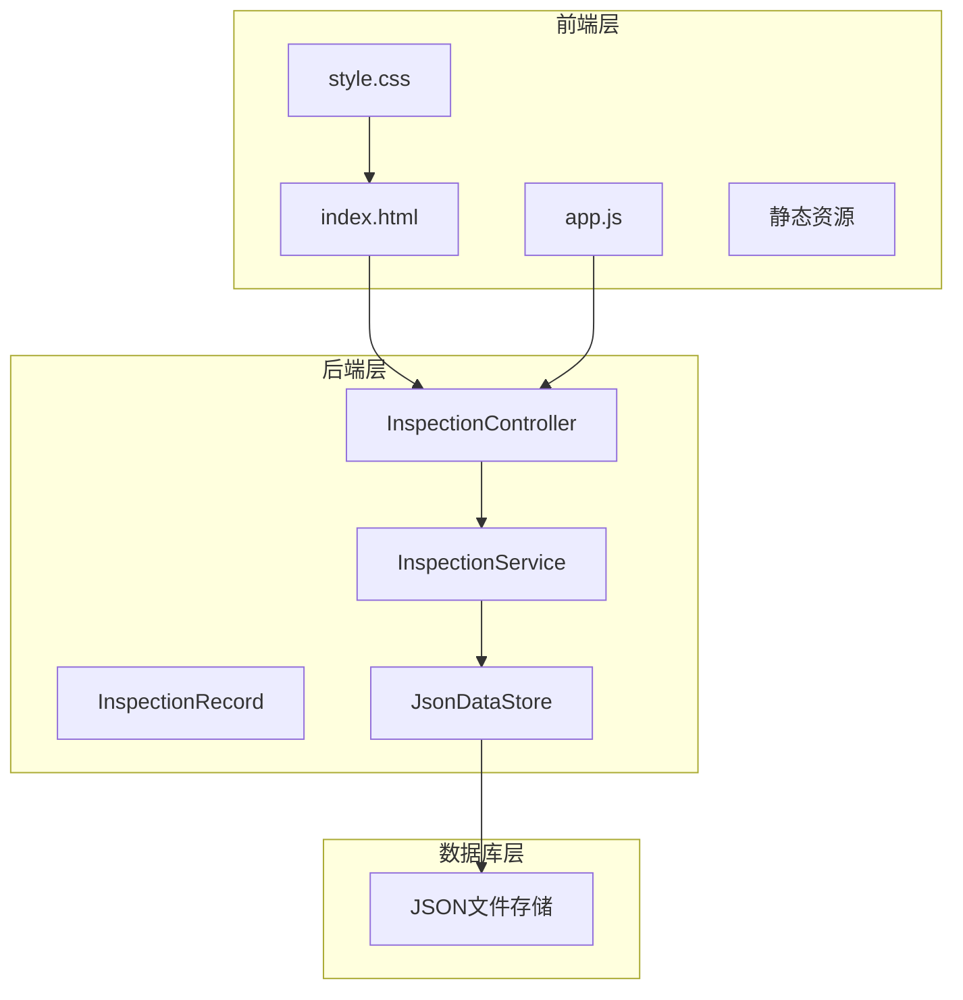

**图表来源**
- [index.html:1-179](file://src/main/resources/static/index.html#L1-L179)
- [style.css:1-336](file://src/main/resources/static/css/style.css#L1-L336)
- [app.js:1-420](file://src/main/resources/static/js/app.js#L1-L420)

**章节来源**
- [index.html:1-179](file://src/main/resources/static/index.html#L1-L179)
- [style.css:1-336](file://src/main/resources/static/css/style.css#L1-L336)
- [app.js:1-420](file://src/main/resources/static/js/app.js#L1-L420)

## 整体布局设计

系统采用经典的左右二分栏布局，实现了功能分区明确、视觉层次清晰的用户界面设计。

### 布局架构

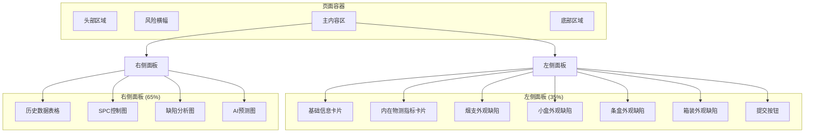

**图表来源**
- [index.html:26-169](file://src/main/resources/static/index.html#L26-L169)

### 核心设计原则

1. **比例分配**：左侧录入面板占35%，右侧看板占65%，形成合理的视觉平衡
2. **模块化设计**：每个功能区域独立成卡，便于维护和扩展
3. **一致性**：统一的圆角卡片、阴影效果和色彩体系
4. **层次感**：通过间距和阴影营造深度感

**章节来源**
- [index.html:94-121](file://src/main/resources/static/index.html#L94-L121)
- [style.css:94-121](file://src/main/resources/static/css/style.css#L94-L121)

## 头部区域设计

头部区域采用粘性定位设计，确保在页面滚动时始终保持可见状态。

### 结构组成

```mermaid
graph TD
Header[app-header] --> Inner[header-inner]
Inner --> Title[app-title<br/>系统标题]
Inner --> Subtitle[app-subtitle<br/>副标题说明]
style Header fill:#ffffff,stroke:#d2d2d7,stroke-width:1px
style Inner fill:#ffffff,stroke:none
style Title fill:#1d1d1f,stroke:none
style Subtitle fill:#86868b,stroke:none
```

**图表来源**
- [index.html:13-19](file://src/main/resources/static/index.html#L13-L19)
- [style.css:46-76](file://src/main/resources/static/css/style.css#L46-L76)

### 设计特点

1. **毛玻璃效果**：使用backdrop-filter实现半透明背景
2. **居中布局**：文本内容水平居中对齐
3. **品牌标识**：包含项目名称和公司标识
4. **粘性定位**：固定在页面顶部，提升用户体验

**章节来源**
- [index.html:14-18](file://src/main/resources/static/index.html#L14-L18)
- [style.css:46-55](file://src/main/resources/static/css/style.css#L46-L55)

## 左侧数据录入面板

左侧面板采用垂直堆叠的卡片式布局，包含五个主要功能区域，每个区域都有明确的数据类型和用途。

### 基础信息卡片

基础信息卡片收集生产过程中的基本参数信息：

| 字段 | 输入类型 | 默认值 | 说明 |
|------|----------|--------|------|
| 日期 | date | 当前日期 | 质检日期选择 |
| 班次 | select | 早班 | 生产班次选择 |
| 机台编号 | select | 1# | 生产设备编号 |
| 班组 | select | 甲班 | 生产班组 |
| 总抽检数量 | number | 100 | 抽检样本数量 |

### 烟支内在物测指标

内在物测指标是质量控制的核心参数：

| 指标 | 单位 | 默认值 | 测量范围 | 重要性 |
|------|------|--------|----------|--------|
| 吸阻 | Pa | 1100 | 800-1500 | 高 |
| 单支重量 | g | 0.90 | 0.85-0.95 | 高 |
| 圆周 | mm | 24.5 | 24.0-25.0 | 中 |

### 四级外观缺陷录入

系统采用A、B、C、D四级缺陷分类标准，对应不同的严重程度：

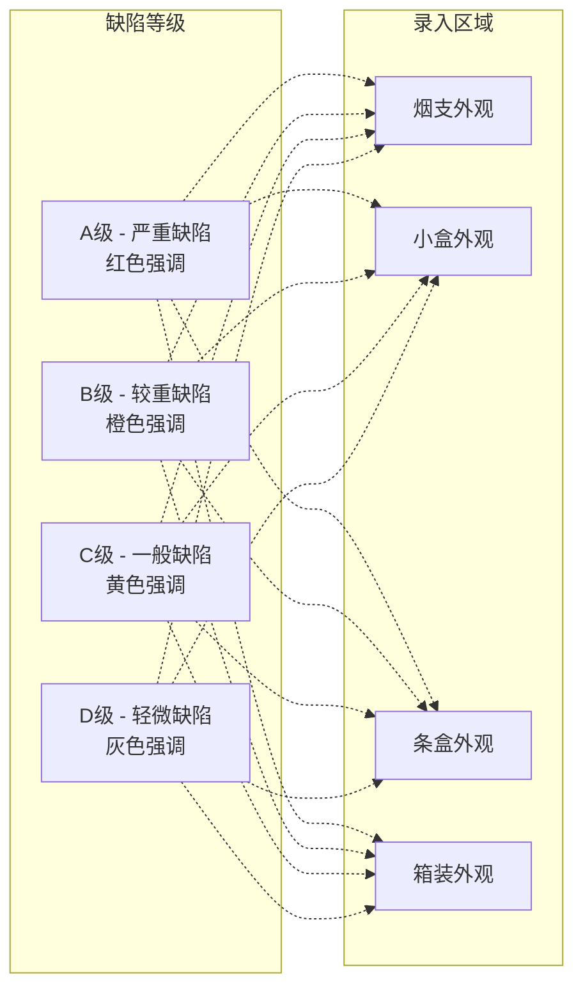

**图表来源**
- [index.html:88-131](file://src/main/resources/static/index.html#L88-L131)
- [style.css:223-227](file://src/main/resources/static/css/style.css#L223-L227)

### 录入界面设计

每个缺陷录入区域都采用九宫格布局，确保用户操作的一致性和效率：

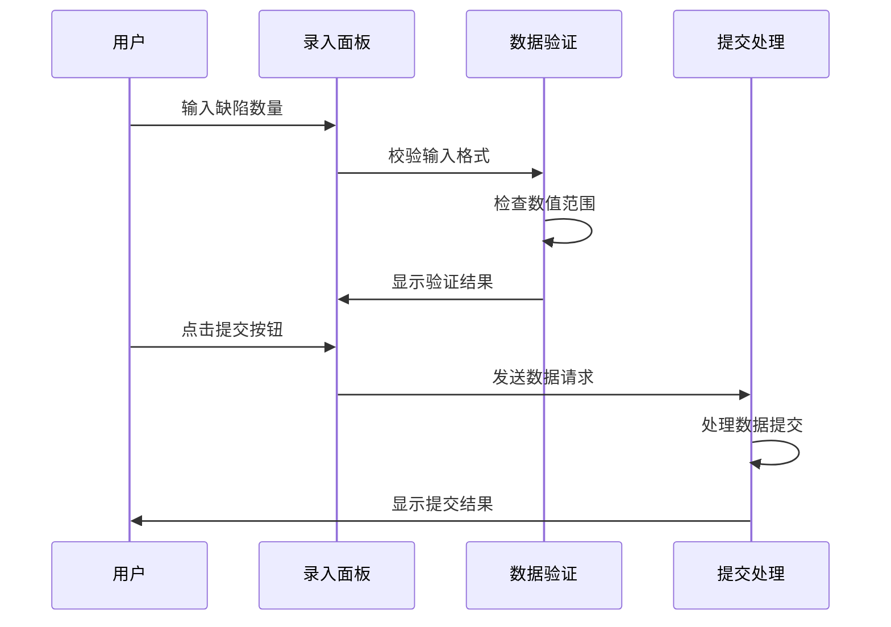

**图表来源**
- [index.html:133-134](file://src/main/resources/static/index.html#L133-L134)
- [app.js:28-74](file://src/main/resources/static/js/app.js#L28-L74)

**章节来源**
- [index.html:32-134](file://src/main/resources/static/index.html#L32-L134)
- [style.css:123-153](file://src/main/resources/static/css/style.css#L123-L153)

## 右侧可视化看板

右侧看板采用四板块布局，每个板块都有特定的功能定位和视觉设计。

### 历史数据表格

历史数据表格提供完整的质检历史记录查询功能：

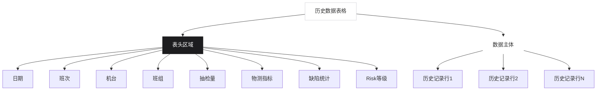

**图表来源**
- [app.js:98-159](file://src/main/resources/static/js/app.js#L98-L159)
- [style.css:256-291](file://src/main/resources/static/css/style.css#L256-L291)

### SPC控制图

SPC控制图用于监控生产过程的稳定性，包含三个核心指标：

| 指标 | 控制线 | 作用 | 异常识别 |
|------|--------|------|----------|
| 吸阻 | UCL/LCL | 质量稳定性 | 红色X标记 |
| 单支重量 | UCL/LCL | 产品一致性 | 红色X标记 |
| 圆周 | UCL/LCL | 包装规格 | 红色X标记 |

### 缺陷分析图

缺陷分析图采用饼图和折线图组合的方式：

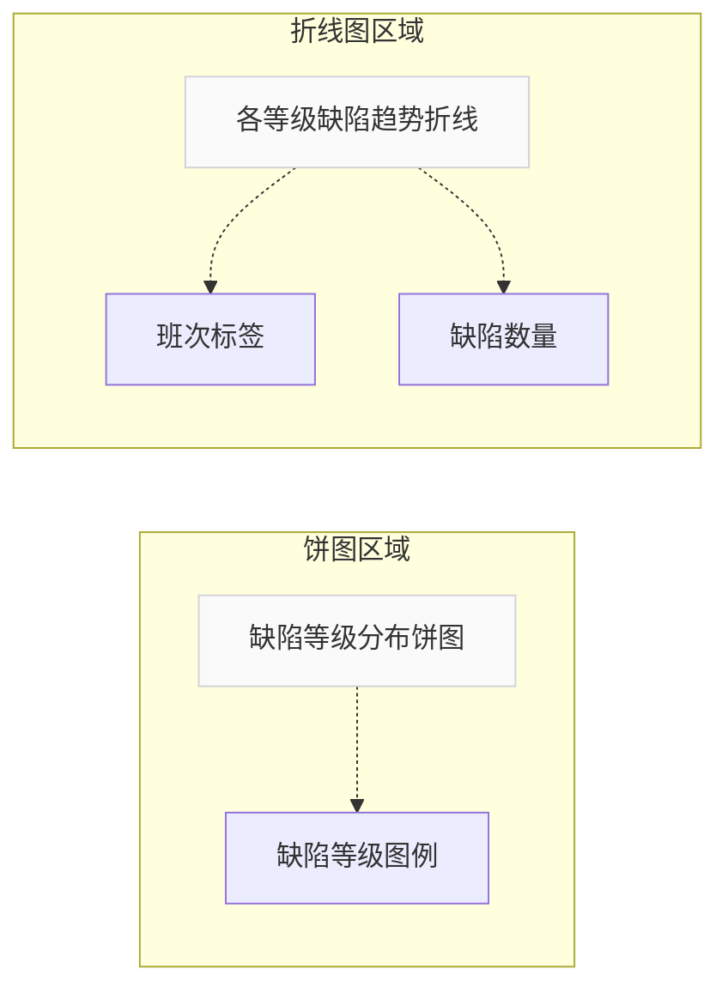

**图表来源**
- [app.js:266-337](file://src/main/resources/static/js/app.js#L266-L337)

### AI预测图

AI预测图提供未来质量趋势预测功能：

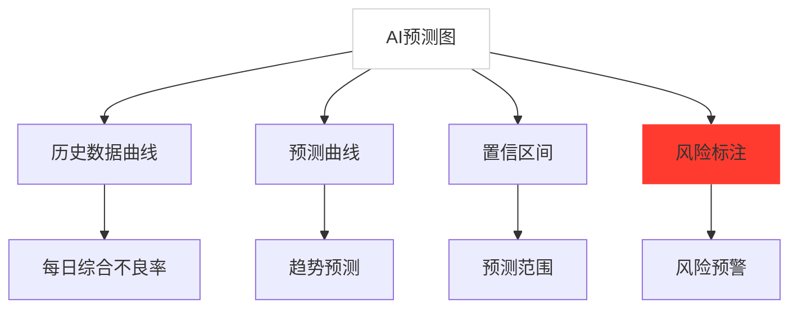

**图表来源**
- [app.js:339-411](file://src/main/resources/static/js/app.js#L339-L411)

**章节来源**
- [index.html:138-167](file://src/main/resources/static/index.html#L138-L167)
- [app.js:76-83](file://src/main/resources/static/js/app.js#L76-L83)

## 响应式设计实现

系统采用现代响应式设计理念，确保在不同设备上都能提供良好的用户体验。

### 宽度比例配置

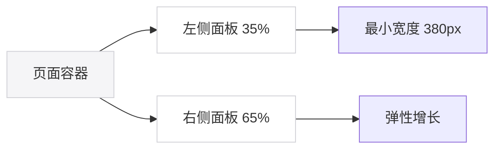

**图表来源**
- [style.css:103-121](file://src/main/resources/static/css/style.css#L103-L121)

### 移动端适配策略

1. **最小宽度限制**：设置页面最小宽度为1200px，确保桌面端最佳体验
2. **弹性布局**：使用Flexbox实现内容的自适应调整
3. **滚动优化**：左侧面板支持独立滚动，避免影响整体布局
4. **触摸友好**：按钮和输入框尺寸适合手指操作

### 响应式断点

系统采用单一断点策略：
- **桌面端**：≥1200px，完整显示双栏布局
- **平板端**：800px-1199px，保持双栏但内容压缩
- **移动端**：<800px，建议使用桌面浏览器访问

**章节来源**
- [style.css:43](file://src/main/resources/static/css/style.css#L43)
- [style.css:103-121](file://src/main/resources/static/css/style.css#L103-L121)

## 语义化标签与可访问性

系统在HTML结构设计中充分考虑了语义化和可访问性要求。

### 语义化标签使用

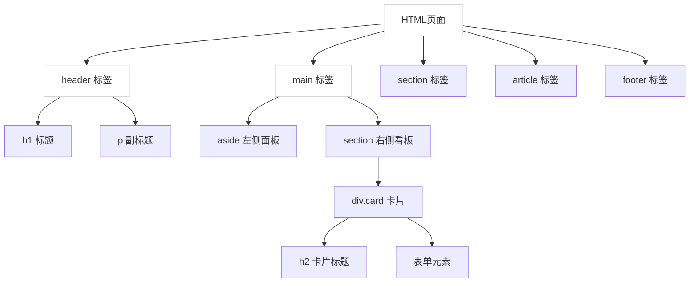

**图表来源**
- [index.html:13-169](file://src/main/resources/static/index.html#L13-L169)

### 可访问性特性

1. **键盘导航**：所有交互元素支持Tab键导航
2. **屏幕阅读器**：语义化标签提供良好朗读体验
3. **色彩对比**：确保文本与背景有足够的对比度
4. **焦点管理**：提供清晰的键盘焦点指示
5. **错误提示**：输入验证错误有明确的视觉反馈

### 无障碍设计

- **ARIA标签**：关键元素添加适当的ARIA属性
- **替代文本**：图片和图标提供描述性文本
- **表单标签**：每个输入框都有对应的label标签
- **状态通知**：操作结果通过多种方式告知用户

**章节来源**
- [index.html:13-179](file://src/main/resources/static/index.html#L13-L179)
- [style.css:123-153](file://src/main/resources/static/css/style.css#L123-L153)

## 技术架构分析

系统采用前后端分离的技术架构，实现了清晰的职责分工和良好的扩展性。

### 前端技术栈

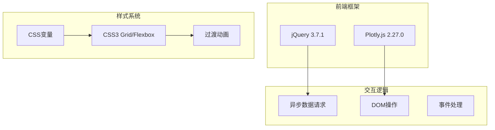

**图表来源**
- [index.html:8-9](file://src/main/resources/static/index.html#L8-L9)
- [app.js:1-13](file://src/main/resources/static/js/app.js#L1-L13)

### 后端架构

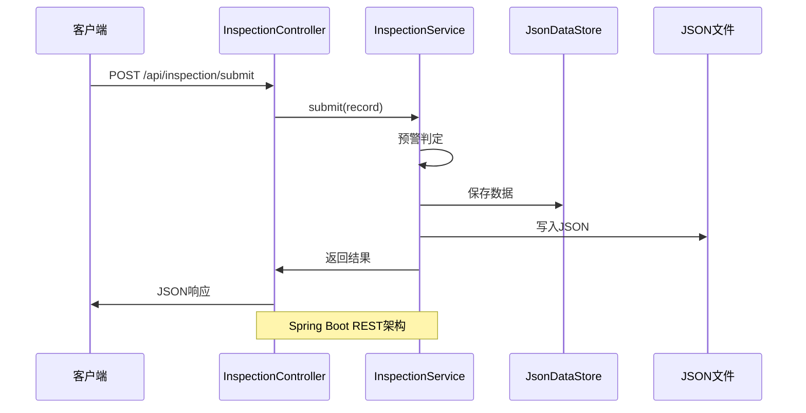

**图表来源**
- [InspectionController.java:15-34](file://src/main/java/com/zjzy/quality/controller/InspectionController.java#L15-L34)
- [InspectionService.java:19-44](file://src/main/java/com/zjzy/quality/service/InspectionService.java#L19-L44)

### 数据流设计

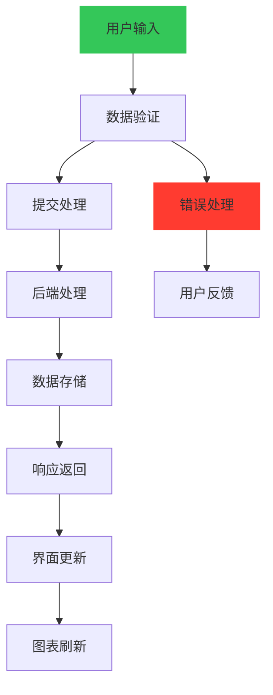

**图表来源**
- [app.js:28-74](file://src/main/resources/static/js/app.js#L28-L74)
- [InspectionService.java:19-44](file://src/main/java/com/zjzy/quality/service/InspectionService.java#L19-L44)

**章节来源**
- [InspectionController.java:10-34](file://src/main/java/com/zjzy/quality/controller/InspectionController.java#L10-L34)
- [InspectionService.java:8-44](file://src/main/java/com/zjzy/quality/service/InspectionService.java#L8-L44)
- [InspectionRecord.java:7-154](file://src/main/java/com/zjzy/quality/entity/InspectionRecord.java#L7-L154)

## 总结

卷烟全维度质检智能预警预判系统的HTML页面结构设计体现了现代Web开发的最佳实践。通过精心设计的布局架构、丰富的交互功能和完善的可访问性考虑，系统为用户提供了一个专业、高效的质量管理平台。

### 设计亮点

1. **极简主义设计**：遵循Apple官网的设计语言，追求简洁优雅的视觉效果
2. **功能完整性**：涵盖数据录入、实时监控、历史分析和智能预测的完整流程
3. **响应式适配**：在保证桌面端体验的同时，考虑了多设备的兼容性
4. **语义化结构**：符合Web标准的HTML结构，便于SEO和可访问性
5. **性能优化**：合理的内容组织和资源加载策略

### 技术优势

- **前后端分离**：清晰的架构边界，便于团队协作和系统维护
- **数据驱动**：基于真实数据的可视化展示，提供决策支持
- **实时更新**：AJAX技术实现实时数据刷新，提升用户体验
- **扩展性强**：模块化的组件设计，支持功能的灵活扩展

该系统不仅满足了卷烟质量检测的实际需求，也为工业4.0时代的智能制造提供了优秀的数字化解决方案。