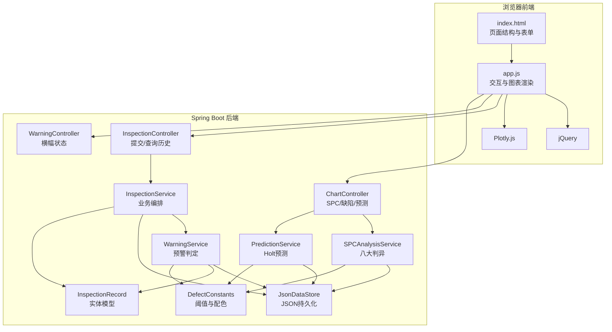
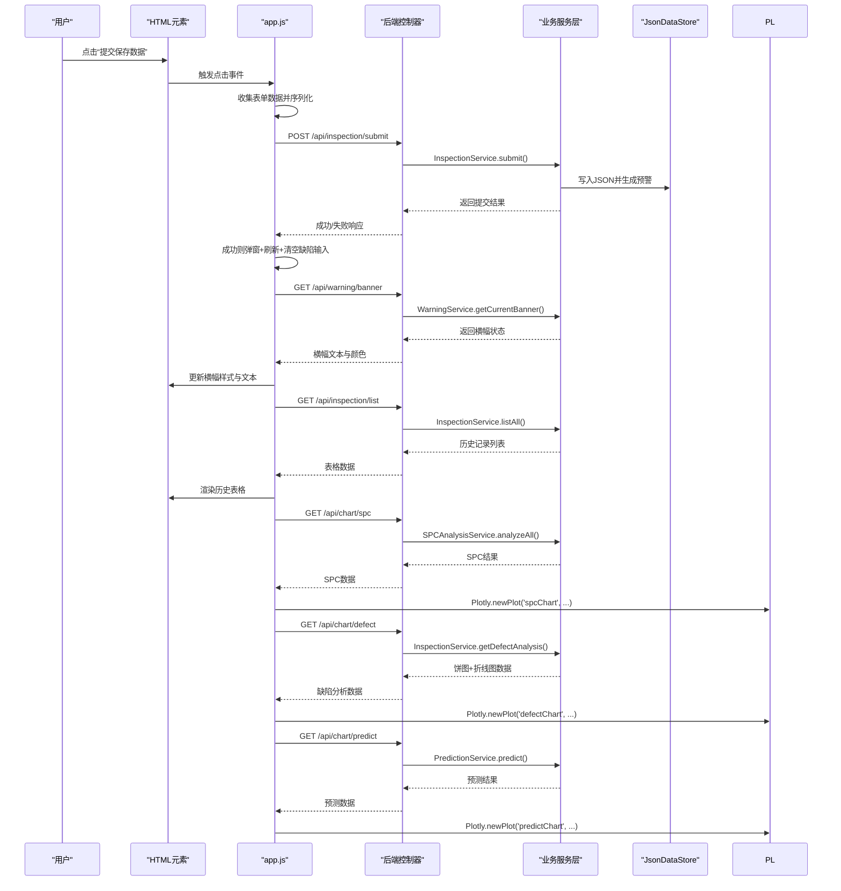
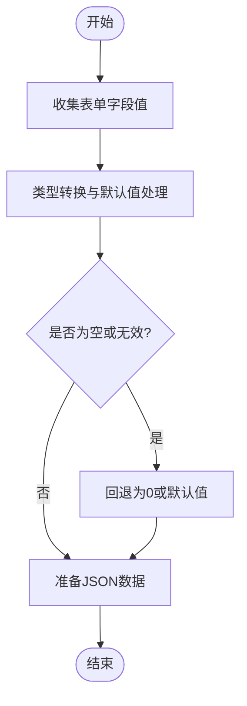
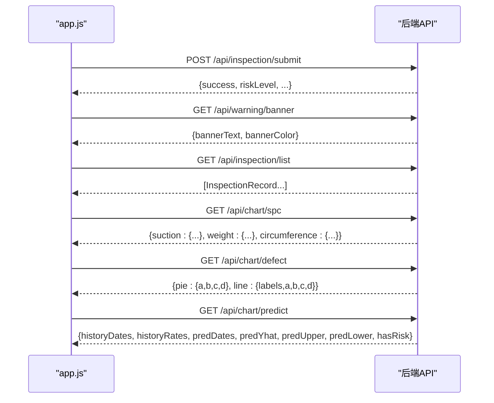
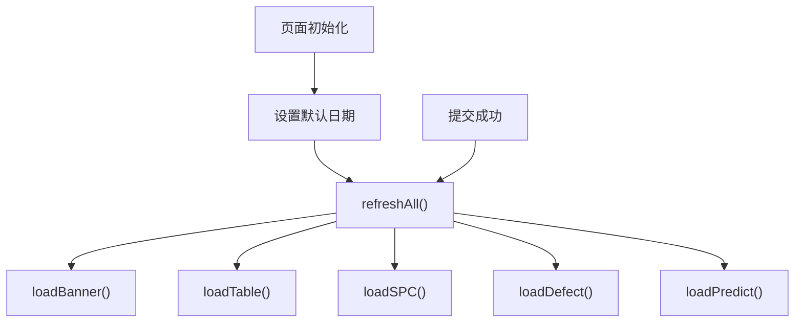
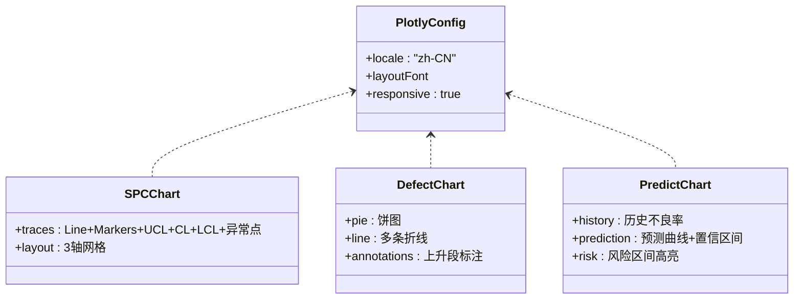
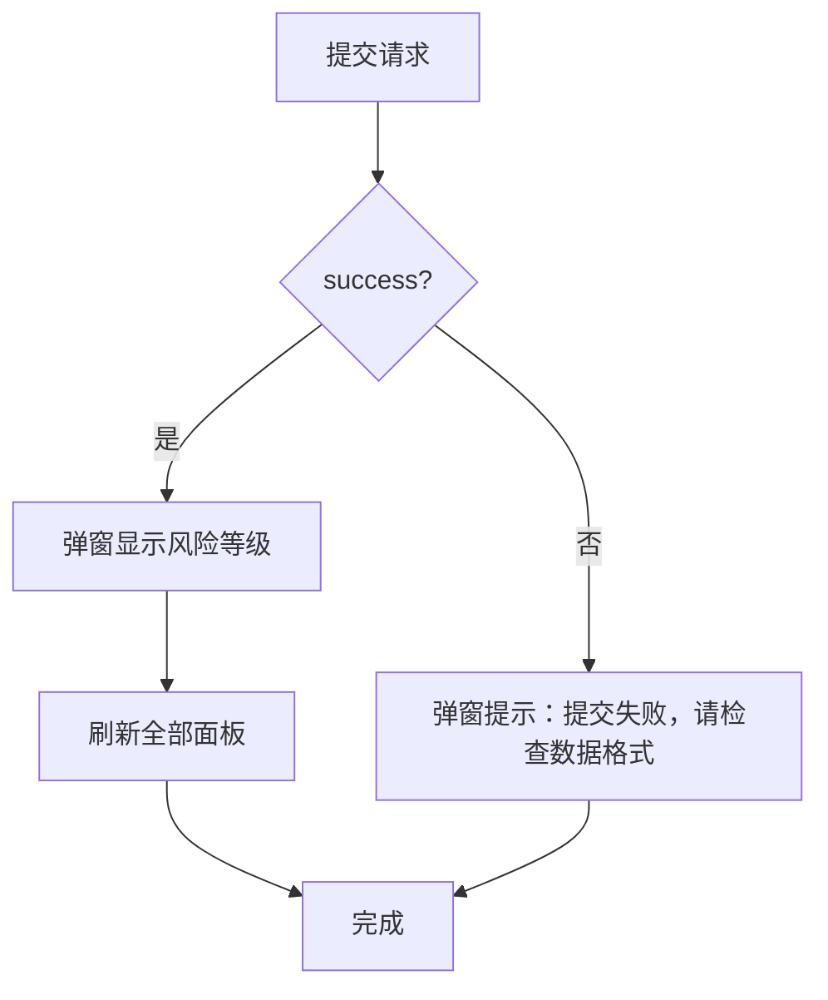
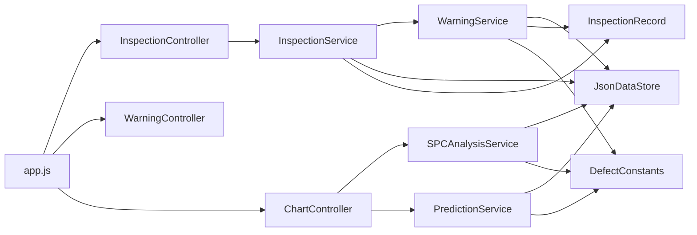

# JavaScript交互逻辑

<cite>
**本文引用的文件**
- [app.js](file://src/main/resources/static/js/app.js)
- [index.html](file://src/main/resources/index.html)
- [ChartController.java](file://src/main/java/com/zjzy/quality/controller/ChartController.java)
- [InspectionController.java](file://src/main/java/com/zjzy/quality/controller/InspectionController.java)
- [WarningController.java](file://src/main/java/com/zjzy/quality/controller/WarningController.java)
- [InspectionService.java](file://src/main/java/com/zjzy/quality/service/InspectionService.java)
- [PredictionService.java](file://src/main/java/com/zjzy/quality/service/PredictionService.java)
- [SPCAnalysisService.java](file://src/main/java/com/zjzy/quality/service/SPCAnalysisService.java)
- [WarningService.java](file://src/main/java/com/zjzy/quality/service/WarningService.java)
- [DefectConstants.java](file://src/main/java/com/zjzy/quality/constant/DefectConstants.java)
- [InspectionRecord.java](file://src/main/java/com/zjzy/quality/entity/InspectionRecord.java)
- [JsonDataStore.java](file://src/main/java/com/zjzy/quality/util/JsonDataStore.java)
</cite>

## 目录
1. [简介](#简介)
2. [项目结构](#项目结构)
3. [核心组件](#核心组件)
4. [架构总览](#架构总览)
5. [详细组件分析](#详细组件分析)
6. [依赖关系分析](#依赖关系分析)
7. [性能考量](#性能考量)
8. [故障排查指南](#故障排查指南)
9. [结论](#结论)

## 简介
本文件聚焦于前端交互逻辑，系统性梳理 app.js 的核心功能实现，包括：
- 表单验证与数据收集
- AJAX 异步请求流程（提交、历史查询、图表数据）
- 实时数据更新机制（页面初始化、手动刷新）
- 图表渲染逻辑（Plotly.js 初始化、数据绑定、配置与交互）
- 错误处理与用户反馈（加载提示、成功提示、错误弹窗）

## 项目结构
前端采用 jQuery + Plotly.js 架构，通过 AJAX 调用后端 REST 接口获取数据并渲染可视化图表；后端以 Spring Boot 提供统一的 API，业务逻辑由 Java 服务层完成。

**图表来源**
- [index.html:1-179](file://src/main/resources/index.html#L1-L179)
- [app.js:1-420](file://src/main/resources/static/js/app.js#L1-L420)
- [InspectionController.java:1-35](file://src/main/java/com/zjzy/quality/controller/InspectionController.java#L1-L35)
- [WarningController.java:1-38](file://src/main/java/com/zjzy/quality/controller/WarningController.java#L1-L38)
- [ChartController.java:1-106](file://src/main/java/com/zjzy/quality/controller/ChartController.java#L1-L106)
- [InspectionService.java:1-102](file://src/main/java/com/zjzy/quality/service/InspectionService.java#L1-L102)
- [PredictionService.java:1-169](file://src/main/java/com/zjzy/quality/service/PredictionService.java#L1-L169)
- [SPCAnalysisService.java:1-241](file://src/main/java/com/zjzy/quality/service/SPCAnalysisService.java#L1-L241)
- [WarningService.java:1-140](file://src/main/java/com/zjzy/quality/service/WarningService.java#L1-L140)
- [DefectConstants.java:1-76](file://src/main/java/com/zjzy/quality/constant/DefectConstants.java#L1-L76)
- [InspectionRecord.java:1-154](file://src/main/java/com/zjzy/quality/entity/InspectionRecord.java#L1-L154)
- [JsonDataStore.java:1-222](file://src/main/java/com/zjzy/quality/util/JsonDataStore.java#L1-L222)

**章节来源**
- [index.html:1-179](file://src/main/resources/index.html#L1-L179)
- [app.js:1-420](file://src/main/resources/static/js/app.js#L1-L420)

## 核心组件
- 页面初始化与默认日期设置
- 表单数据收集与提交
- 全量数据刷新（横幅、表格、SPC、缺陷、预测）
- AJAX 请求封装与错误处理
- Plotly 图表渲染与布局配置
- 工具函数（颜色转换）

**章节来源**
- [app.js:16-83](file://src/main/resources/static/js/app.js#L16-L83)
- [app.js:57-74](file://src/main/resources/static/js/app.js#L57-L74)
- [app.js:77-83](file://src/main/resources/static/js/app.js#L77-L83)
- [app.js:414-420](file://src/main/resources/static/js/app.js#L414-L420)

## 架构总览
前端通过 app.js 统一调度各模块：
- 初始化时设置默认日期并调用 refreshAll() 刷新全部面板
- 提交按钮绑定 click 事件，收集表单数据并通过 AJAX 提交
- 各面板独立加载：横幅状态、历史表格、SPC 控制图、缺陷分析、AI 预测
- 图表使用 Plotly.js 渲染，支持响应式布局与多轴配置

**图表来源**
- [app.js:29-74](file://src/main/resources/static/js/app.js#L29-L74)
- [app.js:86-96](file://src/main/resources/static/js/app.js#L86-L96)
- [app.js:99-159](file://src/main/resources/static/js/app.js#L99-L159)
- [app.js:162-264](file://src/main/resources/static/js/app.js#L162-L264)
- [app.js:267-337](file://src/main/resources/static/js/app.js#L267-L337)
- [app.js:340-411](file://src/main/resources/static/js/app.js#L340-L411)
- [InspectionController.java:21-33](file://src/main/java/com/zjzy/quality/controller/InspectionController.java#L21-L33)
- [WarningController.java:24-27](file://src/main/java/com/zjzy/quality/controller/WarningController.java#L24-L27)
- [ChartController.java:25-104](file://src/main/java/com/zjzy/quality/controller/ChartController.java#L25-L104)
- [InspectionService.java:19-44](file://src/main/java/com/zjzy/quality/service/InspectionService.java#L19-L44)
- [WarningService.java:126-138](file://src/main/java/com/zjzy/quality/service/WarningService.java#L126-L138)
- [SPCAnalysisService.java:45-74](file://src/main/java/com/zjzy/quality/service/SPCAnalysisService.java#L45-L74)
- [PredictionService.java:50-159](file://src/main/java/com/zjzy/quality/service/PredictionService.java#L50-L159)

## 详细组件分析

### 表单验证与数据收集
- 输入类型与步长约束：吸阻、重量、圆周等数值字段使用 number 类型并设置 step；抽检数量使用 number 类型并设置最小值
- 必填项检查：日期、班次、机台、班组、抽检数量等字段在前端未做显式校验，但后端实体类包含非空字段，提交时由后端进行校验
- 数据收集与类型转换：app.js 将输入框值转换为整数或浮点数，无法解析时回退为 0，确保图表与计算可用

**图表来源**
- [index.html:35-130](file://src/main/resources/index.html#L35-L130)
- [app.js:29-55](file://src/main/resources/static/js/app.js#L29-L55)

**章节来源**
- [index.html:35-130](file://src/main/resources/index.html#L35-L130)
- [app.js:29-55](file://src/main/resources/static/js/app.js#L29-L55)

### AJAX 异步请求实现
- 提交质检数据：POST /api/inspection/submit，发送 InspectionRecord JSON，成功后弹窗显示风险等级并刷新全部面板
- 历史数据获取：GET /api/inspection/list，返回历史记录列表，用于渲染表格
- 横幅状态：GET /api/warning/banner，返回当前风险横幅文本与颜色
- 图表数据：
  - SPC：GET /api/chart/spc，返回吸阻、重量、圆周的均值、中心线、上下控制限及异常点
  - 缺陷分析：GET /api/chart/defect，返回饼图与折线图数据
  - AI 预测：GET /api/chart/predict，返回历史与预测日期、不良率、置信区间与风险标注

**图表来源**
- [app.js:57-74](file://src/main/resources/static/js/app.js#L57-L74)
- [app.js:86-96](file://src/main/resources/static/js/app.js#L86-L96)
- [app.js:99-159](file://src/main/resources/static/js/app.js#L99-L159)
- [app.js:162-264](file://src/main/resources/static/js/app.js#L162-L264)
- [app.js:267-337](file://src/main/resources/static/js/app.js#L267-L337)
- [app.js:340-411](file://src/main/resources/static/js/app.js#L340-L411)
- [InspectionController.java:21-33](file://src/main/java/com/zjzy/quality/controller/InspectionController.java#L21-L33)
- [WarningController.java:24-27](file://src/main/java/com/zjzy/quality/controller/WarningController.java#L24-L27)
- [ChartController.java:25-104](file://src/main/java/com/zjzy/quality/controller/ChartController.java#L25-L104)

**章节来源**
- [app.js:57-74](file://src/main/resources/static/js/app.js#L57-L74)
- [app.js:86-96](file://src/main/resources/static/js/app.js#L86-L96)
- [app.js:99-159](file://src/main/resources/static/js/app.js#L99-L159)
- [app.js:162-264](file://src/main/resources/static/js/app.js#L162-L264)
- [app.js:267-337](file://src/main/resources/static/js/app.js#L267-L337)
- [app.js:340-411](file://src/main/resources/static/js/app.js#L340-L411)

### 实时数据更新机制
- 页面初始化：设置默认日期为当天，并立即调用 refreshAll() 刷新全部面板
- 手动刷新：refreshAll() 串行调用 loadBanner()、loadTable()、loadSPC()、loadDefect()、loadPredict()
- 事件驱动：提交成功后再次调用 refreshAll()，确保横幅、表格、图表同步更新
- 缓存策略：前端未实现本地缓存；后端通过 JsonDataStore 在内存中维护缓存并持久化到 JSON 文件

**图表来源**
- [app.js:16-26](file://src/main/resources/static/js/app.js#L16-L26)
- [app.js:77-83](file://src/main/resources/static/js/app.js#L77-L83)
- [app.js:62-68](file://src/main/resources/static/js/app.js#L62-L68)

**章节来源**
- [app.js:16-26](file://src/main/resources/static/js/app.js#L16-L26)
- [app.js:77-83](file://src/main/resources/static/js/app.js#L77-L83)
- [app.js:62-68](file://src/main/resources/static/js/app.js#L62-L68)

### 图表渲染逻辑（Plotly.js）
- 全局中文配置：设置 d3.locale 为 zh-CN
- 字体与布局：统一字体家族、大小与颜色，设置边距、网格与背景色
- SPC 控制图：三轴并列展示吸阻、重量、圆周，绘制主线、UCL/CL/LCL 三条基准线，标注严重异常（红X）与轻微偏离（黄圆），支持注释
- 缺陷分析：饼图展示 A/B/C/D 类别占比，折线图展示近10班次趋势，标注上升段异动
- AI 预测：历史曲线与预测曲线，置信区间填充，风险区间高亮，预测期间标注风险提示

**图表来源**
- [app.js:6-13](file://src/main/resources/static/js/app.js#L6-L13)
- [app.js:239-260](file://src/main/resources/static/js/app.js#L239-L260)
- [app.js:324-333](file://src/main/resources/static/js/app.js#L324-L333)
- [app.js:385-395](file://src/main/resources/static/js/app.js#L385-L395)

**章节来源**
- [app.js:6-13](file://src/main/resources/static/js/app.js#L6-L13)
- [app.js:162-264](file://src/main/resources/static/js/app.js#L162-L264)
- [app.js:267-337](file://src/main/resources/static/js/app.js#L267-L337)
- [app.js:340-411](file://src/main/resources/static/js/app.js#L340-L411)

### 错误处理与用户反馈
- 提交失败：AJAX error 回调弹窗提示“提交失败，请检查数据格式”
- 历史表格为空：当后端返回空数组时，前端渲染“暂无数据”提示
- AI 预测数据不足：当历史日期为空时，前端渲染“数据不足，至少需要2条记录方可预测”的提示
- 成功反馈：提交成功后弹窗显示风险等级，并刷新全部面板

**图表来源**
- [app.js:62-73](file://src/main/resources/static/js/app.js#L62-L73)
- [app.js:101-103](file://src/main/resources/static/js/app.js#L101-L103)
- [app.js:342-344](file://src/main/resources/static/js/app.js#L342-L344)

**章节来源**
- [app.js:62-73](file://src/main/resources/static/js/app.js#L62-L73)
- [app.js:101-103](file://src/main/resources/static/js/app.js#L101-L103)
- [app.js:342-344](file://src/main/resources/static/js/app.js#L342-L344)

## 依赖关系分析
- 前端依赖：jQuery（DOM 操作与 AJAX）、Plotly.js（图表渲染）
- 后端依赖：Spring MVC（REST 控制器）、Gson（JSON 序列化）、自定义服务层与工具类
- 数据流：前端通过 app.js 发起 AJAX 请求，后端控制器调用服务层，服务层访问 JsonDataStore 完成数据持久化与读取

**图表来源**
- [app.js:1-420](file://src/main/resources/static/js/app.js#L1-L420)
- [InspectionController.java:1-35](file://src/main/java/com/zjzy/quality/controller/InspectionController.java#L1-L35)
- [WarningController.java:1-38](file://src/main/java/com/zjzy/quality/controller/WarningController.java#L1-L38)
- [ChartController.java:1-106](file://src/main/java/com/zjzy/quality/controller/ChartController.java#L1-L106)
- [InspectionService.java:1-102](file://src/main/java/com/zjzy/quality/service/InspectionService.java#L1-L102)
- [SPCAnalysisService.java:1-241](file://src/main/java/com/zjzy/quality/service/SPCAnalysisService.java#L1-L241)
- [PredictionService.java:1-169](file://src/main/java/com/zjzy/quality/service/PredictionService.java#L1-L169)
- [WarningService.java:1-140](file://src/main/java/com/zjzy/quality/service/WarningService.java#L1-L140)
- [JsonDataStore.java:1-222](file://src/main/java/com/zjzy/quality/util/JsonDataStore.java#L1-L222)
- [DefectConstants.java:1-76](file://src/main/java/com/zjzy/quality/constant/DefectConstants.java#L1-L76)
- [InspectionRecord.java:1-154](file://src/main/java/com/zjzy/quality/entity/InspectionRecord.java#L1-L154)

**章节来源**
- [app.js:1-420](file://src/main/resources/static/js/app.js#L1-L420)
- [InspectionController.java:1-35](file://src/main/java/com/zjzy/quality/controller/InspectionController.java#L1-L35)
- [WarningController.java:1-38](file://src/main/java/com/zjzy/quality/controller/WarningController.java#L1-L38)
- [ChartController.java:1-106](file://src/main/java/com/zjzy/quality/controller/ChartController.java#L1-L106)
- [InspectionService.java:1-102](file://src/main/java/com/zjzy/quality/service/InspectionService.java#L1-L102)
- [SPCAnalysisService.java:1-241](file://src/main/java/com/zjzy/quality/service/SPCAnalysisService.java#L1-L241)
- [PredictionService.java:1-169](file://src/main/java/com/zjzy/quality/service/PredictionService.java#L1-L169)
- [WarningService.java:1-140](file://src/main/java/com/zjzy/quality/service/WarningService.java#L1-L140)
- [JsonDataStore.java:1-222](file://src/main/java/com/zjzy/quality/util/JsonDataStore.java#L1-L222)
- [DefectConstants.java:1-76](file://src/main/java/com/zjzy/quality/constant/DefectConstants.java#L1-L76)
- [InspectionRecord.java:1-154](file://src/main/java/com/zjzy/quality/entity/InspectionRecord.java#L1-L154)

## 性能考量
- 图表渲染：Plotly 渲染多轴与大量标记时可能影响性能，建议在大数据量场景下启用响应式与限制标记数量
- AJAX 调用：页面初始化时一次性拉取多个接口，建议在移动端网络环境下考虑合并请求或增加节流
- 数据存储：JsonDataStore 采用内存缓存+文件持久化，适合小规模演示；生产环境建议迁移到数据库并引入缓存层

## 故障排查指南
- 提交失败：检查输入格式（数值字段需为合法数字）、必填项是否填写；查看浏览器控制台网络请求与后端日志
- 图表空白：确认后端接口返回数据结构正确，前端未对空数据做充分保护时，可在 app.js 中补充空数据处理分支
- 横幅颜色异常：检查 WarningService 返回的颜色值与前端 hexToRgba 转换逻辑
- 预测图表提示“数据不足”：确保历史记录至少两条以上

**章节来源**
- [app.js:62-73](file://src/main/resources/static/js/app.js#L62-L73)
- [app.js:101-103](file://src/main/resources/static/js/app.js#L101-L103)
- [app.js:342-344](file://src/main/resources/static/js/app.js#L342-L344)
- [WarningService.java:126-138](file://src/main/java/com/zjzy/quality/service/WarningService.java#L126-L138)

## 结论
app.js 以简洁的模块化方式实现了完整的前端交互闭环：从表单采集、AJAX 提交、实时刷新到多维图表渲染。配合后端服务层的预警判定、SPC 分析与 AI 预测，形成一套可扩展的质量监控体系。建议后续增强：
- 前端表单校验与错误提示
- 图表懒加载与性能优化
- 后端数据库迁移与缓存策略
- 用户权限与审计日志