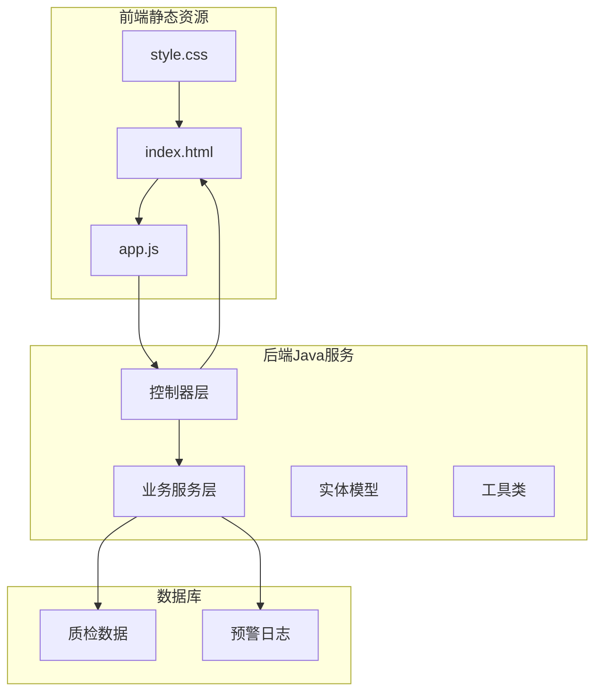
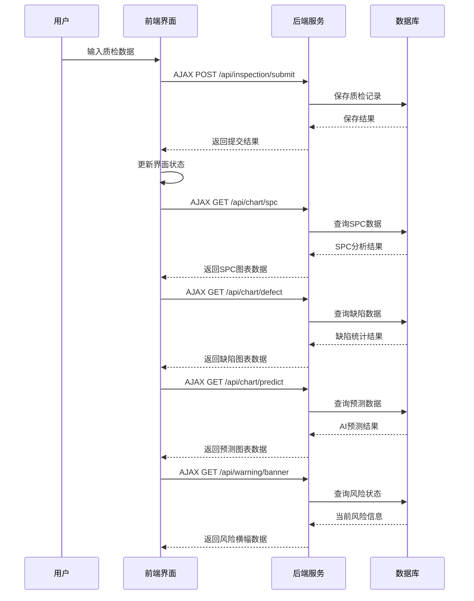
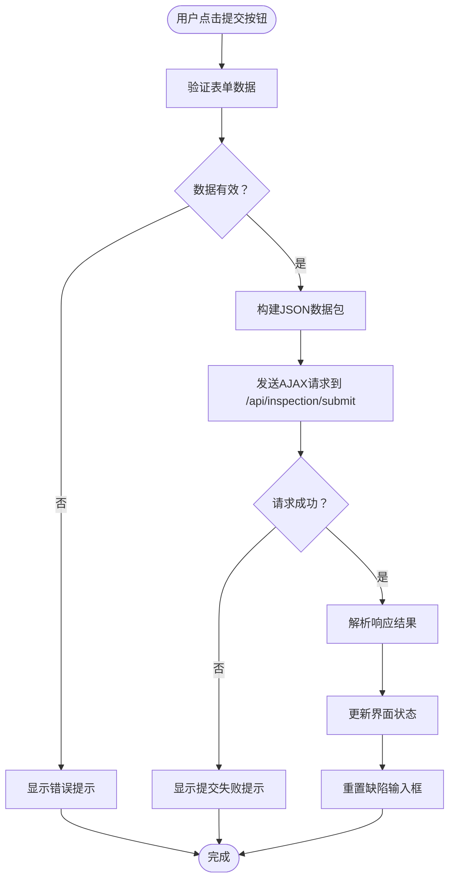
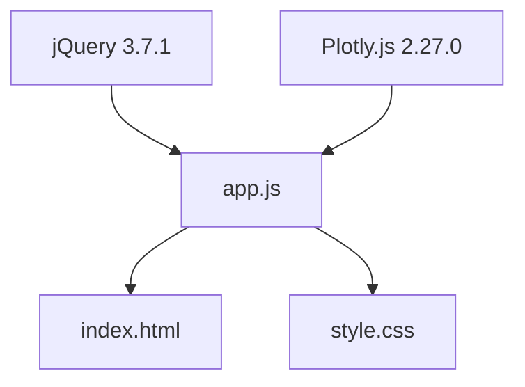
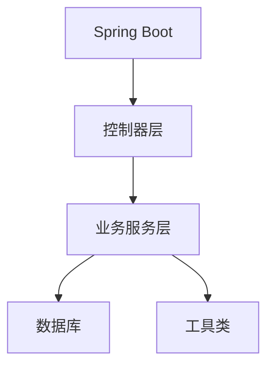

# 前端界面

<cite>
**本文档引用的文件**
- [index.html](file://src/main/resources/static/index.html)
- [app.js](file://src/main/resources/static/js/app.js)
- [style.css](file://src/main/resources/static/css/style.css)
- [ChartController.java](file://src/main/java/com/zjzy/quality/controller/ChartController.java)
- [InspectionController.java](file://src/main/java/com/zjzy/quality/controller/InspectionController.java)
- [WarningController.java](file://src/main/java/com/zjzy/quality/controller/WarningController.java)
- [DefectConstants.java](file://src/main/java/com/zjzy/quality/constant/DefectConstants.java)
- [application.yml](file://src/main/resources/application.yml)
</cite>

## 目录
1. [简介](#简介)
2. [项目结构](#项目结构)
3. [核心组件](#核心组件)
4. [架构概览](#架构概览)
5. [详细组件分析](#详细组件分析)
6. [依赖关系分析](#依赖关系分析)
7. [性能考虑](#性能考虑)
8. [故障排除指南](#故障排除指南)
9. [结论](#结论)

## 简介

本项目是一个基于jQuery和Plotly.js的卷烟全维度质检智能预警预判系统的Web前端界面。该系统采用现代化的前端技术栈，结合企业级后端服务，为用户提供直观的数据录入、实时监控和智能预警功能。

系统采用"左侧数据录入 + 右侧可视化看板"的双栏布局设计，通过四个主要板块展示质检数据：历史数据表格、SPC控制图、缺陷综合分析和AI预测图表。整个界面遵循Apple乔布斯极简设计理念，强调用户体验和视觉美感。

## 项目结构

项目采用前后端分离的架构模式，前端静态资源位于`src/main/resources/static/`目录下，后端Java服务位于`src/main/java/`目录下。

**图表来源**
- [index.html:1-179](file://src/main/resources/static/index.html#L1-L179)
- [app.js:1-420](file://src/main/resources/static/js/app.js#L1-L420)
- [style.css:1-336](file://src/main/resources/static/css/style.css#L1-L336)

**章节来源**
- [index.html:1-179](file://src/main/resources/static/index.html#L1-L179)
- [app.js:1-420](file://src/main/resources/static/js/app.js#L1-L420)
- [style.css:1-336](file://src/main/resources/static/css/style.css#L1-L336)

## 核心组件

### 页面布局结构

系统采用响应式双栏布局设计，整体分为三个主要区域：

1. **顶部标题区**：显示系统名称和项目信息
2. **风险提示横幅**：实时显示当前质量风险状态
3. **主内容区**：左右分栏布局

左侧数据录入面板占35%，右侧可视化看板占65%，两栏之间有24px的间距。

### 数据录入表单

数据录入表单包含以下关键字段：
- 基础信息：日期、班次、机台编号、班组、总抽检数量
- 烟支内在物测指标：吸阻、单支重量、圆周
- 四层外观缺陷：烟支外观、小盒外观、条盒外观、箱装外观缺陷

每个缺陷类别都使用不同颜色标识，A类缺陷用红色，B类缺陷用橙色，C类缺陷用黄色，D类缺陷用灰色。

### 历史数据表格

表格展示全量质检历史数据，包含25个字段，支持按风险等级自动着色显示。

### 四种图表区域

1. **SPC控制图**：展示吸阻、重量、圆周三项指标的SPC监控图
2. **缺陷综合分析**：饼图显示缺陷等级分布，折线图显示各等级缺陷趋势
3. **AI预测大图**：展示历史不良率和AI预测曲线及置信区间
4. **风险提示横幅**：动态显示当前质量风险状态

**章节来源**
- [index.html:26-169](file://src/main/resources/static/index.html#L26-L169)
- [style.css:94-121](file://src/main/resources/static/css/style.css#L94-L121)

## 架构概览

系统采用MVC架构模式，前端通过AJAX与后端进行数据交互。

**图表来源**
- [app.js:57-74](file://src/main/resources/static/js/app.js#L57-L74)
- [ChartController.java:25-70](file://src/main/java/com/zjzy/quality/controller/ChartController.java#L25-L70)
- [InspectionController.java:21-24](file://src/main/java/com/zjzy/quality/controller/InspectionController.java#L21-L24)
- [WarningController.java:24-27](file://src/main/java/com/zjzy/quality/controller/WarningController.java#L24-L27)

## 详细组件分析

### JavaScript主逻辑分析

#### 页面初始化与事件绑定

页面加载完成后，JavaScript执行以下初始化操作：

1. 设置默认日期为当天
2. 调用`refreshAll()`函数加载所有数据面板
3. 绑定提交按钮的点击事件处理器

#### 数据提交流程

**图表来源**
- [app.js:29-74](file://src/main/resources/static/js/app.js#L29-L74)

#### 实时数据更新机制

系统采用定时刷新机制，通过调用`refreshAll()`函数更新所有面板数据：

1. `loadBanner()`: 加载风险横幅状态
2. `loadTable()`: 加载历史数据表格
3. `loadSPC()`: 加载SPC控制图
4. `loadDefect()`: 加载缺陷分析图
5. `loadPredict()`: 加载AI预测图

#### 图表渲染实现

##### SPC控制图渲染

SPC控制图使用Plotly.js渲染三轴图表，包含以下元素：

- 主线：实际测量值连线
- UCL线：上控制限（虚线）
- CL线：中心线（实线）
- LCL线：下控制限（虚线）
- 异常标记：严重异常用红色X标记，轻微偏离用黄色圆圈标记

##### 缺陷分析图渲染

缺陷分析图采用复合图表设计：

- 饼图：显示A、B、C、D四类缺陷占比
- 折线图：显示各等级缺陷随时间的变化趋势
- 异动标注：对上升趋势进行标注提示

##### AI预测图渲染

AI预测图展示历史不良率和预测曲线：

- 历史曲线：实线显示历史每日综合不良率
- 预测曲线：虚线显示Holt趋势预测
- 置信区间：半透明区域表示预测不确定性
- 风险标注：当存在批量质量风险时进行视觉提醒

**章节来源**
- [app.js:15-83](file://src/main/resources/static/js/app.js#L15-L83)
- [app.js:162-264](file://src/main/resources/static/js/app.js#L162-L264)
- [app.js:267-337](file://src/main/resources/static/js/app.js#L267-L337)
- [app.js:340-411](file://src/main/resources/static/js/app.js#L340-L411)

### CSS样式设计原则

#### 设计理念

系统采用Apple乔布斯极简风格，核心设计原则包括：

1. **大留白**：使用大量空白空间营造简洁感
2. **毛玻璃效果**：通过backdrop-filter实现模糊背景
3. **圆角卡片**：统一的16px圆角设计
4. **字体系统**：采用系统默认字体链，确保跨平台一致性

#### 响应式布局

系统支持最小宽度1200px的响应式设计：

- 主容器最大宽度1600px，居中显示
- 左右分栏比例35%:65%
- 卡片采用flex布局，支持垂直滚动
- 表格区域支持水平滚动

#### 颜色系统

采用统一的颜色变量系统：

- 主色调：#0071e3（蓝色）
- 风险等级：A类#FF3B30（红色）、B类#FF9500（橙色）、C类#FFCC00（黄色）、D类#C7C7CC（灰色）
- 安全状态：#34C759（绿色）
- 字体颜色：#1d1d1f（深灰）

#### 交互反馈

- 悬停效果：卡片阴影从轻度提升到重度
- 焦点状态：输入框获得焦点时显示蓝色边框
- 按钮状态：悬停时提升1px，激活时恢复原位
- 过渡动画：所有交互效果持续0.3秒

**章节来源**
- [style.css:1-336](file://src/main/resources/static/css/style.css#L1-L336)

### 后端接口集成

#### REST API设计

系统通过四个主要接口与后端进行数据交互：

1. **/api/inspection/submit**：POST提交质检数据
2. **/api/inspection/list**：GET查询历史数据列表
3. **/api/chart/spc**：GET查询SPC分析数据
4. **/api/chart/defect**：GET查询缺陷分析数据
5. **/api/chart/predict**：GET查询AI预测数据
6. **/api/warning/banner**：GET查询风险横幅状态

#### 数据格式规范

所有接口采用JSON格式进行数据交换，前端通过jQuery的$.ajax()方法进行异步请求。

**章节来源**
- [InspectionController.java:17-33](file://src/main/java/com/zjzy/quality/controller/InspectionController.java#L17-L33)
- [ChartController.java:25-104](file://src/main/java/com/zjzy/quality/controller/ChartController.java#L25-L104)
- [WarningController.java:24-36](file://src/main/java/com/zjzy/quality/controller/WarningController.java#L24-L36)

## 依赖关系分析

### 前端依赖

系统使用两个主要的第三方库：

**图表来源**
- [index.html:8-9](file://src/main/resources/static/index.html#L8-L9)
- [app.js:1-26](file://src/main/resources/static/js/app.js#L1-L26)

### 后端依赖

后端服务依赖Spring Boot框架，提供RESTful API服务。

**图表来源**
- [application.yml:1-24](file://src/main/resources/application.yml#L1-L24)

### 外部资源

系统通过CDN加载外部资源，确保加载速度和稳定性：

- jQuery CDN：https://cdn.jsdelivr.net/npm/jquery@3.7.1/dist/jquery.min.js
- Plotly.js CDN：https://cdn.plot.ly/plotly-2.27.0.min.js

**章节来源**
- [index.html:8-9](file://src/main/resources/static/index.html#L8-L9)

## 性能考虑

### 前端性能优化

1. **懒加载策略**：图表采用延迟加载，在用户需要时才进行渲染
2. **数据缓存**：合理利用浏览器缓存机制，减少重复请求
3. **DOM操作优化**：批量更新DOM，避免频繁的重排重绘
4. **事件委托**：使用事件委托减少事件监听器数量

### 图表性能优化

1. **响应式配置**：启用Plotly.js的responsive选项，自动适应容器大小
2. **数据压缩**：后端返回精简的数据结构，前端只处理必要字段
3. **内存管理**：及时清理不再使用的图表实例，释放内存

### 网络性能优化

1. **CDN加速**：使用CDN加载jQuery和Plotly.js库
2. **HTTP缓存**：合理设置缓存头，提高静态资源加载速度
3. **连接复用**：浏览器会自动复用HTTP连接，减少握手开销

### 浏览器兼容性

系统支持现代浏览器，包括：
- Chrome 60+
- Firefox 55+
- Safari 11+
- Edge 79+

对于不支持ES6语法的旧版本浏览器，建议添加相应的polyfill。

## 故障排除指南

### 常见问题诊断

#### 图表无法显示

1. **检查网络连接**：确认能够访问后端API接口
2. **查看浏览器控制台**：检查是否有JavaScript错误
3. **验证数据格式**：确认后端返回的数据格式正确

#### 表单提交失败

1. **检查必填字段**：确认所有必填字段都已填写
2. **验证数据类型**：确认数字字段输入的是有效数字
3. **查看服务器响应**：检查后端是否返回错误信息

#### 样式显示异常

1. **检查CSS文件加载**：确认style.css文件能够正常加载
2. **验证浏览器兼容性**：确认使用的CSS属性被目标浏览器支持
3. **清除浏览器缓存**：尝试清除缓存后重新加载页面

### 调试技巧

1. **使用开发者工具**：Chrome DevTools可以查看网络请求和JavaScript执行情况
2. **添加日志输出**：在关键位置添加console.log语句进行调试
3. **模拟数据**：使用测试数据验证前端逻辑的正确性

**章节来源**
- [app.js:69-73](file://src/main/resources/static/js/app.js#L69-L73)
- [app.js:101-103](file://src/main/resources/static/js/app.js#L101-L103)

## 结论

本项目成功实现了基于jQuery和Plotly.js的企业级质检管理系统前端界面。通过合理的架构设计和现代化的技术选型，系统具备了良好的用户体验、可维护性和扩展性。

系统的主要优势包括：

1. **直观的用户界面**：采用Apple设计语言，界面简洁美观
2. **强大的数据可视化**：通过多种图表类型展示复杂的质检数据
3. **实时数据更新**：支持多维度数据的实时监控和预警
4. **良好的性能表现**：优化的前端架构确保了流畅的用户体验
5. **完善的错误处理**：健壮的错误处理机制提升了系统的可靠性

未来可以在以下方面进行改进：
- 添加更多的图表交互功能
- 实现更精细的数据筛选和搜索功能
- 增加移动端适配支持
- 优化大数据量场景下的性能表现