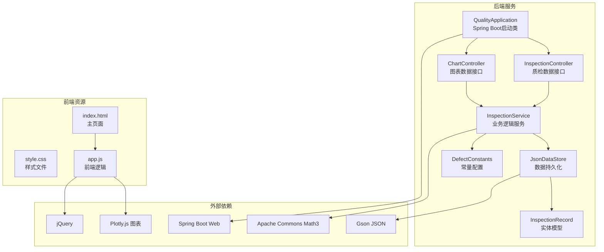
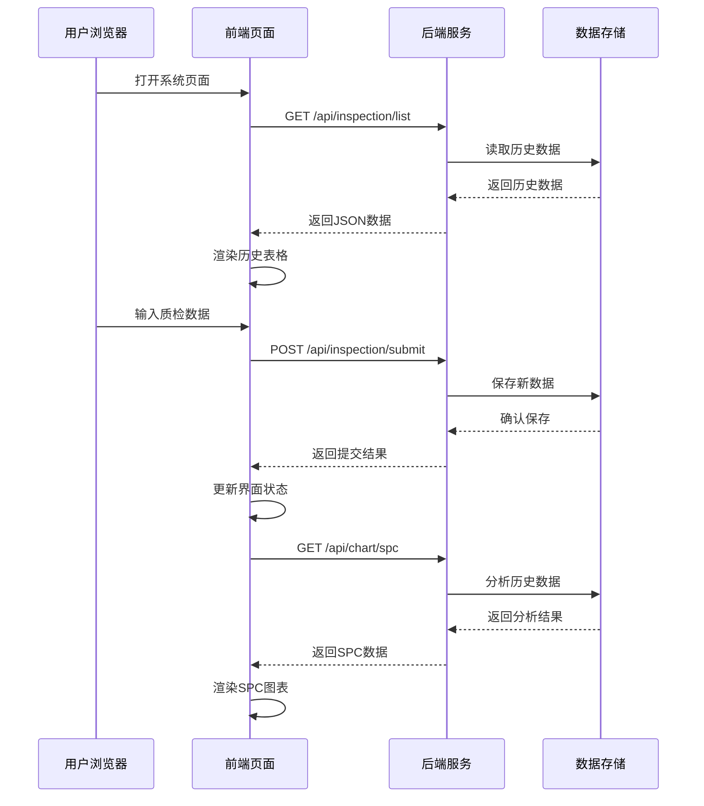
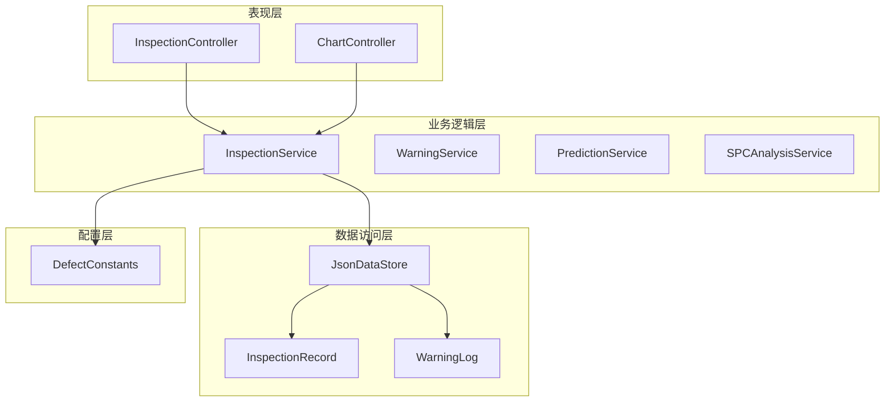
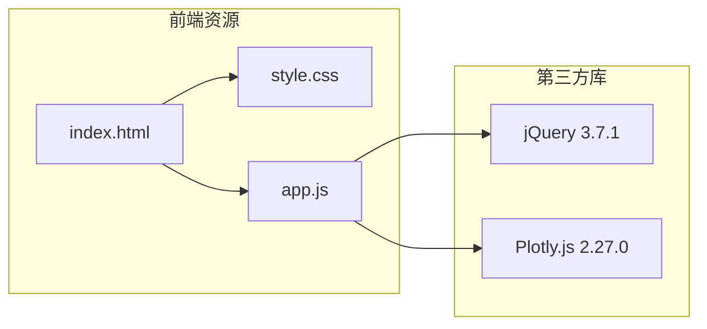

# 快速开始

<cite>
**本文引用的文件列表**
- [pom.xml](file://pom.xml)
- [application.yml](file://src/main/resources/application.yml)
- [run.bat](file://run.bat)
- [mvnw.cmd](file://mvnw.cmd)
- [QualityApplication.java](file://src/main/java/com/zjzy/quality/QualityApplication.java)
- [InspectionController.java](file://src/main/java/com/zjzy/quality/controller/InspectionController.java)
- [ChartController.java](file://src/main/java/com/zjzy/quality/controller/ChartController.java)
- [InspectionService.java](file://src/main/java/com/zjzy/quality/service/InspectionService.java)
- [JsonDataStore.java](file://src/main/java/com/zjzy/quality/util/JsonDataStore.java)
- [InspectionRecord.java](file://src/main/java/com/zjzy/quality/entity/InspectionRecord.java)
- [DefectConstants.java](file://src/main/java/com/zjzy/quality/constant/DefectConstants.java)
- [index.html](file://src/main/resources/static/index.html)
- [app.js](file://src/main/resources/static/js/app.js)
</cite>

## 目录
1. [简介](#简介)
2. [项目结构](#项目结构)
3. [核心组件](#核心组件)
4. [架构概览](#架构概览)
5. [详细组件分析](#详细组件分析)
6. [依赖关系分析](#依赖关系分析)
7. [性能考虑](#性能考虑)
8. [故障排除指南](#故障排除指南)
9. [结论](#结论)
10. [附录](#附录)

## 简介
本指南面向首次使用"卷烟全维度质检智能预警预判系统"的用户，提供从环境准备到系统启动、配置调优、功能使用的完整流程。该系统采用Spring Boot + 前端静态页面的架构，支持Windows批处理脚本一键启动，也支持Maven命令行和IDE直接运行等多种启动方式。系统内置Mock数据，首次启动即可体验完整的数据录入、历史查询、图表展示和AI预测功能。

## 项目结构
系统采用典型的Spring Boot多模块结构，主要由以下部分组成：
- 核心应用模块：Spring Boot启动类和配置
- 控制器层：REST API接口定义
- 业务服务层：核心业务逻辑实现
- 实体模型层：数据结构定义
- 工具类层：数据持久化和辅助功能
- 前端静态资源：HTML、CSS、JavaScript和图表渲染



**图表来源**
- [QualityApplication.java:12-24](file://src/main/java/com/zjzy/quality/QualityApplication.java#L12-L24)
- [InspectionController.java:13-34](file://src/main/java/com/zjzy/quality/controller/InspectionController.java#L13-L34)
- [ChartController.java:17-105](file://src/main/java/com/zjzy/quality/controller/ChartController.java#L17-L105)
- [InspectionService.java:12-101](file://src/main/java/com/zjzy/quality/service/InspectionService.java#L12-L101)
- [JsonDataStore.java:20-222](file://src/main/java/com/zjzy/quality/util/JsonDataStore.java#L20-L222)
- [index.html:1-179](file://src/main/resources/static/index.html#L1-L179)
- [app.js:1-420](file://src/main/resources/static/js/app.js#L1-L420)

**章节来源**
- [pom.xml:1-77](file://pom.xml#L1-L77)
- [application.yml:1-24](file://src/main/resources/application.yml#L1-L24)

## 核心组件
系统的核心组件包括启动类、控制器、服务层、数据模型和前端界面，各组件职责明确且耦合度低。

### 启动类
QualityApplication作为Spring Boot应用的入口点，负责应用初始化和启动流程。启动时会先初始化数据存储，然后启动Spring Boot容器。

### 控制器层
- InspectionController：提供质检数据的提交和查询接口
- ChartController：提供各类图表数据的查询接口

### 服务层
- InspectionService：核心业务逻辑，包含数据提交、历史查询、缺陷分析等功能
- JsonDataStore：数据持久化工具，基于JSON文件存储

### 前端界面
采用响应式设计，包含四大功能板块：数据录入面板、历史数据表格、SPC控制图、缺陷分析图和AI预测图。

**章节来源**
- [QualityApplication.java:12-24](file://src/main/java/com/zjzy/quality/QualityApplication.java#L12-L24)
- [InspectionController.java:13-34](file://src/main/java/com/zjzy/quality/controller/InspectionController.java#L13-L34)
- [ChartController.java:17-105](file://src/main/java/com/zjzy/quality/controller/ChartController.java#L17-L105)
- [InspectionService.java:12-101](file://src/main/java/com/zjzy/quality/service/InspectionService.java#L12-L101)
- [JsonDataStore.java:20-222](file://src/main/java/com/zjzy/quality/util/JsonDataStore.java#L20-L222)
- [index.html:1-179](file://src/main/resources/static/index.html#L1-L179)

## 架构概览
系统采用前后端分离的架构模式，后端提供REST API，前端通过AJAX请求获取数据并实时渲染图表。



**图表来源**
- [app.js:28-74](file://src/main/resources/static/js/app.js#L28-L74)
- [InspectionController.java:21-33](file://src/main/java/com/zjzy/quality/controller/InspectionController.java#L21-L33)
- [ChartController.java:25-70](file://src/main/java/com/zjzy/quality/controller/ChartController.java#L25-L70)
- [InspectionService.java:19-44](file://src/main/java/com/zjzy/quality/service/InspectionService.java#L19-L44)

## 详细组件分析

### 环境准备与安装

#### Java环境要求
系统基于Spring Boot 2.7.18构建，要求JDK 1.8版本。这是项目POM文件中明确指定的Java版本。

#### Maven配置
项目使用Maven 3.6+进行构建管理，包含以下关键依赖：
- Spring Boot Web：提供Web框架和嵌入式Tomcat服务器
- Apache Commons Math3：数学统计和AI预测算法
- Gson：JSON序列化和反序列化
- Spring Boot DevTools：开发期热部署支持

#### 项目克隆与编译
系统提供了两种编译方式：
1. 使用Maven Wrapper（推荐）：自动下载Maven依赖
2. 使用本地Maven：需要预先安装Maven

**章节来源**
- [pom.xml:23-28](file://pom.xml#L23-L28)
- [pom.xml:30-65](file://pom.xml#L30-L65)
- [mvnw.cmd:1-16](file://mvnw.cmd#L1-L16)

### 多种启动方式

#### Windows批处理脚本启动
系统提供run.bat批处理脚本，具备以下特性：
- 自动检测Java环境是否安装
- 使用Maven Wrapper进行编译和启动
- 首次运行会自动下载Maven依赖
- 支持中文显示和错误提示

#### Maven命令行启动
直接使用Maven命令启动应用：
```bash
mvn spring-boot:run
```

#### IDE直接运行
在支持Spring Boot的IDE中直接运行QualityApplication类即可启动应用。

**章节来源**
- [run.bat:1-35](file://run.bat#L1-L35)
- [mvnw.cmd:1-16](file://mvnw.cmd#L1-L16)
- [QualityApplication.java:14-23](file://src/main/java/com/zjzy/quality/QualityApplication.java#L14-L23)

### application.yml配置详解

#### 服务器配置
- server.port：应用监听端口，默认8080
- server.servlet.context-path：应用上下文路径，默认根路径

#### 静态资源配置
- spring.web.resources.static-locations：静态资源目录映射
- spring.mvc.static-path-pattern：静态资源访问路径模式

#### 日志配置
- logging.level：设置不同包的日志级别
- com.zjzy.quality：INFO级别
- org.springframework：WARN级别

**章节来源**
- [application.yml:4-24](file://src/main/resources/application.yml#L4-L24)

### 首次使用指导

#### 系统启动后访问
应用启动后可通过以下地址访问：
- 主页面：http://localhost:8080
- API文档：http://localhost:8080/swagger-ui.html

#### 数据录入操作
1. 在左侧数据录入面板填写基础信息
2. 填写烟支内在物测指标
3. 录入各级外观缺陷数量
4. 点击"提交保存数据"按钮

#### 历史查询功能
系统自动加载历史数据并在右侧表格中显示，支持查看所有质检记录。

#### 图表查看功能
系统提供四种图表：
1. SPC控制图：显示吸阻、重量、圆周的控制图
2. 缺陷分析图：显示缺陷分布和趋势
3. AI预测图：显示综合不良率预测结果
4. 历史数据表格：显示完整的质检记录

**章节来源**
- [index.html:13-179](file://src/main/resources/static/index.html#L13-L179)
- [app.js:28-83](file://src/main/resources/static/js/app.js#L28-L83)

## 依赖关系分析

### 后端依赖关系
系统后端采用清晰的分层架构，各层职责明确：



**图表来源**
- [InspectionController.java:13-34](file://src/main/java/com/zjzy/quality/controller/InspectionController.java#L13-L34)
- [ChartController.java:17-105](file://src/main/java/com/zjzy/quality/controller/ChartController.java#L17-L105)
- [InspectionService.java:12-101](file://src/main/java/com/zjzy/quality/service/InspectionService.java#L12-L101)
- [JsonDataStore.java:20-222](file://src/main/java/com/zjzy/quality/util/JsonDataStore.java#L20-L222)

### 前端依赖关系
前端采用jQuery + Plotly.js的组合，实现丰富的交互效果：



**图表来源**
- [index.html:7-9](file://src/main/resources/static/index.html#L7-L9)
- [app.js:6-8](file://src/main/resources/static/js/app.js#L6-L8)

**章节来源**
- [pom.xml:30-65](file://pom.xml#L30-L65)
- [index.html:7-9](file://src/main/resources/static/index.html#L7-L9)
- [app.js:6-8](file://src/main/resources/static/js/app.js#L6-L8)

## 性能考虑
系统在设计时充分考虑了性能优化：
- 数据持久化采用JSON文件存储，启动时一次性加载到内存
- 前端图表使用Canvas渲染，支持大数据量的实时更新
- 后端服务采用异步处理，避免阻塞主线程
- 缓存机制减少重复计算和数据库访问

## 故障排除指南

### 环境相关问题

#### Java环境问题
**症状**：批处理脚本报错，提示未检测到Java环境
**解决方案**：
1. 检查JDK是否正确安装
2. 验证JAVA_HOME环境变量设置
3. 确认Path中包含%JAVA_HOME%\bin
4. 重启命令行窗口使环境变量生效

#### Maven依赖下载失败
**症状**：首次启动时Maven下载超时或失败
**解决方案**：
1. 检查网络连接和代理设置
2. 清理本地Maven缓存：`mvn clean`
3. 使用国内镜像源加速下载
4. 手动下载Maven Wrapper依赖

### 应用启动问题

#### 端口占用问题
**症状**：应用启动失败，提示端口被占用
**解决方案**：
1. 修改application.yml中的server.port
2. 查找并终止占用端口的进程
3. 重启系统服务

#### 静态资源加载失败
**症状**：页面显示空白或图表无法渲染
**解决方案**：
1. 检查static目录结构是否完整
2. 验证application.yml中的静态资源配置
3. 确认文件权限设置正确

### 功能使用问题

#### 数据提交失败
**症状**：点击提交按钮后无响应或报错
**解决方案**：
1. 检查网络连接是否正常
2. 确认后端服务正在运行
3. 查看浏览器开发者工具的网络请求
4. 检查后端日志输出

#### 图表显示异常
**症状**：图表无法正常显示或数据不更新
**解决方案**：
1. 刷新页面重新加载数据
2. 检查浏览器是否阻止了JavaScript执行
3. 确认Plotly.js库是否正确加载
4. 查看浏览器控制台是否有JavaScript错误

**章节来源**
- [run.bat:9-24](file://run.bat#L9-L24)
- [application.yml:4-24](file://src/main/resources/application.yml#L4-L24)
- [app.js:57-74](file://src/main/resources/static/js/app.js#L57-L74)

## 结论
本系统提供了完整的卷烟质量检测和预警功能，具有以下特点：
- 易于部署：支持多种启动方式，一键启动
- 功能完整：涵盖数据录入、历史查询、图表展示、AI预测
- 配置灵活：支持参数化配置，便于适应不同需求
- 扩展性强：模块化设计，便于功能扩展和维护

建议用户在首次使用时按照本指南逐步完成环境准备和系统启动，如遇问题可参考故障排除指南或联系技术支持。

## 附录

### 常用配置参数说明
- server.port：应用监听端口（默认8080）
- spring.web.resources.static-locations：静态资源目录
- logging.level.com.zjzy.quality：应用日志级别（INFO）

### 数据存储位置
系统数据默认存储在项目根目录下的data文件夹中：
- inspection_data.json：质检数据文件
- warning_log.json：预警日志文件

### 开发环境建议
- 推荐使用JDK 1.8.0_301或更高版本
- 建议使用IntelliJ IDEA或Eclipse等主流IDE
- 前端开发可使用VS Code配合Live Server插件