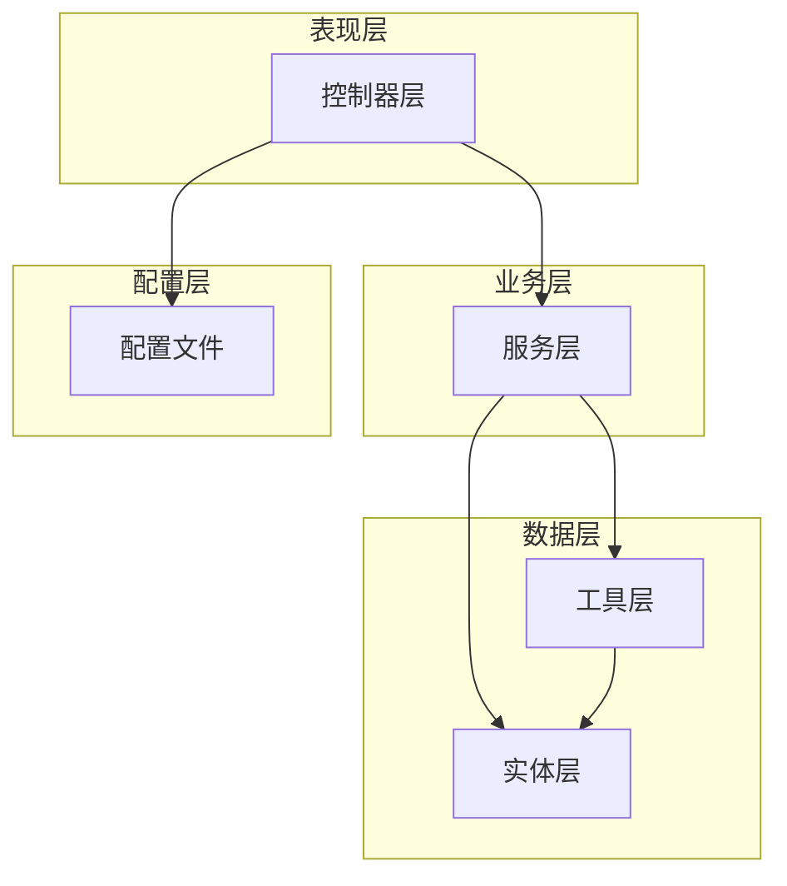
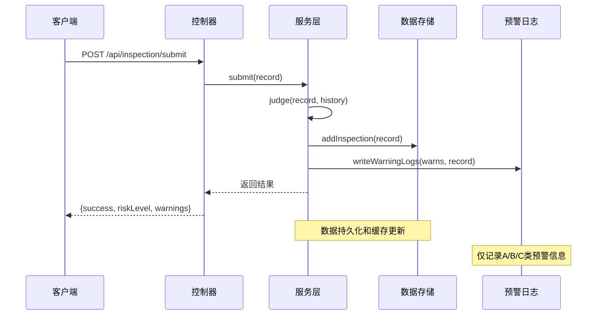
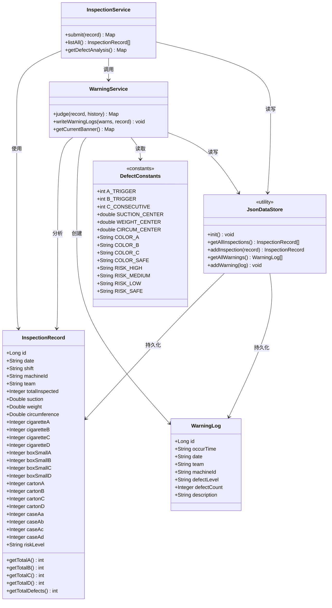
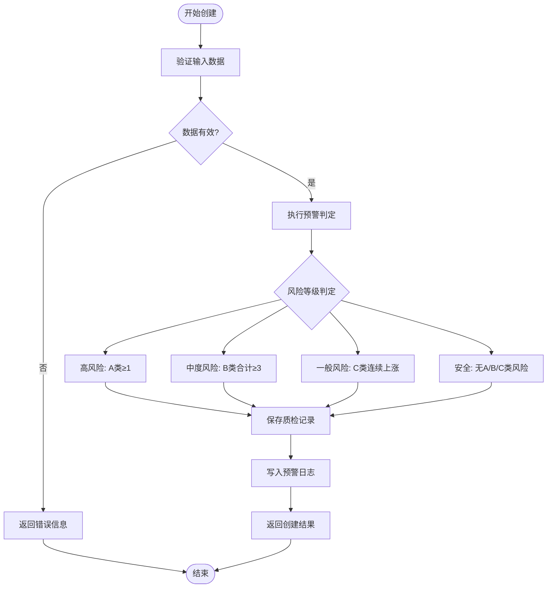
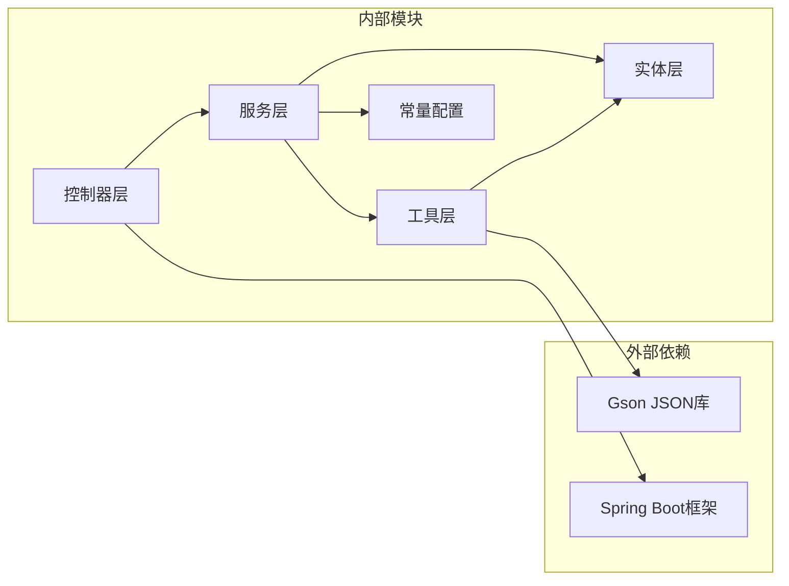

# 数据模型

<cite>
**本文引用的文件**
- [InspectionRecord.java](file://src/main/java/com/zjzy/quality/entity/InspectionRecord.java)
- [WarningLog.java](file://src/main/java/com/zjzy/quality/entity/WarningLog.java)
- [DefectConstants.java](file://src/main/java/com/zjzy/quality/constant/DefectConstants.java)
- [InspectionService.java](file://src/main/java/com/zjzy/quality/service/InspectionService.java)
- [WarningService.java](file://src/main/java/com/zjzy/quality/service/WarningService.java)
- [JsonDataStore.java](file://src/main/java/com/zjzy/quality/util/JsonDataStore.java)
- [InspectionController.java](file://src/main/java/com/zjzy/quality/controller/InspectionController.java)
- [WarningController.java](file://src/main/java/com/zjzy/quality/controller/WarningController.java)
- [application.yml](file://src/main/resources/application.yml)
</cite>

## 目录
1. [简介](#简介)
2. [项目结构](#项目结构)
3. [核心组件](#核心组件)
4. [架构概览](#架构概览)
5. [详细组件分析](#详细组件分析)
6. [依赖分析](#依赖分析)
7. [性能考虑](#性能考虑)
8. [故障排除指南](#故障排除指南)
9. [结论](#结论)
10. [附录](#附录)

## 简介
本文件详细说明了卷烟全维度质检智能预警预判系统中的核心数据模型和常量配置。文档涵盖了质检记录实体、预警日志实体以及缺陷分级阈值常量的完整定义，并解释了实体间的关系映射、数据验证规则、业务规则以及数据模型的生命周期管理。

## 项目结构
系统采用分层架构设计，主要包含以下层次：
- 实体层：定义核心数据模型
- 服务层：实现业务逻辑和数据处理
- 控制器层：提供REST API接口
- 工具层：负责数据持久化和缓存管理
- 配置层：Spring Boot应用配置

**图表来源**
- [InspectionController.java:1-35](file://src/main/java/com/zjzy/quality/controller/InspectionController.java#L1-L35)
- [WarningController.java:1-38](file://src/main/java/com/zjzy/quality/controller/WarningController.java#L1-L38)
- [InspectionService.java:1-102](file://src/main/java/com/zjzy/quality/service/InspectionService.java#L1-L102)
- [WarningService.java:1-140](file://src/main/java/com/zjzy/quality/service/WarningService.java#L1-L140)
- [JsonDataStore.java:1-222](file://src/main/java/com/zjzy/quality/util/JsonDataStore.java#L1-L222)

**章节来源**
- [application.yml:1-24](file://src/main/resources/application.yml#L1-L24)

## 核心组件

### InspectionRecord 质检记录实体
InspectionRecord 是系统的核心数据实体，用于存储完整的质检数据。该实体包含了生产过程中的关键质量指标和缺陷统计信息。

#### 字段定义与业务含义

**基础信息字段**
- `id`: Long - 主键标识符，自增生成
- `date`: String - 质检日期，格式为 yyyy-MM-dd
- `shift`: String - 班次信息，支持早班/中班/晚班
- `machineId`: String - 机台编号，唯一标识生产设备
- `team`: String - 班组名称，标识操作班组
- `totalInspected`: Integer - 总抽检数量，表示该班次抽检的产品总数

**内在物测指标**
- `suction`: Double - 吸阻测量值，单位 Pa，反映产品透气性
- `weight`: Double - 单支重量，单位 g，反映产品重量控制
- `circumference`: Double - 圆周测量值，单位 mm，反映产品尺寸精度

**缺陷分类统计**
系统采用四层级缺陷分类体系，每层包含四个缺陷等级（A、B、C、D）：

**烟支层级缺陷**
- `cigaretteA/B/C/D`: Integer - 烟支外观缺陷数量统计

**小盒层级缺陷**
- `boxSmallA/B/C/D`: Integer - 小盒外观缺陷数量统计

**条盒层级缺陷**
- `cartonA/B/C/D`: Integer - 条盒外观缺陷数量统计

**箱装层级缺陷**
- `caseAa/Ab/Ac/Ad`: Integer - 箱装外观缺陷数量统计（使用caseAa避免Java关键字冲突）

**风险等级**
- `riskLevel`: String - 当日风险等级，支持高风险、中度风险、一般风险、平稳等状态

#### 数据类型与约束条件
- 所有数值型字段支持null值，系统通过安全方法进行空值处理
- 缺陷数量字段默认为0，确保计算准确性
- 风险等级字段遵循预定义枚举值集合
- 日期字段必须符合 yyyy-MM-dd 格式要求

#### 计算方法
实体提供了多个聚合计算方法：
- `getTotalA/B/C/D()`: 计算各层级缺陷总数
- `getTotalDefects()`: 计算总缺陷数（A+B+C+D）
- 内部安全方法 `safe()` 处理null值情况

**章节来源**
- [InspectionRecord.java:1-154](file://src/main/java/com/zjzy/quality/entity/InspectionRecord.java#L1-L154)

### WarningLog 预警日志实体
WarningLog 实体专门用于记录触发A、B、C类预警的质量异常信息，支持直接用于QC和质量追溯报告。

#### 结构设计
- `id`: Long - 预警日志主键，自增生成
- `occurTime`: String - 预警发生时间戳
- `date`: String - 质检日期
- `team`: String - 班组信息
- `machineId`: String - 机台编号
- `defectLevel`: String - 缺陷等级（A/B/C）
- `defectCount`: Integer - 缺陷数量
- `description`: String - 详细的异常描述信息

#### 存储格式
预警日志采用JSON格式存储，便于快速检索和分析。日志文件位于项目根目录下的 `warn_log/` 文件夹中。

**章节来源**
- [WarningLog.java:1-44](file://src/main/java/com/zjzy/quality/entity/WarningLog.java#L1-L44)

### DefectConstants 常量配置类
DefectConstants 类集中定义了所有缺陷分级阈值、物测指标内控标准以及系统使用的各种常量参数。

#### 缺陷分级阈值
- `A_TRIGGER`: 1 - A类缺陷触发阈值，任意层级A类缺陷≥1即触发高风险预警
- `B_TRIGGER`: 3 - B类缺陷触发阈值，所有层级B类缺陷合计≥3触发中度预警
- `C_CONSECUTIVE`: 3 - C类连续班次数，连续3班次C类总数严格递增触发一般预警

#### 物测指标内控标准
系统定义了三个关键物测指标的内控标准：

**吸阻(Pa)**
- `SUCTION_CENTER`: 1100.0 - 中心线
- `SUCTION_UCL`: 1300.0 - 上控制限
- `SUCTION_LCL`: 900.0 - 下控制限

**单支重量(g)**
- `WEIGHT_CENTER`: 0.900 - 中心线
- `WEIGHT_UCL`: 0.980 - 上控制限
- `WEIGHT_LCL`: 0.820 - 下控制限

**圆周(mm)**
- `CIRCUM_CENTER`: 24.50 - 中心线
- `CIRCUM_UCL`: 24.90 - 上控制限
- `CIRCUM_LCL`: 24.10 - 下控制限

#### 预警配色方案
采用Apple风格的配色系统：
- `COLOR_A`: #FF3B30 - A类严重缺陷（苹果红）
- `COLOR_B`: #FF9500 - B类较重缺陷（苹果橙）
- `COLOR_C`: #FFCC00 - C类一般缺陷（苹果黄）
- `COLOR_D`: #C7C7CC - D类轻微缺陷（苹果灰）
- `COLOR_SAFE`: #34C759 - 无风险安全（苹果绿）

#### 风险等级文本
- `RISK_HIGH`: "高风险"
- `RISK_MEDIUM`: "中度风险"
- `RISK_LOW`: "一般风险"
- `RISK_SAFE`: "平稳"

#### 模块名称定义
- `MODULE_NAMES`: {"cigarette", "boxSmall", "carton", "caseA"}
- `MODULE_LABELS`: {"烟支", "小盒", "条盒", "箱装"}
- `LEVEL_SUFFIX`: {"A", "B", "C", "D"}

**章节来源**
- [DefectConstants.java:1-76](file://src/main/java/com/zjzy/quality/constant/DefectConstants.java#L1-L76)

## 架构概览

系统采用经典的MVC架构模式，结合RESTful API设计，实现了从数据采集到预警分析的完整流程。

**图表来源**
- [InspectionController.java:21-24](file://src/main/java/com/zjzy/quality/controller/InspectionController.java#L21-L24)
- [InspectionService.java:20-44](file://src/main/java/com/zjzy/quality/service/InspectionService.java#L20-L44)
- [WarningService.java:105-121](file://src/main/java/com/zjzy/quality/service/WarningService.java#L105-L121)

**章节来源**
- [InspectionController.java:1-35](file://src/main/java/com/zjzy/quality/controller/InspectionController.java#L1-L35)
- [WarningController.java:1-38](file://src/main/java/com/zjzy/quality/controller/WarningController.java#L1-L38)

## 详细组件分析

### 数据模型关系映射

**图表来源**
- [InspectionRecord.java:7-154](file://src/main/java/com/zjzy/quality/entity/InspectionRecord.java#L7-L154)
- [WarningLog.java:7-44](file://src/main/java/com/zjzy/quality/entity/WarningLog.java#L7-L44)
- [DefectConstants.java:7-76](file://src/main/java/com/zjzy/quality/constant/DefectConstants.java#L7-L76)
- [JsonDataStore.java:20-222](file://src/main/java/com/zjzy/quality/util/JsonDataStore.java#L20-L222)
- [InspectionService.java:12-102](file://src/main/java/com/zjzy/quality/service/InspectionService.java#L12-L102)
- [WarningService.java:15-140](file://src/main/java/com/zjzy/quality/service/WarningService.java#L15-L140)

### 数据验证规则

系统实现了多层次的数据验证机制：

#### 输入验证
- 所有数值字段支持null值处理
- 日期字段必须符合 yyyy-MM-dd 格式
- 缺陷数量字段自动转换为整数类型
- 风险等级字段进行枚举值校验

#### 业务规则验证
- A类缺陷触发：任意层级A类缺陷≥1
- B类缺陷触发：所有层级B类缺陷合计≥3
- C类缺陷触发：连续3班次C类总数严格递增
- D类缺陷仅统计不触发预警

#### 数据完整性验证
- 自增ID生成器确保唯一性
- 内存缓存与文件存储双写保证数据一致性
- Mock数据生成确保系统初始可用性

**章节来源**
- [WarningService.java:23-99](file://src/main/java/com/zjzy/quality/service/WarningService.java#L23-L99)
- [InspectionRecord.java:150-152](file://src/main/java/com/zjzy/quality/entity/InspectionRecord.java#L150-L152)

### 数据生命周期管理

#### 创建流程

**图表来源**
- [InspectionService.java:20-44](file://src/main/java/com/zjzy/quality/service/InspectionService.java#L20-L44)
- [WarningService.java:23-99](file://src/main/java/com/zjzy/quality/service/WarningService.java#L23-L99)

#### 更新流程
系统采用不可变数据设计，更新操作通过以下方式实现：
- 新增记录时自动生成新的ID
- 历史数据通过时间序列维护
- 预警日志独立存储，便于追溯分析

#### 删除流程
系统未提供显式的删除功能，但支持以下清理方式：
- 清空数据文件重新初始化
- 手动编辑JSON文件进行数据清理
- 系统重启后重新加载Mock数据

**章节来源**
- [JsonDataStore.java:70-92](file://src/main/java/com/zjzy/quality/util/JsonDataStore.java#L70-L92)

## 依赖分析

系统采用松耦合的设计原则，各组件间的依赖关系清晰明确：

**图表来源**
- [JsonDataStore.java:3-7](file://src/main/java/com/zjzy/quality/util/JsonDataStore.java#L3-L7)
- [InspectionController.java:3-5](file://src/main/java/com/zjzy/quality/controller/InspectionController.java#L3-L5)
- [WarningController.java:3-6](file://src/main/java/com/zjzy/quality/controller/WarningController.java#L3-L6)

### 组件耦合度分析
- **低耦合**: 实体类之间无直接依赖关系
- **中等耦合**: 服务层依赖实体和工具类
- **高内聚**: 工具类职责单一，功能明确
- **松散耦合**: 控制器层与业务逻辑分离

**章节来源**
- [DefectConstants.java:1-76](file://src/main/java/com/zjzy/quality/constant/DefectConstants.java#L1-L76)
- [JsonDataStore.java:1-222](file://src/main/java/com/zjzy/quality/util/JsonDataStore.java#L1-L222)

## 性能考虑

### 内存管理
- 使用ArrayList作为内存缓存，支持动态扩容
- 采用synchronized关键字确保线程安全
- 原子长整型ID生成器避免并发冲突

### I/O优化
- JSON文件格式便于快速序列化和反序列化
- 批量读写操作减少磁盘I/O次数
- 文件路径统一管理，避免硬编码

### 缓存策略
- 内存缓存与文件存储双重备份
- 初始化时一次性加载所有历史数据
- 支持增量更新，避免全量重载

## 故障排除指南

### 常见问题及解决方案

#### 数据持久化失败
**症状**: 系统启动时报错，无法读取历史数据
**原因**: data/目录权限不足或文件损坏
**解决**: 
1. 检查data/目录是否存在且可读写
2. 确认inspection_data.json和warning_log.json文件格式正确
3. 重启应用以重新生成Mock数据

#### 预警判定异常
**症状**: 预警结果不符合预期
**原因**: 缺陷阈值配置错误或数据格式不正确
**解决**:
1. 检查DefectConstants中的阈值设置
2. 验证输入数据的格式和范围
3. 查看WarningService的判定逻辑

#### API调用失败
**症状**: REST接口返回错误
**原因**: 请求参数格式不正确或服务未启动
**解决**:
1. 确认POST请求体包含完整的InspectionRecord对象
2. 检查服务器端口8080是否被占用
3. 验证application.yml配置文件

**章节来源**
- [JsonDataStore.java:96-149](file://src/main/java/com/zjzy/quality/util/JsonDataStore.java#L96-L149)
- [WarningService.java:105-121](file://src/main/java/com/zjzy/quality/service/WarningService.java#L105-L121)

## 结论
本数据模型文档详细阐述了卷烟质量检测系统的数据结构设计、业务规则实现和系统集成方案。通过合理的实体设计、严格的验证机制和清晰的生命周期管理，系统能够有效地支持质量监控和预警分析需求。常量配置的集中管理使得系统具有良好的可维护性和可扩展性。

## 附录

### 示例数据

#### 质检记录示例
以下是一个完整的质检记录示例，展示了各个字段的取值范围和业务含义：

| 字段名 | 示例值 | 说明 |
|--------|--------|------|
| id | 1 | 主键标识符 |
| date | "2026-06-11" | 质检日期 |
| shift | "早班" | 班次信息 |
| machineId | "1#" | 机台编号 |
| team | "甲班" | 操作班组 |
| totalInspected | 120 | 抽检数量 |
| suction | 1085.0 | 吸阻(Pa) |
| weight | 0.895 | 单支重量(g) |
| circumference | 24.45 | 圆周(mm) |
| cigaretteA | 0 | 烟支A类缺陷 |
| cigaretteB | 1 | 烟支B类缺陷 |
| cigaretteC | 2 | 烟支C类缺陷 |
| cigaretteD | 3 | 烟支D类缺陷 |
| boxSmallA | 0 | 小盒A类缺陷 |
| boxSmallB | 0 | 小盒B类缺陷 |
| boxSmallC | 1 | 小盒C类缺陷 |
| boxSmallD | 2 | 小盒D类缺陷 |
| cartonA | 0 | 条盒A类缺陷 |
| cartonB | 0 | 条盒B类缺陷 |
| cartonC | 1 | 条盒C类缺陷 |
| cartonD | 1 | 条盒D类缺陷 |
| caseAa | 0 | 箱装A类缺陷 |
| caseAb | 0 | 箱装B类缺陷 |
| caseAc | 0 | 箱装C类缺陷 |
| caseAd | 1 | 箱装D类缺陷 |
| riskLevel | "平稳" | 风险等级 |

#### 预警日志示例
以下是一个预警日志记录的示例：

| 字段名 | 示例值 | 说明 |
|--------|--------|------|
| id | 1 | 预警日志ID |
| occurTime | "2026-06-16 14:30:25" | 预警发生时间 |
| date | "2026-06-16" | 质检日期 |
| team | "丙班" | 操作班组 |
| machineId | "3#" | 机台编号 |
| defectLevel | "A" | 缺陷等级 |
| defectCount | 1 | 缺陷数量 |
| description | "检出A类严重缺陷1个，高风险，立即复核" | 预警描述 |

### 数据字典

#### 实体字段定义表

**InspectionRecord 实体字段**
| 字段名 | 数据类型 | 必填 | 默认值 | 说明 |
|--------|----------|------|--------|------|
| id | Long | 否 | null | 主键标识符 |
| date | String | 是 | - | 质检日期 |
| shift | String | 是 | - | 班次信息 |
| machineId | String | 是 | - | 机台编号 |
| team | String | 是 | - | 操作班组 |
| totalInspected | Integer | 是 | - | 抽检数量 |
| suction | Double | 否 | null | 吸阻(Pa) |
| weight | Double | 否 | null | 单支重量(g) |
| circumference | Double | 否 | null | 圆周(mm) |
| cigaretteA | Integer | 否 | 0 | 烟支A类缺陷 |
| cigaretteB | Integer | 否 | 0 | 烟支B类缺陷 |
| cigaretteC | Integer | 否 | 0 | 烟支C类缺陷 |
| cigaretteD | Integer | 否 | 0 | 烟支D类缺陷 |
| boxSmallA | Integer | 否 | 0 | 小盒A类缺陷 |
| boxSmallB | Integer | 否 | 0 | 小盒B类缺陷 |
| boxSmallC | Integer | 否 | 0 | 小盒C类缺陷 |
| boxSmallD | Integer | 否 | 0 | 小盒D类缺陷 |
| cartonA | Integer | 否 | 0 | 条盒A类缺陷 |
| cartonB | Integer | 否 | 0 | 条盒B类缺陷 |
| cartonC | Integer | 否 | 0 | 条盒C类缺陷 |
| cartonD | Integer | 否 | 0 | 条盒D类缺陷 |
| caseAa | Integer | 否 | 0 | 箱装A类缺陷 |
| caseAb | Integer | 否 | 0 | 箱装B类缺陷 |
| caseAc | Integer | 否 | 0 | 箱装C类缺陷 |
| caseAd | Integer | 否 | 0 | 箱装D类缺陷 |
| riskLevel | String | 否 | "平稳" | 风险等级 |

**WarningLog 实体字段**
| 字段名 | 数据类型 | 必填 | 默认值 | 说明 |
|--------|----------|------|--------|------|
| id | Long | 否 | null | 预警日志ID |
| occurTime | String | 是 | - | 预警发生时间 |
| date | String | 是 | - | 质检日期 |
| team | String | 是 | - | 操作班组 |
| machineId | String | 是 | - | 机台编号 |
| defectLevel | String | 是 | - | 缺陷等级(A/B/C) |
| defectCount | Integer | 是 | - | 缺陷数量 |
| description | String | 是 | - | 预警描述信息 |

#### API 接口定义

**质检数据接口**
- POST `/api/inspection/submit` - 提交质检数据
- GET `/api/inspection/list` - 查询历史数据

**预警日志接口**
- GET `/api/warning/banner` - 获取当前风险横幅状态
- GET `/api/warning/logs` - 查询全部预警日志

**章节来源**
- [InspectionController.java:21-33](file://src/main/java/com/zjzy/quality/controller/InspectionController.java#L21-L33)
- [WarningController.java:24-36](file://src/main/java/com/zjzy/quality/controller/WarningController.java#L24-L36)