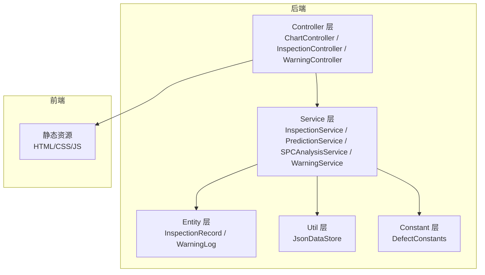
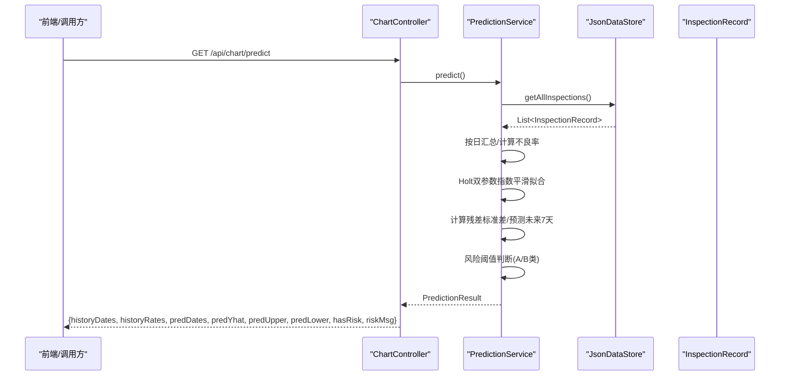
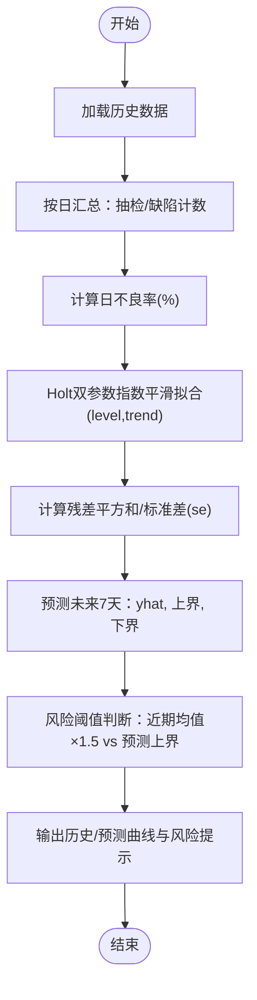
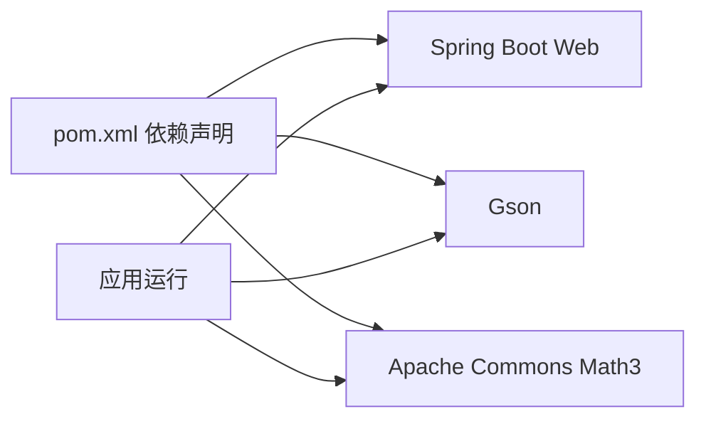

# AI预测分析

<cite>
**本文引用的文件**
- [PredictionService.java](file://src/main/java/com/zjzy/quality/service/PredictionService.java)
- [InspectionService.java](file://src/main/java/com/zjzy/quality/service/InspectionService.java)
- [InspectionRecord.java](file://src/main/java/com/zjzy/quality/entity/InspectionRecord.java)
- [ChartController.java](file://src/main/java/com/zjzy/quality/controller/ChartController.java)
- [JsonDataStore.java](file://src/main/java/com/zjzy/quality/util/JsonDataStore.java)
- [WarningService.java](file://src/main/java/com/zjzy/quality/service/WarningService.java)
- [SPCAnalysisService.java](file://src/main/java/com/zjzy/quality/service/SPCAnalysisService.java)
- [DefectConstants.java](file://src/main/java/com/zjzy/quality/constant/DefectConstants.java)
- [WarningLog.java](file://src/main/java/com/zjzy/quality/entity/WarningLog.java)
- [application.yml](file://src/main/resources/application.yml)
- [pom.xml](file://pom.xml)
</cite>

## 目录
1. [简介](#简介)
2. [项目结构](#项目结构)
3. [核心组件](#核心组件)
4. [架构总览](#架构总览)
5. [详细组件分析](#详细组件分析)
6. [依赖分析](#依赖分析)
7. [性能考虑](#性能考虑)
8. [故障排除指南](#故障排除指南)
9. [结论](#结论)
10. [附录](#附录)

## 简介
本技术文档围绕“AI预测分析模块”展开，重点介绍Holt双参数指数平滑算法在质量检测场景中的实现与应用。内容涵盖：
- 数学原理与参数选择
- 模型训练流程与数据预处理
- 预测实现细节（时间序列聚合、平滑参数优化、未来趋势预测、置信区间）
- 风险预警与异常检测策略
- 预测精度评估与性能监控建议
- 生产计划优化与质量管理决策实践
- 适用场景、局限性与改进方向

## 项目结构
系统采用Spring Boot后端 + 前端静态资源的架构，核心业务位于service层，数据持久化通过JSON文件实现，控制器负责对外提供REST接口。

**图表来源**
- [ChartController.java:17-105](file://src/main/java/com/zjzy/quality/controller/ChartController.java#L17-L105)
- [InspectionController.java:13-34](file://src/main/java/com/zjzy/quality/controller/InspectionController.java#L13-L34)
- [WarningController.java:16-37](file://src/main/java/com/zjzy/quality/controller/WarningController.java#L16-L37)
- [InspectionService.java:12-101](file://src/main/java/com/zjzy/quality/service/InspectionService.java#L12-L101)
- [PredictionService.java:14-168](file://src/main/java/com/zjzy/quality/service/PredictionService.java#L14-L168)
- [SPCAnalysisService.java:14-240](file://src/main/java/com/zjzy/quality/service/SPCAnalysisService.java#L14-L240)
- [WarningService.java:15-139](file://src/main/java/com/zjzy/quality/service/WarningService.java#L15-L139)
- [JsonDataStore.java:20-221](file://src/main/java/com/zjzy/quality/util/JsonDataStore.java#L20-L221)
- [DefectConstants.java:7-75](file://src/main/java/com/zjzy/quality/constant/DefectConstants.java#L7-L75)

**章节来源**
- [application.yml:4-23](file://src/main/resources/application.yml#L4-L23)
- [pom.xml:30-64](file://pom.xml#L30-L64)

## 核心组件
- PredictionService：实现Holt双参数指数平滑预测，输出历史与预测曲线、置信区间及风险提示。
- InspectionService：提交质检数据、执行预警判定、写入预警日志、返回分析结果。
- SPCAnalysisService：基于Nelson八条规则的SPC分析，识别异常趋势。
- WarningService：A/B/C/D四级预警判定与日志写入。
- JsonDataStore：JSON文件持久化与Mock数据生成。
- DefectConstants：缺陷分级阈值、物测指标内控限与配色常量。
- 实体类：InspectionRecord、WarningLog。

**章节来源**
- [PredictionService.java:14-168](file://src/main/java/com/zjzy/quality/service/PredictionService.java#L14-L168)
- [InspectionService.java:12-101](file://src/main/java/com/zjzy/quality/service/InspectionService.java#L12-L101)
- [SPCAnalysisService.java:14-240](file://src/main/java/com/zjzy/quality/service/SPCAnalysisService.java#L14-L240)
- [WarningService.java:15-139](file://src/main/java/com/zjzy/quality/service/WarningService.java#L15-L139)
- [JsonDataStore.java:20-221](file://src/main/java/com/zjzy/quality/util/JsonDataStore.java#L20-L221)
- [DefectConstants.java:7-75](file://src/main/java/com/zjzy/quality/constant/DefectConstants.java#L7-L75)
- [InspectionRecord.java:7-153](file://src/main/java/com/zjzy/quality/entity/InspectionRecord.java#L7-L153)
- [WarningLog.java:7-43](file://src/main/java/com/zjzy/quality/entity/WarningLog.java#L7-L43)

## 架构总览
AI预测分析模块通过控制器暴露REST接口，服务层完成数据聚合、平滑拟合与预测，最终以统一数据结构返回给前端绘图组件。

**图表来源**
- [ChartController.java:86-104](file://src/main/java/com/zjzy/quality/controller/ChartController.java#L86-L104)
- [PredictionService.java:50-158](file://src/main/java/com/zjzy/quality/service/PredictionService.java#L50-L158)
- [JsonDataStore.java:66-75](file://src/main/java/com/zjzy/quality/util/JsonDataStore.java#L66-L75)

## 详细组件分析

### Holt双参数指数平滑算法与预测实现
- 数学原理
  - 水平项(level)与趋势项(trend)分别对序列的均值与线性变化进行建模。
  - 通过两个平滑参数α与β分别控制观测值与水平项的变化权重。
- 参数选择
  - α（alpha）：0.3；β（beta）：0.1。该组合偏向平滑，适合波动较小的历史序列。
  - 可根据实际数据波动性调整，如更敏感场景可提高α/β，但需结合残差检验。
- 模型训练与预测流程
  - 数据预处理：按日汇总抽检数量、缺陷总数与A/B类缺陷，计算日不良率百分比。
  - 拟合：从第1天开始，逐点更新level与trend，得到拟合序列fitted。
  - 残差标准差：基于拟合残差计算标准误差se，作为预测不确定性度量。
  - 预测：未来7天，yhat = level + trend * i，置信区间为yhat ± 1.96 * se。
  - 风险预警：比较近期平均不良率与预测上界，若预测上界超过近期平均的1.5倍且A/B类占比非零，则判定存在批量质量风险。

**图表来源**
- [PredictionService.java:50-158](file://src/main/java/com/zjzy/quality/service/PredictionService.java#L50-L158)

**章节来源**
- [PredictionService.java:16-20](file://src/main/java/com/zjzy/quality/service/PredictionService.java#L16-L20)
- [PredictionService.java:50-158](file://src/main/java/com/zjzy/quality/service/PredictionService.java#L50-L158)

### 时间序列数据预处理
- 日汇总策略：按日期聚合当日抽检总数、缺陷总数与A/B类缺陷数，避免班次/机台粒度过细导致噪声。
- 不良率计算：当当日抽检为0时，不良率为0，避免除零与异常放大。
- 输入稳定性：确保输入序列单调递增的时间索引，便于趋势估计。

**章节来源**
- [PredictionService.java:56-87](file://src/main/java/com/zjzy/quality/service/PredictionService.java#L56-L87)

### 平滑参数优化
- 当前固定参数：α=0.3，β=0.1。
- 优化建议：
  - 交叉验证：划分训练/验证集，最小化验证集MSE或MAE。
  - 网格搜索：遍历α、β候选集合，选择最优组合。
  - 在线学习：随新数据到达动态调整参数，提升适应性。
- 注意：参数过大易过拟合，过小则响应迟缓。

**章节来源**
- [PredictionService.java:16-20](file://src/main/java/com/zjzy/quality/service/PredictionService.java#L16-L20)

### 未来趋势预测与置信区间
- 趋势外推：假设未来若干天的趋势保持不变，yhat = level + trend * i。
- 置信区间：使用残差标准差se构造正态近似区间，置信水平约95%。
- 边界约束：下界至少为0，避免负值。

**章节来源**
- [PredictionService.java:114-132](file://src/main/java/com/zjzy/quality/service/PredictionService.java#L114-L132)

### 风险预警与异常检测
- 预测风险：若预测上界超过近期平均的1.5倍且A/B类占比非零，则标记存在批量质量风险。
- 与SPC联动：SPC分析识别异常趋势，预测模块提供未来窗口的风险预警，形成闭环。
- 与预警服务协同：InspectionService在提交数据时即时判定风险等级并写入日志。

**章节来源**
- [PredictionService.java:134-156](file://src/main/java/com/zjzy/quality/service/PredictionService.java#L134-L156)
- [SPCAnalysisService.java:79-239](file://src/main/java/com/zjzy/quality/service/SPCAnalysisService.java#L79-L239)
- [WarningService.java:23-99](file://src/main/java/com/zjzy/quality/service/WarningService.java#L23-L99)

### 预测精度评估与性能监控
- 评估指标（建议）
  - MAE/MSE/MAPE：衡量预测误差。
  - 覆盖率：预测区间包含真实值的比例。
  - 动态阈值：对比预测上界与实际波动，评估预警及时性。
- 性能监控
  - 定期检查残差分布是否接近正态，异常时调整参数或引入季节性/外生变量。
  - 监控预测上界与实际的偏离频率，持续优化阈值与置信水平。

**章节来源**
- [PredictionService.java:106-112](file://src/main/java/com/zjzy/quality/service/PredictionService.java#L106-L112)

### 预测结果解释与可视化
- 历史曲线：反映过去一段时间的质量趋势。
- 预测区间：指示未来7天的可能范围，帮助制定缓冲库存与人员安排。
- 风险提示：当预测上界显著升高时，提醒管理者提前干预。

**章节来源**
- [ChartController.java:86-104](file://src/main/java/com/zjzy/quality/controller/ChartController.java#L86-L104)
- [PredictionService.java:25-45](file://src/main/java/com/zjzy/quality/service/PredictionService.java#L25-L45)

### 具体预测案例
- 未来7天趋势预测：调用GET /api/chart/predict，后端返回历史与预测数据，前端绘制曲线与置信带。
- 异常检测预警：结合SPC分析与预测上界，若出现持续上升或越界，触发风险提示。
- 生产计划优化：基于预测上界与置信区间，合理设置生产节拍、巡检频次与备料量，降低质量成本。

**章节来源**
- [ChartController.java:86-104](file://src/main/java/com/zjzy/quality/controller/ChartController.java#L86-L104)
- [SPCAnalysisService.java:45-74](file://src/main/java/com/zjzy/quality/service/SPCAnalysisService.java#L45-L74)

### 适用场景、局限性与改进方向
- 适用场景
  - 质量趋势稳定或缓慢变化的场景；需要短期（几天到一周）趋势预测。
- 局限性
  - 对突发异常不敏感；对非线性/周期性变化拟合能力有限；参数固定可能不适应快速变化。
- 改进方向
  - 引入自适应参数或在线学习机制。
  - 结合季节性分解（如STL）或外生变量（设备状态、环境因素）。
  - 多模型融合（指数平滑+机器学习），提升鲁棒性。

## 依赖分析
- Spring Boot Web：提供REST接口与静态资源服务。
- Gson：JSON序列化/反序列化，支撑数据持久化。
- Apache Commons Math3：数学统计与预测算法基础（当前未在预测模块直接使用，保留以备扩展）。

**图表来源**
- [pom.xml:30-64](file://pom.xml#L30-L64)

**章节来源**
- [pom.xml:30-64](file://pom.xml#L30-L64)

## 性能考虑
- 数据规模：当前使用JSON文件存储，建议在数据量增大时迁移到数据库并增加索引。
- 计算复杂度：Holt平滑为O(n)，预测7天为O(1)，整体线性。
- I/O优化：初始化阶段一次性加载数据，后续读写通过缓存与增量更新减少磁盘访问。
- 前端渲染：Plotly.js按需渲染，建议分页或采样显示历史数据以提升交互性能。

## 故障排除指南
- 接口无法访问
  - 检查端口与上下文路径配置，确认服务已启动。
- 预测结果为空
  - 确认历史数据至少包含2天以上，且抽检数量非空。
- 预测上界异常
  - 检查平滑参数是否过高；必要时降低α/β或引入残差校正。
- 预警日志缺失
  - 确认WarningService.writeWarningLogs被调用，且仅记录A/B/C类预警。

**章节来源**
- [application.yml:4-23](file://src/main/resources/application.yml#L4-L23)
- [PredictionService.java:52-53](file://src/main/java/com/zjzy/quality/service/PredictionService.java#L52-L53)
- [WarningService.java:105-121](file://src/main/java/com/zjzy/quality/service/WarningService.java#L105-L121)

## 结论
本模块以Holt双参数指数平滑为核心，实现了对质量趋势的短期预测与风险预警，具备参数简单、易于解释的优势。结合SPC分析与预警服务，形成从异常识别到风险预判的闭环。建议在实际应用中逐步引入参数自适应与多模型融合，以提升对复杂场景的适应能力。

## 附录

### 接口定义与数据结构
- GET /api/chart/predict
  - 返回字段：historyDates、historyRates、predDates、predYhat、predUpper、predLower、hasRisk、riskMsg、colorA
- GET /api/chart/spc
  - 返回字段：suction/weight/circumference的values、center、ucl、lcl、severe、mild及其描述
- GET /api/chart/defect
  - 返回字段：pie（A/B/C/D总量）、line（近10班次各层级缺陷折线）、colorA/B/C/D
- POST /api/inspection/submit
  - 请求体：InspectionRecord
  - 返回字段：success、riskLevel、bannerText、bannerColor、warnings、message
- GET /api/inspection/list
  - 返回：全量历史数据
- GET /api/warning/banner
  - 返回：当前风险横幅状态
- GET /api/warning/logs
  - 返回：全部预警日志（仅A/B/C类）

**章节来源**
- [ChartController.java:25-104](file://src/main/java/com/zjzy/quality/controller/ChartController.java#L25-L104)
- [InspectionController.java:21-33](file://src/main/java/com/zjzy/quality/controller/InspectionController.java#L21-L33)
- [WarningController.java:24-36](file://src/main/java/com/zjzy/quality/controller/WarningController.java#L24-L36)

### 关键常量与阈值
- 缺陷分级阈值：A类≥1、B类合计≥3、C类连续N班次严格递增（N=3）
- 物测指标内控限：吸阻、单支重量、圆周的中心线与UCL/LCL
- 颜色与风险等级：Apple风格配色与风险等级文本

**章节来源**
- [DefectConstants.java:11-66](file://src/main/java/com/zjzy/quality/constant/DefectConstants.java#L11-L66)