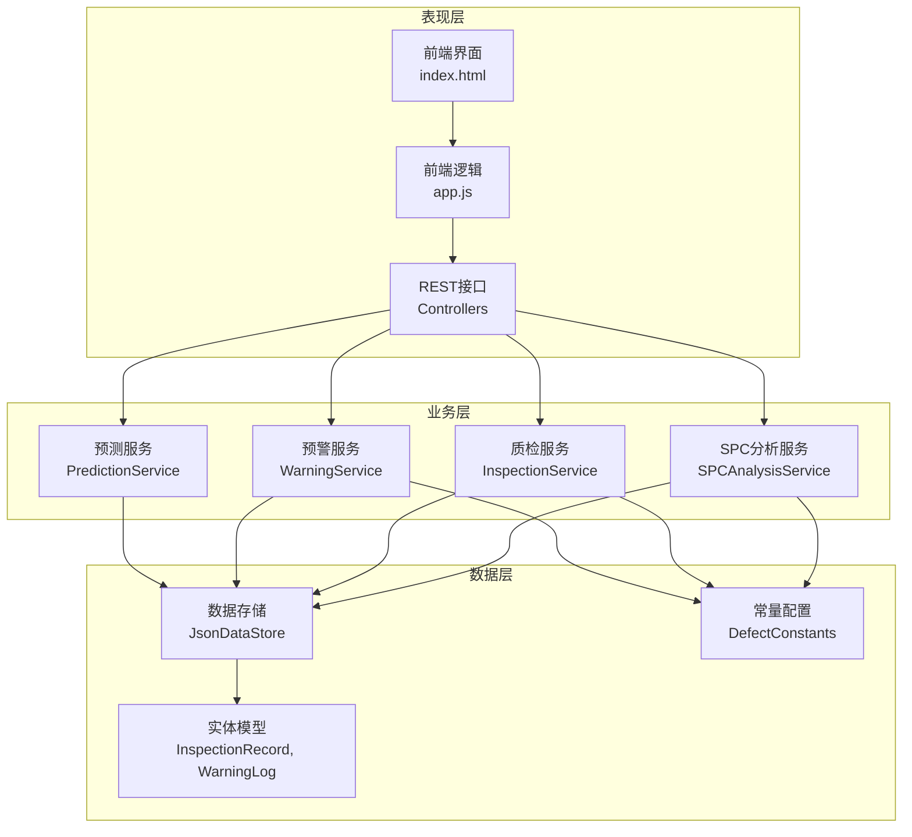
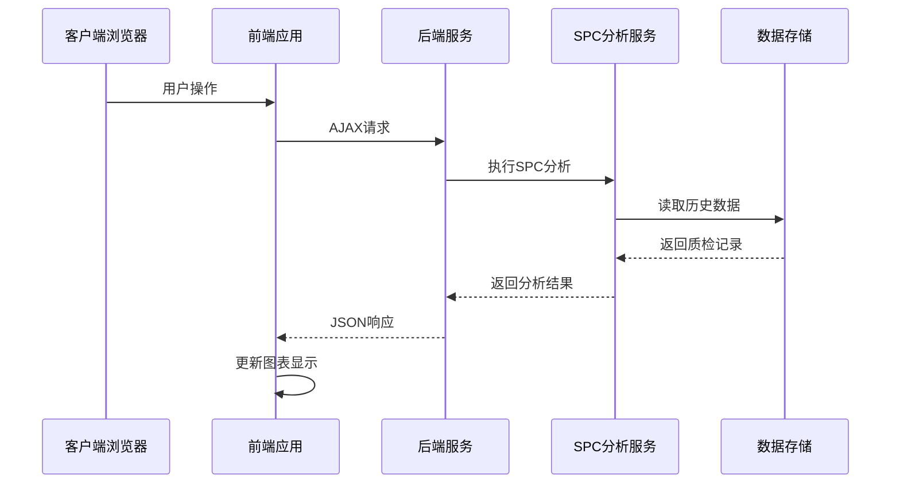
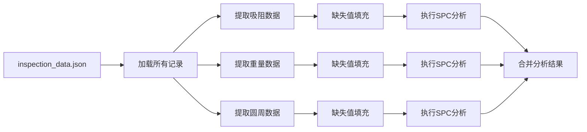
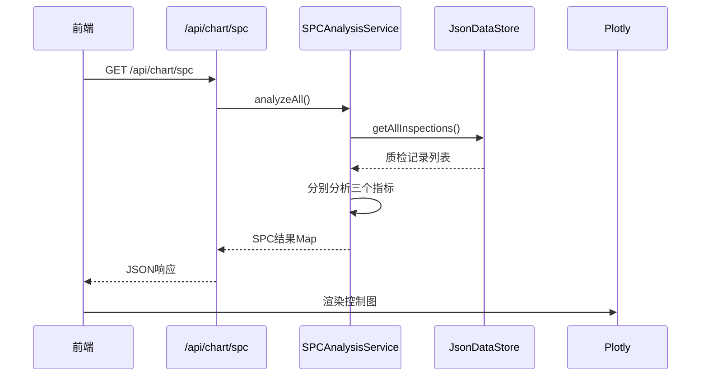
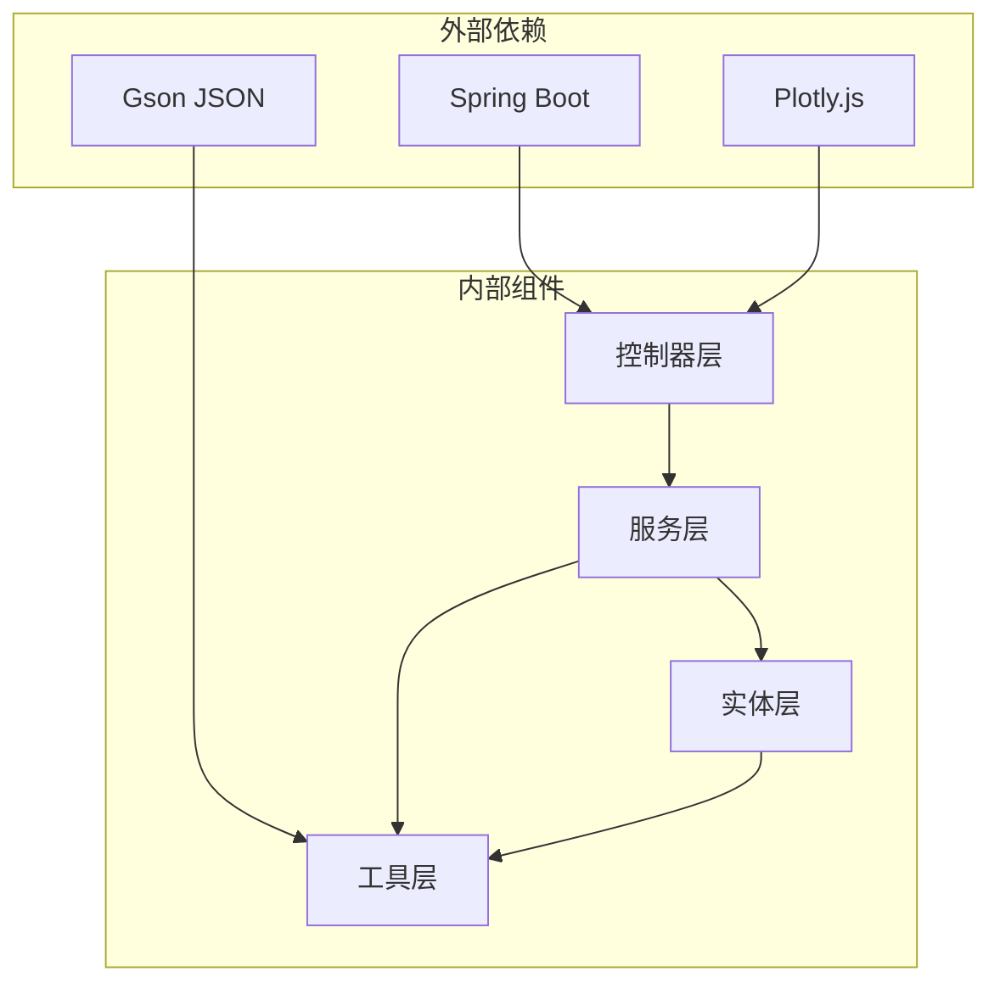

# SPC统计过程控制

<cite>
**本文引用的文件**
- [SPCAnalysisService.java](file://src/main/java/com/zjzy/quality/service/SPCAnalysisService.java)
- [ChartController.java](file://src/main/java/com/zjzy/quality/controller/ChartController.java)
- [DefectConstants.java](file://src/main/java/com/zjzy/quality/constant/DefectConstants.java)
- [InspectionRecord.java](file://src/main/java/com/zjzy/quality/entity/InspectionRecord.java)
- [JsonDataStore.java](file://src/main/java/com/zjzy/quality/util/JsonDataStore.java)
- [InspectionService.java](file://src/main/java/com/zjzy/quality/service/InspectionService.java)
- [WarningService.java](file://src/main/java/com/zjzy/quality/service/WarningService.java)
- [PredictionService.java](file://src/main/java/com/zjzy/quality/service/PredictionService.java)
- [WarningLog.java](file://src/main/java/com/zjzy/quality/entity/WarningLog.java)
- [InspectionController.java](file://src/main/java/com/zjzy/quality/controller/InspectionController.java)
- [WarningController.java](file://src/main/java/com/zjzy/quality/controller/WarningController.java)
- [application.yml](file://src/main/resources/application.yml)
- [app.js](file://src/main/resources/static/js/app.js)
- [index.html](file://src/main/resources/static/index.html)
</cite>

## 目录
1. [简介](#简介)
2. [项目结构](#项目结构)
3. [核心组件](#核心组件)
4. [架构概览](#架构概览)
5. [详细组件分析](#详细组件分析)
6. [依赖分析](#依赖分析)
7. [性能考虑](#性能考虑)
8. [故障排除指南](#故障排除指南)
9. [结论](#结论)
10. [附录](#附录)

## 简介
本项目是一个基于Java的SPC（统计过程控制）质量管理系统，实现了Nelson八大判异规则，用于监控卷烟生产过程中的关键质量指标。系统通过吸阻、单支重量、圆周三个物测指标的实时监控，结合缺陷分级预警机制，为企业提供全面的质量控制解决方案。

## 项目结构
项目采用Spring Boot框架，采用经典的三层架构设计：



**图表来源**
- [SPCAnalysisService.java:1-241](file://src/main/java/com/zjzy/quality/service/SPCAnalysisService.java#L1-L241)
- [ChartController.java:1-106](file://src/main/java/com/zjzy/quality/controller/ChartController.java#L1-L106)
- [JsonDataStore.java:1-222](file://src/main/java/com/zjzy/quality/util/JsonDataStore.java#L1-L222)

**章节来源**
- [application.yml:1-24](file://src/main/resources/application.yml#L1-L24)
- [index.html:1-179](file://src/main/resources/static/index.html#L1-L179)

## 核心组件
系统的核心由以下关键组件构成：

### SPC分析服务
SPCAnalysisService是整个系统的核心，实现了完整的SPC统计分析功能，包括：
- Nelson八大判异规则的完整实现
- 三类物测指标的统一分析接口
- 控制图绘制所需的完整数据结构

### 数据存储层
JsonDataStore提供了基于JSON文件的轻量级数据持久化方案，支持：
- 质检记录的增删改查
- 预警日志的管理
- Mock数据自动生成
- 线程安全的数据访问

### 前端可视化
前端采用jQuery + Plotly.js的组合，提供：
- 实时的SPC控制图展示
- 多维度的质量分析图表
- 交互式的数据可视化界面

**章节来源**
- [SPCAnalysisService.java:14-74](file://src/main/java/com/zjzy/quality/service/SPCAnalysisService.java#L14-L74)
- [JsonDataStore.java:20-62](file://src/main/java/com/zjzy/quality/util/JsonDataStore.java#L20-L62)
- [app.js:1-420](file://src/main/resources/static/js/app.js#L1-L420)

## 架构概览
系统采用前后端分离的架构设计，后端提供RESTful API，前端负责数据展示和用户交互：



**图表来源**
- [ChartController.java:25-70](file://src/main/java/com/zjzy/quality/controller/ChartController.java#L25-L70)
- [SPCAnalysisService.java:45-74](file://src/main/java/com/zjzy/quality/service/SPCAnalysisService.java#L45-L74)
- [JsonDataStore.java:66-68](file://src/main/java/com/zjzy/quality/util/JsonDataStore.java#L66-L68)

## 详细组件分析

### SPC分析服务详解

#### Nelson八大判异规则实现
系统完整实现了Nelson八条判异规则，每条规则都有明确的数学定义和应用场景：

```mermaid
flowchart TD
Start([开始SPC分析]) --> LoadData[加载历史数据]
LoadData --> CalcSigma[计算σ值<br/>σ = (UCL-LCL)/6]
CalcSigma --> CheckSigma{σ > 0?}
CheckSigma --> |否| ReturnEmpty[返回空结果]
CheckSigma --> |是| DefineZones[定义±1σ, ±2σ区域]
DefineZones --> Rule1[规则1: 单点超出3σ控制限]
Rule1 --> Rule2[规则2: 连续9点在中心线同侧]
Rule2 --> Rule3[规则3: 连续6点递增或递减]
Rule3 --> Rule4[规则4: 连续14点交替升降]
Rule4 --> Rule5[规则5: 连续3点中2点超出2σ]
Rule5 --> Rule6[规则6: 连续5点中4点超出1σ]
Rule6 --> Rule7[规则7: 连续15点在1σ内]
Rule7 --> Rule8[规则8: 连续8点在1σ外两侧]
Rule8 --> Classify[分类严重异常和轻微偏离]
Classify --> ReturnResult[返回分析结果]
ReturnEmpty --> End([结束])
ReturnResult --> End
```

**图表来源**
- [SPCAnalysisService.java:79-239](file://src/main/java/com/zjzy/quality/service/SPCAnalysisService.java#L79-L239)

#### 控制图绘制算法
系统实现了完整的控制图绘制算法，包括：

**中心线设定逻辑**：
- 吸阻：中心线1100 Pa，上下控制限分别为1300 Pa和900 Pa
- 单支重量：中心线0.900 g，上下控制限分别为0.980 g和0.820 g  
- 圆周：中心线24.50 mm，上下控制限分别为24.90 mm和24.10 mm

**控制限计算方法**：
- 使用标准正态分布假设，控制限 = 中心线 ± 3×σ
- σ = (UCL - LCL) / 6
- 在此基础上定义±1σ和±2σ辅助区域

**异常检测算法**：
- 严重异常（红色）：规则1（单点超出3σ）
- 轻微偏离（黄色）：规则2-8的其他情况
- 每个规则都使用滑动窗口技术进行检测

**章节来源**
- [SPCAnalysisService.java:79-239](file://src/main/java/com/zjzy/quality/service/SPCAnalysisService.java#L79-L239)
- [DefectConstants.java:23-42](file://src/main/java/com/zjzy/quality/constant/DefectConstants.java#L23-L42)

### 数据预处理流程

#### 数据源整合
系统从JSON数据存储中获取完整的质检历史数据，然后针对每个物测指标进行独立分析：



**图表来源**
- [SPCAnalysisService.java:45-74](file://src/main/java/com/zjzy/quality/service/SPCAnalysisService.java#L45-L74)
- [JsonDataStore.java:66-68](file://src/main/java/com/zjzy/quality/util/JsonDataStore.java#L66-L68)

#### 缺失值处理策略
对于历史数据中的缺失值，系统采用保守的中心线填充策略：
- 吸阻缺失值填充为1100 Pa（中心线）
- 重量缺失值填充为0.900 g（中心线）
- 圆周缺失值填充为24.50 mm（中心线）

这种策略确保了统计分析的完整性，同时避免了对历史趋势的误判。

**章节来源**
- [SPCAnalysisService.java:50-71](file://src/main/java/com/zjzy/quality/service/SPCAnalysisService.java#L50-L71)

### 前端可视化集成

#### 控制图渲染流程
前端通过AJAX请求获取SPC分析结果，然后使用Plotly.js进行渲染：



**图表来源**
- [ChartController.java:25-70](file://src/main/java/com/zjzy/quality/controller/ChartController.java#L25-L70)
- [app.js:162-264](file://src/main/resources/static/js/app.js#L162-L264)

#### 图表样式配置
前端使用Apple风格的颜色体系：
- 严重异常：#FF3B30（苹果红）
- 轻微偏离：#FFCC00（苹果黄）
- 正常状态：#34C759（苹果绿）
- 控制限：#FF3B30（虚线）

**章节来源**
- [ChartController.java:65-68](file://src/main/java/com/zjzy/quality/controller/ChartController.java#L65-L68)
- [DefectConstants.java:46-55](file://src/main/java/com/zjzy/quality/constant/DefectConstants.java#L46-L55)

## 依赖分析

### 组件间依赖关系



**图表来源**
- [SPCAnalysisService.java:1-10](file://src/main/java/com/zjzy/quality/service/SPCAnalysisService.java#L1-L10)
- [JsonDataStore.java:3-6](file://src/main/java/com/zjzy/quality/util/JsonDataStore.java#L3-L6)

### 关键依赖关系

#### SPC分析依赖链
SPCAnalysisService的依赖关系相对简单，主要依赖于：
- DefectConstants：提供控制限和颜色配置
- InspectionRecord：数据模型定义
- JsonDataStore：数据源访问

#### 前后端通信协议
前端通过REST API与后端通信，主要接口包括：
- `/api/chart/spc`：获取SPC分析数据
- `/api/inspection/submit`：提交质检数据
- `/api/warning/banner`：获取风险横幅状态

**章节来源**
- [SPCAnalysisService.java:3-5](file://src/main/java/com/zjzy/quality/service/SPCAnalysisService.java#L3-L5)
- [ChartController.java:25-70](file://src/main/java/com/zjzy/quality/controller/ChartController.java#L25-L70)

## 性能考虑

### 数据访问优化
系统采用内存缓存策略，避免频繁的文件I/O操作：
- 质检记录缓存在内存中
- 预警日志同样缓存在内存中
- 仅在数据变更时才进行文件持久化

### 算法复杂度分析
- SPC分析的时间复杂度：O(n) × 8条规则 = O(n)
- 每条规则都使用滑动窗口技术，窗口大小固定
- 空间复杂度：O(n)用于存储结果

### 前端渲染优化
- 使用Plotly.js的响应式特性
- 合理的数据分页和懒加载
- 图表更新采用增量渲染

## 故障排除指南

### 常见问题及解决方案

#### 数据加载失败
**症状**：系统启动时报错，无法加载历史数据
**原因**：data目录不存在或权限不足
**解决方案**：
1. 确认data目录存在且可读写
2. 检查文件权限设置
3. 重启应用以重新初始化数据存储

#### SPC分析结果为空
**症状**：控制图显示空白或仅有中心线
**原因**：历史数据不足或控制限配置错误
**解决方案**：
1. 确保至少有2条历史数据记录
2. 检查DefectConstants中的控制限配置
3. 验证数据格式是否正确

#### 前端图表不显示
**症状**：页面加载正常但图表区域空白
**原因**：网络请求失败或JSON格式错误
**解决方案**：
1. 检查浏览器开发者工具中的网络请求
2. 确认后端API接口正常运行
3. 验证JSON响应格式

**章节来源**
- [JsonDataStore.java:46-62](file://src/main/java/com/zjzy/quality/util/JsonDataStore.java#L46-L62)
- [SPCAnalysisService.java:81-86](file://src/main/java/com/zjzy/quality/service/SPCAnalysisService.java#L81-L86)

## 结论
本SPC统计过程控制系统通过实现Nelson八大判异规则，为企业提供了全面的质量监控解决方案。系统具有以下特点：

1. **完整的SPC实现**：准确实现了所有Nelson判异规则
2. **灵活的配置**：通过常量类轻松调整控制限和阈值
3. **直观的可视化**：提供丰富的图表展示和交互功能
4. **易于扩展**：模块化设计便于功能扩展和维护

该系统特别适用于卷烟等制造业的质量控制场景，能够有效识别生产过程中的异常波动，预防质量问题的发生。

## 附录

### SPC分析示例

#### 示例1：吸阻异常检测
当吸阻值连续出现以下模式时会被标记为异常：
- 单点超出1300 Pa或低于900 Pa
- 连续9点位于中心线同一侧
- 连续6点呈单调递增或递减趋势

#### 示例2：重量过程能力分析
通过观察重量数据在±1σ和±2σ区域的分布情况，可以评估过程能力：
- 过程稳定：大部分数据分布在±1σ区域内
- 过程漂移：数据向某一侧偏移
- 过程波动：数据在控制限附近频繁波动

### 最佳实践建议

#### 控制图参数配置
1. **初始设置**：基于历史数据计算统计参数
2. **定期校准**：每季度重新计算控制限
3. **特殊调整**：设备大修后重新设定控制限

#### 报警阈值设置
1. **严重异常**：单点超出3σ控制限
2. **轻微偏离**：规则2-8的其他情况
3. **预警机制**：建立多级预警响应流程

#### 历史数据分析方法
1. **趋势分析**：观察长期趋势变化
2. **周期性分析**：识别班次、季节性影响
3. **异常溯源**：结合工艺参数进行深度分析