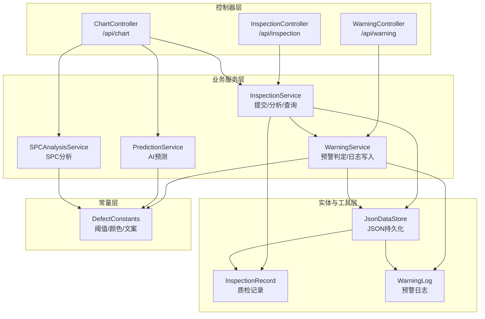
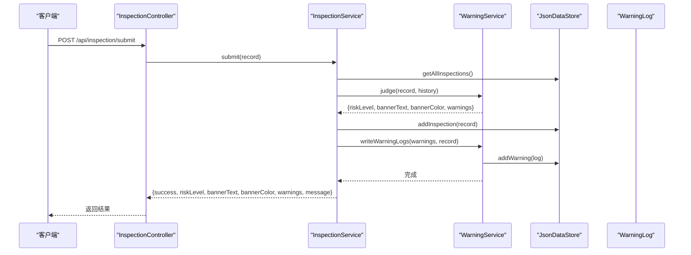
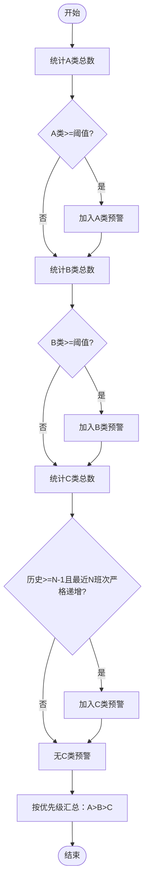
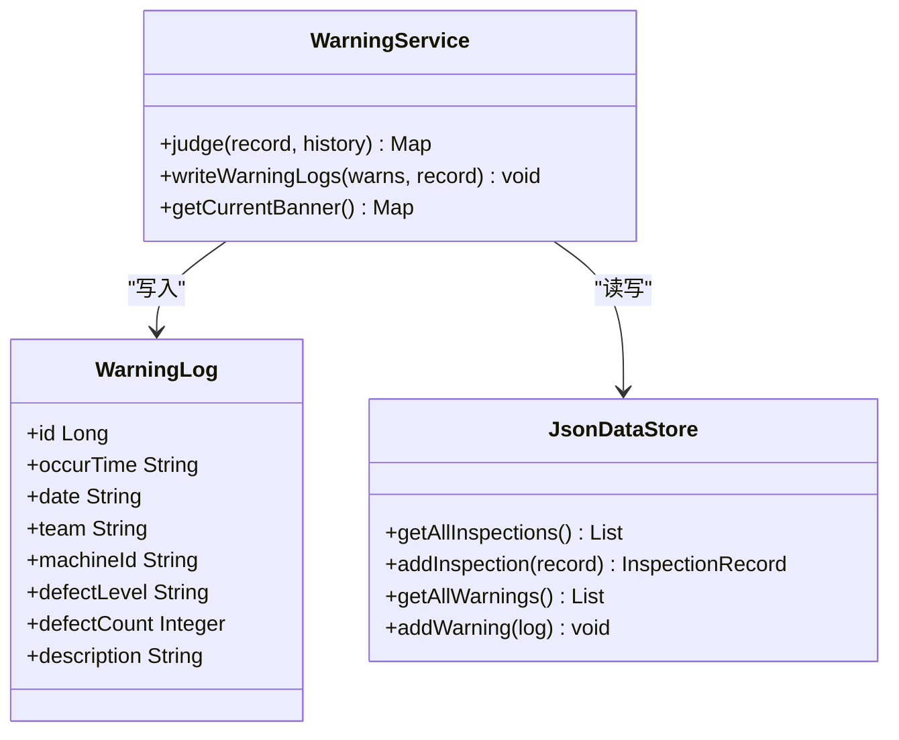
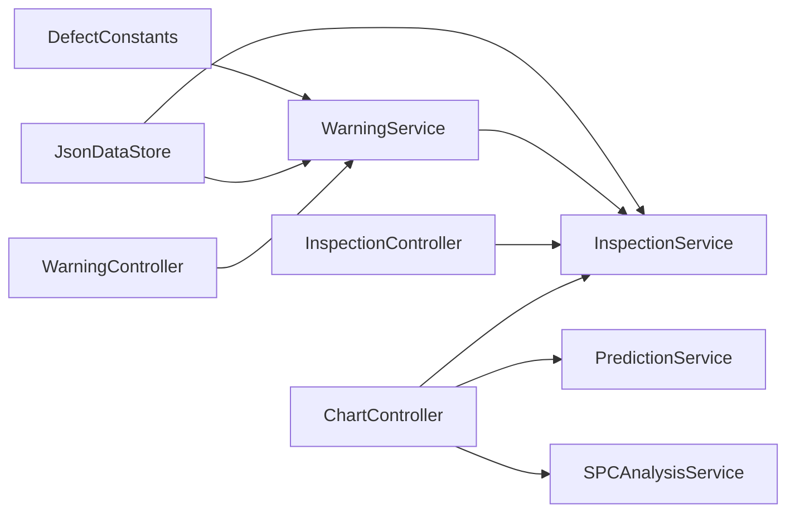

# 智能预警系统

<cite>
**本文引用的文件**
- [DefectConstants.java](file://src/main/java/com/zjzy/quality/constant/DefectConstants.java)
- [WarningService.java](file://src/main/java/com/zjzy/quality/service/WarningService.java)
- [WarningLog.java](file://src/main/java/com/zjzy/quality/entity/WarningLog.java)
- [InspectionRecord.java](file://src/main/java/com/zjzy/quality/entity/InspectionRecord.java)
- [JsonDataStore.java](file://src/main/java/com/zjzy/quality/util/JsonDataStore.java)
- [InspectionService.java](file://src/main/java/com/zjzy/quality/service/InspectionService.java)
- [WarningController.java](file://src/main/java/com/zjzy/quality/controller/WarningController.java)
- [InspectionController.java](file://src/main/java/com/zjzy/quality/controller/InspectionController.java)
- [ChartController.java](file://src/main/java/com/zjzy/quality/controller/ChartController.java)
- [QualityApplication.java](file://src/main/java/com/zjzy/quality/QualityApplication.java)
- [application.yml](file://src/main/resources/application.yml)
- [PredictionService.java](file://src/main/java/com/zjzy/quality/service/PredictionService.java)
- [SPCAnalysisService.java](file://src/main/java/com/zjzy/quality/service/SPCAnalysisService.java)
</cite>

## 目录
1. [简介](#简介)
2. [项目结构](#项目结构)
3. [核心组件](#核心组件)
4. [架构总览](#架构总览)
5. [详细组件分析](#详细组件分析)
6. [依赖关系分析](#依赖关系分析)
7. [性能考虑](#性能考虑)
8. [故障排除指南](#故障排除指南)
9. [结论](#结论)
10. [附录](#附录)

## 简介
本系统是一个面向卷烟生产的“全维度质检智能预警预判系统”，通过A/B/C/D四级缺陷分级标准，结合物测指标SPC控制与AI预测能力，实现对生产过程的实时预警与可视化监控。系统采用纯Java实现，无需外部Python依赖，支持本地JSON文件持久化，并提供REST接口供前端调用。

## 项目结构
系统采用分层架构：
- 控制器层：负责HTTP请求处理与响应输出
- 业务服务层：封装质检数据提交、预警判定、图表分析等核心业务
- 实体与工具层：定义数据模型与JSON持久化工具
- 常量层：集中管理阈值、颜色、文案等配置

**图表来源**
- [WarningController.java:16-37](file://src/main/java/com/zjzy/quality/controller/WarningController.java#L16-L37)
- [InspectionController.java:13-34](file://src/main/java/com/zjzy/quality/controller/InspectionController.java#L13-L34)
- [ChartController.java:17-105](file://src/main/java/com/zjzy/quality/controller/ChartController.java#L17-L105)
- [InspectionService.java:12-101](file://src/main/java/com/zjzy/quality/service/InspectionService.java#L12-L101)
- [WarningService.java:15-139](file://src/main/java/com/zjzy/quality/service/WarningService.java#L15-L139)
- [JsonDataStore.java:20-221](file://src/main/java/com/zjzy/quality/util/JsonDataStore.java#L20-L221)
- [InspectionRecord.java:7-153](file://src/main/java/com/zjzy/quality/entity/InspectionRecord.java#L7-L153)
- [WarningLog.java:7-43](file://src/main/java/com/zjzy/quality/entity/WarningLog.java#L7-L43)
- [DefectConstants.java:7-75](file://src/main/java/com/zjzy/quality/constant/DefectConstants.java#L7-L75)
- [PredictionService.java:14-168](file://src/main/java/com/zjzy/quality/service/PredictionService.java#L14-L168)
- [SPCAnalysisService.java:14-239](file://src/main/java/com/zjzy/quality/service/SPCAnalysisService.java#L14-L239)

**章节来源**
- [application.yml:1-24](file://src/main/resources/application.yml#L1-L24)
- [QualityApplication.java:12-24](file://src/main/java/com/zjzy/quality/QualityApplication.java#L12-L24)

## 核心组件
- DefectConstants：集中定义缺陷分级阈值、物测指标内控限、预警配色与文案模板，是系统配置的核心。
- WarningService：实现A/B/C/D四级预警判定、风险等级汇总、预警日志写入与横幅状态查询。
- InspectionService：封装质检数据提交流程，串联数据持久化、预警判定与日志写入。
- JsonDataStore：提供JSON文件持久化与Mock数据生成，支持质检记录与预警日志的读写。
- 实体类：InspectionRecord与WarningLog分别承载质检数据与预警日志的结构化信息。
- 控制器：WarningController、InspectionController、ChartController提供REST接口。

**章节来源**
- [DefectConstants.java:7-75](file://src/main/java/com/zjzy/quality/constant/DefectConstants.java#L7-L75)
- [WarningService.java:15-139](file://src/main/java/com/zjzy/quality/service/WarningService.java#L15-L139)
- [InspectionService.java:12-101](file://src/main/java/com/zjzy/quality/service/InspectionService.java#L12-L101)
- [JsonDataStore.java:20-221](file://src/main/java/com/zjzy/quality/util/JsonDataStore.java#L20-L221)
- [InspectionRecord.java:7-153](file://src/main/java/com/zjzy/quality/entity/InspectionRecord.java#L7-L153)
- [WarningLog.java:7-43](file://src/main/java/com/zjzy/quality/entity/WarningLog.java#L7-L43)
- [WarningController.java:16-37](file://src/main/java/com/zjzy/quality/controller/WarningController.java#L16-L37)
- [InspectionController.java:13-34](file://src/main/java/com/zjzy/quality/controller/InspectionController.java#L13-L34)
- [ChartController.java:17-105](file://src/main/java/com/zjzy/quality/controller/ChartController.java#L17-L105)

## 架构总览
系统启动时初始化数据存储，随后通过REST接口对外提供功能：
- 提交质检数据：InspectionController接收POST请求，调用InspectionService完成提交、判定与持久化。
- 预警查询：WarningController提供当前横幅状态与历史预警日志查询。
- 图表分析：ChartController整合缺陷分析、SPC分析与AI预测结果，返回前端渲染所需数据。

**图表来源**
- [InspectionController.java:21-24](file://src/main/java/com/zjzy/quality/controller/InspectionController.java#L21-L24)
- [InspectionService.java:19-44](file://src/main/java/com/zjzy/quality/service/InspectionService.java#L19-L44)
- [WarningService.java:23-99](file://src/main/java/com/zjzy/quality/service/WarningService.java#L23-L99)
- [JsonDataStore.java:66-92](file://src/main/java/com/zjzy/quality/util/JsonDataStore.java#L66-L92)
- [WarningLog.java:7-43](file://src/main/java/com/zjzy/quality/entity/WarningLog.java#L7-L43)

## 详细组件分析

### A/B/C/D四级风险预警标准与判定逻辑
- A类（严重缺陷）：任意层级A类缺陷≥1即触发高风险预警；横幅颜色为Apple红，文案提示“高风险，立即复核”。
- B类（较重缺陷）：所有层级B类缺陷合计≥3即触发中度风险预警；横幅颜色为Apple橙，文案提示“中度风险，及时排查”。
- C类（一般缺陷）：连续N班次C类总数严格递增（默认N=3）即触发一般风险预警；横幅颜色为Apple黄，文案提示“一般风险，请关注”。该判定依赖历史记录列表。
- D类（轻微缺陷）：仅统计不预警，作为风险等级汇总的参考项。

判定优先级：A>B>C，若同时满足多个条件，以最高优先级为准。

**图表来源**
- [WarningService.java:23-99](file://src/main/java/com/zjzy/quality/service/WarningService.java#L23-L99)
- [DefectConstants.java:11-18](file://src/main/java/com/zjzy/quality/constant/DefectConstants.java#L11-L18)

**章节来源**
- [WarningService.java:23-99](file://src/main/java/com/zjzy/quality/service/WarningService.java#L23-L99)
- [DefectConstants.java:11-18](file://src/main/java/com/zjzy/quality/constant/DefectConstants.java#L11-L18)

### 风险等级计算算法与预警触发条件
- 风险等级汇总规则：若存在A类预警，则为高风险；否则若存在B类预警，则为中度风险；否则若存在C类预警，则为一般风险；否则为平稳。
- 横幅文本与颜色：根据汇总后的风险等级，从DefectConstants中选择对应文案与颜色。
- C类连续上涨判定：使用历史记录子序列，检查是否满足严格递增且长度≥N（默认3），满足则触发一般风险。

**章节来源**
- [WarningService.java:77-95](file://src/main/java/com/zjzy/quality/service/WarningService.java#L77-L95)
- [DefectConstants.java:44-66](file://src/main/java/com/zjzy/quality/constant/DefectConstants.java#L44-L66)

### WarningService核心方法实现
- judge(record, history)：执行A/B/C三级判定，返回包含风险等级、横幅文本、横幅颜色与预警详情的Map。
- writeWarningLogs(warns, record)：将触发的A/B/C类预警写入JSON文件，字段包括发生时间、日期、班组、机台、缺陷等级、数量与描述。
- getCurrentBanner()：基于最新记录与历史数据计算当前横幅状态，若无历史数据则返回“平稳”。

**图表来源**
- [WarningService.java:15-139](file://src/main/java/com/zjzy/quality/service/WarningService.java#L15-L139)
- [WarningLog.java:7-43](file://src/main/java/com/zjzy/quality/entity/WarningLog.java#L7-L43)
- [JsonDataStore.java:20-92](file://src/main/java/com/zjzy/quality/util/JsonDataStore.java#L20-L92)

**章节来源**
- [WarningService.java:23-138](file://src/main/java/com/zjzy/quality/service/WarningService.java#L23-L138)
- [WarningLog.java:7-43](file://src/main/java/com/zjzy/quality/entity/WarningLog.java#L7-L43)
- [JsonDataStore.java:84-92](file://src/main/java/com/zjzy/quality/util/JsonDataStore.java#L84-L92)

### DefectConstants中的阈值配置、颜色定义与文案模板
- 缺陷分级阈值
  - A类触发阈值：任意层级A类缺陷≥1即触发高风险。
  - B类触发阈值：所有层级B类缺陷合计≥3即触发中度风险。
  - C类连续班次数：连续N班次C类总数严格递增触发一般风险，默认N=3。
- 物测指标内控标准（中心线、UCL、LCL）
  - 吸阻：中心线、UCL、LCL
  - 单支重量：中心线、UCL、LCL
  - 圆周：中心线、UCL、LCL
- 预警配色（Apple风格）
  - A类：Apple红；B类：Apple橙；C类：Apple黄；D类：Apple灰；安全：Apple绿
- 风险等级文本
  - 高风险、中度风险、一般风险、平稳
- 外观模块名称
  - 模块名数组与标签数组、等级后缀数组

配置方法：直接修改DefectConstants中的常量值即可调整阈值与颜色，无需改动其他代码。

**章节来源**
- [DefectConstants.java:9-75](file://src/main/java/com/zjzy/quality/constant/DefectConstants.java#L9-L75)

### 预警信息生成机制
- 生成内容：缺陷等级、数量、描述文本。
- 描述模板：根据判定类型动态拼接数量与风险提示语。
- 存储：仅记录A/B/C类预警，D类不写入日志。

**章节来源**
- [WarningService.java:26-73](file://src/main/java/com/zjzy/quality/service/WarningService.java#L26-L73)
- [WarningLog.java:7-43](file://src/main/java/com/zjzy/quality/entity/WarningLog.java#L7-L43)

### 预警日志写入格式、存储位置与查询方法
- 写入格式：WarningLog实体包含发生时间、日期、班组、机台、缺陷等级、缺陷数量与描述。
- 存储位置：data/inspection_data.json（质检记录）、data/warning_log.json（预警日志）。
- 查询方法：
  - 当前横幅状态：GET /api/warning/banner
  - 历史预警日志：GET /api/warning/logs

**章节来源**
- [JsonDataStore.java:22-24](file://src/main/java/com/zjzy/quality/util/JsonDataStore.java#L22-L24)
- [WarningController.java:24-36](file://src/main/java/com/zjzy/quality/controller/WarningController.java#L24-L36)
- [WarningLog.java:7-43](file://src/main/java/com/zjzy/quality/entity/WarningLog.java#L7-L43)

### 具体预警案例分析
以下案例展示不同缺陷组合下的预警结果（基于系统内置Mock数据与判定逻辑）：
- 高风险案例：任一层级A类缺陷≥1，例如某班次A类缺陷数量≥1，系统判定为高风险，横幅颜色为Apple红，提示“高风险，立即复核”。
- 中度风险案例：所有层级B类缺陷合计≥3，例如某班次B类缺陷合计≥3，系统判定为中度风险，横幅颜色为Apple橙，提示“中度风险，及时排查”。
- 一般风险案例：连续3班次C类总数严格递增，例如近3班次C类缺陷数量分别为10、12、15，系统判定为一般风险，横幅颜色为Apple黄，提示“一般风险，请关注”。
- 平稳案例：未触发A/B/C类预警，系统判定为平稳，横幅颜色为Apple绿，提示“当前班次无A/B/C类风险，质检数据平稳”。

**章节来源**
- [InspectionRecord.java:115-148](file://src/main/java/com/zjzy/quality/entity/InspectionRecord.java#L115-L148)
- [WarningService.java:26-95](file://src/main/java/com/zjzy/quality/service/WarningService.java#L26-L95)
- [JsonDataStore.java:153-220](file://src/main/java/com/zjzy/quality/util/JsonDataStore.java#L153-L220)

### 扩展性设计与自定义阈值配置指南
- 扩展性设计
  - 配置集中化：阈值、颜色、文案均在DefectConstants中统一管理，便于维护与横向扩展。
  - 服务解耦：WarningService独立于控制器与数据存储，便于单元测试与替换实现。
  - 可插拔分析：SPCAnalysisService与PredictionService可独立扩展新的分析算法。
- 自定义阈值配置
  - 修改DefectConstants中的A类、B类阈值与C类连续班次数，即可调整预警灵敏度。
  - 调整物测指标内控限（SUCTION_CENTER/UCL/LCL、WEIGHT_CENTER/UCL/LCL、CIRCUM_CENTER/UCL/LCL）以适配不同车间标准。
  - 如需新增风险等级或文案，可在DefectConstants中添加新常量并在WarningService中引用。

**章节来源**
- [DefectConstants.java:9-75](file://src/main/java/com/zjzy/quality/constant/DefectConstants.java#L9-L75)
- [WarningService.java:77-95](file://src/main/java/com/zjzy/quality/service/WarningService.java#L77-L95)

## 依赖关系分析
- 组件耦合
  - WarningService依赖DefectConstants与JsonDataStore，用于阈值读取与日志写入。
  - InspectionService依赖WarningService与JsonDataStore，串联提交流程。
  - 控制器层仅依赖服务层，保持低耦合。
- 外部依赖
  - Spring Boot用于Web框架与启动。
  - Gson用于JSON序列化与反序列化。
  - 无外部Python依赖，AI预测与SPC分析均为纯Java实现。

**图表来源**
- [DefectConstants.java:7-75](file://src/main/java/com/zjzy/quality/constant/DefectConstants.java#L7-L75)
- [WarningService.java:15-139](file://src/main/java/com/zjzy/quality/service/WarningService.java#L15-L139)
- [InspectionService.java:12-101](file://src/main/java/com/zjzy/quality/service/InspectionService.java#L12-L101)
- [JsonDataStore.java:20-221](file://src/main/java/com/zjzy/quality/util/JsonDataStore.java#L20-L221)
- [InspectionController.java:13-34](file://src/main/java/com/zjzy/quality/controller/InspectionController.java#L13-L34)
- [WarningController.java:16-37](file://src/main/java/com/zjzy/quality/controller/WarningController.java#L16-L37)
- [ChartController.java:17-105](file://src/main/java/com/zjzy/quality/controller/ChartController.java#L17-L105)
- [PredictionService.java:14-168](file://src/main/java/com/zjzy/quality/service/PredictionService.java#L14-L168)
- [SPCAnalysisService.java:14-239](file://src/main/java/com/zjzy/quality/service/SPCAnalysisService.java#L14-L239)

**章节来源**
- [application.yml:1-24](file://src/main/resources/application.yml#L1-L24)
- [QualityApplication.java:12-24](file://src/main/java/com/zjzy/quality/QualityApplication.java#L12-L24)

## 性能考虑
- 数据持久化：使用Gson进行JSON读写，文件I/O在应用启动时初始化，日常写入为追加模式，性能稳定。
- 内存缓存：JsonDataStore维护内存缓存，减少频繁磁盘IO。
- 预测与SPC：Holt双参数指数平滑与SPC八大规则均为O(n)复杂度，适合短期预测与实时分析。
- 建议：在高并发场景下，可考虑引入数据库替代JSON文件，或增加缓存层与异步写入策略。

[本节为通用建议，不直接分析具体文件]

## 故障排除指南
- 启动失败
  - 检查application.yml端口与静态资源路径配置。
  - 确认data目录可读写权限。
- 预警不触发
  - 检查DefectConstants中的阈值设置是否合理。
  - 确认InspectionRecord字段是否正确传入。
- 日志未写入
  - 检查WarningService.writeWarningLogs是否被调用。
  - 确认data/warning_log.json是否存在且可写。
- 图表数据异常
  - 检查SPCAnalysisService与PredictionService的输入数据完整性。
  - 确认ChartController接口返回的数据结构与前端一致。

**章节来源**
- [application.yml:1-24](file://src/main/resources/application.yml#L1-L24)
- [JsonDataStore.java:46-62](file://src/main/java/com/zjzy/quality/util/JsonDataStore.java#L46-L62)
- [WarningService.java:105-121](file://src/main/java/com/zjzy/quality/service/WarningService.java#L105-L121)
- [SPCAnalysisService.java:45-74](file://src/main/java/com/zjzy/quality/service/SPCAnalysisService.java#L45-L74)
- [PredictionService.java:50-59](file://src/main/java/com/zjzy/quality/service/PredictionService.java#L50-L59)

## 结论
本系统通过清晰的配置化阈值、稳定的JSON持久化与简洁的REST接口，实现了卷烟生产的智能预警与可视化监控。WarningService为核心判定引擎，DefectConstants集中管理配置，JsonDataStore提供可靠的数据持久化。系统具备良好的扩展性，可通过调整阈值与颜色快速适配不同车间标准，并可进一步集成数据库与异步处理提升性能。

[本节为总结性内容，不直接分析具体文件]

## 附录
- 接口清单
  - GET /api/warning/banner：获取当前横幅状态
  - GET /api/warning/logs：获取历史预警日志
  - POST /api/inspection/submit：提交质检数据
  - GET /api/inspection/list：查询历史数据
  - GET /api/chart/spc：获取SPC分析数据
  - GET /api/chart/defect：获取缺陷分析数据
  - GET /api/chart/predict：获取AI预测数据

**章节来源**
- [WarningController.java:24-36](file://src/main/java/com/zjzy/quality/controller/WarningController.java#L24-L36)
- [InspectionController.java:21-33](file://src/main/java/com/zjzy/quality/controller/InspectionController.java#L21-L33)
- [ChartController.java:25-104](file://src/main/java/com/zjzy/quality/controller/ChartController.java#L25-L104)