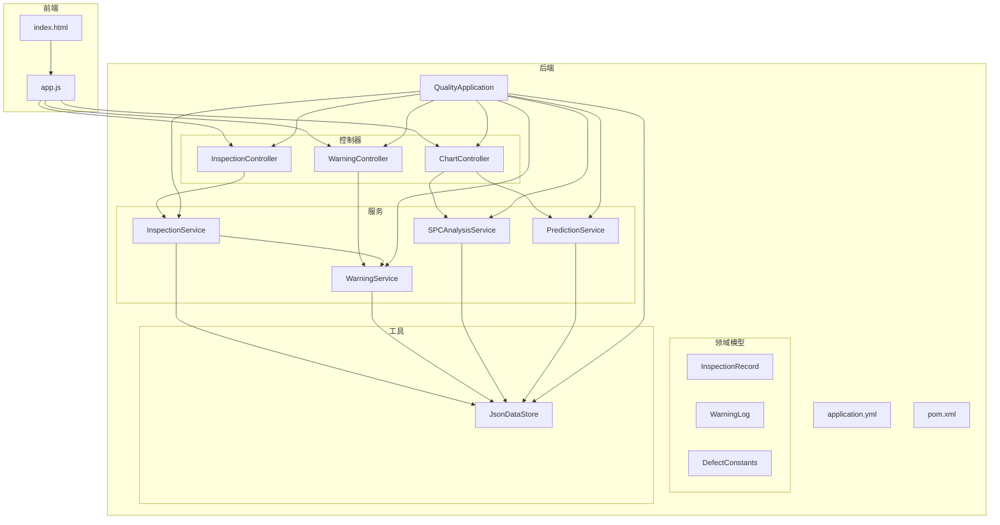
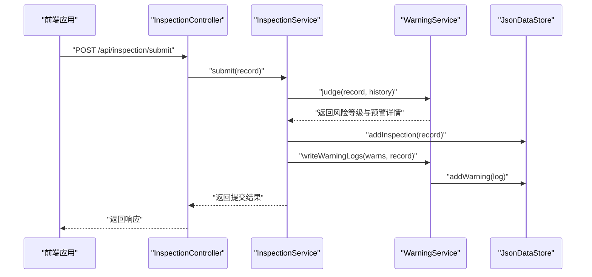
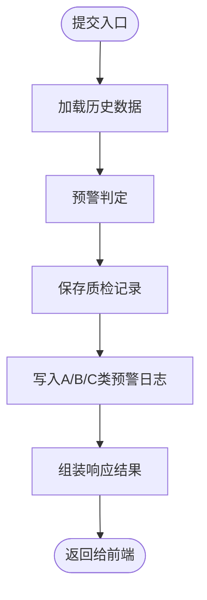
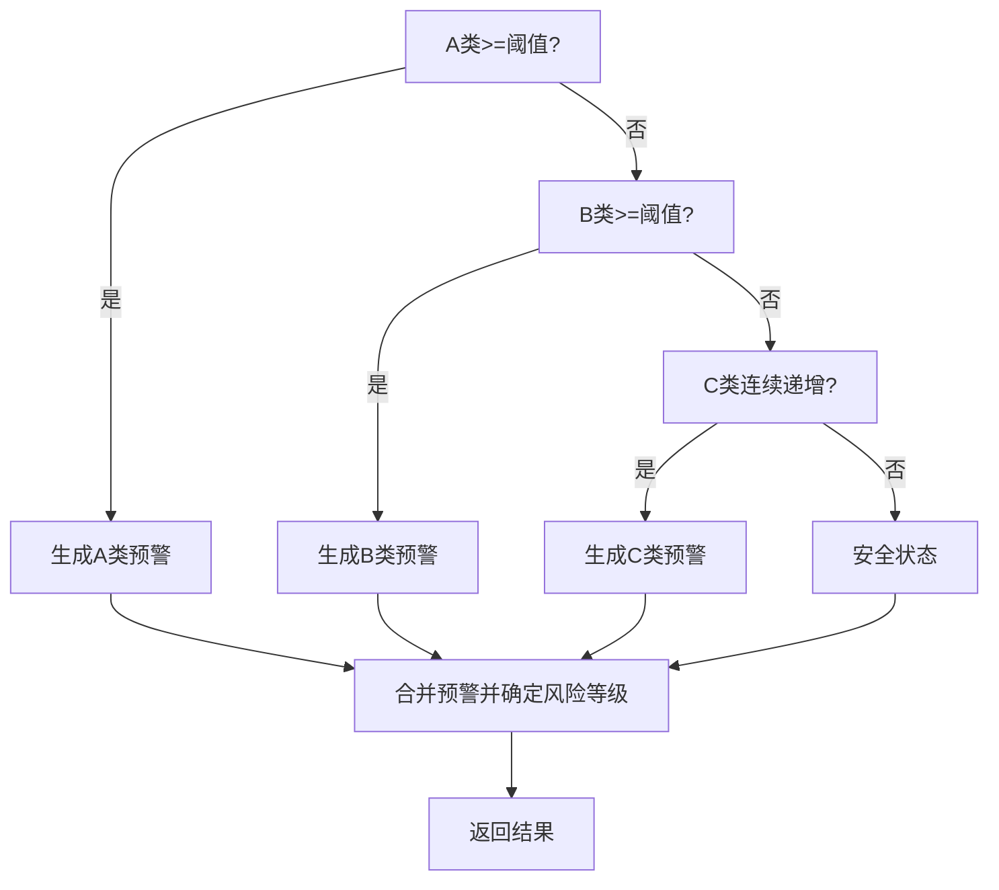
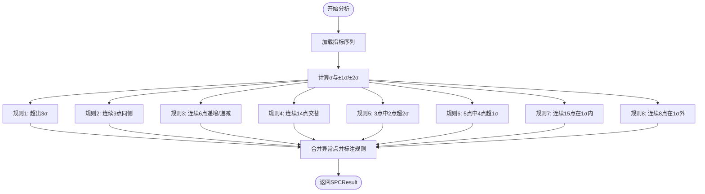
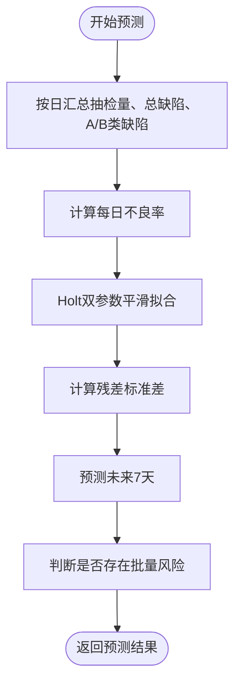
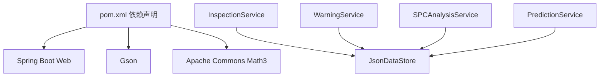

# 核心功能

<cite>
**本文引用的文件**
- [QualityApplication.java](file://src/main/java/com/zjzy/quality/QualityApplication.java)
- [InspectionController.java](file://src/main/java/com/zjzy/quality/controller/InspectionController.java)
- [WarningController.java](file://src/main/java/com/zjzy/quality/controller/WarningController.java)
- [ChartController.java](file://src/main/java/com/zjzy/quality/controller/ChartController.java)
- [InspectionService.java](file://src/main/java/com/zjzy/quality/service/InspectionService.java)
- [WarningService.java](file://src/main/java/com/zjzy/quality/service/WarningService.java)
- [SPCAnalysisService.java](file://src/main/java/com/zjzy/quality/service/SPCAnalysisService.java)
- [PredictionService.java](file://src/main/java/com/zjzy/quality/service/PredictionService.java)
- [InspectionRecord.java](file://src/main/java/com/zjzy/quality/entity/InspectionRecord.java)
- [WarningLog.java](file://src/main/java/com/zjzy/quality/entity/WarningLog.java)
- [DefectConstants.java](file://src/main/java/com/zjzy/quality/constant/DefectConstants.java)
- [JsonDataStore.java](file://src/main/java/com/zjzy/quality/util/JsonDataStore.java)
- [pom.xml](file://pom.xml)
- [application.yml](file://src/main/resources/application.yml)
- [index.html](file://src/main/resources/static/index.html)
- [app.js](file://src/main/resources/static/js/app.js)
</cite>

## 目录
1. [引言](#引言)
2. [项目结构](#项目结构)
3. [核心组件](#核心组件)
4. [架构总览](#架构总览)
5. [详细组件分析](#详细组件分析)
6. [依赖分析](#依赖分析)
7. [性能考虑](#性能考虑)
8. [故障排除指南](#故障排除指南)
9. [结论](#结论)
10. [附录](#附录)

## 引言
本项目是一个“卷烟全维度质检智能预警预判系统”，围绕四大核心功能模块构建：
- 质检数据管理：支持数据提交、历史查询、批量操作等
- 智能预警系统：基于A/B/C/D四级标准与历史趋势进行风险判定
- SPC统计过程控制：实现Nelson八大判异规则，进行物测指标控制图分析
- AI预测分析：采用Holt双参数指数平滑进行趋势预测与风险预警

系统采用前后端分离架构，后端以Spring Boot提供REST接口，前端使用jQuery与Plotly.js渲染可视化看板。数据持久化通过JSON文件实现，便于快速迭代与迁移。

## 项目结构
系统采用分层与按功能域组织的结构：
- 控制器层：InspectionController、WarningController、ChartController
- 业务服务层：InspectionService、WarningService、SPCAnalysisService、PredictionService
- 实体与常量：InspectionRecord、WarningLog、DefectConstants
- 工具与持久化：JsonDataStore
- 启动类与配置：QualityApplication、application.yml、pom.xml
- 前端静态资源：index.html、app.js

**图表来源**
- [QualityApplication.java:12-24](file://src/main/java/com/zjzy/quality/QualityApplication.java#L12-L24)
- [InspectionController.java:13-34](file://src/main/java/com/zjzy/quality/controller/InspectionController.java#L13-L34)
- [WarningController.java:16-37](file://src/main/java/com/zjzy/quality/controller/WarningController.java#L16-L37)
- [ChartController.java:17-105](file://src/main/java/com/zjzy/quality/controller/ChartController.java#L17-L105)
- [InspectionService.java:12-101](file://src/main/java/com/zjzy/quality/service/InspectionService.java#L12-L101)
- [WarningService.java:15-139](file://src/main/java/com/zjzy/quality/service/WarningService.java#L15-L139)
- [SPCAnalysisService.java:14-240](file://src/main/java/com/zjzy/quality/service/SPCAnalysisService.java#L14-L240)
- [PredictionService.java:14-168](file://src/main/java/com/zjzy/quality/service/PredictionService.java#L14-L168)
- [JsonDataStore.java:20-221](file://src/main/java/com/zjzy/quality/util/JsonDataStore.java#L20-L221)

**章节来源**
- [application.yml:4-24](file://src/main/resources/application.yml#L4-L24)
- [pom.xml:30-76](file://pom.xml#L30-L76)

## 核心组件
- 质检数据管理：负责接收前端提交的质检记录，计算A/B/C/D类缺陷总数，写入JSON文件，并触发预警判定与日志记录。
- 智能预警系统：依据DefectConstants中的阈值与规则，对A/B/C类缺陷进行即时判定，生成风险等级与横幅提示。
- SPC统计过程控制：对吸阻、单支重量、圆周三项物测指标执行Nelson八大判异规则，输出控制图与异常点标注。
- AI预测分析：基于Holt双参数指数平滑对每日不良率进行拟合与未来7天预测，结合A/B类缺陷占比判断是否存在批量质量风险。

**章节来源**
- [InspectionService.java:19-44](file://src/main/java/com/zjzy/quality/service/InspectionService.java#L19-L44)
- [WarningService.java:23-99](file://src/main/java/com/zjzy/quality/service/WarningService.java#L23-L99)
- [SPCAnalysisService.java:45-74](file://src/main/java/com/zjzy/quality/service/SPCAnalysisService.java#L45-L74)
- [PredictionService.java:50-159](file://src/main/java/com/zjzy/quality/service/PredictionService.java#L50-L159)

## 架构总览
系统采用“控制器-服务-工具”的分层架构，前端通过REST接口与后端交互，数据通过JsonDataStore进行本地持久化。启动类在应用启动时初始化数据存储，确保系统具备Mock数据以供演示。

**图表来源**
- [InspectionController.java:21-24](file://src/main/java/com/zjzy/quality/controller/InspectionController.java#L21-L24)
- [InspectionService.java:19-44](file://src/main/java/com/zjzy/quality/service/InspectionService.java#L19-L44)
- [WarningService.java:23-99](file://src/main/java/com/zjzy/quality/service/WarningService.java#L23-L99)
- [JsonDataStore.java:70-92](file://src/main/java/com/zjzy/quality/util/JsonDataStore.java#L70-L92)

## 详细组件分析

### 质检数据管理模块
- 业务逻辑
  - 接收前端提交的质检记录，计算A/B/C/D类缺陷总数与总缺陷数
  - 基于历史数据调用预警服务进行风险判定
  - 将记录写入JSON文件，同时将A/B/C类预警写入预警日志
  - 返回包含风险等级、横幅文本、横幅颜色与预警详情的响应
- 输入输出
  - 输入：InspectionRecord（包含日期、班次、机台、班组、抽检量、物测指标、各级缺陷数量）
  - 输出：Map（success、riskLevel、bannerText、bannerColor、warnings、message）
- 错误处理
  - 历史数据为空时仍可正常提交
  - JSON读写异常会打印错误日志但不影响流程继续
- 使用场景
  - 班组录入当日质检数据，系统即时给出风险提示并记录历史

**图表来源**
- [InspectionService.java:19-44](file://src/main/java/com/zjzy/quality/service/InspectionService.java#L19-L44)
- [JsonDataStore.java:66-92](file://src/main/java/com/zjzy/quality/util/JsonDataStore.java#L66-L92)

**章节来源**
- [InspectionController.java:21-33](file://src/main/java/com/zjzy/quality/controller/InspectionController.java#L21-L33)
- [InspectionService.java:19-100](file://src/main/java/com/zjzy/quality/service/InspectionService.java#L19-L100)
- [InspectionRecord.java:115-148](file://src/main/java/com/zjzy/quality/entity/InspectionRecord.java#L115-L148)

### 智能预警系统模块
- 业务逻辑
  - A类：任意层级A类缺陷>=1即触发高风险
  - B类：所有层级B类合计>=3触发中度风险
  - C类：连续N班次C类总数严格递增触发一般风险
  - D类：仅统计，不触发预警
  - 横幅优先级：A>B>C，否则为安全
- 输入输出
  - 输入：当前记录、历史记录列表
  - 输出：Map（riskLevel、bannerText、bannerColor、warnings）
- 错误处理
  - 历史长度不足时跳过C类连续趋势判定
  - 无预警时返回安全状态
- 使用场景
  - 实时展示当前班次风险状态，指导现场处置

**图表来源**
- [WarningService.java:23-99](file://src/main/java/com/zjzy/quality/service/WarningService.java#L23-L99)
- [DefectConstants.java:11-18](file://src/main/java/com/zjzy/quality/constant/DefectConstants.java#L11-L18)

**章节来源**
- [WarningService.java:23-139](file://src/main/java/com/zjzy/quality/service/WarningService.java#L23-L139)
- [WarningController.java:24-36](file://src/main/java/com/zjzy/quality/controller/WarningController.java#L24-L36)

### SPC统计过程控制模块
- 算法原理
  - Nelson八大判异规则：超出3σ、连续9点同侧、连续6点递增/递减、连续14点交替、3点中2点超2σ、5点中4点超1σ、连续15点在1σ内、连续8点在1σ外
  - 计算σ=(UCL-LCL)/6，区分严重异常（红点）与轻微偏离（黄点）
- 输入输出
  - 输入：吸阻、单支重量、圆周的历史数据与控制限
  - 输出：SPCResult（values、center、ucl、lcl、severe、mild、描述）
- 错误处理
  - 控制限无效时直接返回空结果
  - 无数据时返回空集合
- 使用场景
  - 实时监控物测指标是否偏离稳定状态，辅助工艺调整

**图表来源**
- [SPCAnalysisService.java:79-239](file://src/main/java/com/zjzy/quality/service/SPCAnalysisService.java#L79-L239)
- [DefectConstants.java:23-42](file://src/main/java/com/zjzy/quality/constant/DefectConstants.java#L23-L42)

**章节来源**
- [ChartController.java:25-70](file://src/main/java/com/zjzy/quality/controller/ChartController.java#L25-L70)
- [SPCAnalysisService.java:45-240](file://src/main/java/com/zjzy/quality/service/SPCAnalysisService.java#L45-L240)

### AI预测分析模块
- 算法原理
  - Holt双参数指数平滑：分解为水平与趋势两部分，使用固定α与β参数
  - 残差标准差估计预测区间，95%置信区间上下界为yhat ± 1.96*se
  - 风险判定：比较未来最大上界与近期平均不良率1.5倍，且A/B类缺陷占比>0时判定存在批量风险
- 输入输出
  - 输入：历史质检记录（按日聚合）
  - 输出：PredictionResult（historyDates、historyRates、predDates、predYhat、predUpper、predLower、hasRisk、riskMsg）
- 错误处理
  - 历史数据不足时直接返回空结果
  - 日期解析异常时回退到当前日期
- 使用场景
  - 预判未来质量趋势，提前发出风险信号

**图表来源**
- [PredictionService.java:50-159](file://src/main/java/com/zjzy/quality/service/PredictionService.java#L50-L159)

**章节来源**
- [ChartController.java:89-104](file://src/main/java/com/zjzy/quality/controller/ChartController.java#L89-L104)
- [PredictionService.java:16-45](file://src/main/java/com/zjzy/quality/service/PredictionService.java#L16-L45)

## 依赖分析
- 外部依赖
  - Spring Boot Web：提供REST接口能力
  - Gson：JSON序列化/反序列化
  - Apache Commons Math3：数学统计与预测（注：当前实现未使用该库，保留以备扩展）
- 内部耦合
  - 控制器依赖服务；服务依赖工具类与常量；实体作为数据载体贯穿各层
  - JsonDataStore承担数据持久化职责，被多处服务共享

**图表来源**
- [pom.xml:30-76](file://pom.xml#L30-L76)
- [JsonDataStore.java:20-221](file://src/main/java/com/zjzy/quality/util/JsonDataStore.java#L20-L221)

**章节来源**
- [pom.xml:30-76](file://pom.xml#L30-L76)

## 性能考虑
- 数据规模
  - 当前使用JSON文件与内存缓存，适合中小规模数据演示；如需支撑更大体量，建议迁移到数据库并引入分页与索引
- 计算复杂度
  - 预警与缺陷汇总为O(n)，SPC分析为O(n*k)（k为规则数量），预测为O(n)
- I/O优化
  - JsonDataStore采用同步方法与文件落盘，建议在高并发场景下增加锁粒度或引入异步写入
- 前端渲染
  - Plotly渲染大量点时可能影响性能，建议对历史数据进行采样或分页展示

## 故障排除指南
- 启动失败
  - 检查application.yml端口占用与静态资源路径配置
  - 确认JDK版本与Maven依赖一致
- 数据无法持久化
  - 检查data目录权限与磁盘空间
  - 查看控制台异常日志定位具体文件写入问题
- 预测/SPC结果为空
  - 确认历史数据是否充足（至少2条）
  - 检查控制限设置是否合理（UCL>LCL>0）

**章节来源**
- [application.yml:4-24](file://src/main/resources/application.yml#L4-L24)
- [JsonDataStore.java:96-149](file://src/main/java/com/zjzy/quality/util/JsonDataStore.java#L96-L149)

## 结论
本系统以清晰的分层架构实现了从数据录入、实时预警、统计分析到趋势预测的完整闭环。通过可配置的阈值与规则，满足不同车间的质量内控需求；通过SPC与AI预测增强对过程稳定性的洞察与风险前置能力。建议后续在生产环境引入数据库、缓存与消息队列，进一步提升稳定性与扩展性。

## 附录
- 启动与访问
  - 启动类：QualityApplication
  - 访问地址：http://localhost:8080
- 前端交互
  - 表单字段覆盖基础信息、物测指标与四层外观缺陷
  - 提交后自动刷新看板：历史表格、SPC图、缺陷分析、预测图
- 常量与阈值
  - 缺陷阈值与物测控制限集中定义于DefectConstants，便于统一维护与快速调整

**章节来源**
- [QualityApplication.java:14-23](file://src/main/java/com/zjzy/quality/QualityApplication.java#L14-L23)
- [index.html:32-135](file://src/main/resources/static/index.html#L32-L135)
- [DefectConstants.java:9-76](file://src/main/java/com/zjzy/quality/constant/DefectConstants.java#L9-L76)