# 质检数据管理

<cite>
**本文引用的文件**
- [InspectionRecord.java](file://src/main/java/com/zjzy/quality/entity/InspectionRecord.java)
- [WarningLog.java](file://src/main/java/com/zjzy/quality/entity/WarningLog.java)
- [InspectionService.java](file://src/main/java/com/zjzy/quality/service/InspectionService.java)
- [WarningService.java](file://src/main/java/com/zjzy/quality/service/WarningService.java)
- [SPCAnalysisService.java](file://src/main/java/com/zjzy/quality/service/SPCAnalysisService.java)
- [PredictionService.java](file://src/main/java/com/zjzy/quality/service/PredictionService.java)
- [JsonDataStore.java](file://src/main/java/com/zjzy/quality/util/JsonDataStore.java)
- [DefectConstants.java](file://src/main/java/com/zjzy/quality/constant/DefectConstants.java)
- [InspectionController.java](file://src/main/java/com/zjzy/quality/controller/InspectionController.java)
- [ChartController.java](file://src/main/java/com/zjzy/quality/controller/ChartController.java)
- [WarningController.java](file://src/main/java/com/zjzy/quality/controller/WarningController.java)
- [QualityApplication.java](file://src/main/java/com/zjzy/quality/QualityApplication.java)
- [application.yml](file://src/main/resources/application.yml)
</cite>

## 目录
1. [简介](#简介)
2. [项目结构](#项目结构)
3. [核心组件](#核心组件)
4. [架构总览](#架构总览)
5. [详细组件分析](#详细组件分析)
6. [依赖关系分析](#依赖关系分析)
7. [性能考虑](#性能考虑)
8. [故障排除指南](#故障排除指南)
9. [结论](#结论)
10. [附录](#附录)

## 简介
本模块为“卷烟全维度质检智能预警预判系统”的核心数据管理与分析子系统，提供以下能力：
- 质检数据提交与历史管理（JSON文件持久化）
- 实时预警判定与日志记录（A/B/C/D四级）
- 缺陷分析数据生成（饼图与折线图）
- 物测指标SPC控制图分析
- 基于Holt双参数指数平滑的AI预测
- REST接口对外提供数据与分析结果

系统采用Spring Boot + Gson + Plotly.js的轻量架构，数据以JSON文件形式存储于项目data目录，支持Mock数据自动生成，便于快速部署与演示。

## 项目结构
- 实体层：InspectionRecord（质检记录）、WarningLog（预警日志）
- 服务层：InspectionService（提交/查询/分析）、WarningService（预警判定/日志写入）、SPCAnalysisService（SPC分析）、PredictionService（AI预测）
- 工具层：JsonDataStore（JSON文件读写与缓存）
- 控制器层：InspectionController（提交/历史查询）、ChartController（图表数据）、WarningController（预警横幅/日志）
- 常量层：DefectConstants（阈值、内控限、配色等）
- 启动类：QualityApplication（应用启动与数据初始化）

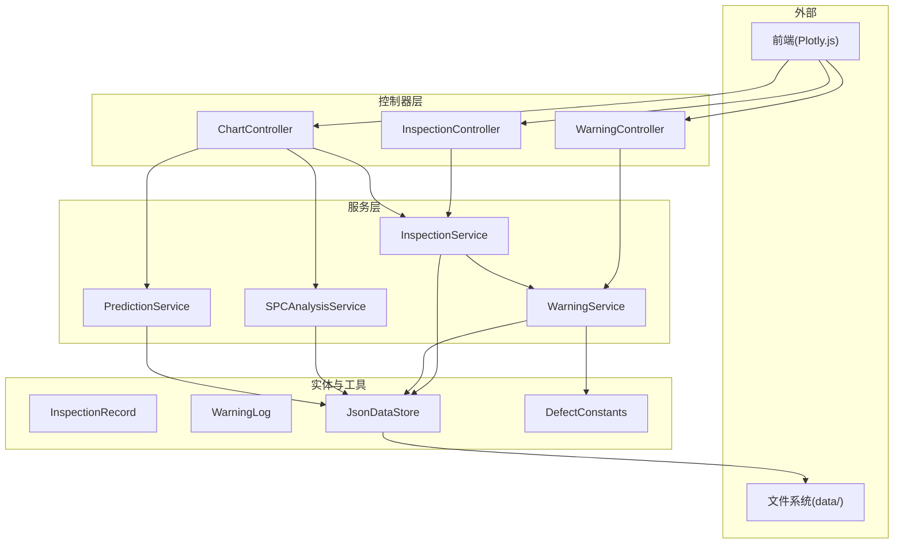

**图表来源**
- [InspectionController.java:13-34](file://src/main/java/com/zjzy/quality/controller/InspectionController.java#L13-L34)
- [ChartController.java:17-104](file://src/main/java/com/zjzy/quality/controller/ChartController.java#L17-L104)
- [WarningController.java:16-37](file://src/main/java/com/zjzy/quality/controller/WarningController.java#L16-L37)
- [InspectionService.java:12-101](file://src/main/java/com/zjzy/quality/service/InspectionService.java#L12-L101)
- [WarningService.java:15-139](file://src/main/java/com/zjzy/quality/service/WarningService.java#L15-L139)
- [SPCAnalysisService.java:14-240](file://src/main/java/com/zjzy/quality/service/SPCAnalysisService.java#L14-L240)
- [PredictionService.java:14-168](file://src/main/java/com/zjzy/quality/service/PredictionService.java#L14-L168)
- [JsonDataStore.java:20-221](file://src/main/java/com/zjzy/quality/util/JsonDataStore.java#L20-L221)
- [DefectConstants.java:7-75](file://src/main/java/com/zjzy/quality/constant/DefectConstants.java#L7-L75)

**章节来源**
- [application.yml:1-24](file://src/main/resources/application.yml#L1-L24)
- [QualityApplication.java:12-24](file://src/main/java/com/zjzy/quality/QualityApplication.java#L12-L24)

## 核心组件
- InspectionRecord：质检记录实体，包含日期、班次、机台、班组、抽检数量及多层级缺陷计数，提供A/B/C/D类缺陷合计计算。
- WarningLog：预警日志实体，记录发生时间、日期、班组、机台、缺陷等级、缺陷数量与描述。
- JsonDataStore：JSON文件持久化与内存缓存，负责初始化、读写、Mock数据生成。
- InspectionService：提交流程编排（历史读取→预警判定→JSON存储→预警日志写入→结果返回），历史查询与缺陷分析。
- WarningService：A/B/C/D四级预警判定与日志写入。
- SPCAnalysisService：基于Nelson八条规则的SPC分析。
- PredictionService：Holt双参数指数平滑预测未来质量趋势。
- 控制器：REST接口暴露提交、查询、图表、预警等能力。

**章节来源**
- [InspectionRecord.java:7-153](file://src/main/java/com/zjzy/quality/entity/InspectionRecord.java#L7-L153)
- [WarningLog.java:7-43](file://src/main/java/com/zjzy/quality/entity/WarningLog.java#L7-L43)
- [JsonDataStore.java:20-221](file://src/main/java/com/zjzy/quality/util/JsonDataStore.java#L20-L221)
- [InspectionService.java:12-101](file://src/main/java/com/zjzy/quality/service/InspectionService.java#L12-L101)
- [WarningService.java:15-139](file://src/main/java/com/zjzy/quality/service/WarningService.java#L15-L139)
- [SPCAnalysisService.java:14-240](file://src/main/java/com/zjzy/quality/service/SPCAnalysisService.java#L14-L240)
- [PredictionService.java:14-168](file://src/main/java/com/zjzy/quality/service/PredictionService.java#L14-L168)

## 架构总览
系统启动时通过JsonDataStore.init()加载或生成Mock数据，随后提供REST接口供前端调用。提交流程通过InspectionService统一编排，预警判定由WarningService完成，并将A/B/C类预警写入WarningLog文件。图表数据由ChartController聚合InspectionService与SPCAnalysisService/PredictionService的结果返回给前端。

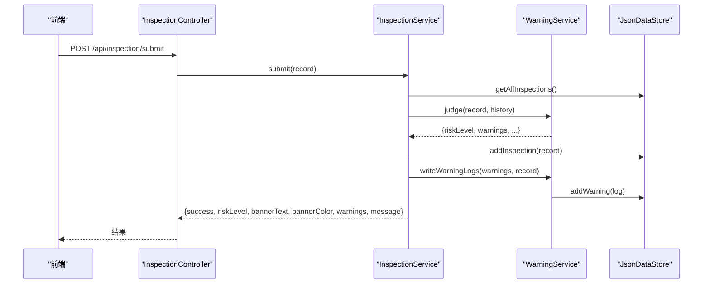

**图表来源**
- [InspectionController.java:21-24](file://src/main/java/com/zjzy/quality/controller/InspectionController.java#L21-L24)
- [InspectionService.java:19-44](file://src/main/java/com/zjzy/quality/service/InspectionService.java#L19-L44)
- [WarningService.java:23-99](file://src/main/java/com/zjzy/quality/service/WarningService.java#L23-L99)
- [JsonDataStore.java:66-92](file://src/main/java/com/zjzy/quality/util/JsonDataStore.java#L66-L92)

## 详细组件分析

### InspectionRecord 实体类
- 字段定义
  - 基础信息：id、date、shift、machineId、team、totalInspected
  - 内在物测指标：suction、weight、circumference
  - 外观缺陷（多层级）：cigaretteA/B/C/D、boxSmallA/B/C/D、cartonA/B/C/D、caseAa/Ab/ Ac/Ad
  - 风险等级：riskLevel
- 数据验证规则
  - 数值型字段允许为空；合计计算使用安全加法（空值视为0）
  - 通过getTotalA/B/C/D/ getTotalDefects 提供层级汇总
- 时间序列分析逻辑
  - 本实体不直接参与时间序列分析，但为SPC与预测服务提供基础数据

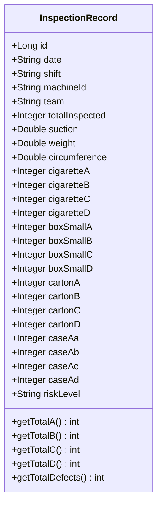

**图表来源**
- [InspectionRecord.java:7-153](file://src/main/java/com/zjzy/quality/entity/InspectionRecord.java#L7-L153)

**章节来源**
- [InspectionRecord.java:7-153](file://src/main/java/com/zjzy/quality/entity/InspectionRecord.java#L7-L153)

### WarningLog 实体类
- 字段定义
  - id、occurTime、date、team、machineId、defectLevel、defectCount、description
- 用途
  - 仅记录A/B/C类预警，用于QC追溯与报告

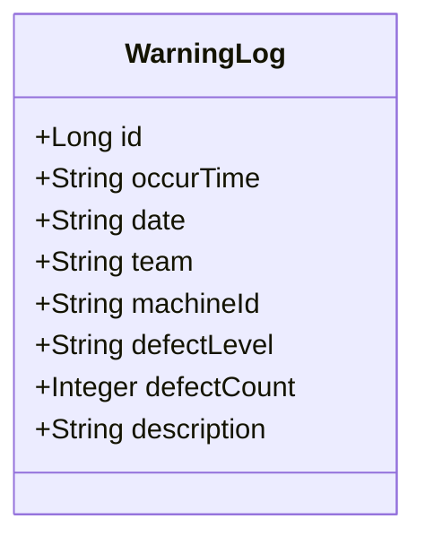

**图表来源**
- [WarningLog.java:7-43](file://src/main/java/com/zjzy/quality/entity/WarningLog.java#L7-L43)

**章节来源**
- [WarningLog.java:7-43](file://src/main/java/com/zjzy/quality/entity/WarningLog.java#L7-L43)

### InspectionService（提交/查询/分析）
- submit方法完整执行链路
  - 历史数据读取：从JsonDataStore获取历史记录（不含当前行）
  - 预警判定：调用WarningService.judge(record, history)，设置riskLevel
  - JSON存储：JsonDataStore.addInspection(record)
  - 预警日志写入：WarningService.writeWarningLogs(warns, record)
  - 结果返回：封装success、riskLevel、横幅文本/颜色、warnings、message
- listAll方法实现
  - 直接委托JsonDataStore.getAllInspections()
- getDefectAnalysis方法（饼图+折线图）
  - 饼图：累计A/B/C/D类缺陷总数
  - 折线图：最近10班次的时间序列（标签为“日期 班次”），四条线分别对应A/B/C/D

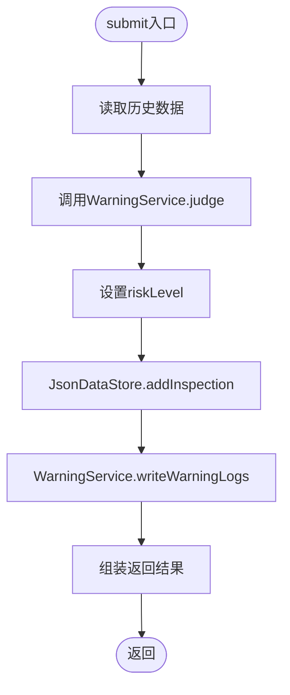

**图表来源**
- [InspectionService.java:19-44](file://src/main/java/com/zjzy/quality/service/InspectionService.java#L19-L44)

**章节来源**
- [InspectionService.java:12-101](file://src/main/java/com/zjzy/quality/service/InspectionService.java#L12-L101)

### WarningService（预警判定与日志）
- 预警判定规则
  - A类：任意层级A类>=1 → 高风险
  - B类：所有层级B类合计>=3 → 中度风险
  - C类：连续N班次C类总数严格递增 → 一般风险（N由常量定义）
  - D类：仅统计，不预警
- 横幅状态汇总优先级：A>B>C，否则平稳
- 日志写入
  - 仅写入A/B/C类预警，构造WarningLog并持久化

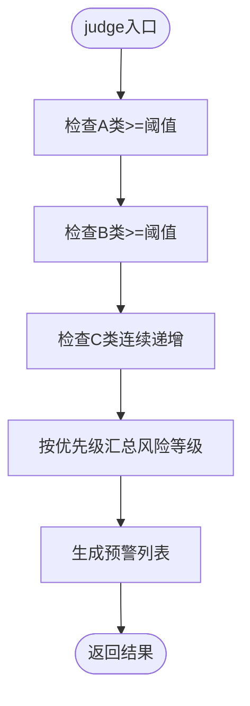

**图表来源**
- [WarningService.java:23-99](file://src/main/java/com/zjzy/quality/service/WarningService.java#L23-L99)

**章节来源**
- [WarningService.java:15-139](file://src/main/java/com/zjzy/quality/service/WarningService.java#L15-L139)
- [DefectConstants.java:7-75](file://src/main/java/com/zjzy/quality/constant/DefectConstants.java#L7-L75)

### JsonDataStore（JSON文件持久化）
- 初始化
  - 创建data目录，加载inspection与warning文件，若无则生成Mock数据
- 质检记录
  - getAllInspections、addInspection、getLatestInspection
- 预警日志
  - getAllWarnings、addWarning
- Mock数据
  - 自动生成30条示例数据，包含日期、班次、机台、班组、物测指标与缺陷计数

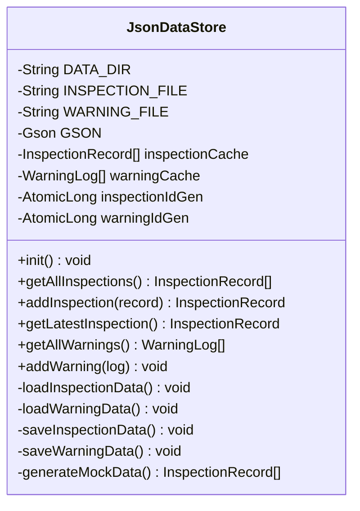

**图表来源**
- [JsonDataStore.java:20-221](file://src/main/java/com/zjzy/quality/util/JsonDataStore.java#L20-L221)

**章节来源**
- [JsonDataStore.java:20-221](file://src/main/java/com/zjzy/quality/util/JsonDataStore.java#L20-L221)

### SPCAnalysisService（SPC分析）
- 分析对象：吸阻、单支重量、圆周三项物测指标
- 方法：analyzeAll()返回三者SPCResult
- 核心算法：Nelson八条规则，区分严重异常（红色）与轻微偏离（黄色）
- 输出：values、center、ucl、lcl、severe/mild异常点索引与描述

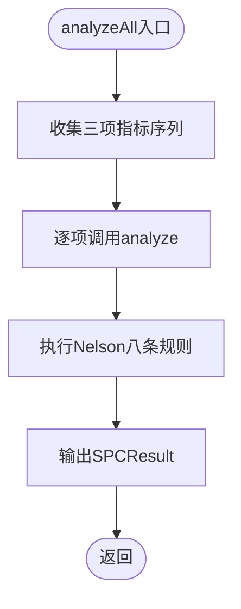

**图表来源**
- [SPCAnalysisService.java:45-74](file://src/main/java/com/zjzy/quality/service/SPCAnalysisService.java#L45-L74)

**章节来源**
- [SPCAnalysisService.java:14-240](file://src/main/java/com/zjzy/quality/service/SPCAnalysisService.java#L14-L240)
- [DefectConstants.java:20-42](file://src/main/java/com/zjzy/quality/constant/DefectConstants.java#L20-L42)

### PredictionService（AI预测）
- 输入：历史质检记录（按日汇总）
- 处理：按日汇总总抽检、总缺陷、A/B类缺陷，计算不良率
- 方法：Holt双参数指数平滑拟合历史，预测未来7天
- 输出：历史日期与不良率、预测日期与上下界、是否存在批量风险提示

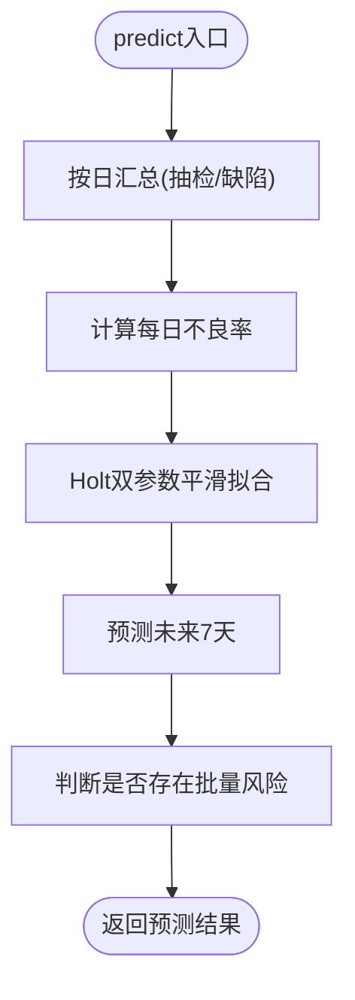

**图表来源**
- [PredictionService.java:50-159](file://src/main/java/com/zjzy/quality/service/PredictionService.java#L50-L159)

**章节来源**
- [PredictionService.java:14-168](file://src/main/java/com/zjzy/quality/service/PredictionService.java#L14-L168)

### 控制器层（REST接口）
- InspectionController
  - POST /api/inspection/submit：提交质检数据
  - GET /api/inspection/list：查询历史数据
- ChartController
  - GET /api/chart/defect：缺陷分析（饼图+折线图）
  - GET /api/chart/spc：SPC分析
  - GET /api/chart/predict：AI预测
- WarningController
  - GET /api/warning/banner：当前风险横幅状态
  - GET /api/warning/logs：全部预警日志

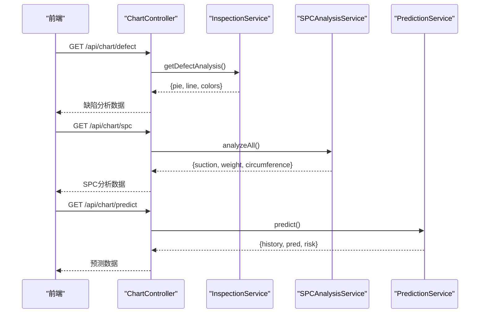

**图表来源**
- [ChartController.java:76-104](file://src/main/java/com/zjzy/quality/controller/ChartController.java#L76-L104)
- [InspectionService.java:56-100](file://src/main/java/com/zjzy/quality/service/InspectionService.java#L56-L100)
- [SPCAnalysisService.java:45-74](file://src/main/java/com/zjzy/quality/service/SPCAnalysisService.java#L45-L74)
- [PredictionService.java:50-159](file://src/main/java/com/zjzy/quality/service/PredictionService.java#L50-L159)

**章节来源**
- [InspectionController.java:13-34](file://src/main/java/com/zjzy/quality/controller/InspectionController.java#L13-L34)
- [ChartController.java:17-104](file://src/main/java/com/zjzy/quality/controller/ChartController.java#L17-L104)
- [WarningController.java:16-37](file://src/main/java/com/zjzy/quality/controller/WarningController.java#L16-L37)

## 依赖关系分析
- 组件耦合
  - InspectionService依赖JsonDataStore与WarningService，承担提交流程编排
  - WarningService依赖JsonDataStore与DefectConstants，负责预警判定与日志写入
  - ChartController依赖InspectionService、SPCAnalysisService、PredictionService提供图表数据
  - JsonDataStore作为底层存储，被多个服务共享
- 外部依赖
  - Spring Boot（Web框架）
  - Gson（JSON序列化）
  - 前端Plotly.js（图表渲染）

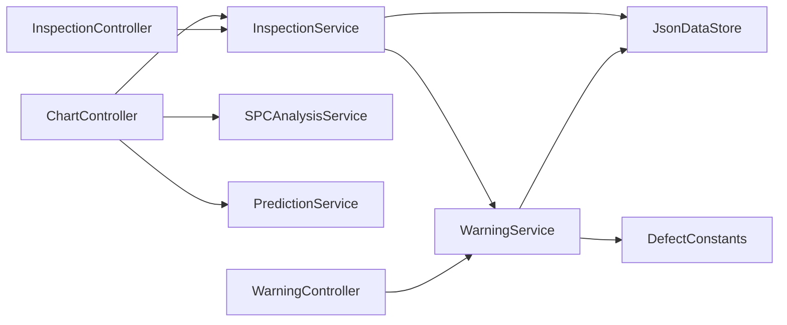

**图表来源**
- [InspectionService.java:12-101](file://src/main/java/com/zjzy/quality/service/InspectionService.java#L12-L101)
- [WarningService.java:15-139](file://src/main/java/com/zjzy/quality/service/WarningService.java#L15-L139)
- [ChartController.java:17-104](file://src/main/java/com/zjzy/quality/controller/ChartController.java#L17-L104)
- [InspectionController.java:13-34](file://src/main/java/com/zjzy/quality/controller/InspectionController.java#L13-L34)
- [WarningController.java:16-37](file://src/main/java/com/zjzy/quality/controller/WarningController.java#L16-L37)
- [JsonDataStore.java:20-221](file://src/main/java/com/zjzy/quality/util/JsonDataStore.java#L20-L221)
- [DefectConstants.java:7-75](file://src/main/java/com/zjzy/quality/constant/DefectConstants.java#L7-L75)

**章节来源**
- [InspectionService.java:12-101](file://src/main/java/com/zjzy/quality/service/InspectionService.java#L12-L101)
- [WarningService.java:15-139](file://src/main/java/com/zjzy/quality/service/WarningService.java#L15-L139)
- [JsonDataStore.java:20-221](file://src/main/java/com/zjzy/quality/util/JsonDataStore.java#L20-L221)

## 性能考虑
- 内存缓存
  - JsonDataStore维护inspectionCache与warningCache，减少频繁IO
- 并发安全
  - 关键方法使用synchronized，保证并发读写一致性
- 序列化开销
  - 使用GsonBuilder配置pretty printing与日期格式，兼顾可读性与性能
- 预测与分析复杂度
  - SPC分析O(n)扫描Nelson规则；预测Holt平滑O(n)；缺陷分析O(n)
- I/O优化
  - 初始化阶段一次性加载/生成数据，运行期只做增量更新

[本节为通用性能讨论，不直接分析具体文件]

## 故障排除指南
- 启动失败
  - 检查application.yml端口占用与静态资源路径
  - 确认data目录可写权限
- 数据异常
  - 检查inspection_data.json与warning_log.json格式是否正确
  - 如文件损坏，删除后重启将自动生成Mock数据
- 预警不生效
  - 核对DefectConstants中的阈值与内控限是否符合预期
  - 确认WarningService.judge逻辑与writeWarningLogs执行路径
- 图表数据缺失
  - 确认ChartController接口可用且前端正确调用
  - 检查InspectionService.getDefectAnalysis与SPCAnalysisService.analyzeAll返回结构

**章节来源**
- [application.yml:1-24](file://src/main/resources/application.yml#L1-L24)
- [JsonDataStore.java:46-62](file://src/main/java/com/zjzy/quality/util/JsonDataStore.java#L46-L62)
- [WarningService.java:105-121](file://src/main/java/com/zjzy/quality/service/WarningService.java#L105-L121)
- [DefectConstants.java:7-75](file://src/main/java/com/zjzy/quality/constant/DefectConstants.java#L7-L75)

## 结论
本模块以清晰的分层架构实现了质检数据的提交、预警、分析与预测功能，具备良好的扩展性与可维护性。通过常量集中管理与Mock数据机制，降低了部署与测试成本；通过SPC与预测算法，提升了质量管理的智能化水平。

[本节为总结性内容，不直接分析具体文件]

## 附录

### 接口与数据结构说明

- 提交质检数据（POST /api/inspection/submit）
  - 请求体：InspectionRecord（见实体字段定义）
  - 成功响应：包含success、riskLevel、bannerText、bannerColor、warnings、message
  - 错误处理：内部捕获异常并返回友好提示

- 查询历史数据（GET /api/inspection/list）
  - 响应：List<InspectionRecord>

- 缺陷分析数据（GET /api/chart/defect）
  - 响应：
    - pie：{a: sumA, b: sumB, c: sumC, d: sumD}
    - line：{labels: [日期 班次...], a: [...], b: [...], c: [...], d: [...]}
    - colorA/B/C/D：配色常量

- SPC分析数据（GET /api/chart/spc）
  - 响应：
    - suction/weight/circumference：{label, values, center, ucl, lcl, severe, mild}

- AI预测数据（GET /api/chart/predict）
  - 响应：
    - historyDates/historyRates/predDates/predYhat/predUpper/predLower
    - hasRisk/riskMsg

- 当前风险横幅（GET /api/warning/banner）
  - 响应：{riskLevel, bannerText, bannerColor}

- 预警日志（GET /api/warning/logs）
  - 响应：List<WarningLog>

**章节来源**
- [InspectionController.java:17-33](file://src/main/java/com/zjzy/quality/controller/InspectionController.java#L17-L33)
- [ChartController.java:21-104](file://src/main/java/com/zjzy/quality/controller/ChartController.java#L21-L104)
- [WarningController.java:20-36](file://src/main/java/com/zjzy/quality/controller/WarningController.java#L20-L36)
- [InspectionService.java:56-100](file://src/main/java/com/zjzy/quality/service/InspectionService.java#L56-L100)
- [SPCAnalysisService.java:25-74](file://src/main/java/com/zjzy/quality/service/SPCAnalysisService.java#L25-L74)
- [PredictionService.java:90-103](file://src/main/java/com/zjzy/quality/service/PredictionService.java#L90-L103)
- [WarningService.java:126-138](file://src/main/java/com/zjzy/quality/service/WarningService.java#L126-L138)

### 关键业务逻辑与性能优化策略
- 业务逻辑
  - A/B/C/D四级预警优先级与触发条件明确，日志仅记录A/B/C类
  - 缺陷分析按层级累加，折线图取最近10班次
  - SPC分析严格遵循Nelson规则，区分严重与轻微异常
  - 预测采用Holt双参数平滑，结合近期均值与预测区间判断风险
- 性能优化
  - 内存缓存+增量持久化，避免重复解析大文件
  - 并发方法同步化，保障数据一致性
  - 常量集中管理，便于阈值调整与二次开发

[本节为概念性总结，不直接分析具体文件]