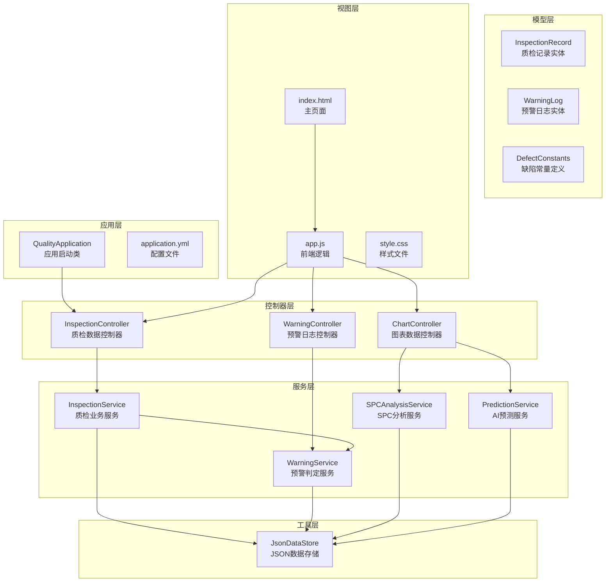
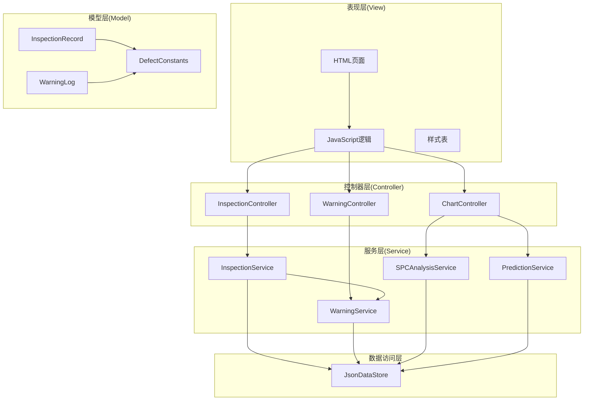
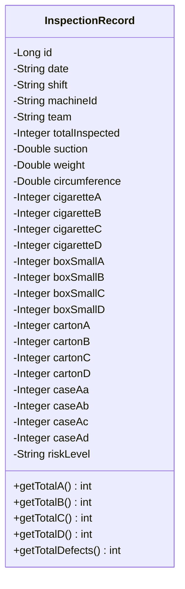
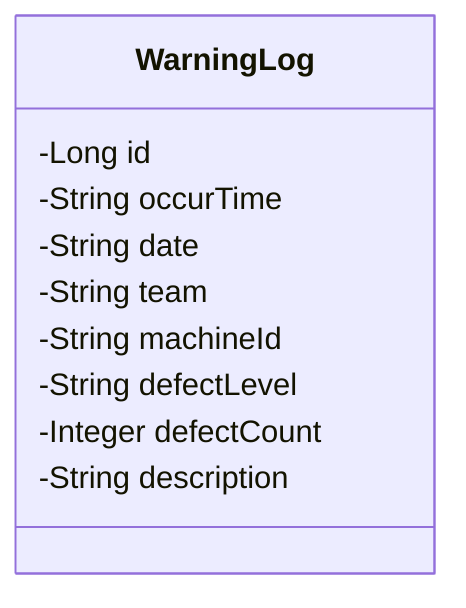
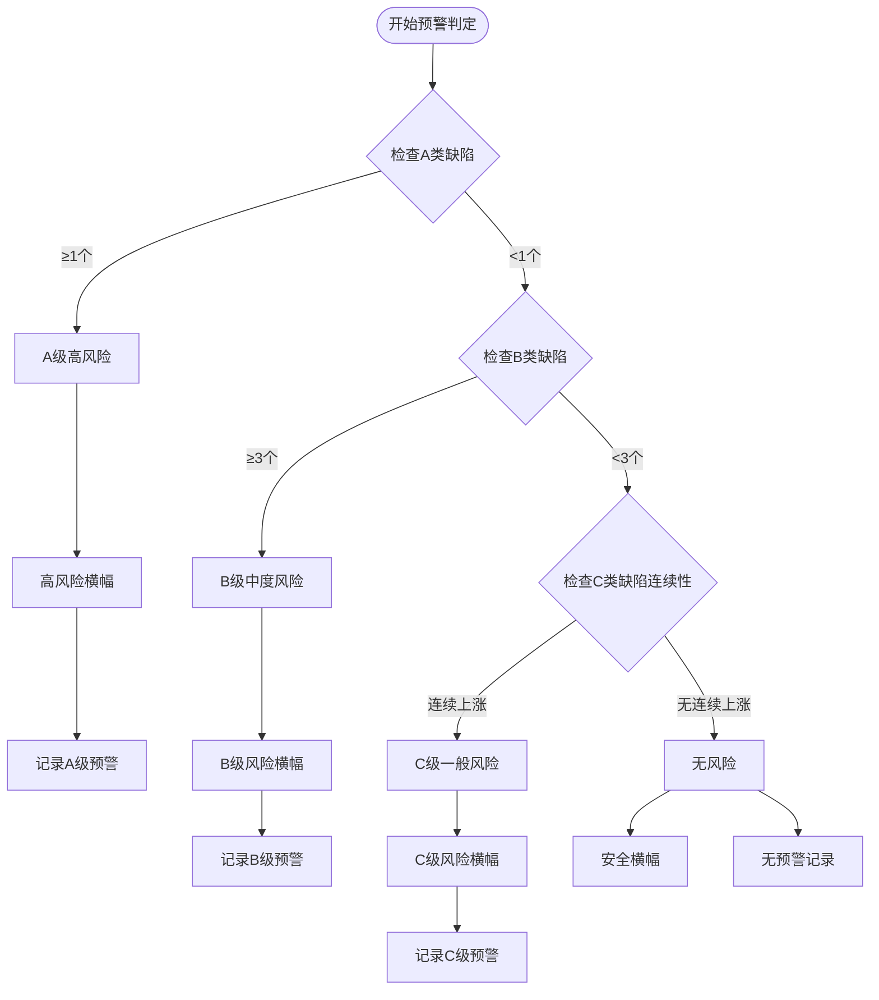
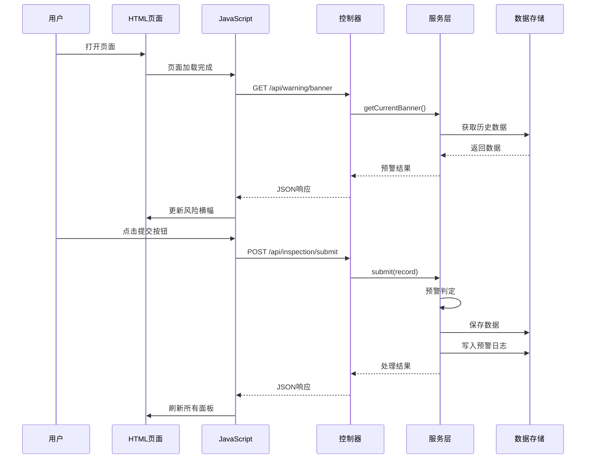
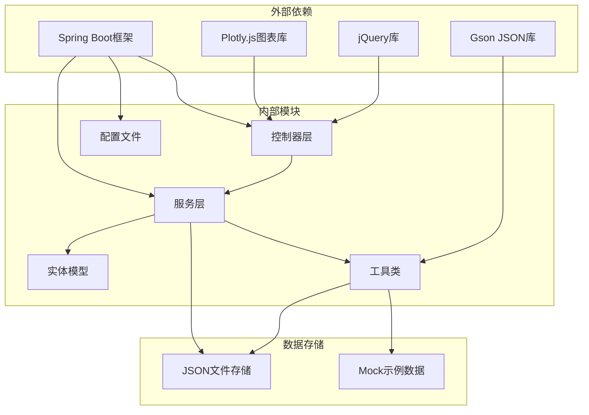

# MVC设计模式

<cite>
**本文档引用的文件**
- [QualityApplication.java](file://src/main/java/com/zjzy/quality/QualityApplication.java)
- [InspectionRecord.java](file://src/main/java/com/zjzy/quality/entity/InspectionRecord.java)
- [WarningLog.java](file://src/main/java/com/zjzy/quality/entity/WarningLog.java)
- [InspectionController.java](file://src/main/java/com/zjzy/quality/controller/InspectionController.java)
- [ChartController.java](file://src/main/java/com/zjzy/quality/controller/ChartController.java)
- [WarningController.java](file://src/main/java/com/zjzy/quality/controller/WarningController.java)
- [InspectionService.java](file://src/main/java/com/zjzy/quality/service/InspectionService.java)
- [WarningService.java](file://src/main/java/com/zjzy/quality/service/WarningService.java)
- [SPCAnalysisService.java](file://src/main/java/com/zjzy/quality/service/SPCAnalysisService.java)
- [PredictionService.java](file://src/main/java/com/zjzy/quality/service/PredictionService.java)
- [JsonDataStore.java](file://src/main/java/com/zjzy/quality/util/JsonDataStore.java)
- [DefectConstants.java](file://src/main/java/com/zjzy/quality/constant/DefectConstants.java)
- [index.html](file://src/main/resources/static/index.html)
- [app.js](file://src/main/resources/static/js/app.js)
- [style.css](file://src/main/resources/static/css/style.css)
- [application.yml](file://src/main/resources/application.yml)
</cite>

## 目录
1. [引言](#引言)
2. [项目结构](#项目结构)
3. [核心组件](#核心组件)
4. [架构概览](#架构概览)
5. [详细组件分析](#详细组件分析)
6. [依赖关系分析](#依赖关系分析)
7. [性能考虑](#性能考虑)
8. [故障排除指南](#故障排除指南)
9. [结论](#结论)

## 引言

本项目是一个基于Spring Boot的卷烟全维度质检智能预警预判系统，采用经典的MVC（Model-View-Controller）架构模式实现。系统通过前后端分离的设计，实现了从数据采集、业务处理到可视化展示的完整质量管理流程。

该系统的核心目标是通过智能化的预警机制，帮助质检人员及时发现生产过程中的质量问题，预防批量性质量事故的发生。系统集成了SPC统计过程控制、AI预测分析等先进技术，为企业数字化转型提供有力支撑。

## 项目结构

项目采用标准的Spring Boot多模块结构，按照MVC分层组织代码：

**图表来源**
- [QualityApplication.java:1-25](file://src/main/java/com/zjzy/quality/QualityApplication.java#L1-L25)
- [InspectionController.java:1-35](file://src/main/java/com/zjzy/quality/controller/InspectionController.java#L1-L35)
- [ChartController.java:1-106](file://src/main/java/com/zjzy/quality/controller/ChartController.java#L1-L106)
- [WarningController.java:1-38](file://src/main/java/com/zjzy/quality/controller/WarningController.java#L1-L38)

**章节来源**
- [QualityApplication.java:1-25](file://src/main/java/com/zjzy/quality/QualityApplication.java#L1-L25)
- [application.yml:1-24](file://src/main/resources/application.yml#L1-L24)

## 核心组件

### Model层（实体模型）

Model层包含两个核心实体类，负责数据的结构化表示和业务规则封装：

#### InspectionRecord实体类
- **职责**：封装完整的质检数据记录
- **关键属性**：日期、班次、机台编号、班组、抽检数量等基本信息
- **物测指标**：吸阻、单支重量、圆周等内在质量指标
- **外观缺陷**：四个层级（烟支、小盒、条盒、箱装）的A、B、C、D类缺陷统计
- **业务方法**：提供各类缺陷的汇总计算方法

#### WarningLog实体类  
- **职责**：记录预警触发的日志信息
- **关键属性**：发生时间、日期、班组、机台、缺陷等级、缺陷数量、描述信息
- **用途**：支持质量追溯和审计需求

**章节来源**
- [InspectionRecord.java:1-154](file://src/main/java/com/zjzy/quality/entity/InspectionRecord.java#L1-L154)
- [WarningLog.java:1-44](file://src/main/java/com/zjzy/quality/entity/WarningLog.java#L1-L44)

### View层（用户界面）

View层采用现代化的前端技术栈，提供直观的用户交互界面：

#### 主页面结构
- **顶部标题区**：显示系统名称和项目信息
- **风险提示横幅**：实时显示当前质量风险状态
- **左侧数据录入面板**：包含基础信息、物测指标、四层外观缺陷的完整录入表单
- **右侧可视化看板**：四个核心功能板块的数据展示

#### 样式设计
- 采用Apple乔布斯极简风格设计语言
- 使用毛玻璃效果、圆角卡片、大留白布局
- 支持响应式设计，适配不同屏幕尺寸

**章节来源**
- [index.html:1-179](file://src/main/resources/static/index.html#L1-L179)
- [style.css:1-336](file://src/main/resources/static/css/style.css#L1-L336)

### Controller层（请求处理）

Controller层作为MVC架构的协调者，负责HTTP请求的接收和响应：

#### InspectionController
- **API接口**：`/api/inspection/submit`（POST）、`/api/inspection/list`（GET）
- **功能**：处理质检数据的提交和查询请求
- **集成**：调用InspectionService完成业务逻辑处理

#### ChartController  
- **API接口**：`/api/chart/spc`（GET）、`/api/chart/defect`（GET）、`/api/chart/predict`（GET）
- **功能**：提供SPC分析、缺陷分析、AI预测等图表数据
- **输出格式**：标准化的JSON数据结构供前端Plotly.js渲染

#### WarningController
- **API接口**：`/api/warning/banner`（GET）、`/api/warning/logs`（GET）
- **功能**：获取当前风险状态和历史预警日志
- **数据源**：直接访问JsonDataStore获取预警数据

**章节来源**
- [InspectionController.java:1-35](file://src/main/java/com/zjzy/quality/controller/InspectionController.java#L1-L35)
- [ChartController.java:1-106](file://src/main/java/com/zjzy/quality/controller/ChartController.java#L1-L106)
- [WarningController.java:1-38](file://src/main/java/com/zjzy/quality/controller/WarningController.java#L1-L38)

### Service层（业务逻辑）

Service层封装了系统的业务规则和数据处理逻辑：

#### InspectionService
- **核心功能**：质检数据提交的完整业务流程编排
- **处理步骤**：数据验证→预警判定→持久化→日志记录→结果返回
- **数据分析**：提供缺陷统计和趋势分析功能

#### WarningService
- **预警判定**：严格的A/B/C/D四级缺陷判定标准
- **风险评估**：基于历史数据的连续性分析
- **日志管理**：将预警信息转换为结构化的日志记录

#### SPCAnalysisService
- **SPC分析**：实现Nelson八条规则的统计过程控制
- **异常检测**：自动识别指标偏移和异常模式
- **可视化支持**：提供前端所需的图表数据格式

#### PredictionService
- **AI预测**：使用Holt双参数指数平滑进行时序预测
- **风险预判**：提前识别潜在的质量风险
- **预测输出**：包含预测区间和风险评估结果

**章节来源**
- [InspectionService.java:1-102](file://src/main/java/com/zjzy/quality/service/InspectionService.java#L1-L102)
- [WarningService.java:1-140](file://src/main/java/com/zjzy/quality/service/WarningService.java#L1-L140)
- [SPCAnalysisService.java:1-241](file://src/main/java/com/zjzy/quality/service/SPCAnalysisService.java#L1-L241)
- [PredictionService.java:1-169](file://src/main/java/com/zjzy/quality/service/PredictionService.java#L1-L169)

## 架构概览

系统采用分层架构设计，各层职责明确，耦合度低：

**图表来源**
- [app.js:1-420](file://src/main/resources/static/js/app.js#L1-L420)
- [InspectionController.java:1-35](file://src/main/java/com/zjzy/quality/controller/InspectionController.java#L1-L35)
- [ChartController.java:1-106](file://src/main/java/com/zjzy/quality/controller/ChartController.java#L1-L106)
- [WarningController.java:1-38](file://src/main/java/com/zjzy/quality/controller/WarningController.java#L1-L38)

## 详细组件分析

### 数据模型设计

#### InspectionRecord实体设计
InspectionRecord采用了完整的数据建模策略：

**图表来源**
- [InspectionRecord.java:7-154](file://src/main/java/com/zjzy/quality/entity/InspectionRecord.java#L7-L154)

**业务规则封装**：
- 缺陷统计方法：提供A、B、C、D各级别的汇总计算
- 安全处理：空值检查和默认值处理
- 风险等级：通过setter方法设置计算后的风险等级

#### WarningLog实体设计
WarningLog专注于预警场景的数据建模：

**图表来源**
- [WarningLog.java:7-44](file://src/main/java/com/zjzy/quality/entity/WarningLog.java#L7-L44)

### 预警判定机制

WarningService实现了严格的四级预警判定体系：

**图表来源**
- [WarningService.java:23-99](file://src/main/java/com/zjzy/quality/service/WarningService.java#L23-L99)

**预警规则特点**：
- A类缺陷：任意层级A类缺陷≥1即触发高风险
- B类缺陷：所有层级B类缺陷合计≥3触发中度风险  
- C类缺陷：连续N班次C类总数严格递增触发一般风险
- D类缺陷：仅统计不预警

### 前端交互流程

前端采用jQuery + Plotly.js的技术组合，实现动态数据展示：

**图表来源**
- [app.js:28-74](file://src/main/resources/static/js/app.js#L28-L74)
- [InspectionController.java:21-24](file://src/main/java/com/zjzy/quality/controller/InspectionController.java#L21-L24)
- [InspectionService.java:19-44](file://src/main/java/com/zjzy/quality/service/InspectionService.java#L19-L44)

**章节来源**
- [app.js:1-420](file://src/main/resources/static/js/app.js#L1-L420)
- [InspectionController.java:1-35](file://src/main/java/com/zjzy/quality/controller/InspectionController.java#L1-L35)
- [WarningService.java:126-138](file://src/main/java/com/zjzy/quality/service/WarningService.java#L126-L138)

## 依赖关系分析

系统采用松耦合的设计原则，通过清晰的接口边界实现模块间的协作：

**图表来源**
- [JsonDataStore.java:26-29](file://src/main/java/com/zjzy/quality/util/JsonDataStore.java#L26-L29)
- [QualityApplication.java:3](file://src/main/java/com/zjzy/quality/QualityApplication.java#L3))

**依赖特点**：
- **框架依赖**：Spring Boot提供Web容器和依赖注入
- **序列化依赖**：Gson用于JSON数据的序列化和反序列化
- **前端依赖**：Plotly.js和jQuery提供丰富的可视化和交互能力
- **数据持久化**：采用JSON文件存储，便于部署和迁移

**章节来源**
- [JsonDataStore.java:1-222](file://src/main/java/com/zjzy/quality/util/JsonDataStore.java#L1-L222)
- [DefectConstants.java:1-76](file://src/main/java/com/zjzy/quality/constant/DefectConstants.java#L1-L76)

## 性能考虑

### 数据存储优化
- **内存缓存**：JsonDataStore采用内存缓存机制，减少磁盘I/O操作
- **原子ID生成**：使用AtomicLong确保并发环境下的ID唯一性
- **延迟初始化**：按需加载数据，启动时间优化

### 前端性能优化
- **懒加载策略**：图表按需加载，提升页面初始渲染速度
- **数据缓存**：前端对API响应进行缓存，减少重复请求
- **响应式设计**：优化移动端浏览体验

### 业务处理优化
- **批量处理**：SPC分析和预测计算采用批量处理模式
- **算法优化**：预警判定算法时间复杂度O(n)，适合大数据量场景
- **异步处理**：日志写入采用异步方式，不影响主线程性能

## 故障排除指南

### 常见问题及解决方案

#### 启动问题
**现象**：应用无法正常启动
**原因**：数据文件损坏或权限不足
**解决**：删除data目录下的JSON文件，重启应用自动生成新文件

#### 数据提交失败
**现象**：前端提交数据后无响应
**原因**：网络连接异常或API接口不可用
**解决**：检查浏览器开发者工具的Network标签，确认API响应状态码

#### 图表显示异常
**现象**：SPC图表或预测图表无法正常显示
**原因**：数据不足或前端依赖库加载失败
**解决**：确认至少有2条历史数据，检查CDN连接是否正常

#### 预警判定不准确
**现象**：预警结果与预期不符
**原因**：缺陷阈值设置不当或数据格式错误
**解决**：检查DefectConstants中的阈值配置，确认数据格式符合要求

**章节来源**
- [JsonDataStore.java:46-62](file://src/main/java/com/zjzy/quality/util/JsonDataStore.java#L46-L62)
- [DefectConstants.java:11-18](file://src/main/java/com/zjzy/quality/constant/DefectConstants.java#L11-L18)

## 结论

本项目成功实现了基于MVC架构的卷烟质检预警系统，展现了良好的软件工程实践：

### 架构优势
- **层次清晰**：MVC分层明确，职责边界清晰
- **扩展性强**：模块化设计便于功能扩展和维护
- **用户体验佳**：现代化的前端界面和丰富的可视化展示

### 技术亮点
- **智能化预警**：结合统计分析和机器学习的双重预警机制
- **实时监控**：支持实时数据更新和动态图表展示
- **数据驱动**：完整的数据采集、处理、分析、展示闭环

### 应用价值
该系统为企业质量管理提供了强有力的技术支撑，通过智能化的预警机制，能够有效预防质量事故的发生，提升产品质量和生产效率。系统的模块化设计也为后续的功能扩展和技术升级奠定了良好基础。