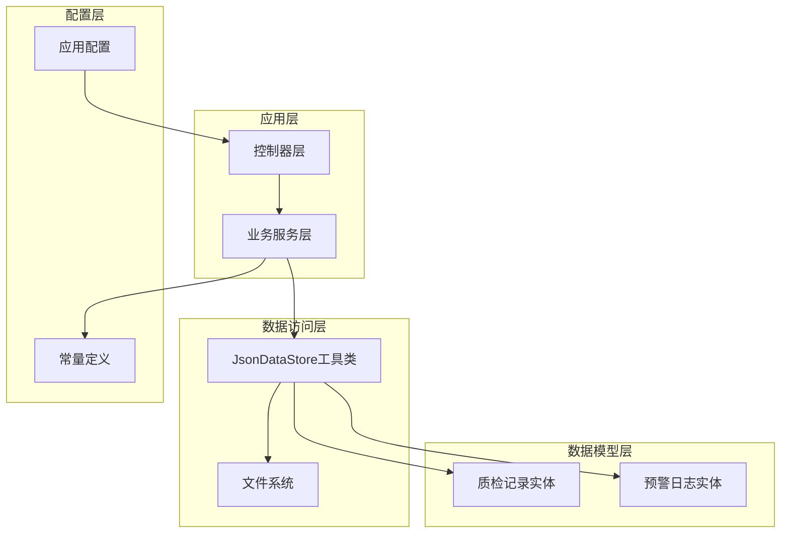
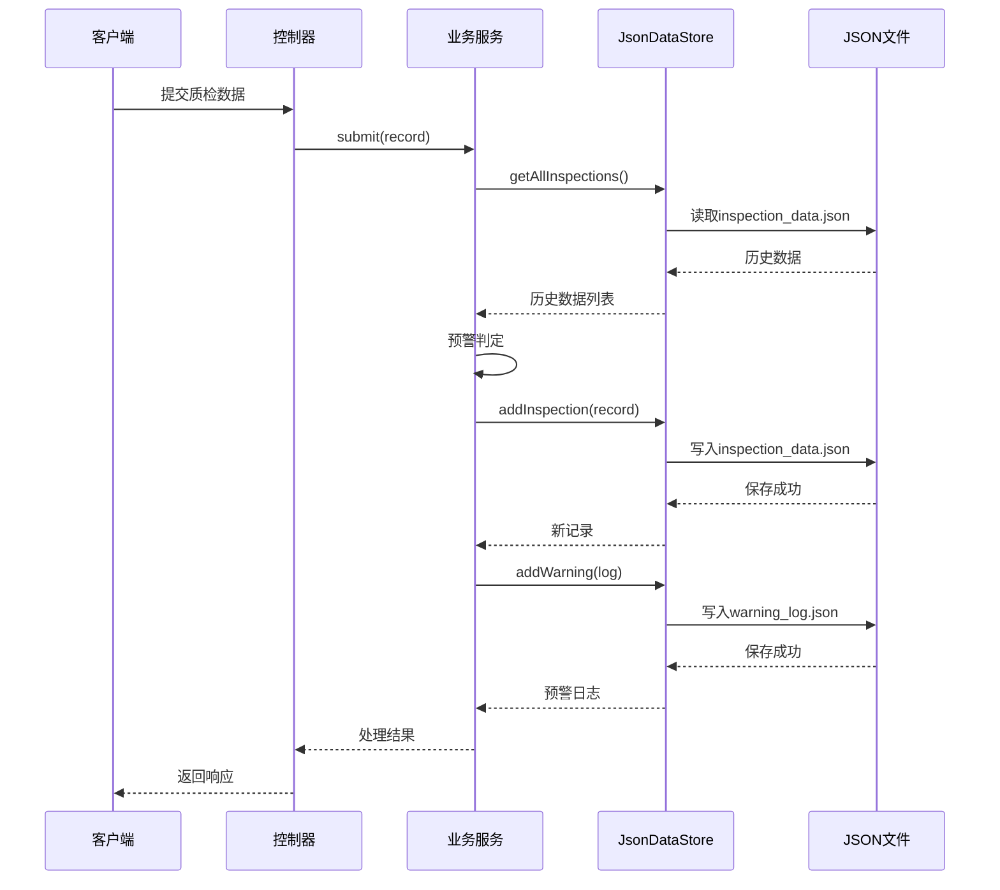
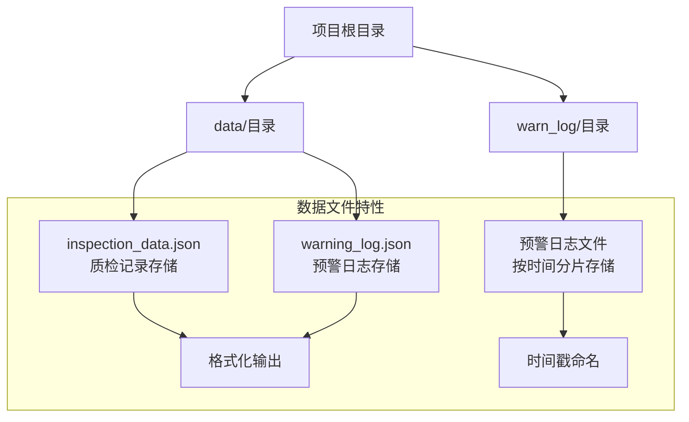
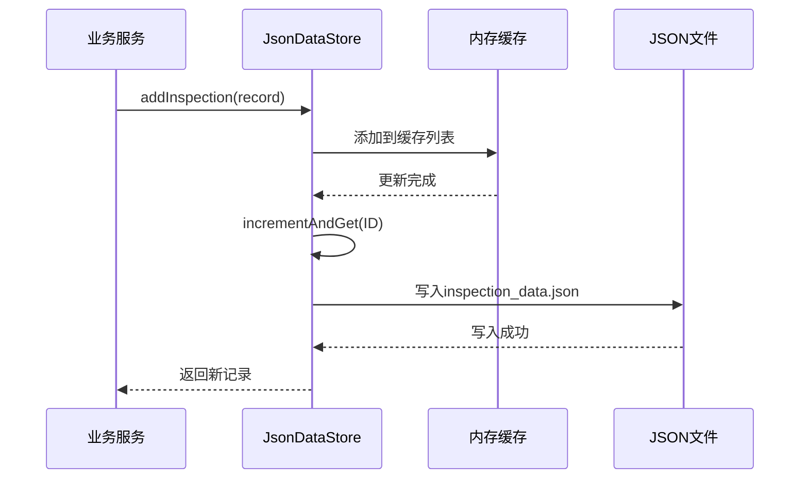
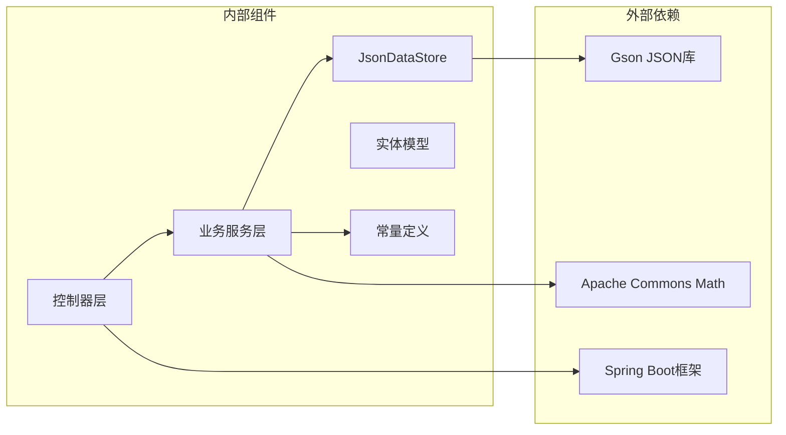

# 数据持久化方案

<cite>
**本文档引用的文件**
- [JsonDataStore.java](file://src/main/java/com/zjzy/quality/util/JsonDataStore.java)
- [InspectionRecord.java](file://src/main/java/com/zjzy/quality/entity/InspectionRecord.java)
- [WarningLog.java](file://src/main/java/com/zjzy/quality/entity/WarningLog.java)
- [InspectionService.java](file://src/main/java/com/zjzy/quality/service/InspectionService.java)
- [WarningService.java](file://src/main/java/com/zjzy/quality/service/WarningService.java)
- [DefectConstants.java](file://src/main/java/com/zjzy/quality/constant/DefectConstants.java)
- [InspectionController.java](file://src/main/java/com/zjzy/quality/controller/InspectionController.java)
- [WarningController.java](file://src/main/java/com/zjzy/quality/controller/WarningController.java)
- [application.yml](file://src/main/resources/application.yml)
- [pom.xml](file://pom.xml)
- [QualityApplication.java](file://src/main/java/com/zjzy/quality/QualityApplication.java)
</cite>

## 目录
1. [引言](#引言)
2. [项目结构](#项目结构)
3. [核心组件](#核心组件)
4. [架构概览](#架构概览)
5. [详细组件分析](#详细组件分析)
6. [依赖关系分析](#依赖关系分析)
7. [性能考量](#性能考量)
8. [故障排除指南](#故障排除指南)
9. [结论](#结论)
10. [附录](#附录)

## 引言

卷烟质检预警系统采用基于JSON文件的本地存储机制，为生产环境提供简单可靠的持久化解决方案。该方案通过JsonDataStore工具类实现数据的自动加载、缓存管理和文件持久化，支持质检记录和预警日志的完整生命周期管理。

系统设计的核心理念是在保证数据一致性的前提下，提供简洁高效的本地存储方案，同时为未来的数据库迁移做好准备。通过Mock数据机制，系统可以在首次启动时自动生成示例数据，确保开发和测试环境的快速搭建。

## 项目结构

系统采用典型的Spring Boot三层架构设计，数据持久化层位于util包中，通过独立的工具类实现数据的统一管理。



**图表来源**
- [JsonDataStore.java:1-222](file://src/main/java/com/zjzy/quality/util/JsonDataStore.java#L1-L222)
- [InspectionService.java:1-102](file://src/main/java/com/zjzy/quality/service/InspectionService.java#L1-L102)
- [WarningService.java:1-140](file://src/main/java/com/zjzy/quality/service/WarningService.java#L1-L140)

**章节来源**
- [application.yml:1-24](file://src/main/resources/application.yml#L1-L24)
- [pom.xml:1-77](file://pom.xml#L1-L77)

## 核心组件

### JsonDataStore工具类

JsonDataStore是整个数据持久化系统的核心组件，负责：
- 数据目录的自动创建和管理
- 质检记录和预警日志的内存缓存
- JSON文件的读写操作
- ID生成器的维护
- Mock数据的生成

该工具类采用单例模式，通过synchronized关键字确保线程安全性，使用Gson库进行JSON序列化和反序列化。

**章节来源**
- [JsonDataStore.java:15-62](file://src/main/java/com/zjzy/quality/util/JsonDataStore.java#L15-L62)

### 数据实体模型

系统包含两个核心数据实体：

**质检记录实体**包含完整的质检数据字段，涵盖内在质量指标和外观缺陷统计：
- 内在质量指标：吸阻、单支重量、圆周等
- 外观缺陷分类：烟支、小盒、条盒、箱装四个层级的A、B、C、D类缺陷
- 班次信息：日期、班次、机台编号、班组
- 风险等级标识

**预警日志实体**专注于预警信息的记录：
- 预警发生时间
- 质检基本信息（日期、班组、机台）
- 缺陷等级和数量
- 预警描述信息

**章节来源**
- [InspectionRecord.java:1-154](file://src/main/java/com/zjzy/quality/entity/InspectionRecord.java#L1-L154)
- [WarningLog.java:1-44](file://src/main/java/com/zjzy/quality/entity/WarningLog.java#L1-L44)

## 架构概览

系统采用分层架构设计，数据持久化层与业务逻辑层完全解耦，通过清晰的接口进行交互。



**图表来源**
- [InspectionController.java:21-24](file://src/main/java/com/zjzy/quality/controller/InspectionController.java#L21-L24)
- [InspectionService.java:20-44](file://src/main/java/com/zjzy/quality/service/InspectionService.java#L20-L44)
- [JsonDataStore.java:70-92](file://src/main/java/com/zjzy/quality/util/JsonDataStore.java#L70-L92)

## 详细组件分析

### 数据目录结构设计

系统采用两级目录结构来组织数据文件：



**图表来源**
- [JsonDataStore.java:22-24](file://src/main/java/com/zjzy/quality/util/JsonDataStore.java#L22-L24)

每个数据文件都采用格式化输出，便于人工阅读和调试。系统会自动创建缺失的目录结构，确保运行时的可靠性。

**章节来源**
- [JsonDataStore.java:46-62](file://src/main/java/com/zjzy/quality/util/JsonDataStore.java#L46-L62)

### 数据读写操作流程

#### 初始化流程

系统启动时的完整初始化过程如下：

```mermaid
flowchart TD
Start([系统启动]) --> InitStore[调用JsonDataStore.init()]
InitStore --> CheckDir{检查data目录}
CheckDir --> |不存在| CreateDir[创建data目录]
CheckDir --> |存在| LoadData[加载历史数据]
CreateDir --> LoadData
LoadData --> LoadInspection[加载质检数据]
LoadData --> LoadWarning[加载预警数据]
LoadInspection --> CheckHistory{历史数据为空?}
CheckHistory --> |是| GenerateMock[生成Mock数据]
CheckHistory --> |否| SetIdGen[设置ID生成器]
GenerateMock --> SaveInspection[保存Mock数据]
SaveInspection --> SetIdGen
SetIdGen --> Complete[初始化完成]
LoadWarning --> Complete
```

**图表来源**
- [JsonDataStore.java:46-62](file://src/main/java/com/zjzy/quality/util/JsonDataStore.java#L46-L62)
- [JsonDataStore.java:153-220](file://src/main/java/com/zjzy/quality/util/JsonDataStore.java#L153-L220)

#### 数据写入流程

每次数据写入都遵循严格的事务性原则：



**图表来源**
- [JsonDataStore.java:70-75](file://src/main/java/com/zjzy/quality/util/JsonDataStore.java#L70-L75)
- [JsonDataStore.java:135-141](file://src/main/java/com/zjzy/quality/util/JsonDataStore.java#L135-L141)

### 数据一致性保障机制

系统通过以下机制确保数据一致性：

1. **内存缓存同步**：所有读写操作都先更新内存缓存，再持久化到文件
2. **原子性操作**：使用synchronized关键字确保方法级别的原子性
3. **ID生成器**：独立的AtomicLong确保ID的唯一性和连续性
4. **错误处理**：完善的异常捕获和降级处理机制

**章节来源**
- [JsonDataStore.java:31-37](file://src/main/java/com/zjzy/quality/util/JsonDataStore.java#L31-L37)
- [JsonDataStore.java:109-112](file://src/main/java/com/zjzy/quality/util/JsonDataStore.java#L109-L112)

## 依赖关系分析

系统采用松耦合的设计，各组件之间的依赖关系清晰明确：



**图表来源**
- [pom.xml:30-65](file://pom.xml#L30-L65)
- [JsonDataStore.java:3](file://src/main/java/com/zjzy/quality/util/JsonDataStore.java#L3)

**章节来源**
- [pom.xml:30-65](file://pom.xml#L30-L65)

## 性能考量

### 内存使用优化

系统采用内存缓存策略，在内存中维护完整的数据集，避免频繁的文件I/O操作。对于大规模数据场景，需要考虑内存使用情况和垃圾回收影响。

### 并发访问处理

通过synchronized关键字和原子操作确保多线程环境下的数据安全。对于高并发场景，可以考虑引入更细粒度的锁机制或异步写入策略。

### 文件I/O性能

- 使用BufferedReader/BufferedWriter减少磁盘I/O次数
- JSON文件格式便于人类阅读和调试
- 大文件时考虑分片存储策略

## 故障排除指南

### 常见问题及解决方案

**数据无法加载**
- 检查data目录权限
- 验证JSON文件格式正确性
- 查看控制台异常信息

**数据丢失问题**
- 立即停止系统运行
- 检查文件系统完整性
- 联系系统管理员

**性能问题**
- 监控内存使用情况
- 考虑数据分页加载
- 优化查询条件

**章节来源**
- [JsonDataStore.java:109-112](file://src/main/java/com/zjzy/quality/util/JsonDataStore.java#L109-L112)
- [JsonDataStore.java:129-131](file://src/main/java/com/zjzy/quality/util/JsonDataStore.java#L129-L131)

## 结论

基于JSON文件的本地存储方案为卷烟质检预警系统提供了简单可靠的数据持久化解决方案。该方案具有以下优势：

1. **实现简单**：无需复杂的数据库配置和维护
2. **成本低廉**：零运维成本，适合中小规模应用
3. **易于调试**：JSON格式便于人工检查和修改
4. **可移植性强**：纯文件存储，便于备份和迁移

同时，该方案也存在一定的局限性：
- 大数据量时性能受限
- 缺乏复杂查询能力
- 并发访问需要额外考虑
- 数据备份和恢复相对简单

对于未来的发展，建议在保持现有功能的基础上，逐步引入数据库支持，实现从JSON存储到关系型数据库的平滑迁移。

## 附录

### 数据备份和恢复策略

**定期备份策略**
- 建议每日定时备份data目录
- 使用压缩格式减少存储空间
- 将备份文件存储在不同位置

**灾难恢复流程**
1. 停止系统运行
2. 备份当前损坏的数据文件
3. 从最近的备份恢复
4. 验证数据完整性
5. 重新启动系统

**章节来源**
- [JsonDataStore.java:48-51](file://src/main/java/com/zjzy/quality/util/JsonDataStore.java#L48-L51)

### 扩展性考虑

系统设计充分考虑了扩展需求：
- 接口设计支持数据库迁移
- 配置化常量便于参数调整
- 模块化设计便于功能扩展