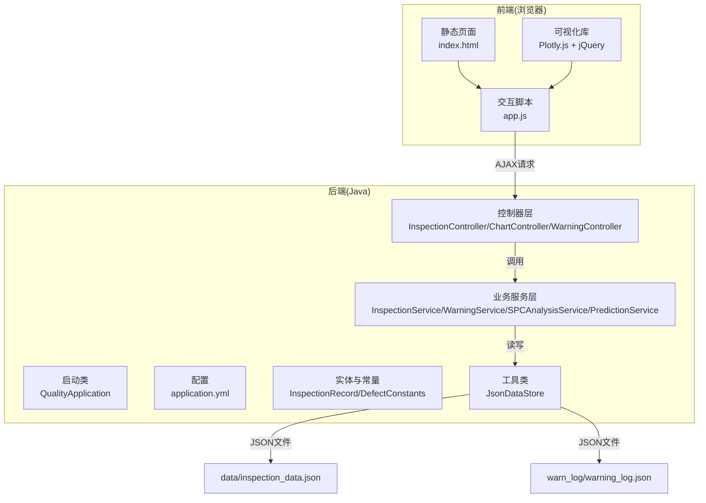
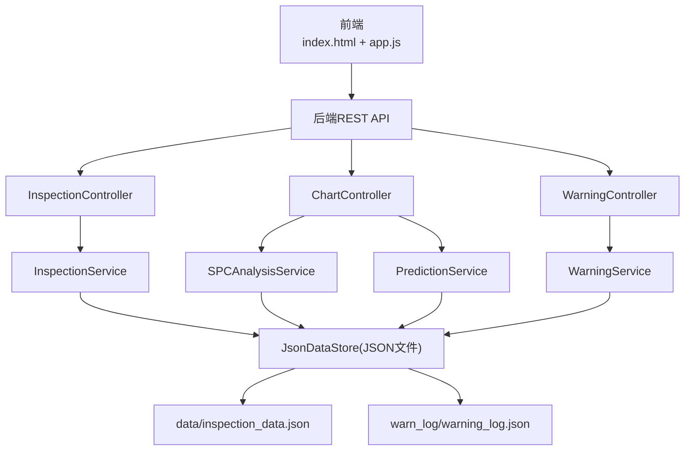
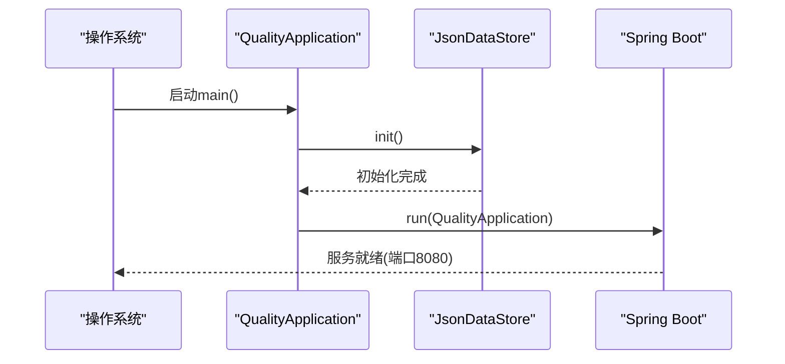
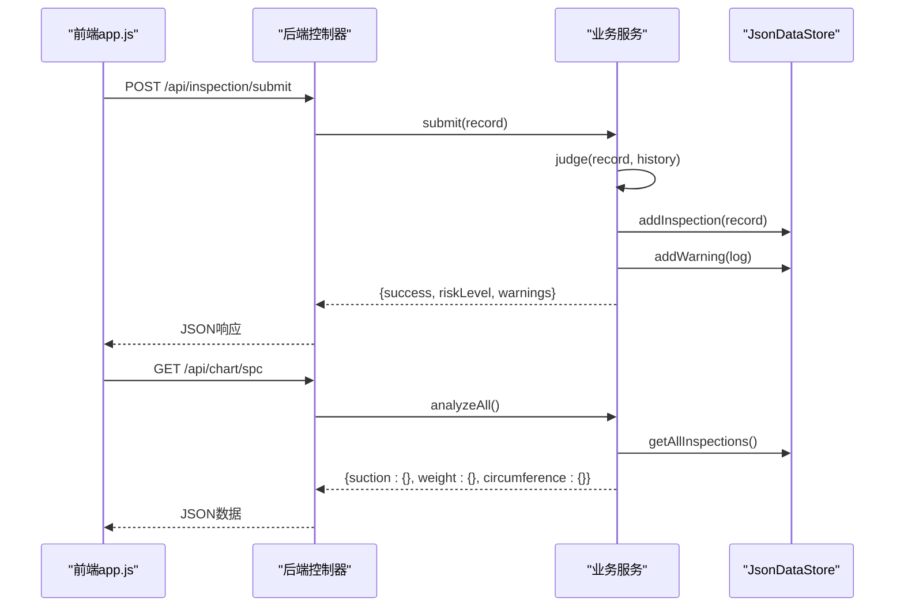
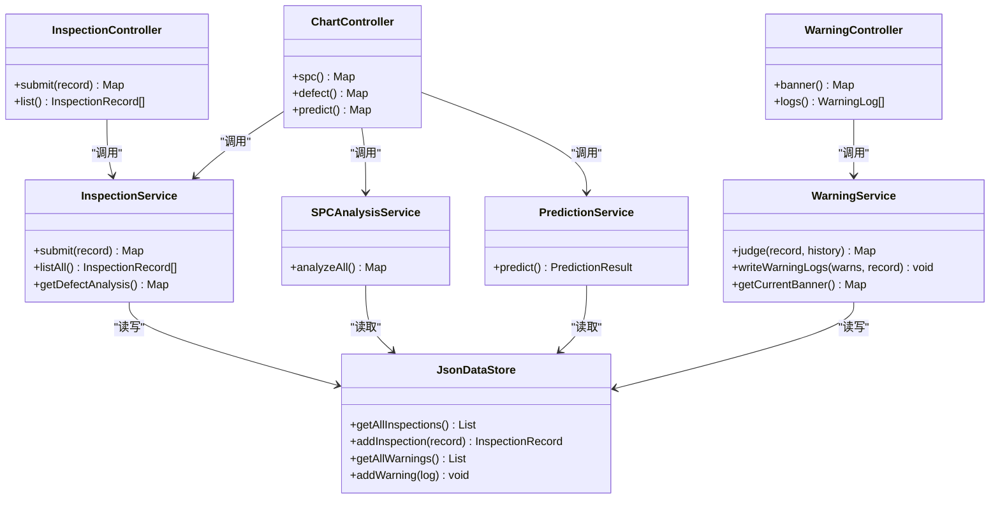
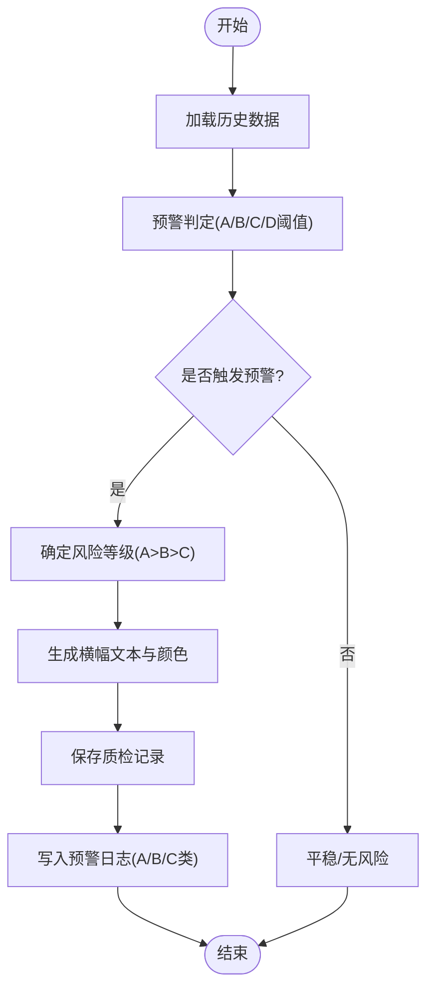
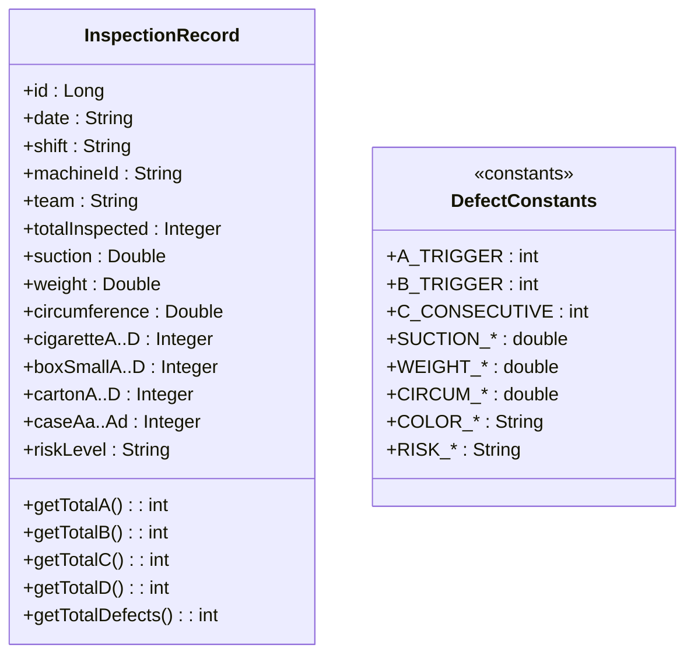
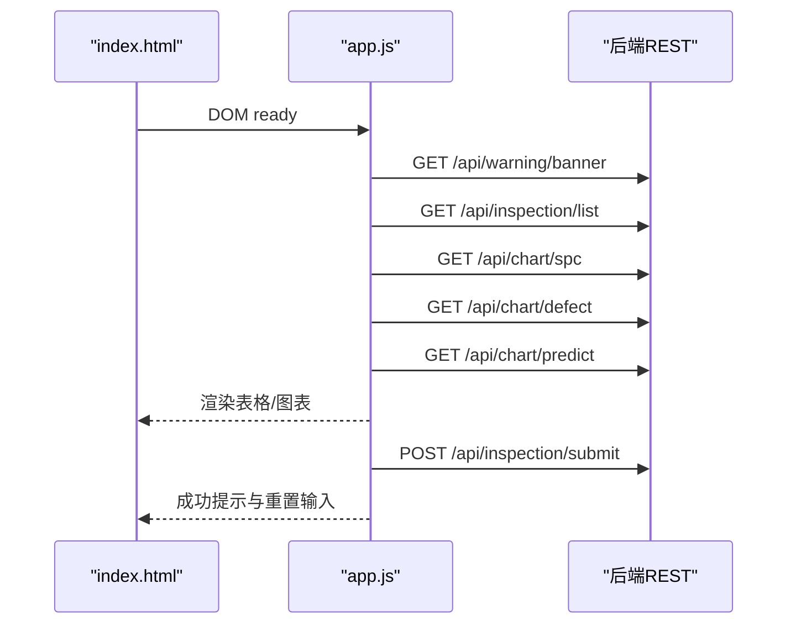
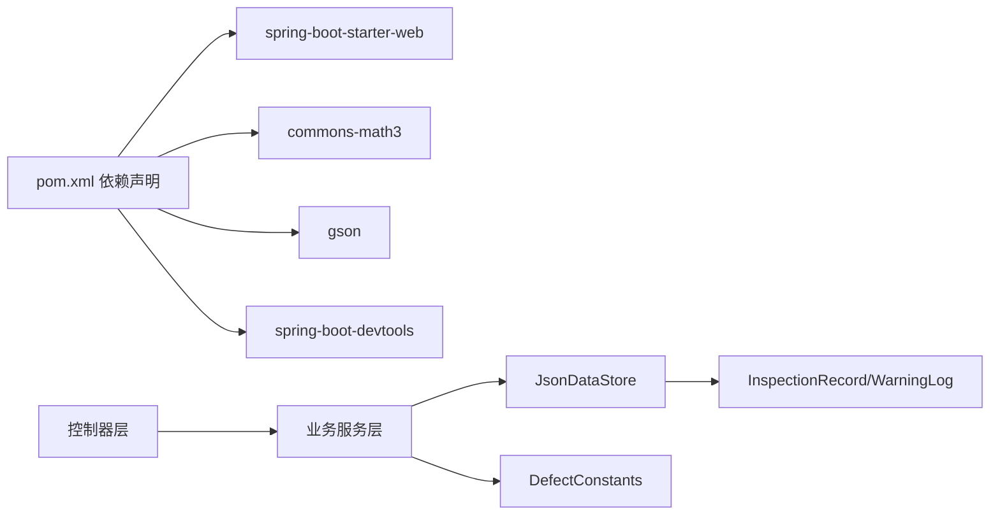

# 整体架构设计

<cite>
**本文档引用的文件**
- [QualityApplication.java](file://src/main/java/com/zjzy/quality/QualityApplication.java)
- [application.yml](file://src/main/resources/application.yml)
- [pom.xml](file://pom.xml)
- [index.html](file://src/main/resources/static/index.html)
- [app.js](file://src/main/resources/static/js/app.js)
- [InspectionController.java](file://src/main/java/com/zjzy/quality/controller/InspectionController.java)
- [ChartController.java](file://src/main/java/com/zjzy/quality/controller/ChartController.java)
- [WarningController.java](file://src/main/java/com/zjzy/quality/controller/WarningController.java)
- [InspectionService.java](file://src/main/java/com/zjzy/quality/service/InspectionService.java)
- [WarningService.java](file://src/main/java/com/zjzy/quality/service/WarningService.java)
- [SPCAnalysisService.java](file://src/main/java/com/zjzy/quality/service/SPCAnalysisService.java)
- [PredictionService.java](file://src/main/java/com/zjzy/quality/service/PredictionService.java)
- [JsonDataStore.java](file://src/main/java/com/zjzy/quality/util/JsonDataStore.java)
- [InspectionRecord.java](file://src/main/java/com/zjzy/quality/entity/InspectionRecord.java)
- [DefectConstants.java](file://src/main/java/com/zjzy/quality/constant/DefectConstants.java)
</cite>

## 目录
1. [引言](#引言)
2. [项目结构](#项目结构)
3. [核心组件](#核心组件)
4. [架构总览](#架构总览)
5. [详细组件分析](#详细组件分析)
6. [依赖关系分析](#依赖关系分析)
7. [性能考虑](#性能考虑)
8. [故障排除指南](#故障排除指南)
9. [结论](#结论)

## 引言
本项目是“卷烟全维度质检智能预警预判系统”，采用前后端分离的全栈架构：后端使用Spring Boot提供REST API，前端使用jQuery与Plotly.js构建可视化界面。系统通过JSON文件实现本地数据持久化，支持SPC统计过程控制、四级缺陷分析与AI预测功能，帮助生产现场进行质量预警与决策。

## 项目结构
项目采用典型的Maven多模块布局，主要由以下层次组成：
- 启动类与配置：Spring Boot启动类与应用配置
- 控制器层：面向前端的REST接口
- 业务服务层：核心业务逻辑与算法实现
- 数据模型与常量：实体类与阈值/配色常量
- 工具类：JSON数据持久化与Mock数据生成
- 前端静态资源：HTML页面与JavaScript交互逻辑

**图表来源**
- [QualityApplication.java:1-25](file://src/main/java/com/zjzy/quality/QualityApplication.java#L1-L25)
- [application.yml:1-24](file://src/main/resources/application.yml#L1-L24)
- [InspectionController.java:1-35](file://src/main/java/com/zjzy/quality/controller/InspectionController.java#L1-L35)
- [ChartController.java:1-106](file://src/main/java/com/zjzy/quality/controller/ChartController.java#L1-L106)
- [WarningController.java:1-38](file://src/main/java/com/zjzy/quality/controller/WarningController.java#L1-L38)
- [InspectionService.java:1-102](file://src/main/java/com/zjzy/quality/service/InspectionService.java#L1-L102)
- [WarningService.java:1-140](file://src/main/java/com/zjzy/quality/service/WarningService.java#L1-L140)
- [SPCAnalysisService.java:1-241](file://src/main/java/com/zjzy/quality/service/SPCAnalysisService.java#L1-L241)
- [PredictionService.java:1-169](file://src/main/java/com/zjzy/quality/service/PredictionService.java#L1-L169)
- [JsonDataStore.java:1-222](file://src/main/java/com/zjzy/quality/util/JsonDataStore.java#L1-L222)
- [index.html:1-179](file://src/main/resources/static/index.html#L1-L179)
- [app.js:1-420](file://src/main/resources/static/js/app.js#L1-L420)

**章节来源**
- [pom.xml:1-77](file://pom.xml#L1-L77)
- [application.yml:1-24](file://src/main/resources/application.yml#L1-L24)

## 核心组件
- 启动类与初始化：负责应用启动与数据存储初始化
- 控制器层：提供REST接口，分别处理质检数据提交、图表数据查询与预警横幅状态
- 业务服务层：包含质检提交编排、预警判定、SPC分析与AI预测
- 数据模型与常量：定义质检记录实体与缺陷分级阈值、物测指标内控限、配色方案
- 工具类：基于Gson的JSON文件持久化，支持Mock数据生成与并发安全的内存缓存
- 前端视图层：HTML页面与jQuery/Plotly.js交互，动态渲染四大看板

**章节来源**
- [QualityApplication.java:1-25](file://src/main/java/com/zjzy/quality/QualityApplication.java#L1-L25)
- [InspectionController.java:1-35](file://src/main/java/com/zjzy/quality/controller/InspectionController.java#L1-L35)
- [ChartController.java:1-106](file://src/main/java/com/zjzy/quality/controller/ChartController.java#L1-L106)
- [WarningController.java:1-38](file://src/main/java/com/zjzy/quality/controller/WarningController.java#L1-L38)
- [InspectionService.java:1-102](file://src/main/java/com/zjzy/quality/service/InspectionService.java#L1-L102)
- [WarningService.java:1-140](file://src/main/java/com/zjzy/quality/service/WarningService.java#L1-L140)
- [SPCAnalysisService.java:1-241](file://src/main/java/com/zjzy/quality/service/SPCAnalysisService.java#L1-L241)
- [PredictionService.java:1-169](file://src/main/java/com/zjzy/quality/service/PredictionService.java#L1-L169)
- [JsonDataStore.java:1-222](file://src/main/java/com/zjzy/quality/util/JsonDataStore.java#L1-L222)
- [InspectionRecord.java:1-154](file://src/main/java/com/zjzy/quality/entity/InspectionRecord.java#L1-L154)
- [DefectConstants.java:1-76](file://src/main/java/com/zjzy/quality/constant/DefectConstants.java#L1-L76)

## 架构总览
系统采用前后端分离的三层架构：
- 前端：jQuery + Plotly.js，负责用户交互与可视化渲染
- 后端：Spring Boot REST API，负责业务编排与数据处理
- 存储：本地JSON文件，便于快速迭代与演示

**图表来源**
- [index.html:1-179](file://src/main/resources/static/index.html#L1-L179)
- [app.js:1-420](file://src/main/resources/static/js/app.js#L1-L420)
- [InspectionController.java:1-35](file://src/main/java/com/zjzy/quality/controller/InspectionController.java#L1-L35)
- [ChartController.java:1-106](file://src/main/java/com/zjzy/quality/controller/ChartController.java#L1-L106)
- [WarningController.java:1-38](file://src/main/java/com/zjzy/quality/controller/WarningController.java#L1-L38)
- [InspectionService.java:1-102](file://src/main/java/com/zjzy/quality/service/InspectionService.java#L1-L102)
- [SPCAnalysisService.java:1-241](file://src/main/java/com/zjzy/quality/service/SPCAnalysisService.java#L1-L241)
- [PredictionService.java:1-169](file://src/main/java/com/zjzy/quality/service/PredictionService.java#L1-L169)
- [WarningService.java:1-140](file://src/main/java/com/zjzy/quality/service/WarningService.java#L1-L140)
- [JsonDataStore.java:1-222](file://src/main/java/com/zjzy/quality/util/JsonDataStore.java#L1-L222)

## 详细组件分析

### 启动与运行机制
- 启动流程：应用启动时先初始化数据存储（加载历史数据或生成Mock），随后启动Spring Boot容器
- 端口配置：默认监听8080端口，上下文路径为根路径
- 静态资源映射：classpath:/static/下的HTML、CSS、JS等静态文件可直接访问

**图表来源**
- [QualityApplication.java:14-23](file://src/main/java/com/zjzy/quality/QualityApplication.java#L14-L23)
- [JsonDataStore.java:46-62](file://src/main/java/com/zjzy/quality/util/JsonDataStore.java#L46-L62)
- [application.yml:4-8](file://src/main/resources/application.yml#L4-L8)

**章节来源**
- [QualityApplication.java:1-25](file://src/main/java/com/zjzy/quality/QualityApplication.java#L1-L25)
- [application.yml:1-24](file://src/main/resources/application.yml#L1-L24)

### 前后端通信协议与数据交换
- 通信协议：HTTP/HTTPS + AJAX
- 数据格式：JSON（请求体/响应体）
- 关键接口：
  - 提交质检数据：POST /api/inspection/submit
  - 查询历史列表：GET /api/inspection/list
  - 获取SPC数据：GET /api/chart/spc
  - 获取缺陷分析：GET /api/chart/defect
  - 获取AI预测：GET /api/chart/predict
  - 获取预警横幅：GET /api/warning/banner
  - 获取预警日志：GET /api/warning/logs

**图表来源**
- [app.js:57-74](file://src/main/resources/static/js/app.js#L57-L74)
- [InspectionController.java:21-24](file://src/main/java/com/zjzy/quality/controller/InspectionController.java#L21-L24)
- [ChartController.java:25-70](file://src/main/java/com/zjzy/quality/controller/ChartController.java#L25-L70)
- [InspectionService.java:19-44](file://src/main/java/com/zjzy/quality/service/InspectionService.java#L19-L44)
- [WarningService.java:23-99](file://src/main/java/com/zjzy/quality/service/WarningService.java#L23-L99)
- [JsonDataStore.java:66-92](file://src/main/java/com/zjzy/quality/util/JsonDataStore.java#L66-L92)

**章节来源**
- [app.js:1-420](file://src/main/resources/static/js/app.js#L1-L420)
- [InspectionController.java:1-35](file://src/main/java/com/zjzy/quality/controller/InspectionController.java#L1-L35)
- [ChartController.java:1-106](file://src/main/java/com/zjzy/quality/controller/ChartController.java#L1-L106)
- [WarningController.java:1-38](file://src/main/java/com/zjzy/quality/controller/WarningController.java#L1-L38)

### 控制器层设计
- InspectionController：处理质检数据提交与历史查询
- ChartController：提供SPC、缺陷分析与AI预测数据接口
- WarningController：提供预警横幅状态与日志查询

**图表来源**
- [InspectionController.java:1-35](file://src/main/java/com/zjzy/quality/controller/InspectionController.java#L1-L35)
- [ChartController.java:1-106](file://src/main/java/com/zjzy/quality/controller/ChartController.java#L1-L106)
- [WarningController.java:1-38](file://src/main/java/com/zjzy/quality/controller/WarningController.java#L1-L38)
- [InspectionService.java:1-102](file://src/main/java/com/zjzy/quality/service/InspectionService.java#L1-L102)
- [SPCAnalysisService.java:1-241](file://src/main/java/com/zjzy/quality/service/SPCAnalysisService.java#L1-L241)
- [PredictionService.java:1-169](file://src/main/java/com/zjzy/quality/service/PredictionService.java#L1-L169)
- [WarningService.java:1-140](file://src/main/java/com/zjzy/quality/service/WarningService.java#L1-L140)
- [JsonDataStore.java:1-222](file://src/main/java/com/zjzy/quality/util/JsonDataStore.java#L1-L222)

**章节来源**
- [InspectionController.java:1-35](file://src/main/java/com/zjzy/quality/controller/InspectionController.java#L1-L35)
- [ChartController.java:1-106](file://src/main/java/com/zjzy/quality/controller/ChartController.java#L1-L106)
- [WarningController.java:1-38](file://src/main/java/com/zjzy/quality/controller/WarningController.java#L1-L38)

### 业务服务层与算法实现
- 预警判定：基于A/B/C/D四级阈值，优先级A>B>C，输出风险等级与横幅样式
- SPC分析：实现Nelson八条规则，区分严重异常（红色X）与轻微偏离（黄色圈），返回UCL/CL/LCL与异常点索引
- AI预测：基于Holt双参数指数平滑，计算未来7天预测区间，结合近期AB类缺陷占比判断是否存在批量风险
- 缺陷分析：饼图展示A/B/C/D总量，折线图展示近10班次趋势，并标注上升段异动

**图表来源**
- [WarningService.java:23-99](file://src/main/java/com/zjzy/quality/service/WarningService.java#L23-L99)
- [InspectionService.java:19-44](file://src/main/java/com/zjzy/quality/service/InspectionService.java#L19-L44)
- [JsonDataStore.java:66-92](file://src/main/java/com/zjzy/quality/util/JsonDataStore.java#L66-L92)

**章节来源**
- [WarningService.java:1-140](file://src/main/java/com/zjzy/quality/service/WarningService.java#L1-L140)
- [SPCAnalysisService.java:1-241](file://src/main/java/com/zjzy/quality/service/SPCAnalysisService.java#L1-L241)
- [PredictionService.java:1-169](file://src/main/java/com/zjzy/quality/service/PredictionService.java#L1-L169)
- [InspectionService.java:1-102](file://src/main/java/com/zjzy/quality/service/InspectionService.java#L1-L102)

### 数据模型与常量
- InspectionRecord：封装完整的质检数据，包含物测指标与四级缺陷计数，提供A/B/C/D合计与总缺陷数计算
- DefectConstants：集中管理缺陷分级阈值、物测指标内控限、风险配色与模块名称映射

**图表来源**
- [InspectionRecord.java:7-154](file://src/main/java/com/zjzy/quality/entity/InspectionRecord.java#L7-L154)
- [DefectConstants.java:7-76](file://src/main/java/com/zjzy/quality/constant/DefectConstants.java#L7-L76)

**章节来源**
- [InspectionRecord.java:1-154](file://src/main/java/com/zjzy/quality/entity/InspectionRecord.java#L1-L154)
- [DefectConstants.java:1-76](file://src/main/java/com/zjzy/quality/constant/DefectConstants.java#L1-L76)

### 前端视图层与交互
- 页面结构：左侧数据录入面板，右侧四大可视化看板（历史表格、SPC、缺陷分析、AI预测）
- 交互逻辑：页面初始化设置默认日期并拉取全部数据；提交按钮将表单序列化为JSON并POST到后端；各看板通过GET请求获取数据并用Plotly渲染
- 可视化：Plotly.js负责响应式图表渲染，支持多子图网格布局与中文本地化

**图表来源**
- [index.html:1-179](file://src/main/resources/static/index.html#L1-L179)
- [app.js:16-83](file://src/main/resources/static/js/app.js#L16-L83)
- [app.js:86-159](file://src/main/resources/static/js/app.js#L86-L159)
- [app.js:162-264](file://src/main/resources/static/js/app.js#L162-L264)
- [app.js:267-337](file://src/main/resources/static/js/app.js#L267-L337)
- [app.js:340-411](file://src/main/resources/static/js/app.js#L340-L411)

**章节来源**
- [index.html:1-179](file://src/main/resources/static/index.html#L1-L179)
- [app.js:1-420](file://src/main/resources/static/js/app.js#L1-L420)

## 依赖关系分析
- 外部依赖：Spring Boot Web、Apache Commons Math3、Gson、DevTools（开发）
- 内部耦合：控制器依赖服务层；服务层依赖工具类；工具类依赖实体与常量
- 无循环依赖：清晰的单向依赖链路，便于维护与扩展

**图表来源**
- [pom.xml:30-65](file://pom.xml#L30-L65)
- [InspectionController.java:1-35](file://src/main/java/com/zjzy/quality/controller/InspectionController.java#L1-L35)
- [ChartController.java:1-106](file://src/main/java/com/zjzy/quality/controller/ChartController.java#L1-L106)
- [WarningController.java:1-38](file://src/main/java/com/zjzy/quality/controller/WarningController.java#L1-L38)
- [InspectionService.java:1-102](file://src/main/java/com/zjzy/quality/service/InspectionService.java#L1-L102)
- [SPCAnalysisService.java:1-241](file://src/main/java/com/zjzy/quality/service/SPCAnalysisService.java#L1-L241)
- [PredictionService.java:1-169](file://src/main/java/com/zjzy/quality/service/PredictionService.java#L1-L169)
- [WarningService.java:1-140](file://src/main/java/com/zjzy/quality/service/WarningService.java#L1-L140)
- [JsonDataStore.java:1-222](file://src/main/java/com/zjzy/quality/util/JsonDataStore.java#L1-L222)
- [InspectionRecord.java:1-154](file://src/main/java/com/zjzy/quality/entity/InspectionRecord.java#L1-L154)
- [DefectConstants.java:1-76](file://src/main/java/com/zjzy/quality/constant/DefectConstants.java#L1-L76)

**章节来源**
- [pom.xml:1-77](file://pom.xml#L1-L77)

## 性能考虑
- 数据持久化：JSON文件读写在小规模数据场景下性能良好，建议在生产环境迁移到关系型数据库以提升并发与可靠性
- 前端渲染：Plotly.js在大数据量时可能影响渲染性能，可通过分页或采样策略优化
- 算法复杂度：SPC分析与Holt预测均为O(n)线性扫描，适合中小规模历史数据
- 并发安全：JsonDataStore使用同步方法与原子自增ID，避免竞态条件

## 故障排除指南
- 启动失败：检查端口占用与JVM版本（JDK 1.8），确认application.yml端口与静态资源路径配置正确
- 接口报错：确认URL路径与HTTP方法匹配，检查请求体JSON字段与实体类属性一致
- 数据未持久化：检查data/与warn_log/目录权限，确保Gson序列化/反序列化正常
- 预警不生效：核对DefectConstants中的阈值与内控限是否符合实际需求

**章节来源**
- [application.yml:4-24](file://src/main/resources/application.yml#L4-L24)
- [JsonDataStore.java:96-149](file://src/main/java/com/zjzy/quality/util/JsonDataStore.java#L96-L149)
- [DefectConstants.java:9-76](file://src/main/java/com/zjzy/quality/constant/DefectConstants.java#L9-L76)

## 结论
该系统以Spring Boot与jQuery/Plotly.js为核心，实现了从数据录入、预警判定、统计分析到AI预测的完整闭环。通过清晰的分层架构与可配置的阈值常量，系统具备良好的可维护性与扩展性。建议在后续阶段引入关系型数据库与更完善的前端工程化方案，进一步提升稳定性与用户体验。