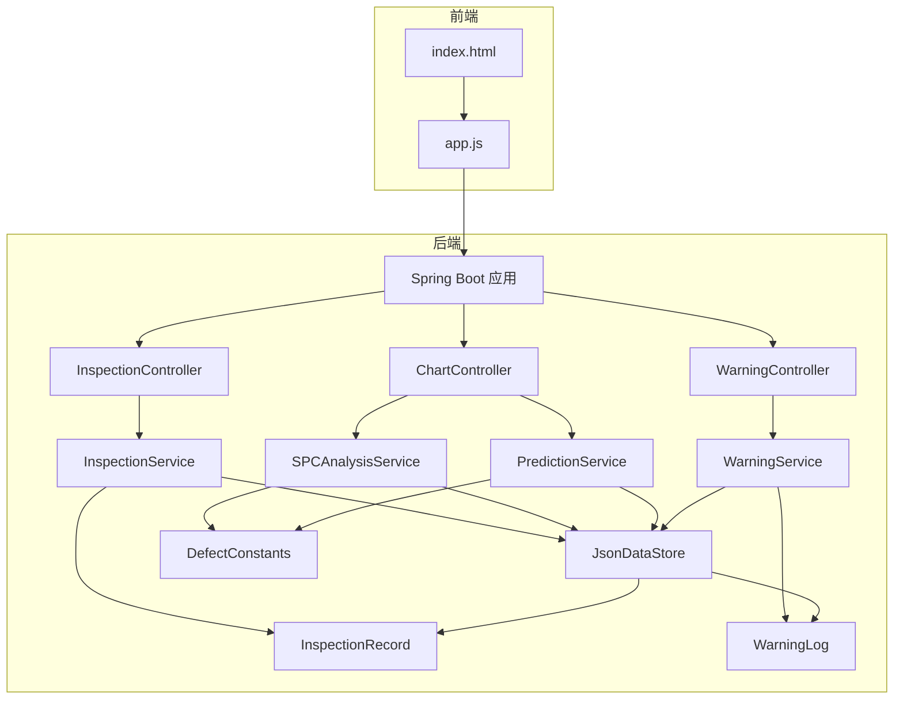
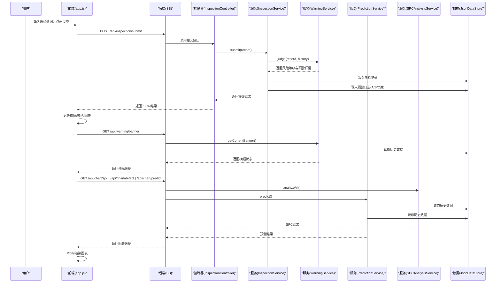
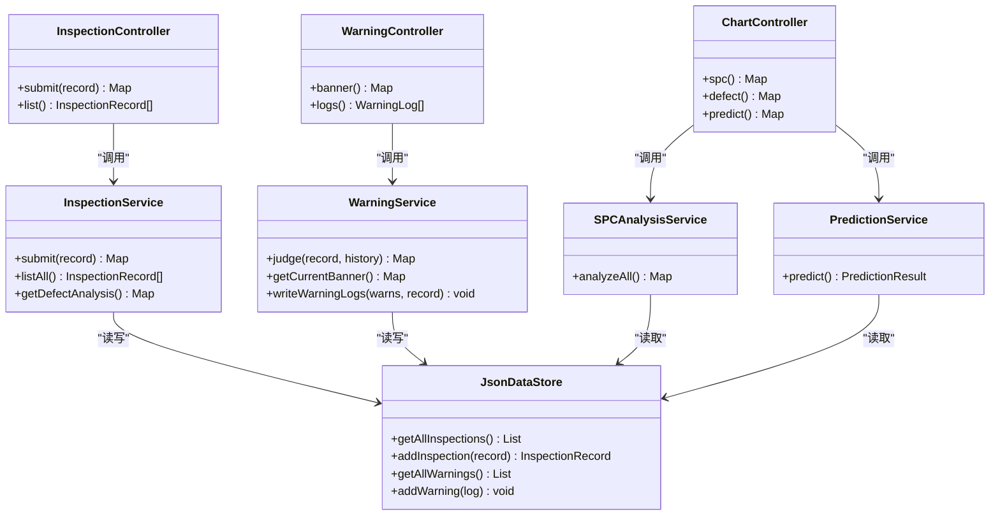
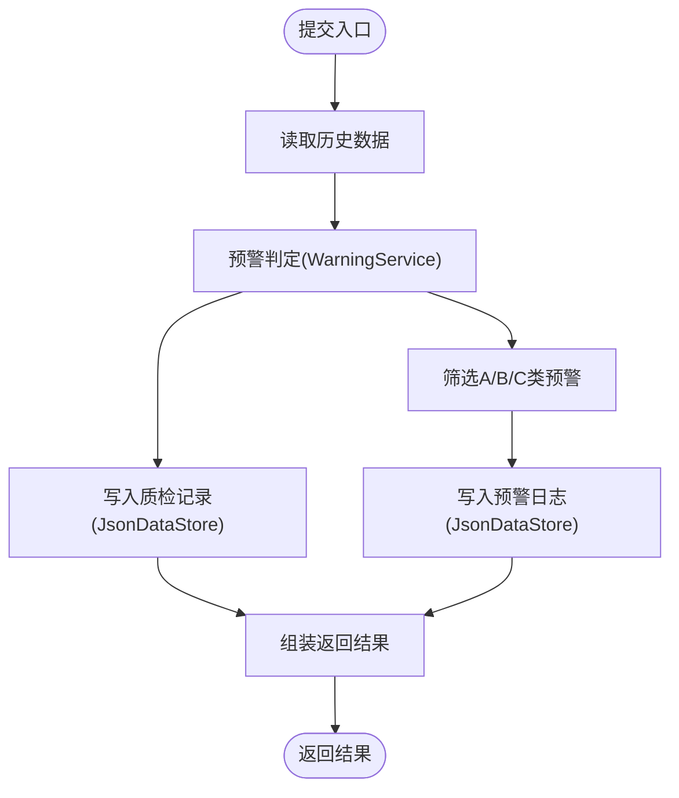
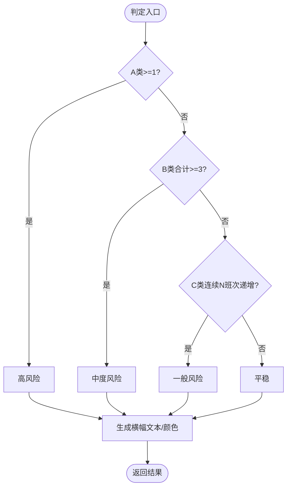
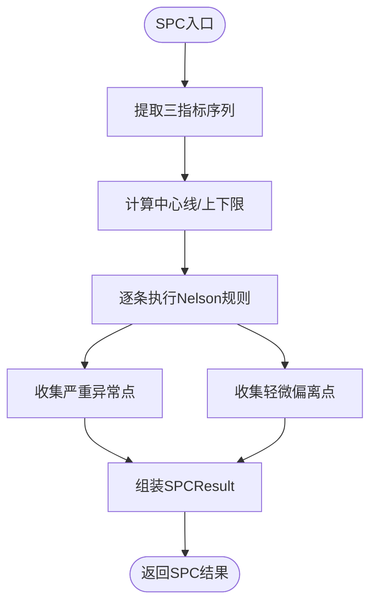
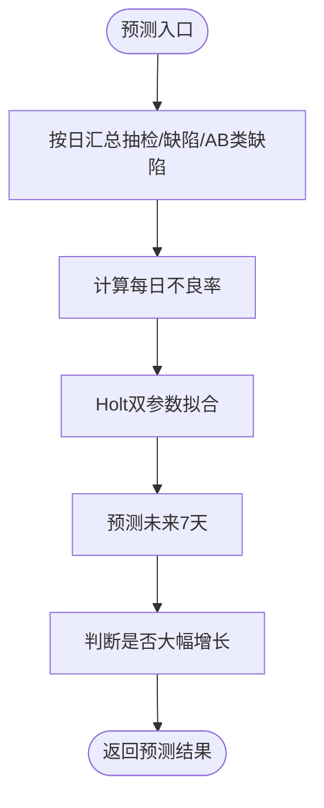
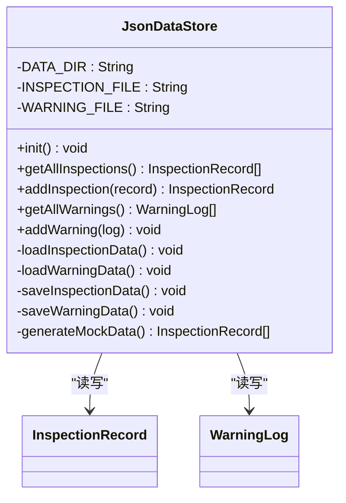
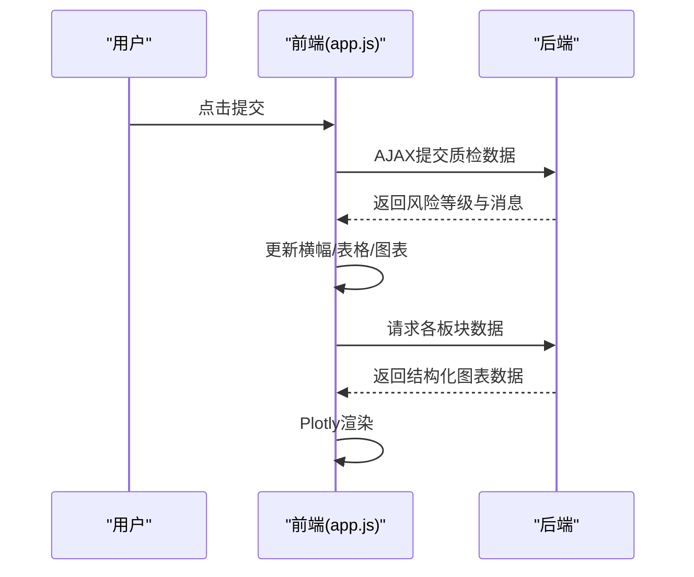
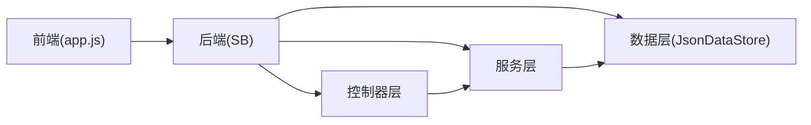

# 系统架构

<cite>
**本文引用的文件**
- [QualityApplication.java](file://src/main/java/com/zjzy/quality/QualityApplication.java)
- [application.yml](file://src/main/resources/application.yml)
- [InspectionController.java](file://src/main/java/com/zjzy/quality/controller/InspectionController.java)
- [ChartController.java](file://src/main/java/com/zjzy/quality/controller/ChartController.java)
- [WarningController.java](file://src/main/java/com/zjzy/quality/controller/WarningController.java)
- [InspectionService.java](file://src/main/java/com/zjzy/quality/service/InspectionService.java)
- [SPCAnalysisService.java](file://src/main/java/com/zjzy/quality/service/SPCAnalysisService.java)
- [PredictionService.java](file://src/main/java/com/zjzy/quality/service/PredictionService.java)
- [WarningService.java](file://src/main/java/com/zjzy/quality/service/WarningService.java)
- [JsonDataStore.java](file://src/main/java/com/zjzy/quality/util/JsonDataStore.java)
- [InspectionRecord.java](file://src/main/java/com/zjzy/quality/entity/InspectionRecord.java)
- [WarningLog.java](file://src/main/java/com/zjzy/quality/entity/WarningLog.java)
- [DefectConstants.java](file://src/main/java/com/zjzy/quality/constant/DefectConstants.java)
- [index.html](file://src/main/resources/static/index.html)
- [app.js](file://src/main/resources/static/js/app.js)
</cite>

## 目录
1. [引言](#引言)
2. [项目结构](#项目结构)
3. [核心组件](#核心组件)
4. [架构总览](#架构总览)
5. [详细组件分析](#详细组件分析)
6. [依赖分析](#依赖分析)
7. [性能考虑](#性能考虑)
8. [故障排查指南](#故障排查指南)
9. [结论](#结论)
10. [附录](#附录)

## 引言
本系统是面向卷烟生产的“全维度质检智能预警预判系统”。其目标是在生产现场通过标准化的质检录入与多维数据分析，实现对A/B/C类严重/较重/一般缺陷的即时预警，并结合SPC控制图与AI预测模型，提前发现质量波动趋势，辅助现场快速处置与管理决策。

系统采用前后端分离架构：后端使用Spring Boot提供RESTful API；前端使用jQuery与Plotly.js实现交互与可视化。数据持久化采用JSON文件本地存储，便于部署与演示，同时预留平滑迁移到关系型数据库的能力。

## 项目结构
系统采用典型的分层架构与MVC模式：
- 控制器层（Controller）：负责HTTP请求处理与响应封装
- 业务服务层（Service）：封装核心业务逻辑（预警判定、SPC分析、AI预测）
- 数据访问层（Data Store）：基于JSON文件的本地持久化工具
- 前端静态资源：HTML页面与JavaScript逻辑，调用后端API并渲染图表

**图示来源**
- [index.html](file://src/main/resources/static/index.html)
- [app.js](file://src/main/resources/static/js/app.js)
- [InspectionController.java](file://src/main/java/com/zjzy/quality/controller/InspectionController.java)
- [ChartController.java](file://src/main/java/com/zjzy/quality/controller/ChartController.java)
- [WarningController.java](file://src/main/java/com/zjzy/quality/controller/WarningController.java)
- [InspectionService.java](file://src/main/java/com/zjzy/quality/service/InspectionService.java)
- [SPCAnalysisService.java](file://src/main/java/com/zjzy/quality/service/SPCAnalysisService.java)
- [PredictionService.java](file://src/main/java/com/zjzy/quality/service/PredictionService.java)
- [WarningService.java](file://src/main/java/com/zjzy/quality/service/WarningService.java)
- [JsonDataStore.java](file://src/main/java/com/zjzy/quality/util/JsonDataStore.java)
- [InspectionRecord.java](file://src/main/java/com/zjzy/quality/entity/InspectionRecord.java)
- [WarningLog.java](file://src/main/java/com/zjzy/quality/entity/WarningLog.java)
- [DefectConstants.java](file://src/main/java/com/zjzy/quality/constant/DefectConstants.java)

**章节来源**
- [application.yml](file://src/main/resources/application.yml)
- [QualityApplication.java](file://src/main/java/com/zjzy/quality/QualityApplication.java)

## 核心组件
- 启动类与配置
  - 启动类负责应用初始化与数据存储加载
  - 配置文件定义服务器端口、静态资源路径与日志级别
- 控制器层
  - 质检接口：提交与查询历史
  - 图表接口：SPC分析、缺陷分析、AI预测
  - 预警接口：当前风险横幅与预警日志
- 业务服务层
  - 质检服务：提交流程编排（预警判定、数据入库、日志写入）
  - 预警服务：A/B/C/D分级判定与横幅状态计算
  - SPC分析服务：Nelson八条规则的SPC判异
  - 预测服务：Holt双参数指数平滑预测未来风险
- 数据持久化
  - JSON文件本地存储，支持Mock数据自动生成
- 前端
  - HTML页面与jQuery脚本，调用后端API并使用Plotly渲染图表

**章节来源**
- [QualityApplication.java](file://src/main/java/com/zjzy/quality/QualityApplication.java)
- [application.yml](file://src/main/resources/application.yml)
- [InspectionController.java](file://src/main/java/com/zjzy/quality/controller/InspectionController.java)
- [ChartController.java](file://src/main/java/com/zjzy/quality/controller/ChartController.java)
- [WarningController.java](file://src/main/java/com/zjzy/quality/controller/WarningController.java)
- [InspectionService.java](file://src/main/java/com/zjzy/quality/service/InspectionService.java)
- [WarningService.java](file://src/main/java/com/zjzy/quality/service/WarningService.java)
- [SPCAnalysisService.java](file://src/main/java/com/zjzy/quality/service/SPCAnalysisService.java)
- [PredictionService.java](file://src/main/java/com/zjzy/quality/service/PredictionService.java)
- [JsonDataStore.java](file://src/main/java/com/zjzy/quality/util/JsonDataStore.java)
- [index.html](file://src/main/resources/static/index.html)
- [app.js](file://src/main/resources/static/js/app.js)

## 架构总览
系统采用“前后端分离 + MVC”的经典架构：
- 前端：静态HTML + jQuery + Plotly.js，负责用户交互与可视化展示
- 后端：Spring Boot REST API，控制器接收请求，服务层处理业务，数据层以JSON文件持久化
- 数据流：前端通过AJAX调用后端接口，后端返回结构化数据，前端渲染图表与表格

**图示来源**
- [app.js](file://src/main/resources/static/js/app.js)
- [InspectionController.java](file://src/main/java/com/zjzy/quality/controller/InspectionController.java)
- [InspectionService.java](file://src/main/java/com/zjzy/quality/service/InspectionService.java)
- [WarningService.java](file://src/main/java/com/zjzy/quality/service/WarningService.java)
- [SPCAnalysisService.java](file://src/main/java/com/zjzy/quality/service/SPCAnalysisService.java)
- [PredictionService.java](file://src/main/java/com/zjzy/quality/service/PredictionService.java)
- [JsonDataStore.java](file://src/main/java/com/zjzy/quality/util/JsonDataStore.java)

## 详细组件分析

### 控制器层（Controller）
- InspectionController
  - 提交质检数据：接收InspectionRecord，调用InspectionService处理并返回结果
  - 查询历史：返回全量质检记录
- ChartController
  - SPC分析：返回吸阻/重量/圆周的SPC结果，包含控制线与异常点
  - 缺陷分析：返回A/B/C/D总量饼图与近10班次折线图
  - AI预测：返回历史与预测的不良率曲线及风险标识
- WarningController
  - 当前横幅：返回最新风险等级与横幅文本
  - 预警日志：返回A/B/C类预警日志列表

**图示来源**
- [InspectionController.java](file://src/main/java/com/zjzy/quality/controller/InspectionController.java)
- [ChartController.java](file://src/main/java/com/zjzy/quality/controller/ChartController.java)
- [WarningController.java](file://src/main/java/com/zjzy/quality/controller/WarningController.java)
- [InspectionService.java](file://src/main/java/com/zjzy/quality/service/InspectionService.java)
- [WarningService.java](file://src/main/java/com/zjzy/quality/service/WarningService.java)
- [SPCAnalysisService.java](file://src/main/java/com/zjzy/quality/service/SPCAnalysisService.java)
- [PredictionService.java](file://src/main/java/com/zjzy/quality/service/PredictionService.java)
- [JsonDataStore.java](file://src/main/java/com/zjzy/quality/util/JsonDataStore.java)

**章节来源**
- [InspectionController.java](file://src/main/java/com/zjzy/quality/controller/InspectionController.java)
- [ChartController.java](file://src/main/java/com/zjzy/quality/controller/ChartController.java)
- [WarningController.java](file://src/main/java/com/zjzy/quality/controller/WarningController.java)

### 业务服务层（Service）

#### 质检服务（InspectionService）
- 提交流程编排：读取历史数据 → 预警判定 → 写入质检记录 → 写入预警日志 → 返回结果
- 历史查询：返回全部质检记录
- 缺陷分析：聚合A/B/C/D总量与近10班次折线

**图示来源**
- [InspectionService.java](file://src/main/java/com/zjzy/quality/service/InspectionService.java)
- [WarningService.java](file://src/main/java/com/zjzy/quality/service/WarningService.java)
- [JsonDataStore.java](file://src/main/java/com/zjzy/quality/util/JsonDataStore.java)

**章节来源**
- [InspectionService.java](file://src/main/java/com/zjzy/quality/service/InspectionService.java)

#### 预警服务（WarningService）
- A/B/C/D四级判定：A类任意层级≥1即高风险；B类合计≥3即中度风险；C类连续N班次严格递增即一般风险
- 横幅状态：按优先级A>B>C输出风险等级与提示语
- 预警日志：仅记录A/B/C类，写入时间、机台、缺陷等级与描述

**图示来源**
- [WarningService.java](file://src/main/java/com/zjzy/quality/service/WarningService.java)
- [DefectConstants.java](file://src/main/java/com/zjzy/quality/constant/DefectConstants.java)

**章节来源**
- [WarningService.java](file://src/main/java/com/zjzy/quality/service/WarningService.java)

#### SPC分析服务（SPCAnalysisService）
- 对吸阻、重量、圆周三项物测指标执行Nelson八条规则的SPC判异
- 输出控制线与异常点索引及规则描述，区分严重异常（红点）与轻微偏离（黄点）

**图示来源**
- [SPCAnalysisService.java](file://src/main/java/com/zjzy/quality/service/SPCAnalysisService.java)
- [DefectConstants.java](file://src/main/java/com/zjzy/quality/constant/DefectConstants.java)

**章节来源**
- [SPCAnalysisService.java](file://src/main/java/com/zjzy/quality/service/SPCAnalysisService.java)

#### 预测服务（PredictionService）
- 基于Holt双参数指数平滑对每日综合不良率进行拟合与预测
- 输出历史与预测日期、曲线与置信区间，判断是否存在批量风险

**图示来源**
- [PredictionService.java](file://src/main/java/com/zjzy/quality/service/PredictionService.java)

**章节来源**
- [PredictionService.java](file://src/main/java/com/zjzy/quality/service/PredictionService.java)

### 数据持久化（JsonDataStore）
- 存储位置：项目根目录下的data文件夹
- 数据类型：质检记录inspection_data.json、预警日志warning_log.json
- 功能：初始化加载/生成Mock数据、增删改查、并发安全（同步方法）、Gson序列化
- Mock数据：首次启动无历史数据时自动生成示例数据

**图示来源**
- [JsonDataStore.java](file://src/main/java/com/zjzy/quality/util/JsonDataStore.java)
- [InspectionRecord.java](file://src/main/java/com/zjzy/quality/entity/InspectionRecord.java)
- [WarningLog.java](file://src/main/java/com/zjzy/quality/entity/WarningLog.java)

**章节来源**
- [JsonDataStore.java](file://src/main/java/com/zjzy/quality/util/JsonDataStore.java)

### 前端交互与可视化
- 页面结构：左侧录入面板，右侧四大可视化板块
- 交互逻辑：提交数据→后端判定与落库→刷新横幅/表格/图表
- 图表渲染：Plotly.js按后端返回的结构化数据绘制SPC、饼图+折线、预测曲线

**图示来源**
- [index.html](file://src/main/resources/static/index.html)
- [app.js](file://src/main/resources/static/js/app.js)

**章节来源**
- [index.html](file://src/main/resources/static/index.html)
- [app.js](file://src/main/resources/static/js/app.js)

## 依赖分析
- 组件耦合
  - 控制器仅依赖服务接口，低耦合
  - 服务层依赖数据存储与常量，形成清晰的业务边界
  - 前端仅依赖后端API，解耦良好
- 外部依赖
  - Spring Boot、Gson、jQuery、Plotly.js
- 潜在循环依赖
  - 未发现循环依赖，模块职责清晰

**图示来源**
- [app.js](file://src/main/resources/static/js/app.js)
- [InspectionController.java](file://src/main/java/com/zjzy/quality/controller/InspectionController.java)
- [InspectionService.java](file://src/main/java/com/zjzy/quality/service/InspectionService.java)
- [JsonDataStore.java](file://src/main/java/com/zjzy/quality/util/JsonDataStore.java)

**章节来源**
- [app.js](file://src/main/resources/static/js/app.js)
- [InspectionController.java](file://src/main/java/com/zjzy/quality/controller/InspectionController.java)
- [InspectionService.java](file://src/main/java/com/zjzy/quality/service/InspectionService.java)
- [JsonDataStore.java](file://src/main/java/com/zjzy/quality/util/JsonDataStore.java)

## 性能考虑
- I/O瓶颈：JSON文件读写在高频写入场景下可能成为瓶颈，建议在生产环境引入数据库
- 计算复杂度：SPC与预测均为O(n)，n为历史记录数，通常规模较小，性能可控
- 前端渲染：图表数据量不大，Plotly渲染性能良好
- 并发安全：数据存储采用同步方法，避免竞态；如需高并发，建议引入锁或事务

## 故障排查指南
- 启动失败
  - 检查application.yml端口占用与静态资源路径
  - 确认data目录权限与磁盘空间
- 数据异常
  - 检查inspection_data.json与warning_log.json格式是否被手动破坏
  - 如需恢复，删除对应JSON文件后重启，系统将重新生成Mock数据
- 接口报错
  - 确认前端AJAX请求URL与Content-Type正确
  - 查看后端日志级别与错误堆栈
- 图表空白
  - 确认后端返回数据结构与前端期望一致
  - 检查网络代理与跨域设置

**章节来源**
- [application.yml](file://src/main/resources/application.yml)
- [JsonDataStore.java](file://src/main/java/com/zjzy/quality/util/JsonDataStore.java)
- [app.js](file://src/main/resources/static/js/app.js)

## 结论
该系统以清晰的MVC分层与前后端分离架构实现了卷烟质检的智能化预警与可视化展示。通过SPC与AI预测技术，系统能够及时发现质量异常趋势，辅助现场快速处置。数据持久化采用JSON文件，部署简单、易于演示；同时具备良好的扩展性，可平滑迁移到关系型数据库与更复杂的分析引擎。

## 附录
- API一览
  - 质检接口
    - POST /api/inspection/submit：提交质检数据
    - GET /api/inspection/list：查询历史数据
  - 图表接口
    - GET /api/chart/spc：SPC分析数据
    - GET /api/chart/defect：缺陷分析数据
    - GET /api/chart/predict：AI预测数据
  - 预警接口
    - GET /api/warning/banner：当前风险横幅
    - GET /api/warning/logs：A/B/C类预警日志

**章节来源**
- [InspectionController.java](file://src/main/java/com/zjzy/quality/controller/InspectionController.java)
- [ChartController.java](file://src/main/java/com/zjzy/quality/controller/ChartController.java)
- [WarningController.java](file://src/main/java/com/zjzy/quality/controller/WarningController.java)