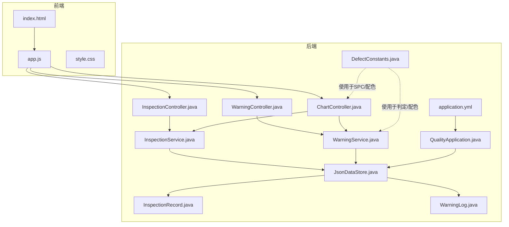
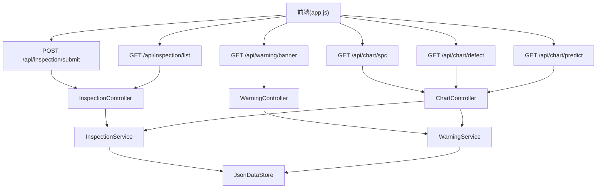
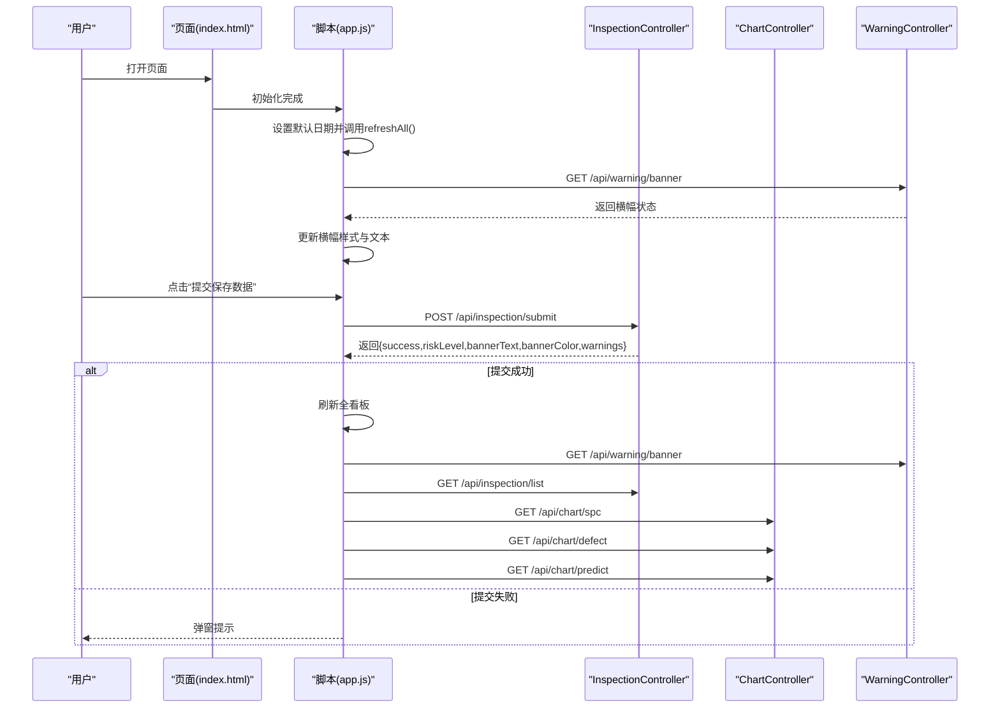
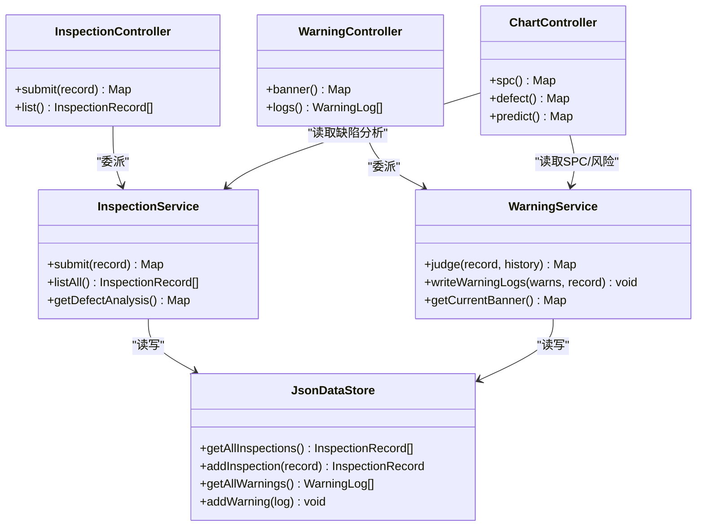
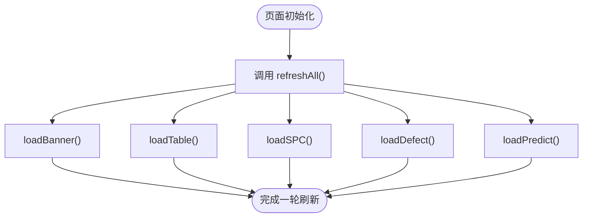
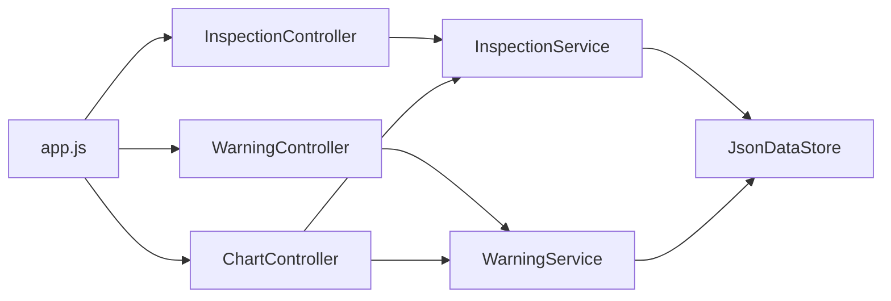

# 组件交互关系

<cite>
**本文引用的文件**
- [QualityApplication.java](file://src/main/java/com/zjzy/quality/QualityApplication.java)
- [application.yml](file://src/main/resources/application.yml)
- [index.html](file://src/main/resources/static/index.html)
- [app.js](file://src/main/resources/static/js/app.js)
- [style.css](file://src/main/resources/static/css/style.css)
- [InspectionController.java](file://src/main/java/com/zjzy/quality/controller/InspectionController.java)
- [ChartController.java](file://src/main/java/com/zjzy/quality/controller/ChartController.java)
- [WarningController.java](file://src/main/java/com/zjzy/quality/controller/WarningController.java)
- [InspectionService.java](file://src/main/java/com/zjzy/quality/service/InspectionService.java)
- [WarningService.java](file://src/main/java/com/zjzy/quality/service/WarningService.java)
- [JsonDataStore.java](file://src/main/java/com/zjzy/quality/util/JsonDataStore.java)
- [InspectionRecord.java](file://src/main/java/com/zjzy/quality/entity/InspectionRecord.java)
- [WarningLog.java](file://src/main/java/com/zjzy/quality/entity/WarningLog.java)
- [DefectConstants.java](file://src/main/java/com/zjzy/quality/constant/DefectConstants.java)
</cite>

## 目录
1. [引言](#引言)
2. [项目结构](#项目结构)
3. [核心组件](#核心组件)
4. [架构总览](#架构总览)
5. [详细组件分析](#详细组件分析)
6. [依赖分析](#依赖分析)
7. [性能考虑](#性能考虑)
8. [故障排查指南](#故障排查指南)
9. [结论](#结论)
10. [附录](#附录)

## 引言
本文件聚焦“卷烟质检预警系统”的组件交互关系，系统采用前后端分离架构：前端使用原生 JavaScript + jQuery + Plotly 渲染可视化看板；后端基于 Spring Boot，以 REST 接口提供数据服务。系统通过 JSON 文件作为本地数据存储，支持 Mock 数据初始化与持久化，便于快速演示与后续迁移至数据库。

## 项目结构
系统主要由以下层次构成：
- 启动与配置：应用启动类负责初始化数据存储，配置文件定义端口、静态资源路径与日志级别。
- 前端页面与脚本：HTML 页面承载布局与表单，JS 负责 AJAX 请求、数据刷新与图表渲染。
- 控制器层：暴露 REST 接口，分别处理质检数据提交、历史查询、图表数据与预警横幅。
- 业务服务层：封装质检数据提交、缺陷分析、预警判定与日志写入等核心逻辑。
- 数据访问与常量：统一的 JSON 存储工具负责数据持久化；常量类集中管理阈值与配色。

**图表来源**
- [QualityApplication.java:14-23](file://src/main/java/com/zjzy/quality/QualityApplication.java#L14-L23)
- [application.yml:4-23](file://src/main/resources/application.yml#L4-L23)
- [index.html:1-179](file://src/main/resources/static/index.html#L1-L179)
- [app.js:1-420](file://src/main/resources/static/js/app.js#L1-L420)
- [InspectionController.java:13-34](file://src/main/java/com/zjzy/quality/controller/InspectionController.java#L13-L34)
- [WarningController.java:16-37](file://src/main/java/com/zjzy/quality/controller/WarningController.java#L16-L37)
- [ChartController.java:17-105](file://src/main/java/com/zjzy/quality/controller/ChartController.java#L17-L105)
- [InspectionService.java:12-101](file://src/main/java/com/zjzy/quality/service/InspectionService.java#L12-L101)
- [WarningService.java:15-139](file://src/main/java/com/zjzy/quality/service/WarningService.java#L15-L139)
- [JsonDataStore.java:20-222](file://src/main/java/com/zjzy/quality/util/JsonDataStore.java#L20-L222)
- [DefectConstants.java:7-76](file://src/main/java/com/zjzy/quality/constant/DefectConstants.java#L7-L76)

**章节来源**
- [QualityApplication.java:12-23](file://src/main/java/com/zjzy/quality/QualityApplication.java#L12-L23)
- [application.yml:4-23](file://src/main/resources/application.yml#L4-L23)
- [index.html:1-179](file://src/main/resources/static/index.html#L1-L179)
- [app.js:15-26](file://src/main/resources/static/js/app.js#L15-L26)

## 核心组件
- 启动类与初始化
  - 启动类在启动时调用数据存储初始化，加载或生成 Mock 数据，并打印启动提示。
- 配置文件
  - 定义服务端口、上下文路径、静态资源映射与日志级别。
- 前端页面与脚本
  - 页面包含数据录入表单与四个可视化板块；脚本负责页面初始化、提交数据、定时刷新与图表渲染。
- 控制器
  - 质检控制器：提供提交与历史查询接口。
  - 预警控制器：提供横幅状态与日志查询接口。
  - 图表控制器：提供 SPC、缺陷分析与 AI 预测数据接口。
- 服务层
  - 质检服务：提交数据、计算风险等级、写入日志、返回结果。
  - 预警服务：根据阈值与规则判定风险等级与横幅状态。
- 数据存储
  - JSON 文件持久化，支持并发安全的读写与 Mock 数据生成。
- 实体与常量
  - 实体类承载质检记录与预警日志；常量类集中管理阈值、SPC 控制限与配色。

**章节来源**
- [QualityApplication.java:14-23](file://src/main/java/com/zjzy/quality/QualityApplication.java#L14-L23)
- [application.yml:4-23](file://src/main/resources/application.yml#L4-L23)
- [app.js:28-74](file://src/main/resources/static/js/app.js#L28-L74)
- [InspectionController.java:13-34](file://src/main/java/com/zjzy/quality/controller/InspectionController.java#L13-L34)
- [WarningController.java:16-37](file://src/main/java/com/zjzy/quality/controller/WarningController.java#L16-L37)
- [ChartController.java:17-105](file://src/main/java/com/zjzy/quality/controller/ChartController.java#L17-L105)
- [InspectionService.java:19-44](file://src/main/java/com/zjzy/quality/service/InspectionService.java#L19-L44)
- [WarningService.java:23-99](file://src/main/java/com/zjzy/quality/service/WarningService.java#L23-L99)
- [JsonDataStore.java:46-62](file://src/main/java/com/zjzy/quality/util/JsonDataStore.java#L46-L62)
- [DefectConstants.java:9-76](file://src/main/java/com/zjzy/quality/constant/DefectConstants.java#L9-L76)

## 架构总览
系统采用三层架构：表现层（前端）、控制层（后端控制器）、业务层（服务）与数据层（JSON 存储）。前端通过 AJAX 调用后端 REST 接口，后端控制器将请求委派给服务层，服务层再与数据存储交互，最终返回数据供前端渲染。

**图表来源**
- [app.js:57-74](file://src/main/resources/static/js/app.js#L57-L74)
- [app.js:87-159](file://src/main/resources/static/js/app.js#L87-L159)
- [app.js:162-264](file://src/main/resources/static/js/app.js#L162-L264)
- [app.js:340-411](file://src/main/resources/static/js/app.js#L340-L411)
- [InspectionController.java:21-33](file://src/main/java/com/zjzy/quality/controller/InspectionController.java#L21-L33)
- [WarningController.java:24-36](file://src/main/java/com/zjzy/quality/controller/WarningController.java#L24-L36)
- [ChartController.java:25-104](file://src/main/java/com/zjzy/quality/controller/ChartController.java#L25-L104)
- [InspectionService.java:19-44](file://src/main/java/com/zjzy/quality/service/InspectionService.java#L19-L44)
- [WarningService.java:23-99](file://src/main/java/com/zjzy/quality/service/WarningService.java#L23-L99)
- [JsonDataStore.java:66-92](file://src/main/java/com/zjzy/quality/util/JsonDataStore.java#L66-L92)

## 详细组件分析

### 前端交互流程（AJAX 调用）
- 页面初始化
  - 页面加载完成后设置默认日期并立即触发一次全量刷新。
- 提交流程
  - 收集表单字段，构造请求体，通过 POST 提交至 /api/inspection/submit。
  - 成功回调：弹窗显示风险等级并刷新全看板；失败回调：提示数据格式错误。
- 刷新流程
  - 全量刷新调用四个子任务：横幅、历史表格、SPC 图、缺陷分析图、AI 预测图。
  - 各子任务通过 GET 请求对应接口，成功后更新 DOM 或渲染图表。

**图表来源**
- [index.html:16-26](file://src/main/resources/static/index.html#L16-L26)
- [app.js:28-74](file://src/main/resources/static/js/app.js#L28-L74)
- [app.js:77-83](file://src/main/resources/static/js/app.js#L77-L83)
- [app.js:86-96](file://src/main/resources/static/js/app.js#L86-L96)
- [app.js:98-159](file://src/main/resources/static/js/app.js#L98-L159)
- [app.js:161-264](file://src/main/resources/static/js/app.js#L161-L264)
- [app.js:339-411](file://src/main/resources/static/js/app.js#L339-L411)
- [InspectionController.java:21-24](file://src/main/java/com/zjzy/quality/controller/InspectionController.java#L21-L24)
- [ChartController.java:25-104](file://src/main/java/com/zjzy/quality/controller/ChartController.java#L25-L104)
- [WarningController.java:24-27](file://src/main/java/com/zjzy/quality/controller/WarningController.java#L24-L27)

**章节来源**
- [index.html:16-26](file://src/main/resources/static/index.html#L16-L26)
- [app.js:28-74](file://src/main/resources/static/js/app.js#L28-L74)
- [app.js:77-83](file://src/main/resources/static/js/app.js#L77-L83)
- [app.js:86-96](file://src/main/resources/static/js/app.js#L86-L96)
- [app.js:98-159](file://src/main/resources/static/js/app.js#L98-L159)
- [app.js:161-264](file://src/main/resources/static/js/app.js#L161-L264)
- [app.js:339-411](file://src/main/resources/static/js/app.js#L339-L411)

### 后端控制器协作机制
- InspectionController
  - 提交接口：接收 InspectionRecord，委派给 InspectionService 处理并返回结果。
  - 历史查询接口：返回全量 InspectionRecord 列表。
- WarningController
  - 横幅状态接口：调用 WarningService 获取当前风险横幅状态。
  - 预警日志接口：直接从 JsonDataStore 读取全部预警日志。
- ChartController
  - SPC 接口：聚合三个物测指标的分析结果，返回 UCL/CL/LCL 与异常点。
  - 缺陷分析接口：返回饼图与折线图数据及配色。
  - AI 预测接口：返回历史与预测曲线、置信区间与风险标注。

**图表来源**
- [InspectionController.java:13-34](file://src/main/java/com/zjzy/quality/controller/InspectionController.java#L13-L34)
- [WarningController.java:16-37](file://src/main/java/com/zjzy/quality/controller/WarningController.java#L16-L37)
- [ChartController.java:17-105](file://src/main/java/com/zjzy/quality/controller/ChartController.java#L17-L105)
- [InspectionService.java:19-101](file://src/main/java/com/zjzy/quality/service/InspectionService.java#L19-L101)
- [WarningService.java:23-139](file://src/main/java/com/zjzy/quality/service/WarningService.java#L23-L139)
- [JsonDataStore.java:66-92](file://src/main/java/com/zjzy/quality/util/JsonDataStore.java#L66-L92)

**章节来源**
- [InspectionController.java:13-34](file://src/main/java/com/zjzy/quality/controller/InspectionController.java#L13-L34)
- [WarningController.java:16-37](file://src/main/java/com/zjzy/quality/controller/WarningController.java#L16-L37)
- [ChartController.java:17-105](file://src/main/java/com/zjzy/quality/controller/ChartController.java#L17-L105)

### 定时刷新机制
- 前端未实现自动轮询定时器，但具备全量刷新能力。可在页面初始化后通过外部定时器实现每 30 秒刷新一次。
- 建议在页面初始化完成后添加定时器，周期性调用 refreshAll()，从而拉取最新横幅、历史表格、SPC、缺陷分析与预测数据。

**图表来源**
- [app.js:77-83](file://src/main/resources/static/js/app.js#L77-L83)
- [app.js:86-96](file://src/main/resources/static/js/app.js#L86-L96)
- [app.js:98-159](file://src/main/resources/static/js/app.js#L98-L159)
- [app.js:161-264](file://src/main/resources/static/js/app.js#L161-L264)
- [app.js:339-411](file://src/main/resources/static/js/app.js#L339-L411)

**章节来源**
- [app.js:77-83](file://src/main/resources/static/js/app.js#L77-L83)

### 数据传递格式与协议约定
- 请求协议
  - Content-Type: application/json
  - 提交质检数据：POST /api/inspection/submit
  - 查询历史：GET /api/inspection/list
  - 获取横幅状态：GET /api/warning/banner
  - 获取 SPC 数据：GET /api/chart/spc
  - 获取缺陷分析数据：GET /api/chart/defect
  - 获取 AI 预测数据：GET /api/chart/predict
- 响应格式
  - 提交接口返回包含 success、riskLevel、bannerText、bannerColor、warnings、message 的对象。
  - 历史接口返回 InspectionRecord 列表。
  - 横幅接口返回包含 riskLevel、bannerText、bannerColor 的对象。
  - SPC 接口返回包含三类物测指标的分析项，以及颜色常量。
  - 缺陷分析接口返回饼图与折线图数据及颜色常量。
  - 预测接口返回历史日期与不良率、预测日期与曲线、置信区间与风险标注。
- 实体模型
  - InspectionRecord：包含日期、班次、机台、班组、抽检量、物测指标与各级缺陷数量，以及风险等级。
  - WarningLog：包含发生时间、日期、班组、机台、缺陷等级、缺陷数量与描述。

**章节来源**
- [InspectionController.java:21-33](file://src/main/java/com/zjzy/quality/controller/InspectionController.java#L21-L33)
- [WarningController.java:24-36](file://src/main/java/com/zjzy/quality/controller/WarningController.java#L24-L36)
- [ChartController.java:25-104](file://src/main/java/com/zjzy/quality/controller/ChartController.java#L25-L104)
- [InspectionRecord.java:7-154](file://src/main/java/com/zjzy/quality/entity/InspectionRecord.java#L7-L154)
- [WarningLog.java:7-44](file://src/main/java/com/zjzy/quality/entity/WarningLog.java#L7-L44)

### 异常处理与错误传播
- 前端
  - 提交失败时通过 AJAX error 回调弹窗提示“数据格式错误”。
  - 历史表格为空时展示“暂无数据”提示。
  - 预测图数据不足时提示“数据不足，至少需要2条记录方可预测”。
- 后端
  - 控制器层未显式捕获异常，异常会沿调用链向上传播。
  - 服务层与数据层内部对文件读写进行异常捕获并输出错误日志，保证系统稳定性。
- 建议
  - 在控制器层增加统一异常处理，返回标准化错误响应。
  - 对关键接口增加参数校验与边界条件处理。

**章节来源**
- [app.js:70-73](file://src/main/resources/static/js/app.js#L70-L73)
- [app.js:101-103](file://src/main/resources/static/js/app.js#L101-L103)
- [app.js:342-344](file://src/main/resources/static/js/app.js#L342-L344)
- [JsonDataStore.java:109-113](file://src/main/java/com/zjzy/quality/util/JsonDataStore.java#L109-L113)
- [JsonDataStore.java:128-132](file://src/main/java/com/zjzy/quality/util/JsonDataStore.java#L128-L132)

### 组件调试与监控方法
- 启动与日志
  - 启动类打印系统启动提示与访问地址。
  - 配置文件设置日志级别，便于定位问题。
- 前端调试
  - 使用浏览器开发者工具查看网络请求与响应，确认接口返回格式是否符合预期。
  - 在控制台执行局部刷新函数（如 loadBanner/loadTable），验证单接口可用性。
- 后端调试
  - 在服务层关键节点添加日志输出，观察数据流转与阈值判定过程。
  - 检查数据存储文件是否存在、权限是否正确、内容是否被覆盖。
- 监控建议
  - 增加统一异常处理器，记录异常堆栈与请求上下文。
  - 对关键接口增加健康检查与超时告警。

**章节来源**
- [QualityApplication.java:19-22](file://src/main/java/com/zjzy/quality/QualityApplication.java#L19-L22)
- [application.yml:20-23](file://src/main/resources/application.yml#L20-L23)
- [JsonDataStore.java:135-149](file://src/main/java/com/zjzy/quality/util/JsonDataStore.java#L135-L149)

## 依赖分析
- 组件耦合
  - 控制器与服务之间为单向依赖，职责清晰。
  - 服务与数据存储之间为读写依赖，数据访问集中在 JsonDataStore。
- 外部依赖
  - 前端依赖 jQuery 与 Plotly，用于交互与可视化。
  - 后端使用 Gson 进行 JSON 序列化与反序列化。
- 循环依赖
  - 未发现循环依赖，整体结构稳定。

**图表来源**
- [app.js:57-74](file://src/main/resources/static/js/app.js#L57-L74)
- [InspectionController.java:21-33](file://src/main/java/com/zjzy/quality/controller/InspectionController.java#L21-L33)
- [WarningController.java:24-36](file://src/main/java/com/zjzy/quality/controller/WarningController.java#L24-L36)
- [ChartController.java:25-104](file://src/main/java/com/zjzy/quality/controller/ChartController.java#L25-L104)
- [InspectionService.java:19-44](file://src/main/java/com/zjzy/quality/service/InspectionService.java#L19-L44)
- [WarningService.java:23-99](file://src/main/java/com/zjzy/quality/service/WarningService.java#L23-L99)
- [JsonDataStore.java:66-92](file://src/main/java/com/zjzy/quality/util/JsonDataStore.java#L66-L92)

**章节来源**
- [app.js:57-74](file://src/main/resources/static/js/app.js#L57-L74)
- [InspectionController.java:21-33](file://src/main/java/com/zjzy/quality/controller/InspectionController.java#L21-L33)
- [WarningController.java:24-36](file://src/main/java/com/zjzy/quality/controller/WarningController.java#L24-L36)
- [ChartController.java:25-104](file://src/main/java/com/zjzy/quality/controller/ChartController.java#L25-L104)

## 性能考虑
- 前端
  - 图表渲染使用 Plotly，建议在数据量较大时进行分页或采样。
  - 刷新策略建议采用节流/防抖，避免频繁请求导致 UI 卡顿。
- 后端
  - JsonDataStore 采用同步方法与内存缓存，适合小规模演示；生产环境建议迁移到数据库并引入连接池与缓存层。
  - SPC 分析与预测计算可考虑异步化，避免阻塞请求线程。
- 存储
  - 文件 I/O 在高并发场景下可能成为瓶颈，建议引入锁优化或替换为数据库。

## 故障排查指南
- 启动失败
  - 检查端口占用与配置文件端口设置。
  - 查看启动日志输出，确认数据初始化是否成功。
- 接口异常
  - 使用浏览器网络面板查看请求与响应，确认 Content-Type 与路径正确。
  - 在后端增加统一异常处理，记录异常详情。
- 数据不一致
  - 检查 data 目录是否存在、权限是否正确。
  - 确认 Mock 数据是否正常生成与持久化。
- 图表渲染异常
  - 检查返回数据结构是否符合前端期望（如 SPC 的异常点索引与描述）。
  - 确认颜色常量与模块名称在前后端保持一致。

**章节来源**
- [application.yml:4-23](file://src/main/resources/application.yml#L4-L23)
- [QualityApplication.java:19-22](file://src/main/java/com/zjzy/quality/QualityApplication.java#L19-L22)
- [JsonDataStore.java:135-149](file://src/main/java/com/zjzy/quality/util/JsonDataStore.java#L135-L149)
- [app.js:161-264](file://src/main/resources/static/js/app.js#L161-L264)

## 结论
该系统通过清晰的前后端分层与 REST 接口实现了质检数据的采集、分析与可视化展示。前端负责交互与渲染，后端负责业务逻辑与数据持久化。当前版本以 JSON 文件作为数据存储，满足快速演示需求；建议在生产环境中引入数据库与统一异常处理，进一步提升稳定性与可维护性。

## 附录
- 前端样式与布局
  - 页面采用 Apple 风格极简设计，左侧为数据录入面板，右侧为可视化看板。
- 常量与阈值
  - 缺陷分级阈值、物测指标控制限与配色均集中于常量类，便于统一管理与调整。

**章节来源**
- [style.css:1-336](file://src/main/resources/static/css/style.css#L1-L336)
- [DefectConstants.java:9-76](file://src/main/java/com/zjzy/quality/constant/DefectConstants.java#L9-L76)