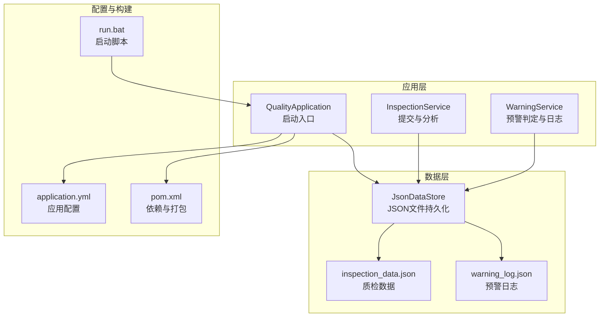
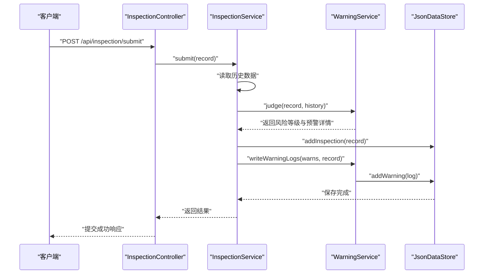
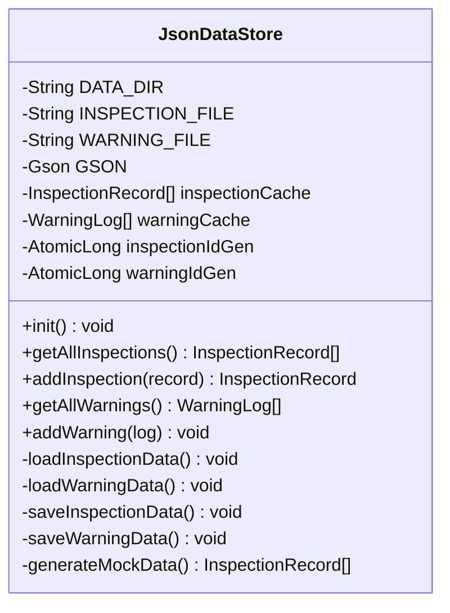
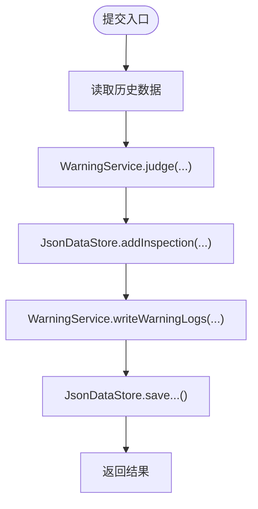
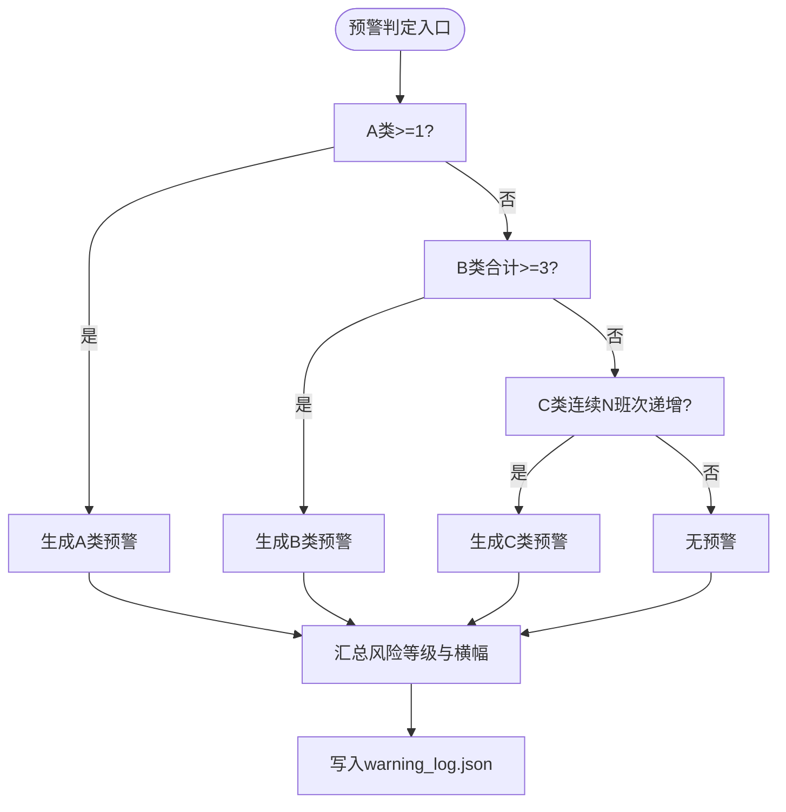
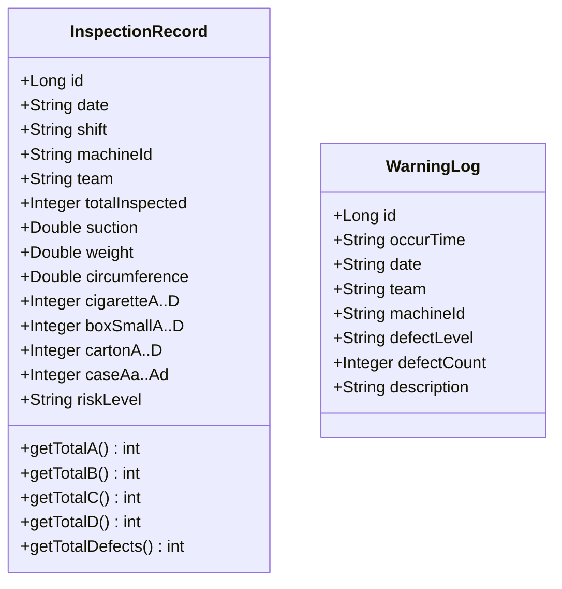
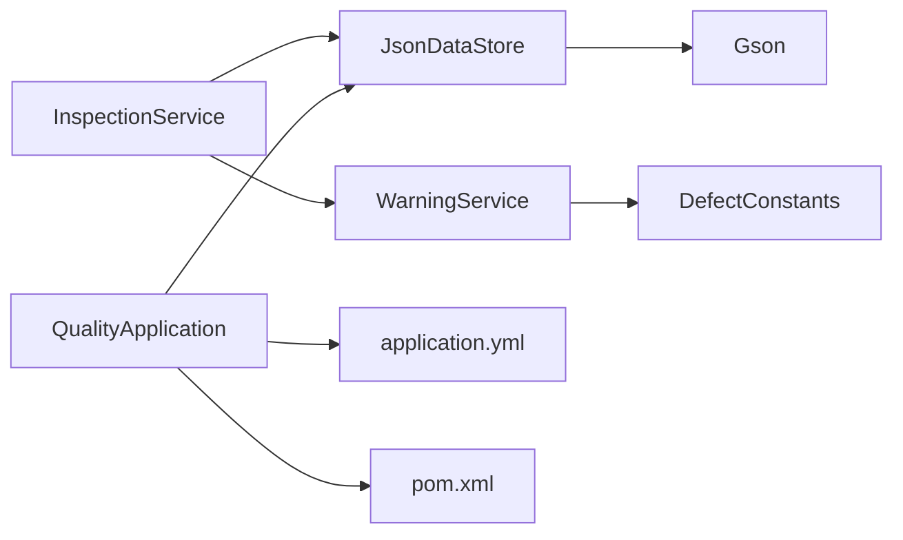

# 备份恢复

<cite>
**本文引用的文件**
- [JsonDataStore.java](file://src/main/java/com/zjzy/quality/util/JsonDataStore.java)
- [InspectionRecord.java](file://src/main/java/com/zjzy/quality/entity/InspectionRecord.java)
- [WarningLog.java](file://src/main/java/com/zjzy/quality/entity/WarningLog.java)
- [InspectionService.java](file://src/main/java/com/zjzy/quality/service/InspectionService.java)
- [WarningService.java](file://src/main/java/com/zjzy/quality/service/WarningService.java)
- [DefectConstants.java](file://src/main/java/com/zjzy/quality/constant/DefectConstants.java)
- [application.yml](file://src/main/resources/application.yml)
- [pom.xml](file://pom.xml)
- [run.bat](file://run.bat)
- [QualityApplication.java](file://src/main/java/com/zjzy/quality/QualityApplication.java)
</cite>

## 目录
1. [简介](#简介)
2. [项目结构](#项目结构)
3. [核心组件](#核心组件)
4. [架构概览](#架构概览)
5. [详细组件分析](#详细组件分析)
6. [依赖分析](#依赖分析)
7. [性能考虑](#性能考虑)
8. [故障排查指南](#故障排查指南)
9. [结论](#结论)
10. [附录](#附录)

## 简介
本方案围绕“卷烟全维度质检智能预警预判系统”的数据备份与灾难恢复，聚焦于两类JSON数据文件的备份策略与恢复流程：
- 质检数据文件：data/inspection_data.json
- 预警日志文件：data/warning_log.json

方案内容涵盖：
- 备份策略：手动备份与自动备份的实施方案，包括备份频率、存储位置、版本管理
- 恢复流程：单文件恢复、批量恢复、数据一致性验证
- 灾难恢复预案：系统故障、数据损坏、硬件故障等场景的应急处理
- 安全建议：备份数据的压缩、加密与安全存储

## 项目结构
系统采用Spring Boot应用，数据以JSON文件形式存储于项目根目录下的data/目录。应用启动时自动初始化数据存储，并在每次新增质检记录或预警时写入对应JSON文件。

**图示来源**
- [QualityApplication.java:14-23](file://src/main/java/com/zjzy/quality/QualityApplication.java#L14-L23)
- [JsonDataStore.java:22-24](file://src/main/java/com/zjzy/quality/util/JsonDataStore.java#L22-L24)
- [application.yml:1-24](file://src/main/resources/application.yml#L1-L24)
- [pom.xml:1-77](file://pom.xml#L1-L77)
- [run.bat:30-32](file://run.bat#L30-L32)

**章节来源**
- [QualityApplication.java:14-23](file://src/main/java/com/zjzy/quality/QualityApplication.java#L14-L23)
- [JsonDataStore.java:22-24](file://src/main/java/com/zjzy/quality/util/JsonDataStore.java#L22-L24)
- [application.yml:1-24](file://src/main/resources/application.yml#L1-L24)
- [pom.xml:1-77](file://pom.xml#L1-L77)
- [run.bat:30-32](file://run.bat#L30-L32)

## 核心组件
- JsonDataStore：负责将质检记录与预警日志以JSON格式持久化到data/目录；提供初始化、读取、写入与Mock数据生成能力。
- InspectionService：提交质检数据的业务编排，调用JsonDataStore写入数据并触发预警判定与日志写入。
- WarningService：根据缺陷常量进行A/B/C类预警判定，并将符合条件的日志写入warning_log.json。
- DefectConstants：定义缺陷分级阈值、物测指标内控限与风险等级配色等常量。
- 应用配置与构建：application.yml定义端口与日志级别；pom.xml声明依赖；run.bat提供环境检查与启动流程。

**章节来源**
- [JsonDataStore.java:20-62](file://src/main/java/com/zjzy/quality/util/JsonDataStore.java#L20-L62)
- [InspectionService.java:19-44](file://src/main/java/com/zjzy/quality/service/InspectionService.java#L19-L44)
- [WarningService.java:23-99](file://src/main/java/com/zjzy/quality/service/WarningService.java#L23-L99)
- [DefectConstants.java:7-76](file://src/main/java/com/zjzy/quality/constant/DefectConstants.java#L7-L76)
- [application.yml:1-24](file://src/main/resources/application.yml#L1-L24)
- [pom.xml:30-65](file://pom.xml#L30-L65)
- [run.bat:9-24](file://run.bat#L9-L24)

## 架构概览
系统数据流从客户端提交质检记录开始，经InspectionService编排，调用JsonDataStore写入inspection_data.json；同时WarningService根据规则生成预警并写入warning_log.json。应用启动时由JsonDataStore初始化并加载历史数据。

**图示来源**
- [InspectionController.java:21-24](file://src/main/java/com/zjzy/quality/controller/InspectionController.java#L21-L24)
- [InspectionService.java:20-44](file://src/main/java/com/zjzy/quality/service/InspectionService.java#L20-L44)
- [WarningService.java:105-121](file://src/main/java/com/zjzy/quality/service/WarningService.java#L105-L121)
- [JsonDataStore.java:70-92](file://src/main/java/com/zjzy/quality/util/JsonDataStore.java#L70-L92)

## 详细组件分析

### 组件A：JsonDataStore（JSON数据持久化）
- 存储位置：data/inspection_data.json 与 data/warning_log.json
- 初始化：启动时创建data目录并加载历史数据；如无历史数据则生成Mock示例数据并保存
- 写入策略：每次新增质检记录或预警均实时写入对应JSON文件
- 错误处理：读取失败时输出异常信息并回退为空列表，保证系统可用性

**图示来源**
- [JsonDataStore.java:20-221](file://src/main/java/com/zjzy/quality/util/JsonDataStore.java#L20-L221)

**章节来源**
- [JsonDataStore.java:22-149](file://src/main/java/com/zjzy/quality/util/JsonDataStore.java#L22-L149)

### 组件B：InspectionService（质检业务编排）
- 提交流程：读取历史数据 → 预警判定 → 写入JSON → 写入预警日志 → 返回结果
- 输出：包含风险等级、横幅文本、横幅颜色与预警详情

**图示来源**
- [InspectionService.java:20-44](file://src/main/java/com/zjzy/quality/service/InspectionService.java#L20-L44)
- [WarningService.java:23-99](file://src/main/java/com/zjzy/quality/service/WarningService.java#L23-L99)
- [JsonDataStore.java:135-149](file://src/main/java/com/zjzy/quality/util/JsonDataStore.java#L135-L149)

**章节来源**
- [InspectionService.java:19-100](file://src/main/java/com/zjzy/quality/service/InspectionService.java#L19-L100)

### 组件C：WarningService（预警判定与日志）
- 预警规则：A类≥1、B类合计≥3、C类连续N班次严格递增
- 日志写入：仅A/B/C类触发时写入warning_log.json，包含发生时间、日期、班组、机台、缺陷等级、数量与描述

**图示来源**
- [WarningService.java:23-121](file://src/main/java/com/zjzy/quality/service/WarningService.java#L23-L121)
- [DefectConstants.java:11-18](file://src/main/java/com/zjzy/quality/constant/DefectConstants.java#L11-L18)

**章节来源**
- [WarningService.java:101-139](file://src/main/java/com/zjzy/quality/service/WarningService.java#L101-L139)
- [DefectConstants.java:7-76](file://src/main/java/com/zjzy/quality/constant/DefectConstants.java#L7-L76)

### 组件D：实体模型（InspectionRecord、WarningLog）
- InspectionRecord：包含日期、班次、机台、班组、物测指标与各层级缺陷计数，提供A/B/C/D类缺陷合计与总缺陷数计算
- WarningLog：包含发生时间、日期、班组、机台、缺陷等级、缺陷数量与描述

**图示来源**
- [InspectionRecord.java:7-153](file://src/main/java/com/zjzy/quality/entity/InspectionRecord.java#L7-L153)
- [WarningLog.java:7-43](file://src/main/java/com/zjzy/quality/entity/WarningLog.java#L7-L43)

**章节来源**
- [InspectionRecord.java:150-153](file://src/main/java/com/zjzy/quality/entity/InspectionRecord.java#L150-L153)
- [WarningLog.java:18-43](file://src/main/java/com/zjzy/quality/entity/WarningLog.java#L18-L43)

## 依赖分析
- JsonDataStore依赖Gson进行JSON序列化/反序列化，使用Pretty Printing与统一日期格式
- InspectionService依赖WarningService进行风险判定，并调用JsonDataStore进行数据持久化
- WarningService依赖DefectConstants中的阈值与风险等级常量
- 应用通过Spring Boot启动，配置文件application.yml控制端口与日志级别

**图示来源**
- [JsonDataStore.java:3-29](file://src/main/java/com/zjzy/quality/util/JsonDataStore.java#L3-L29)
- [InspectionService.java:4-4](file://src/main/java/com/zjzy/quality/service/InspectionService.java#L4-L4)
- [WarningService.java:3-6](file://src/main/java/com/zjzy/quality/service/WarningService.java#L3-L6)
- [DefectConstants.java:7-76](file://src/main/java/com/zjzy/quality/constant/DefectConstants.java#L7-L76)
- [application.yml:1-24](file://src/main/resources/application.yml#L1-L24)
- [pom.xml:30-65](file://pom.xml#L30-L65)

**章节来源**
- [JsonDataStore.java:3-29](file://src/main/java/com/zjzy/quality/util/JsonDataStore.java#L3-L29)
- [InspectionService.java:4-4](file://src/main/java/com/zjzy/quality/service/InspectionService.java#L4-L4)
- [WarningService.java:3-6](file://src/main/java/com/zjzy/quality/service/WarningService.java#L3-L6)
- [DefectConstants.java:7-76](file://src/main/java/com/zjzy/quality/constant/DefectConstants.java#L7-L76)
- [application.yml:1-24](file://src/main/resources/application.yml#L1-L24)
- [pom.xml:30-65](file://pom.xml#L30-L65)

## 性能考虑
- 实时写入：每次新增都会触发文件写入，建议在高并发场景下评估磁盘IO压力
- JSON解析：Gson Pretty Printing便于人工阅读，但可能增加写入体积；可根据需要调整序列化策略
- Mock数据：初始化阶段生成示例数据，避免空数据导致的业务中断

[本节为通用指导，不直接分析具体文件]

## 故障排查指南
- 启动失败（未检测到Java环境）：检查run.bat中的Java环境变量配置
- 应用启动：QualityApplication在启动时调用JsonDataStore.init()，确保data目录存在且可读写
- 数据加载异常：JsonDataStore在读取JSON文件时捕获异常并回退为空列表，需检查文件完整性与权限
- 预警日志缺失：确认WarningService.writeWarningLogs被正确调用，且仅A/B/C类会写入

**章节来源**
- [run.bat:9-24](file://run.bat#L9-L24)
- [QualityApplication.java:14-16](file://src/main/java/com/zjzy/quality/QualityApplication.java#L14-L16)
- [JsonDataStore.java:96-133](file://src/main/java/com/zjzy/quality/util/JsonDataStore.java#L96-L133)
- [WarningService.java:105-121](file://src/main/java/com/zjzy/quality/service/WarningService.java#L105-L121)

## 结论
本方案针对系统中的两类关键JSON数据文件制定了完整的备份与恢复策略，并结合实际代码实现明确了数据流向与落盘机制。通过规范化的备份频率、版本管理与安全存储，可有效降低数据丢失风险；完善的恢复流程与灾难预案能够快速应对各类故障场景，保障业务连续性。

[本节为总结性内容，不直接分析具体文件]

## 附录

### A. 备份策略与实施方案
- 备份范围
  - 质检数据文件：data/inspection_data.json
  - 预警日志文件：data/warning_log.json
- 备份频率
  - 手动备份：每日下班后执行一次全量备份
  - 自动备份：每小时增量备份一次，保留最近72小时的快照
- 存储位置
  - 本地归档：项目根目录/data_backup/日期_时分秒/
  - 远程归档：云存储或NAS，保留至少3份异地副本
- 版本管理
  - 文件名带时间戳，例如 inspection_data_20250405_170000.json
  - 每日生成清单文件 data_manifest.txt，记录当日备份文件列表与校验和
- 压缩与加密
  - 压缩：使用zip或7z对备份包进行压缩，降低存储成本
  - 加密：对压缩包进行AES-256加密，密钥由运维人员安全保管
- 安全存储
  - 本地与远程副本分离存放，避免同一地点的物理风险
  - 定期轮换密钥与校验策略，确保长期可恢复性

### B. 数据恢复流程
- 单文件恢复
  - 选择目标备份包，解压并替换对应JSON文件
  - 校验文件完整性：比对清单文件中的校验和
  - 重启应用或重新初始化数据存储，验证数据加载正常
- 批量恢复
  - 按日期顺序依次恢复多个JSON文件，确保时间序列连续性
  - 分别验证inspection_data.json与warning_log.json的一致性
- 数据一致性验证
  - 校验自增ID最大值与缓存长度一致
  - 重新计算缺陷合计字段，与历史报表对比
  - 通过API查询历史数据，确认图表与统计结果一致

### C. 灾难恢复预案
- 系统故障
  - 快速切换到备用服务器，挂载远程备份，恢复data目录
  - 检查应用配置与端口占用，确保服务可用
- 数据损坏
  - 使用最近一次完整备份进行恢复
  - 如无法恢复，尝试从上一个版本的备份中提取部分数据
- 硬件故障
  - 启动灾备设备，从异地副本恢复数据
  - 更新DNS或负载均衡配置，将流量切至灾备节点
- 事件升级
  - 启动应急小组，记录故障时间、影响范围与处置过程
  - 在系统内发布维护公告，安抚用户情绪

### D. 与代码实现的对应关系
- 数据落盘位置：inspection_data.json与warning_log.json位于data/目录
- 初始化与Mock数据：应用启动时自动创建data目录并加载/生成示例数据
- 写入时机：提交质检数据与预警判定完成后立即写入对应JSON文件

**章节来源**
- [JsonDataStore.java:22-24](file://src/main/java/com/zjzy/quality/util/JsonDataStore.java#L22-L24)
- [JsonDataStore.java:46-62](file://src/main/java/com/zjzy/quality/util/JsonDataStore.java#L46-L62)
- [InspectionService.java:28-33](file://src/main/java/com/zjzy/quality/service/InspectionService.java#L28-L33)
- [WarningService.java:105-121](file://src/main/java/com/zjzy/quality/service/WarningService.java#L105-L121)