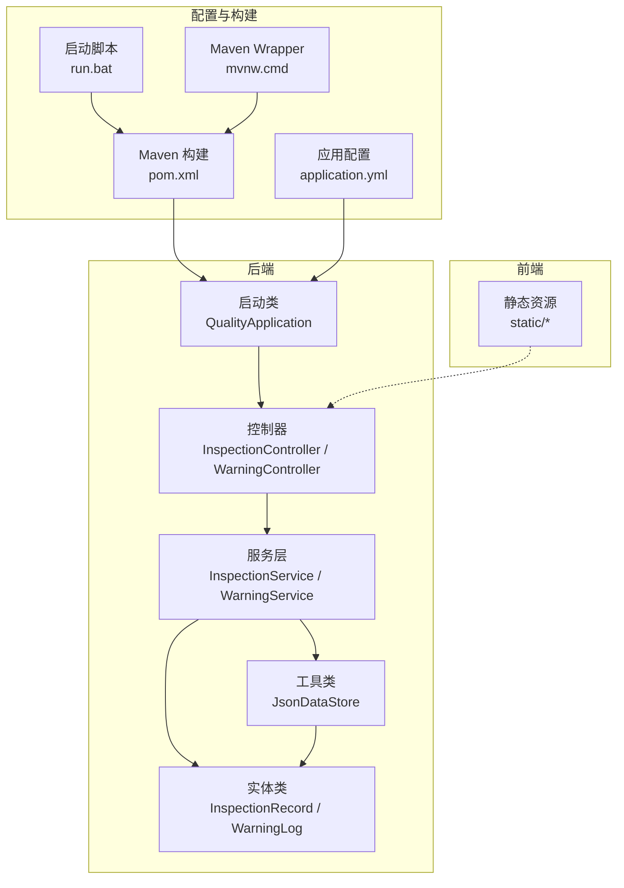
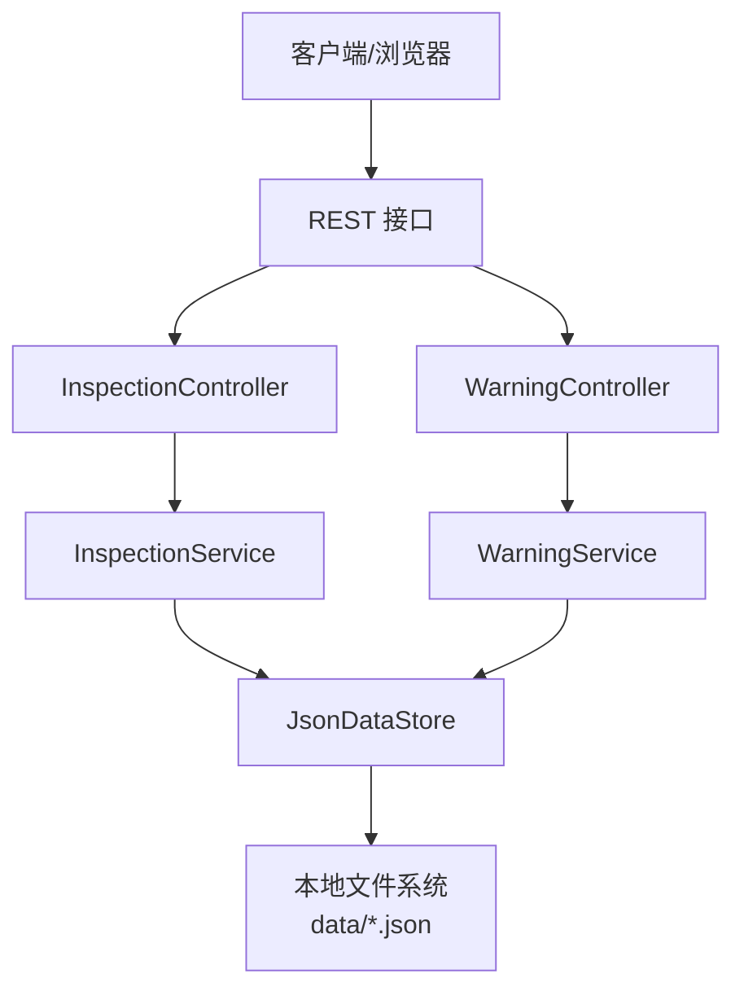
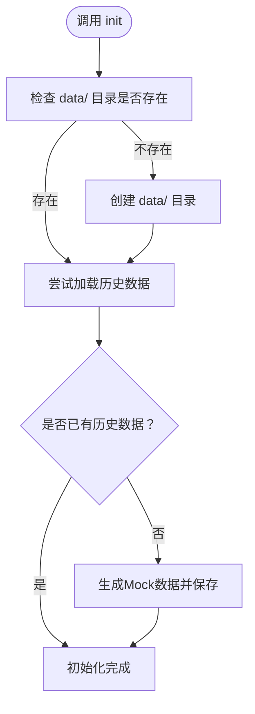
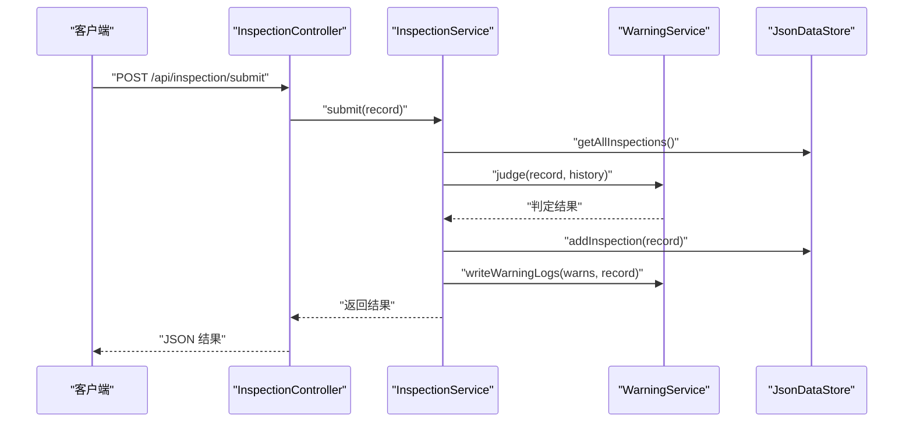
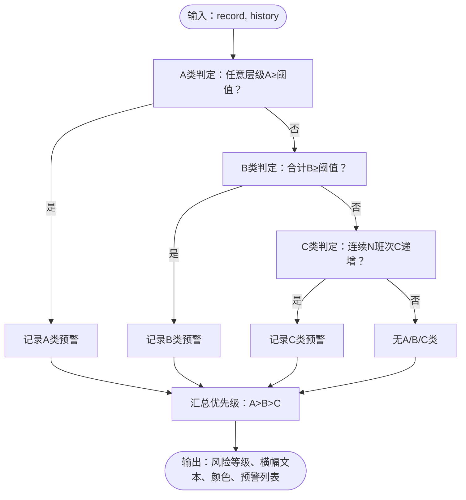
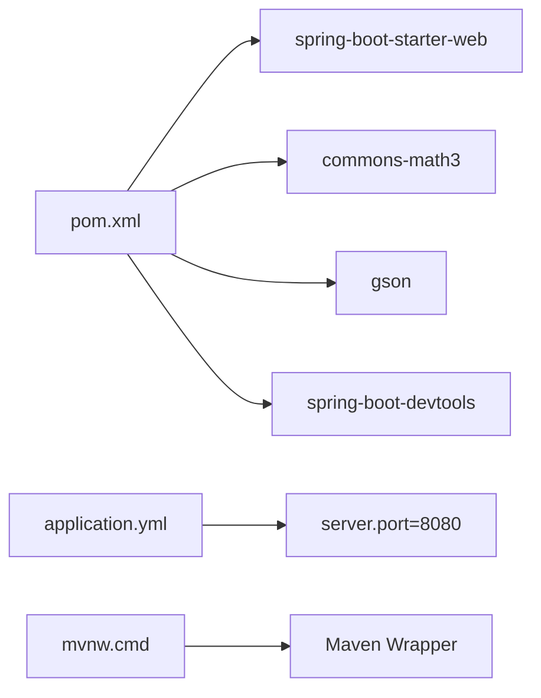

# 故障排查

<cite>
**本文引用的文件**
- [pom.xml](file://pom.xml)
- [application.yml](file://src/main/resources/application.yml)
- [run.bat](file://run.bat)
- [mvnw.cmd](file://mvnw.cmd)
- [QualityApplication.java](file://src/main/java/com/zjzy/quality/QualityApplication.java)
- [JsonDataStore.java](file://src/main/java/com/zjzy/quality/util/JsonDataStore.java)
- [InspectionController.java](file://src/main/java/com/zjzy/quality/controller/InspectionController.java)
- [WarningController.java](file://src/main/java/com/zjzy/quality/controller/WarningController.java)
- [InspectionService.java](file://src/main/java/com/zjzy/quality/service/InspectionService.java)
- [WarningService.java](file://src/main/java/com/zjzy/quality/service/WarningService.java)
- [InspectionRecord.java](file://src/main/java/com/zjzy/quality/entity/InspectionRecord.java)
- [WarningLog.java](file://src/main/java/com/zjzy/quality/entity/WarningLog.java)
</cite>

## 目录
1. [简介](#简介)
2. [项目结构](#项目结构)
3. [核心组件](#核心组件)
4. [架构总览](#架构总览)
5. [详细组件分析](#详细组件分析)
6. [依赖分析](#依赖分析)
7. [性能考虑](#性能考虑)
8. [故障排查指南](#故障排查指南)
9. [结论](#结论)
10. [附录](#附录)

## 简介
本指南面向运维与开发人员，围绕“卷烟全维度质检智能预警预判系统”的启动、运行、性能与日志进行系统性故障排查与问题诊断。内容覆盖：
- 启动阶段：Java环境、端口占用、Maven依赖下载失败等
- 运行阶段：内存溢出、文件权限、磁盘空间不足等
- 性能阶段：响应缓慢、高CPU使用率、内存泄漏等
- 日志分析：如何通过日志快速定位问题根因
- 监控工具：常用系统监控手段与建议

## 项目结构
该项目为基于 Spring Boot 的单体应用，采用前后端静态资源分离（前端位于 static 目录），后端通过 REST 接口提供数据与业务能力。

**图表来源**
- [QualityApplication.java:1-25](file://src/main/java/com/zjzy/quality/QualityApplication.java#L1-L25)
- [InspectionController.java:1-35](file://src/main/java/com/zjzy/quality/controller/InspectionController.java#L1-L35)
- [WarningController.java:1-37](file://src/main/java/com/zjzy/quality/controller/WarningController.java#L1-L37)
- [InspectionService.java:1-102](file://src/main/java/com/zjzy/quality/service/InspectionService.java#L1-L102)
- [WarningService.java:1-140](file://src/main/java/com/zjzy/quality/service/WarningService.java#L1-L140)
- [JsonDataStore.java:1-222](file://src/main/java/com/zjzy/quality/util/JsonDataStore.java#L1-L222)
- [InspectionRecord.java:1-154](file://src/main/java/com/zjzy/quality/entity/InspectionRecord.java#L1-L154)
- [WarningLog.java:1-44](file://src/main/java/com/zjzy/quality/entity/WarningLog.java#L1-L44)
- [pom.xml:1-77](file://pom.xml#L1-L77)
- [application.yml:1-24](file://src/main/resources/application.yml#L1-L24)
- [run.bat:1-35](file://run.bat#L1-L35)
- [mvnw.cmd:1-16](file://mvnw.cmd#L1-L16)

**章节来源**
- [pom.xml:1-77](file://pom.xml#L1-L77)
- [application.yml:1-24](file://src/main/resources/application.yml#L1-L24)
- [run.bat:1-35](file://run.bat#L1-L35)
- [mvnw.cmd:1-16](file://mvnw.cmd#L1-L16)
- [QualityApplication.java:1-25](file://src/main/java/com/zjzy/quality/QualityApplication.java#L1-L25)

## 核心组件
- 启动类与入口：负责初始化数据存储并在启动后输出提示信息。
- 控制器：提供 /api/inspection 与 /api/warning 两个 REST 接口，分别处理质检数据提交与查询、预警横幅与日志查询。
- 服务层：封装业务逻辑，包括数据提交、历史数据分析、预警判定与日志写入。
- 工具类：基于 JSON 的本地持久化，负责 data/ 目录下的 inspection_data.json 与 warning_log.json 的读写。
- 实体类：定义质检记录与预警日志的数据模型。

**章节来源**
- [QualityApplication.java:1-25](file://src/main/java/com/zjzy/quality/QualityApplication.java#L1-L25)
- [InspectionController.java:1-35](file://src/main/java/com/zjzy/quality/controller/InspectionController.java#L1-L35)
- [WarningController.java:1-37](file://src/main/java/com/zjzy/quality/controller/WarningController.java#L1-L37)
- [InspectionService.java:1-102](file://src/main/java/com/zjzy/quality/service/InspectionService.java#L1-L102)
- [WarningService.java:1-140](file://src/main/java/com/zjzy/quality/service/WarningService.java#L1-L140)
- [JsonDataStore.java:1-222](file://src/main/java/com/zjzy/quality/util/JsonDataStore.java#L1-L222)
- [InspectionRecord.java:1-154](file://src/main/java/com/zjzy/quality/entity/InspectionRecord.java#L1-L154)
- [WarningLog.java:1-44](file://src/main/java/com/zjzy/quality/entity/WarningLog.java#L1-L44)

## 架构总览
系统采用典型的三层架构：Web 层（控制器）、业务层（服务）、数据访问层（工具类）。数据以 JSON 文件形式持久化于 data/ 目录，启动时加载并支持 Mock 数据生成。

**图表来源**
- [InspectionController.java:1-35](file://src/main/java/com/zjzy/quality/controller/InspectionController.java#L1-L35)
- [WarningController.java:1-37](file://src/main/java/com/zjzy/quality/controller/WarningController.java#L1-L37)
- [InspectionService.java:1-102](file://src/main/java/com/zjzy/quality/service/InspectionService.java#L1-L102)
- [WarningService.java:1-140](file://src/main/java/com/zjzy/quality/service/WarningService.java#L1-L140)
- [JsonDataStore.java:1-222](file://src/main/java/com/zjzy/quality/util/JsonDataStore.java#L1-L222)

## 详细组件分析

### 组件A：数据持久化与初始化（JsonDataStore）
- 功能要点
  - 在用户工作目录下创建 data/ 目录，确保存在后再进行读写。
  - 支持加载 inspection_data.json 与 warning_log.json；若不存在则生成 Mock 数据并初始化 ID 序列。
  - 提供并发安全的读写接口，并在异常时打印错误信息。
- 关键路径
  - 初始化：[init:46-62](file://src/main/java/com/zjzy/quality/util/JsonDataStore.java#L46-L62)
  - 加载/保存：[loadInspectionData/loadWarningData/saveInspectionData/saveWarningData:96-149](file://src/main/java/com/zjzy/quality/util/JsonDataStore.java#L96-L149)
  - Mock 数据生成：[generateMockData:153-220](file://src/main/java/com/zjzy/quality/util/JsonDataStore.java#L153-L220)

**图表来源**
- [JsonDataStore.java:46-62](file://src/main/java/com/zjzy/quality/util/JsonDataStore.java#L46-L62)
- [JsonDataStore.java:153-220](file://src/main/java/com/zjzy/quality/util/JsonDataStore.java#L153-L220)

**章节来源**
- [JsonDataStore.java:1-222](file://src/main/java/com/zjzy/quality/util/JsonDataStore.java#L1-L222)

### 组件B：质检数据提交流程（InspectionController → InspectionService）
- 功能要点
  - 提交接口接收 InspectionRecord，调用服务层进行历史数据读取、预警判定、数据落盘与日志写入。
  - 返回包含风险等级、横幅文案、横幅颜色与预警明细的结果。
- 关键路径
  - 控制器提交：[submit:21-24](file://src/main/java/com/zjzy/quality/controller/InspectionController.java#L21-L24)
  - 服务层提交：[submit:20-44](file://src/main/java/com/zjzy/quality/service/InspectionService.java#L20-L44)
  - 预警判定：[judge:23-99](file://src/main/java/com/zjzy/quality/service/WarningService.java#L23-L99)
  - 日志写入：[writeWarningLogs:105-121](file://src/main/java/com/zjzy/quality/service/WarningService.java#L105-L121)

**图表来源**
- [InspectionController.java:21-24](file://src/main/java/com/zjzy/quality/controller/InspectionController.java#L21-L24)
- [InspectionService.java:20-44](file://src/main/java/com/zjzy/quality/service/InspectionService.java#L20-L44)
- [WarningService.java:23-99](file://src/main/java/com/zjzy/quality/service/WarningService.java#L23-L99)
- [JsonDataStore.java:70-75](file://src/main/java/com/zjzy/quality/util/JsonDataStore.java#L70-L75)

**章节来源**
- [InspectionController.java:1-35](file://src/main/java/com/zjzy/quality/controller/InspectionController.java#L1-L35)
- [InspectionService.java:1-102](file://src/main/java/com/zjzy/quality/service/InspectionService.java#L1-L102)
- [WarningService.java:1-140](file://src/main/java/com/zjzy/quality/service/WarningService.java#L1-L140)
- [JsonDataStore.java:1-222](file://src/main/java/com/zjzy/quality/util/JsonDataStore.java#L1-L222)

### 组件C：预警判定与横幅状态（WarningService）
- 功能要点
  - 严格依据 A/B/C/D 四级标准进行判定，优先级 A>B>C。
  - 仅对触发 A/B/C 类的记录写入预警日志。
  - 提供当前横幅状态查询接口。
- 关键路径
  - 判定主流程：[judge:23-99](file://src/main/java/com/zjzy/quality/service/WarningService.java#L23-L99)
  - 横幅状态：[getCurrentBanner:126-138](file://src/main/java/com/zjzy/quality/service/WarningService.java#L126-L138)
  - 日志写入：[writeWarningLogs:105-121](file://src/main/java/com/zjzy/quality/service/WarningService.java#L105-L121)

**图表来源**
- [WarningService.java:23-99](file://src/main/java/com/zjzy/quality/service/WarningService.java#L23-L99)

**章节来源**
- [WarningService.java:1-140](file://src/main/java/com/zjzy/quality/service/WarningService.java#L1-L140)

## 依赖分析
- 构建与运行
  - 使用 Maven Wrapper（mvnw.cmd）自动下载并使用 Maven，避免手工安装 Maven。
  - Spring Boot 2.7.x + JDK 1.8，依赖 Web、Apache Commons Math3、Gson、DevTools（开发用）。
- 启动与端口
  - 默认端口 8080，可通过配置文件修改。
- 外部依赖点
  - 无外部数据库或消息中间件，纯本地文件存储。

**图表来源**
- [pom.xml:30-65](file://pom.xml#L30-L65)
- [application.yml:4-5](file://src/main/resources/application.yml#L4-L5)
- [mvnw.cmd:1-16](file://mvnw.cmd#L1-L16)

**章节来源**
- [pom.xml:1-77](file://pom.xml#L1-L77)
- [application.yml:1-24](file://src/main/resources/application.yml#L1-L24)
- [mvnw.cmd:1-16](file://mvnw.cmd#L1-L16)

## 性能考虑
- 数据规模与内存
  - 所有数据均驻留在内存缓存中，历史数据越多，内存占用越高。建议控制历史数据量或引入分页/滚动加载策略。
- I/O 开销
  - 每次新增都会触发一次 JSON 文件写入，频繁提交可能造成磁盘写压力。可考虑批量写入或异步落盘。
- CPU 使用
  - 预警判定涉及循环与数组计算，数据量增大时 CPU 占用上升。可在判定逻辑中增加早期退出与缓存热点数据。
- 并发与锁
  - 关键方法使用 synchronized，避免并发写导致的数据错乱，但也会带来串行化开销。可评估读写分离或更细粒度锁。
- 前端渲染
  - 图表渲染依赖前端 JS，大数据量时渲染卡顿。建议后端提供聚合数据或限制展示窗口大小。

[本节为通用性能指导，不直接分析具体文件，故无“章节来源”]

## 故障排查指南

### 启动阶段问题
- Java 环境缺失或版本不匹配
  - 症状：启动脚本报错“未检测到Java环境”。
  - 排查：确认已安装 JDK 1.8，设置 JAVA_HOME 与 PATH。
  - 参考：[run.bat:9-24](file://run.bat#L9-L24)
- 端口被占用
  - 症状：启动后无法访问或端口冲突。
  - 排查：修改 application.yml 中 server.port，默认 8080；或释放占用端口。
  - 参考：[application.yml:4-5](file://src/main/resources/application.yml#L4-L5)
- Maven 依赖下载失败
  - 症状：首次启动时网络超时或下载失败。
  - 排查：使用 mvnw.cmd 自动下载 Maven；检查网络代理；清理本地仓库缓存后重试。
  - 参考：[mvnw.cmd:1-16](file://mvnw.cmd#L1-L16)，[pom.xml:30-65](file://pom.xml#L30-L65)
- 启动后立即退出
  - 症状：控制台短暂输出即结束。
  - 排查：查看 run.bat 是否 pause 前的错误；确认 Spring Boot 插件可用。
  - 参考：[run.bat:32-34](file://run.bat#L32-L34)，[pom.xml:67-75](file://pom.xml#L67-L75)

**章节来源**
- [run.bat:1-35](file://run.bat#L1-L35)
- [application.yml:1-24](file://src/main/resources/application.yml#L1-L24)
- [mvnw.cmd:1-16](file://mvnw.cmd#L1-L16)
- [pom.xml:1-77](file://pom.xml#L1-L77)

### 运行时错误
- 内存溢出（OOM）
  - 症状：堆内存不足导致进程崩溃或频繁 GC。
  - 排查：减少历史数据量；优化对象池与缓存；必要时启用大对象区参数。
  - 参考：[JsonDataStore.java:31-37](file://src/main/java/com/zjzy/quality/util/JsonDataStore.java#L31-L37)
- 文件权限不足
  - 症状：无法创建 data/ 目录或写入 inspection_data.json/warning_log.json。
  - 排查：以管理员身份运行或调整目录权限；确保工作目录可写。
  - 参考：[JsonDataStore.java:48-51](file://src/main/java/com/zjzy/quality/util/JsonDataStore.java#L48-L51)
- 磁盘空间不足
  - 症状：写入失败或抛出 IOException。
  - 排查：清理磁盘空间；监控 data/ 目录增长趋势；定期归档历史数据。
  - 参考：[JsonDataStore.java:135-149](file://src/main/java/com/zjzy/quality/util/JsonDataStore.java#L135-L149)
- 端口占用与防火墙
  - 症状：访问 404 或连接被拒绝。
  - 排查：netstat 查看端口；关闭占用进程；放通防火墙。
  - 参考：[application.yml:4-5](file://src/main/resources/application.yml#L4-L5)

**章节来源**
- [JsonDataStore.java:1-222](file://src/main/java/com/zjzy/quality/util/JsonDataStore.java#L1-L222)
- [application.yml:1-24](file://src/main/resources/application.yml#L1-L24)

### 性能问题
- 响应缓慢
  - 症状：接口延迟高。
  - 排查：检查历史数据量；优化前端请求窗口；减少一次性返回大量数据。
  - 参考：[InspectionService.java:49-51](file://src/main/java/com/zjzy/quality/service/InspectionService.java#L49-L51)
- 高 CPU 使用率
  - 症状：CPU 占用长时间偏高。
  - 排查：分析判定逻辑瓶颈；减少不必要的数组复制；缓存历史统计。
  - 参考：[WarningService.java:46-73](file://src/main/java/com/zjzy/quality/service/WarningService.java#L46-L73)
- 内存泄漏
  - 症状：内存持续增长。
  - 排查：确认缓存容量上限；避免持有历史快照的长生命周期引用；定期 GC。
  - 参考：[JsonDataStore.java:31-37](file://src/main/java/com/zjzy/quality/util/JsonDataStore.java#L31-L37)

**章节来源**
- [InspectionService.java:1-102](file://src/main/java/com/zjzy/quality/service/InspectionService.java#L1-L102)
- [WarningService.java:1-140](file://src/main/java/com/zjzy/quality/service/WarningService.java#L1-L140)
- [JsonDataStore.java:1-222](file://src/main/java/com/zjzy/quality/util/JsonDataStore.java#L1-L222)

### 日志分析技巧
- 启动日志
  - 关注 Spring Boot 启动信息与端口绑定情况；如遇异常，查看异常栈。
  - 参考：[QualityApplication.java:14-23](file://src/main/java/com/zjzy/quality/QualityApplication.java#L14-L23)
- 数据加载/保存异常
  - 出现“数据加载异常/数据保存异常”提示，通常由文件损坏或权限问题引起。
  - 参考：[JsonDataStore.java:109-113](file://src/main/java/com/zjzy/quality/util/JsonDataStore.java#L109-L113)，[JsonDataStore.java:139-141](file://src/main/java/com/zjzy/quality/util/JsonDataStore.java#L139-L141)
- 预警日志
  - 仅记录 A/B/C 类预警，便于质量追溯；可按日期/机台筛选。
  - 参考：[WarningService.java:105-121](file://src/main/java/com/zjzy/quality/service/WarningService.java#L105-L121)，[WarningController.java:33-36](file://src/main/java/com/zjzy/quality/controller/WarningController.java#L33-L36)

**章节来源**
- [QualityApplication.java:1-25](file://src/main/java/com/zjzy/quality/QualityApplication.java#L1-L25)
- [JsonDataStore.java:1-222](file://src/main/java/com/zjzy/quality/util/JsonDataStore.java#L1-L222)
- [WarningService.java:1-140](file://src/main/java/com/zjzy/quality/service/WarningService.java#L1-L140)
- [WarningController.java:1-37](file://src/main/java/com/zjzy/quality/controller/WarningController.java#L1-L37)

### 系统监控工具使用
- 进程与端口
  - 使用任务管理器/资源监视器观察 CPU/内存；使用 netstat/lsof 查看端口占用。
- 文件系统
  - 监控 data/ 目录大小变化；设置磁盘配额告警。
- 应用健康
  - 启用 Actuator（如需）暴露健康与指标端点；结合日志聚合平台统一收集。
- 前端性能
  - 使用浏览器开发者工具分析网络与渲染耗时；对大数据量图表进行虚拟滚动或服务端聚合。

[本节为通用监控建议，不直接分析具体文件，故无“章节来源”]

## 结论
本系统以本地 JSON 存储为核心，具备清晰的启动与运行流程。故障排查应从环境与依赖入手，逐步深入到数据持久化、业务判定与前端渲染。通过合理的监控与日志策略，可快速定位并解决问题，保障生产稳定运行。

## 附录
- 快速检查清单
  - Java 环境：JDK 1.8，JAVA_HOME 配置正确
  - 端口：server.port 未被占用
  - 依赖：首次启动允许 Maven 下载，网络正常
  - 权限：工作目录可写，data/ 目录存在
  - 空间：磁盘剩余充足
  - 日志：关注启动与数据 I/O 异常信息

[本节为总结性内容，不直接分析具体文件，故无“章节来源”]