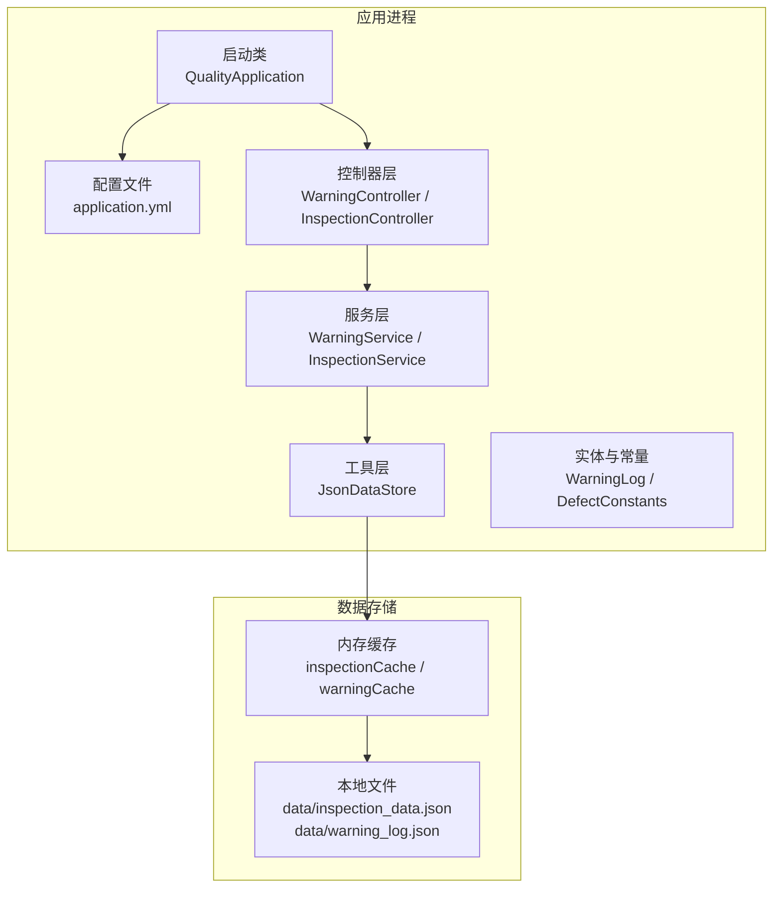
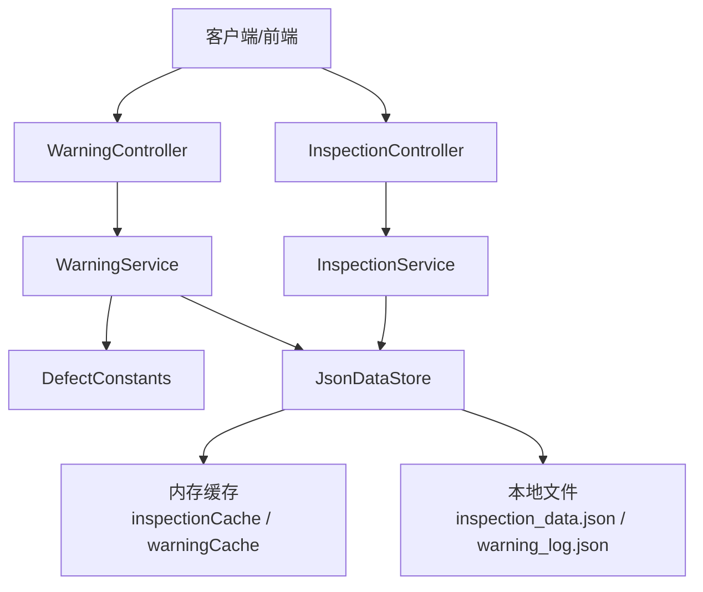
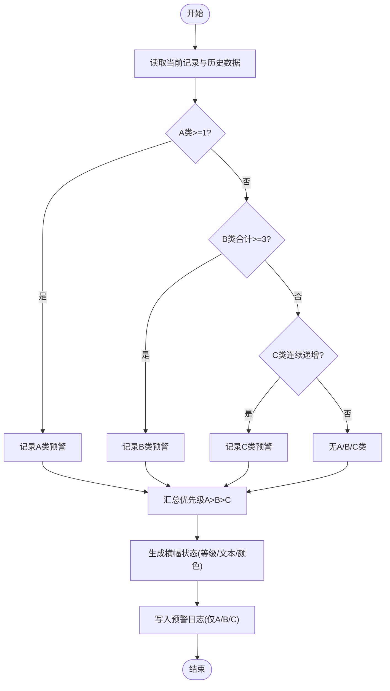
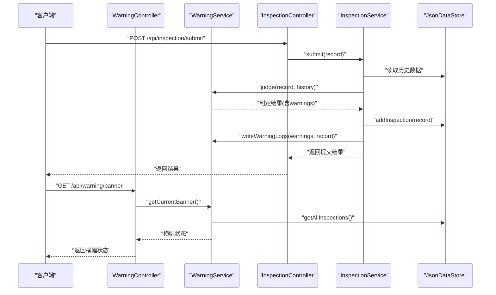
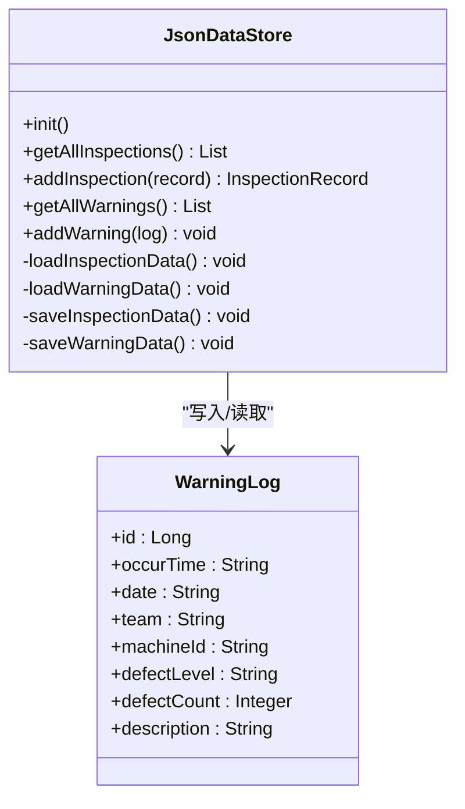
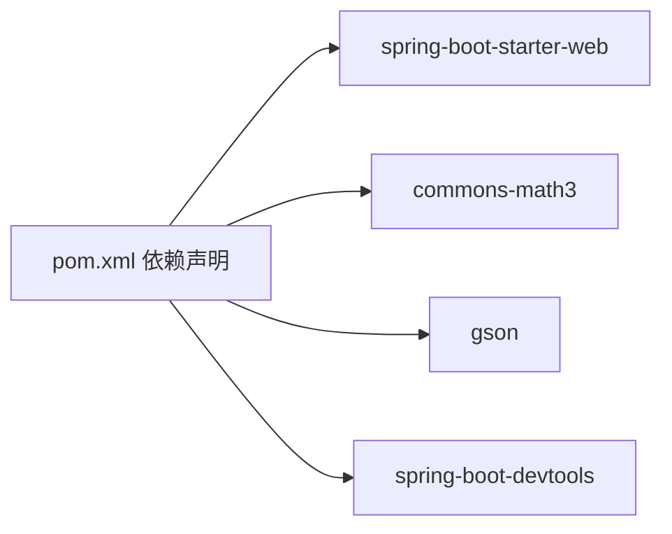

# 监控告警

<cite>
**本文引用的文件**
- [QualityApplication.java](file://src/main/java/com/zjzy/quality/QualityApplication.java)
- [application.yml](file://src/main/resources/application.yml)
- [pom.xml](file://pom.xml)
- [WarningController.java](file://src/main/java/com/zjzy/quality/controller/WarningController.java)
- [InspectionController.java](file://src/main/java/com/zjzy/quality/controller/InspectionController.java)
- [WarningService.java](file://src/main/java/com/zjzy/quality/service/WarningService.java)
- [InspectionService.java](file://src/main/java/com/zjzy/quality/service/InspectionService.java)
- [JsonDataStore.java](file://src/main/java/com/zjzy/quality/util/JsonDataStore.java)
- [WarningLog.java](file://src/main/java/com/zjzy/quality/entity/WarningLog.java)
- [DefectConstants.java](file://src/main/java/com/zjzy/quality/constant/DefectConstants.java)
</cite>

## 目录
1. [简介](#简介)
2. [项目结构](#项目结构)
3. [核心组件](#核心组件)
4. [架构总览](#架构总览)
5. [详细组件分析](#详细组件分析)
6. [依赖分析](#依赖分析)
7. [性能考虑](#性能考虑)
8. [故障排查指南](#故障排查指南)
9. [结论](#结论)
10. [附录](#附录)

## 简介
本文件面向“卷烟全维度质检智能预警预判系统”的监控与告警机制，目标是帮助运维与开发人员理解当前系统在健康检查、日志管理、预警状态监控与性能指标方面的现状，并给出可落地的扩展建议。当前系统未集成Spring Boot Actuator，也未实现外部监控平台对接；但其预警判定与日志落盘逻辑清晰，具备良好的扩展基础。

## 项目结构
系统采用Spring Boot单体架构，控制器层负责对外HTTP接口，服务层编排业务流程，工具层负责数据持久化，常量层集中定义阈值与配色。前端静态资源位于resources/static目录，应用通过application.yml进行基础配置。

图示来源
- [QualityApplication.java:1-25](file://src/main/java/com/zjzy/quality/QualityApplication.java#L1-L25)
- [application.yml:1-24](file://src/main/resources/application.yml#L1-L24)
- [WarningController.java:1-38](file://src/main/java/com/zjzy/quality/controller/WarningController.java#L1-L38)
- [InspectionController.java:1-34](file://src/main/java/com/zjzy/quality/controller/InspectionController.java#L1-L34)
- [WarningService.java:1-140](file://src/main/java/com/zjzy/quality/service/WarningService.java#L1-L140)
- [InspectionService.java:1-37](file://src/main/java/com/zjzy/quality/service/InspectionService.java#L1-L37)
- [JsonDataStore.java:1-222](file://src/main/java/com/zjzy/quality/util/JsonDataStore.java#L1-L222)
- [WarningLog.java:1-44](file://src/main/java/com/zjzy/quality/entity/WarningLog.java#L1-L44)
- [DefectConstants.java:1-76](file://src/main/java/com/zjzy/quality/constant/DefectConstants.java#L1-L76)

章节来源
- [QualityApplication.java:1-25](file://src/main/java/com/zjzy/quality/QualityApplication.java#L1-L25)
- [application.yml:1-24](file://src/main/resources/application.yml#L1-L24)

## 核心组件
- 启动类与入口
  - 应用启动时先初始化数据存储，再启动Spring容器。
- 控制器
  - 预警接口：提供当前风险横幅状态与历史预警日志查询。
  - 质检接口：提交质检数据并返回判定结果。
- 服务层
  - 预警判定：依据A/B/C/D分级规则与连续趋势计算风险等级与横幅状态。
  - 质检编排：提交数据、写入日志、生成横幅状态。
- 工具层
  - JSON数据持久化：内存缓存+文件落盘，支持Mock数据生成。
- 实体与常量
  - 预警日志实体与缺陷分级阈值、物测指标上下限、风险配色等。

章节来源
- [WarningController.java:1-38](file://src/main/java/com/zjzy/quality/controller/WarningController.java#L1-L38)
- [InspectionController.java:1-34](file://src/main/java/com/zjzy/quality/controller/InspectionController.java#L1-L34)
- [WarningService.java:1-140](file://src/main/java/com/zjzy/quality/service/WarningService.java#L1-L140)
- [InspectionService.java:1-37](file://src/main/java/com/zjzy/quality/service/InspectionService.java#L1-L37)
- [JsonDataStore.java:1-222](file://src/main/java/com/zjzy/quality/util/JsonDataStore.java#L1-L222)
- [WarningLog.java:1-44](file://src/main/java/com/zjzy/quality/entity/WarningLog.java#L1-L44)
- [DefectConstants.java:1-76](file://src/main/java/com/zjzy/quality/constant/DefectConstants.java#L1-L76)

## 架构总览
系统采用“控制器-服务-工具”三层架构，数据以JSON文件形式持久化于本地data目录，内存缓存保证读写效率。预警状态通过横幅文本与颜色直观呈现，日志仅记录A/B/C类触发事件，便于追溯与报表。

图示来源
- [WarningController.java:1-38](file://src/main/java/com/zjzy/quality/controller/WarningController.java#L1-L38)
- [InspectionController.java:1-34](file://src/main/java/com/zjzy/quality/controller/InspectionController.java#L1-L34)
- [WarningService.java:1-140](file://src/main/java/com/zjzy/quality/service/WarningService.java#L1-L140)
- [InspectionService.java:1-37](file://src/main/java/com/zjzy/quality/service/InspectionService.java#L1-L37)
- [JsonDataStore.java:1-222](file://src/main/java/com/zjzy/quality/util/JsonDataStore.java#L1-L222)
- [DefectConstants.java:1-76](file://src/main/java/com/zjzy/quality/constant/DefectConstants.java#L1-L76)

## 详细组件分析

### 预警判定与横幅状态
- 判定规则
  - A类：任意层级A类≥1即触发高风险。
  - B类：所有层级B类合计≥3即触发中度风险。
  - C类：连续N班次C类总数严格递增（默认N=3）即触发一般风险。
  - D类：仅统计，不触发预警。
- 结果汇总
  - 按优先级A>B>C，输出风险等级、横幅文本与颜色。
- 日志写入
  - 仅写入A/B/C类触发记录，包含发生时间、日期、班组、机台、缺陷等级、数量与描述。

图示来源
- [WarningService.java:23-99](file://src/main/java/com/zjzy/quality/service/WarningService.java#L23-L99)
- [WarningService.java:105-121](file://src/main/java/com/zjzy/quality/service/WarningService.java#L105-L121)
- [DefectConstants.java:11-18](file://src/main/java/com/zjzy/quality/constant/DefectConstants.java#L11-L18)

章节来源
- [WarningService.java:1-140](file://src/main/java/com/zjzy/quality/service/WarningService.java#L1-L140)
- [DefectConstants.java:1-76](file://src/main/java/com/zjzy/quality/constant/DefectConstants.java#L1-L76)

### HTTP接口与数据流
- 预警接口
  - GET /api/warning/banner：返回当前横幅状态。
  - GET /api/warning/logs：返回全部A/B/C类预警日志。
- 质检接口
  - POST /api/inspection/submit：提交质检数据，返回判定结果。
  - GET /api/inspection/list：返回全部历史质检数据。

图示来源
- [WarningController.java:24-27](file://src/main/java/com/zjzy/quality/controller/WarningController.java#L24-L27)
- [WarningController.java:33-36](file://src/main/java/com/zjzy/quality/controller/WarningController.java#L33-L36)
- [InspectionController.java:21-24](file://src/main/java/com/zjzy/quality/controller/InspectionController.java#L21-L24)
- [InspectionController.java:29-33](file://src/main/java/com/zjzy/quality/controller/InspectionController.java#L29-L33)
- [InspectionService.java:19-37](file://src/main/java/com/zjzy/quality/service/InspectionService.java#L19-L37)
- [WarningService.java:126-138](file://src/main/java/com/zjzy/quality/service/WarningService.java#L126-L138)
- [JsonDataStore.java:66-92](file://src/main/java/com/zjzy/quality/util/JsonDataStore.java#L66-L92)

章节来源
- [WarningController.java:1-38](file://src/main/java/com/zjzy/quality/controller/WarningController.java#L1-L38)
- [InspectionController.java:1-34](file://src/main/java/com/zjzy/quality/controller/InspectionController.java#L1-L34)
- [InspectionService.java:1-37](file://src/main/java/com/zjzy/quality/service/InspectionService.java#L1-L37)
- [WarningService.java:1-140](file://src/main/java/com/zjzy/quality/service/WarningService.java#L1-L140)
- [JsonDataStore.java:1-222](file://src/main/java/com/zjzy/quality/util/JsonDataStore.java#L1-L222)

### 数据持久化与日志
- 存储位置
  - data/inspection_data.json：质检记录。
  - data/warning_log.json：预警日志。
- 读写策略
  - 启动时从文件加载至内存缓存；每次变更同步写回文件。
  - Mock数据用于首次启动或无历史数据场景。
- 日志内容
  - 仅记录A/B/C类触发项，字段包含发生时间、日期、班组、机台、缺陷等级、数量与描述。

图示来源
- [JsonDataStore.java:46-149](file://src/main/java/com/zjzy/quality/util/JsonDataStore.java#L46-L149)
- [WarningLog.java:7-44](file://src/main/java/com/zjzy/quality/entity/WarningLog.java#L7-L44)

章节来源
- [JsonDataStore.java:1-222](file://src/main/java/com/zjzy/quality/util/JsonDataStore.java#L1-L222)
- [WarningLog.java:1-44](file://src/main/java/com/zjzy/quality/entity/WarningLog.java#L1-L44)

## 依赖分析
- 运行环境
  - Spring Boot 2.7.x（兼容JDK 1.8），Web Starter。
- 第三方库
  - Apache Commons Math3：数学统计与AI预测。
  - Gson：JSON序列化/反序列化。
  - DevTools：开发期热部署。
- 外部依赖
  - 未引入Actuator、Micrometer、日志归集组件（如Logback/Log4j2）。

图示来源
- [pom.xml:30-65](file://pom.xml#L30-L65)

章节来源
- [pom.xml:1-77](file://pom.xml#L1-L77)

## 性能考虑
- 当前实现
  - 内存缓存+文件落盘，适合中小规模数据；大规模并发或高吞吐场景需优化。
  - 未启用异步写入与批处理，I/O可能成为瓶颈。
- 建议优化
  - 引入数据库（如MySQL）替代JSON文件，提升并发与可靠性。
  - 使用连接池、分页查询与索引优化。
  - 对写入路径增加异步队列与批量刷盘策略。
  - 引入缓存层（Redis）减少磁盘压力。

## 故障排查指南
- 启动阶段
  - 检查数据目录data是否存在与权限是否足够。
  - 若inspection_data.json为空，系统会生成Mock数据；确认Mock数据是否符合预期。
- 接口调用
  - 提交质检数据后未见横幅变化：确认历史数据是否正确传入，以及判定阈值是否满足。
  - 预警日志为空：确认是否触发A/B/C类，D类不会写入日志。
- 日志与配置
  - application.yml中日志级别为INFO/WARN，便于定位问题。
  - 如需更细粒度日志，可在相应包名下调整级别。

章节来源
- [JsonDataStore.java:46-62](file://src/main/java/com/zjzy/quality/util/JsonDataStore.java#L46-L62)
- [application.yml:19-23](file://src/main/resources/application.yml#L19-L23)

## 结论
当前系统具备清晰的预警判定与日志落盘能力，但尚未接入系统健康监控与外部告警通道。建议在保持现有判定逻辑不变的前提下，逐步引入Actuator与监控平台，完善健康检查、日志轮转与性能指标采集，形成闭环的监控告警体系。

## 附录

### Spring Boot Actuator 配置建议（未在仓库中实现）
- 添加依赖
  - 在pom.xml中引入spring-boot-starter-actuator。
- 健康检查
  - 开启health端点，暴露应用与磁盘空间等健康状态。
- 指标采集
  - 开启metrics端点，结合Micrometer导出至Prometheus/Grafana。
- 安全
  - 限制management端口与访问路径，启用认证与加密传输。

章节来源
- [pom.xml:30-65](file://pom.xml#L30-L65)

### 日志配置与轮转（当前配置）
- 日志级别
  - application.yml中已设置包级别日志级别，便于区分业务与框架日志。
- 文件轮转
  - 当前未配置Logback/Log4j2轮转策略；建议在生产环境启用按大小/时间轮转与保留策略，避免磁盘占用过大。

章节来源
- [application.yml:19-23](file://src/main/resources/application.yml#L19-L23)

### 预警状态与阈值
- 四级预警
  - A：高风险；B：中度风险；C：一般风险；D：轻微风险（不触发预警）。
- 触发阈值
  - A类：任意层级A类≥1。
  - B类：所有层级B类合计≥3。
  - C类：连续N班次C类总数严格递增（默认N=3）。
- 风险配色
  - A类-严重缺陷、B类-较重缺陷、C类-一般缺陷、D类-轻微缺陷、安全：Apple风格配色。

章节来源
- [DefectConstants.java:11-18](file://src/main/java/com/zjzy/quality/constant/DefectConstants.java#L11-L18)
- [DefectConstants.java:46-55](file://src/main/java/com/zjzy/quality/constant/DefectConstants.java#L46-L55)

### 性能监控指标与告警规则（建议）
- 关键指标
  - 响应时间：接口P95/P99延迟。
  - 吞吐量：每秒请求量QPS。
  - 错误率：HTTP 5xx/业务异常比例。
  - 资源使用：CPU、内存、磁盘IO、连接数。
- 告警规则
  - 响应时间：P95超过阈值持续一段时间触发告警。
  - 错误率：错误率超过阈值触发告警。
  - 资源使用：CPU/内存/磁盘占用超过阈值触发告警。
- 告警级别
  - 建议与业务影响匹配：P0（系统不可用）、P1（严重）、P2（重要）、P3（一般）。

[本节为通用实践建议，不直接分析具体文件，故无章节来源]