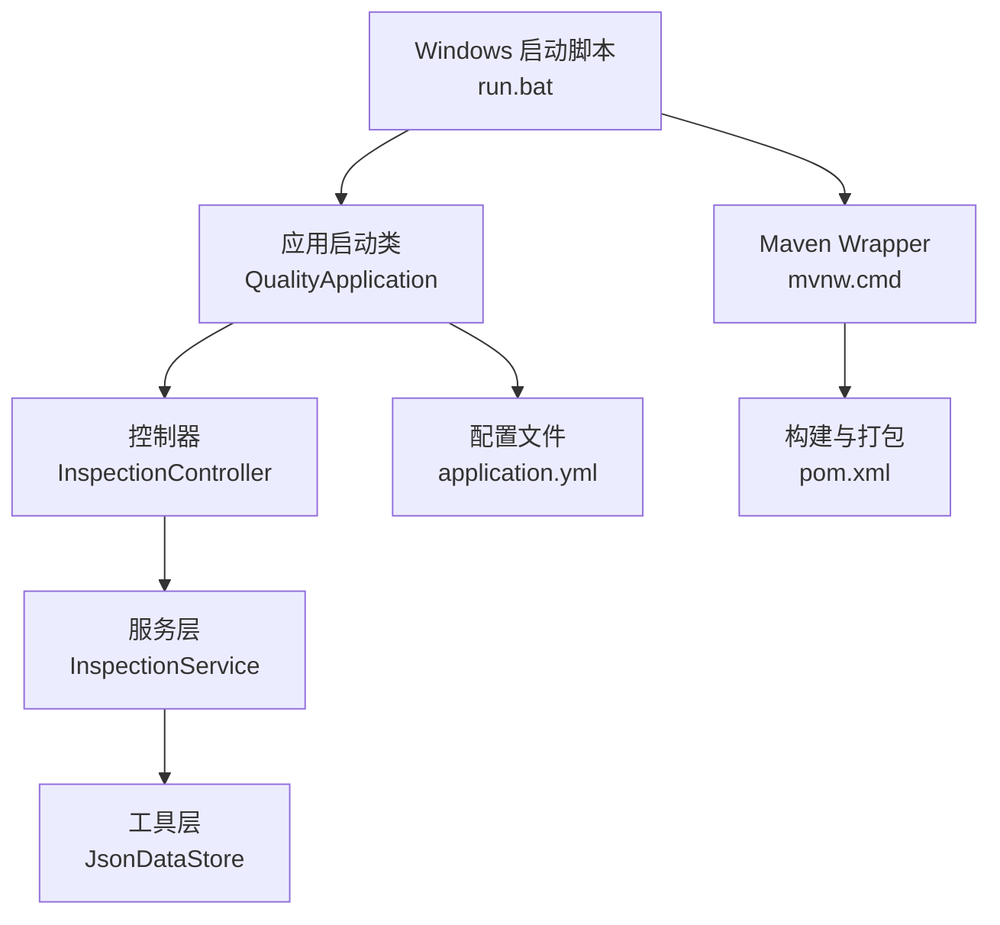
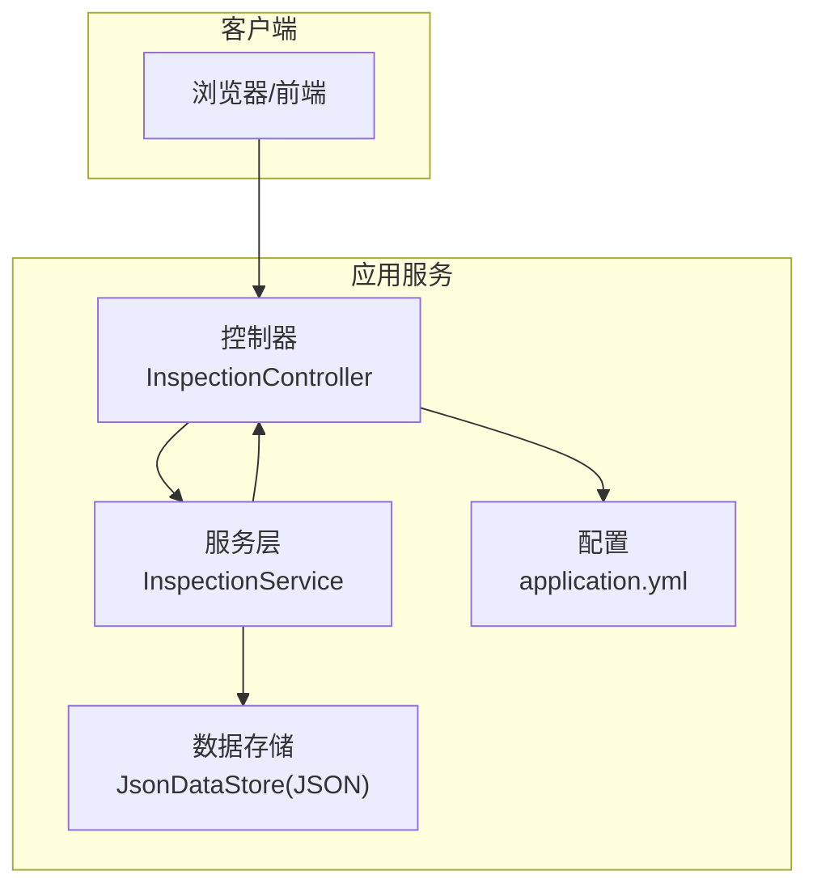
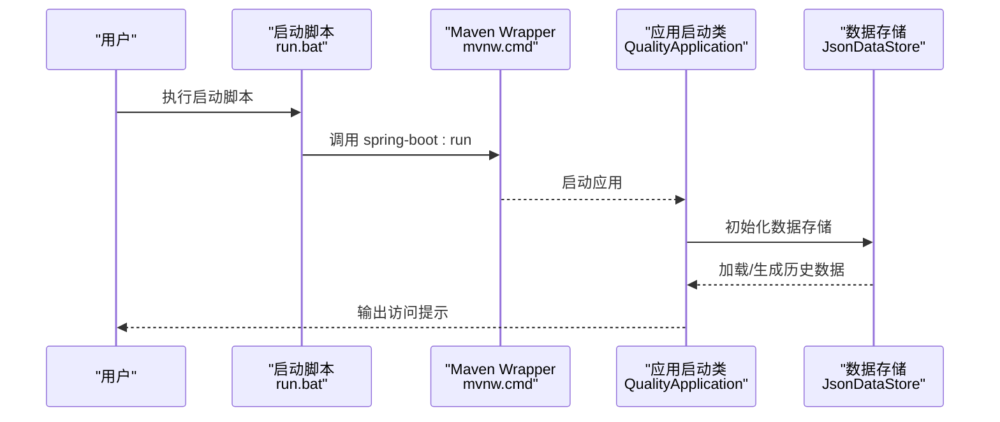
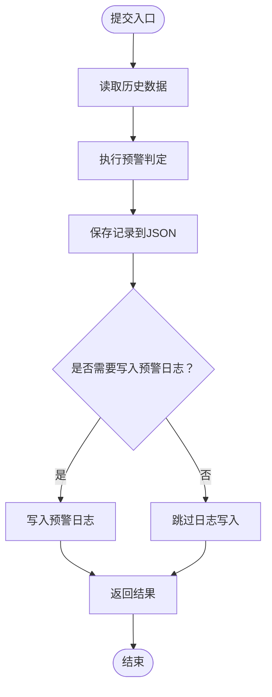
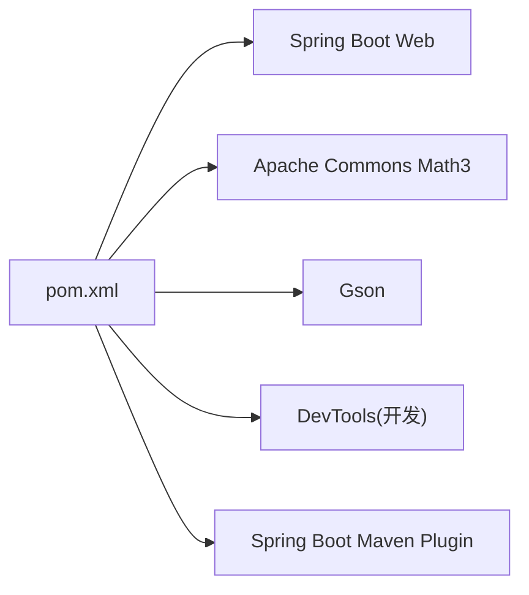

# 部署指南

<cite>
**本文引用的文件**   
- [pom.xml](file://pom.xml)
- [application.yml](file://src/main/resources/application.yml)
- [run.bat](file://run.bat)
- [mvnw.cmd](file://mvnw.cmd)
- [.mvn\wrapper\maven-wrapper.properties](file://.mvn/wrapper/maven-wrapper.properties)
- [QualityApplication.java](file://src/main/java/com/zjzy/quality/QualityApplication.java)
- [JsonDataStore.java](file://src/main/java/com/zjzy/quality/util/JsonDataStore.java)
- [InspectionController.java](file://src/main/java/com/zjzy/quality/controller/InspectionController.java)
- [InspectionService.java](file://src/main/java/com/zjzy/quality/service/InspectionService.java)
</cite>

## 目录
1. [简介](#简介)
2. [项目结构](#项目结构)
3. [核心组件](#核心组件)
4. [架构总览](#架构总览)
5. [详细组件分析](#详细组件分析)
6. [依赖分析](#依赖分析)
7. [性能考虑](#性能考虑)
8. [故障排查指南](#故障排查指南)
9. [结论](#结论)
10. [附录](#附录)

## 简介
本指南面向从开发到生产的部署全流程，覆盖 Windows 环境下的环境检查、Maven Wrapper 使用、项目编译与启动；提供 Linux/Unix 的部署要点与跨平台注意事项；给出 Docker 容器化部署建议（含镜像构建与编排思路），并总结生产环境最佳实践（JVM 参数、端口与静态资源映射等关键配置）。该系统基于 Spring Boot 2.7.x 与 JDK 1.8，采用内嵌 Web 服务器，默认监听 8080 端口，并通过 JSON 文件进行本地数据持久化。

## 项目结构
- 核心模块
  - 应用启动类：负责初始化数据存储并启动 Spring Boot 应用
  - 控制器层：提供 REST 接口，处理质检数据提交与查询
  - 服务层：封装业务逻辑，包含数据持久化、预警判定与统计分析
  - 工具层：基于 Gson 的 JSON 存储工具，支持 Mock 数据与文件读写
  - 配置文件：定义端口、静态资源映射与日志级别
  - 构建脚本：Maven Wrapper 与 Windows 启动批处理脚本

**图表来源**
- [QualityApplication.java:1-25](file://src/main/java/com/zjzy/quality/QualityApplication.java#L1-L25)
- [InspectionController.java:1-35](file://src/main/java/com/zjzy/quality/controller/InspectionController.java#L1-L35)
- [InspectionService.java:1-102](file://src/main/java/com/zjzy/quality/service/InspectionService.java#L1-L102)
- [JsonDataStore.java:1-222](file://src/main/java/com/zjzy/quality/util/JsonDataStore.java#L1-L222)
- [application.yml:1-24](file://src/main/resources/application.yml#L1-L24)
- [pom.xml:1-77](file://pom.xml#L1-L77)
- [mvnw.cmd:1-16](file://mvnw.cmd#L1-L16)
- [run.bat:1-35](file://run.bat#L1-L35)

**章节来源**
- [pom.xml:1-77](file://pom.xml#L1-L77)
- [application.yml:1-24](file://src/main/resources/application.yml#L1-L24)
- [run.bat:1-35](file://run.bat#L1-L35)
- [mvnw.cmd:1-16](file://mvnw.cmd#L1-L16)
- [.mvn\wrapper\maven-wrapper.properties:1-3](file://.mvn/wrapper/maven-wrapper.properties#L1-L3)
- [QualityApplication.java:1-25](file://src/main/java/com/zjzy/quality/QualityApplication.java#L1-L25)
- [JsonDataStore.java:1-222](file://src/main/java/com/zjzy/quality/util/JsonDataStore.java#L1-L222)
- [InspectionController.java:1-35](file://src/main/java/com/zjzy/quality/controller/InspectionController.java#L1-L35)
- [InspectionService.java:1-102](file://src/main/java/com/zjzy/quality/service/InspectionService.java#L1-L102)

## 核心组件
- 应用启动类
  - 在启动时初始化数据存储（加载历史数据或生成 Mock 数据）
  - 启动 Spring Boot 应用，默认监听 8080 端口
- 控制器
  - 提供 /api/inspection/submit（POST）与 /api/inspection/list（GET）接口
- 服务层
  - 提交数据时执行：历史数据读取、预警判定、数据落盘、预警日志写入
  - 提供缺陷分析（饼图+折线图）所需的数据聚合
- 工具层
  - 基于 Gson 的 JSON 文件持久化，分别维护质检记录与预警日志
  - 默认将数据目录置于用户工作目录下的 data 子目录
- 配置文件
  - server.port：默认 8080
  - spring.web.resources.static-locations：classpath:/static/
  - spring.mvc.static-path-pattern：/static/**
  - logging.level：自定义包为 INFO，Spring 框架为 WARN

**章节来源**
- [QualityApplication.java:14-23](file://src/main/java/com/zjzy/quality/QualityApplication.java#L14-L23)
- [InspectionController.java:21-33](file://src/main/java/com/zjzy/quality/controller/InspectionController.java#L21-L33)
- [InspectionService.java:19-44](file://src/main/java/com/zjzy/quality/service/InspectionService.java#L19-L44)
- [JsonDataStore.java:46-62](file://src/main/java/com/zjzy/quality/util/JsonDataStore.java#L46-L62)
- [application.yml:4-23](file://src/main/resources/application.yml#L4-L23)

## 架构总览
系统采用前后端分离的静态资源托管模式：前端静态文件位于 classpath:/static/，由 Spring MVC 提供静态路径映射；后端通过 REST 接口提供数据服务。应用启动后，自动加载或生成 Mock 数据，确保首次运行即可体验。

**图表来源**
- [InspectionController.java:13-34](file://src/main/java/com/zjzy/quality/controller/InspectionController.java#L13-L34)
- [InspectionService.java:12-101](file://src/main/java/com/zjzy/quality/service/InspectionService.java#L12-L101)
- [JsonDataStore.java:20-149](file://src/main/java/com/zjzy/quality/util/JsonDataStore.java#L20-L149)
- [application.yml:4-23](file://src/main/resources/application.yml#L4-L23)

## 详细组件分析

### 组件一：启动与初始化流程
- 启动顺序
  - 启动类在运行前先初始化数据存储
  - 初始化会尝试加载历史数据，若为空则生成 Mock 示例数据
  - 初始化完成后启动 Spring Boot 应用
- 关键点
  - 数据目录位于用户工作目录/data
  - 初始化幂等，避免重复初始化
  - 启动后输出访问提示

**图表来源**
- [run.bat:30-32](file://run.bat#L30-L32)
- [mvnw.cmd:15](file://mvnw.cmd#L15)
- [QualityApplication.java:14-23](file://src/main/java/com/zjzy/quality/QualityApplication.java#L14-L23)
- [JsonDataStore.java:46-62](file://src/main/java/com/zjzy/quality/util/JsonDataStore.java#L46-L62)

**章节来源**
- [run.bat:1-35](file://run.bat#L1-L35)
- [mvnw.cmd:1-16](file://mvnw.cmd#L1-L16)
- [QualityApplication.java:14-23](file://src/main/java/com/zjzy/quality/QualityApplication.java#L14-L23)
- [JsonDataStore.java:46-62](file://src/main/java/com/zjzy/quality/util/JsonDataStore.java#L46-L62)

### 组件二：数据提交与预警流程
- 提交流程
  - 读取历史数据
  - 执行预警判定，得到风险等级与预警列表
  - 将记录写入 JSON 并返回结果
  - 对 A/B/C 类预警写入日志文件
- 复杂度与性能
  - 历史数据读取与写入均为 O(n)，n 为记录数
  - 预警判定与日志写入为 O(1) 操作
  - 整体时间复杂度 O(n)

**图表来源**
- [InspectionService.java:19-44](file://src/main/java/com/zjzy/quality/service/InspectionService.java#L19-L44)
- [JsonDataStore.java:66-75](file://src/main/java/com/zjzy/quality/util/JsonDataStore.java#L66-L75)

**章节来源**
- [InspectionService.java:19-44](file://src/main/java/com/zjzy/quality/service/InspectionService.java#L19-L44)
- [JsonDataStore.java:66-75](file://src/main/java/com/zjzy/quality/util/JsonDataStore.java#L66-L75)

### 组件三：静态资源与访问路径
- 静态资源映射
  - classpath:/static/ 目录下的文件可通过 /static/** 访问
- 访问示例
  - 应用启动后可通过 http://localhost:8080 访问首页
  - 静态资源通过 http://localhost:8080/static/... 访问

**章节来源**
- [application.yml:12-17](file://src/main/resources/application.yml#L12-L17)

## 依赖分析
- 构建与运行
  - 使用 Maven Wrapper，无需全局安装 Maven
  - Spring Boot 插件负责打包与运行
- 运行时依赖
  - Spring Web：提供 Web 服务器与 MVC 能力
  - Apache Commons Math3：用于数学统计与预测
  - Gson：用于 JSON 序列化与反序列化
  - DevTools：开发期热部署（不参与生产）

**图表来源**
- [pom.xml:30-75](file://pom.xml#L30-L75)

**章节来源**
- [pom.xml:30-75](file://pom.xml#L30-L75)

## 性能考虑
- JVM 参数建议（生产）
  - 堆大小：根据数据规模与并发请求调整初始与最大堆
  - GC 策略：优先选择低停顿收集器（如 G1 或 ZGC）
  - 元空间：预留足够元空间以避免类加载失败
  - 线程栈：默认值通常足够，如需大对象可适当增大
- 端口与网络
  - 默认端口 8080，生产环境建议统一出口网关或反向代理
  - 如需多实例部署，注意端口冲突与负载均衡策略
- 静态资源
  - 生产环境建议由 Nginx/Tengine 提供静态资源加速与缓存
  - 合理设置缓存头与压缩策略
- 数据持久化
  - 当前实现为 JSON 文件，适合演示与小规模场景
  - 生产建议迁移到关系型数据库（如 MySQL），并配合连接池与索引优化
- 日志
  - 生产环境建议将日志输出到集中式日志系统（如 ELK/Fluentd）
  - 控制台日志仅保留必要级别，避免影响性能

## 故障排查指南
- 启动失败（Windows）
  - 检查 Java 环境是否安装且版本满足要求
  - 查看启动脚本输出，确认 Maven Wrapper 是否正常下载
  - 若端口被占用，修改 application.yml 中的 server.port
- 数据无法持久化
  - 确认 data 目录存在且具备写权限
  - 检查文件读写异常日志，定位具体文件路径
- 接口异常
  - 检查控制器与服务层日志，确认请求参数与返回结构
  - 使用最小化请求体复现问题，逐步缩小范围
- 性能问题
  - 关注 GC 日志与线程状态
  - 分析静态资源访问与数据库查询瓶颈

**章节来源**
- [run.bat:9-24](file://run.bat#L9-L24)
- [mvnw.cmd:10-13](file://mvnw.cmd#L10-L13)
- [application.yml:4-5](file://src/main/resources/application.yml#L4-L5)
- [JsonDataStore.java:96-149](file://src/main/java/com/zjzy/quality/util/JsonDataStore.java#L96-L149)
- [InspectionController.java:21-33](file://src/main/java/com/zjzy/quality/controller/InspectionController.java#L21-L33)

## 结论
本指南提供了从开发到生产的完整部署路径：Windows 环境通过 Maven Wrapper 与启动脚本快速运行；Linux/Unix 环境遵循相同流程并在容器化方面给出建议；生产环境强调 JVM 参数、端口与静态资源的优化配置。当前实现以 JSON 作为本地存储，适合演示与小规模使用；建议在生产环境中迁移到关系型数据库以获得更好的可靠性与扩展性。

## 附录

### Windows 环境部署步骤
- 环境检查
  - 确保已安装 JDK 1.8，并正确配置 JAVA_HOME 与 PATH
- 编译与启动
  - 执行启动脚本，脚本将自动下载 Maven Wrapper 并运行应用
  - 首次运行会自动下载依赖，耗时取决于网络状况
- 访问应用
  - 启动成功后，访问 http://localhost:8080

**章节来源**
- [run.bat:9-24](file://run.bat#L9-L24)
- [run.bat:30-32](file://run.bat#L30-L32)
- [mvnw.cmd:10-13](file://mvnw.cmd#L10-L13)
- [application.yml:4-5](file://src/main/resources/application.yml#L4-L5)

### Linux/Unix 环境部署要点
- 环境准备
  - 安装 JDK 1.8
  - 确保用户对项目目录具有读写权限（尤其是 data 目录）
- 运行方式
  - 使用 Maven Wrapper 执行构建与启动
  - 可通过 systemd 或 Docker 管理进程生命周期
- 跨平台注意事项
  - 路径分隔符：使用正斜杠或 Java 路径 API
  - 字符集：确保控制台与文件编码一致
  - 权限：保证 data 目录可写，避免启动后无法持久化

**章节来源**
- [mvnw.cmd:10-13](file://mvnw.cmd#L10-L13)
- [JsonDataStore.java:22-24](file://src/main/java/com/zjzy/quality/util/JsonDataStore.java#L22-L24)

### Docker 容器化部署方案
- 镜像构建（建议）
  - 基础镜像：官方 JRE 或 OpenJDK 运行时
  - 复制构建产物（Spring Boot 可执行 JAR）至镜像
  - 暴露端口 8080，设置非 root 用户运行
- docker-compose 编排（建议）
  - 定义服务：应用容器、数据库容器（如需）
  - 映射端口与挂载数据卷（data 目录）
  - 设置健康检查与重启策略
- 注意事项
  - 避免将 data 目录绑定到只读文件系统
  - 生产环境启用只读根文件系统与最小权限原则

[本节为通用容器化建议，不直接对应具体源码文件]

### 生产环境最佳实践清单
- JVM 参数
  - 堆大小：依据数据规模与并发设定
  - GC：优先低停顿收集器
  - 元空间与线程栈：按需预留
- 端口与网络
  - 默认 8080，结合反向代理统一出口
  - 多实例部署时避免端口冲突
- 静态资源
  - 由 Nginx/Tengine 提供静态资源与缓存
- 数据持久化
  - 从 JSON 迁移至关系型数据库，配合连接池与索引
- 日志
  - 集中式日志采集，控制台日志级别

[本节为通用实践建议，不直接对应具体源码文件]