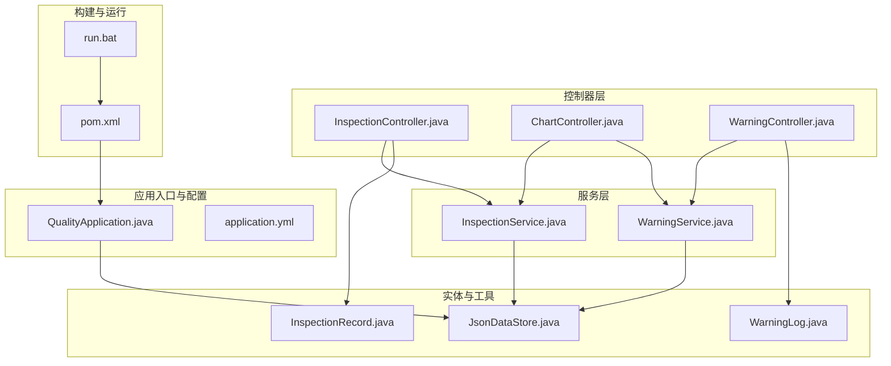
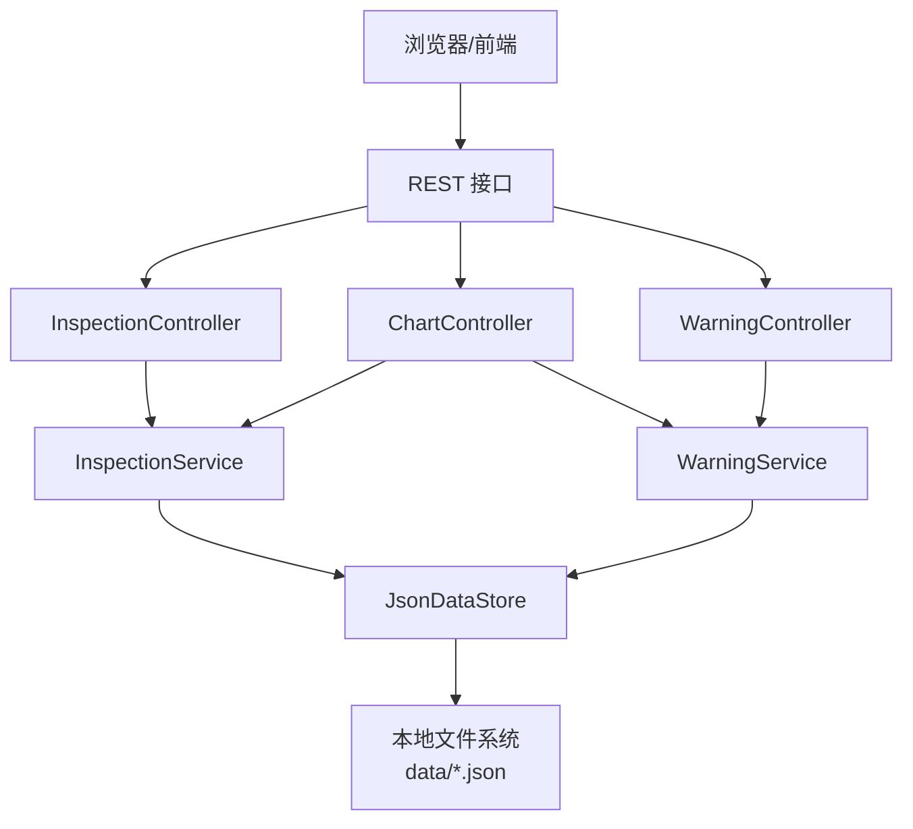
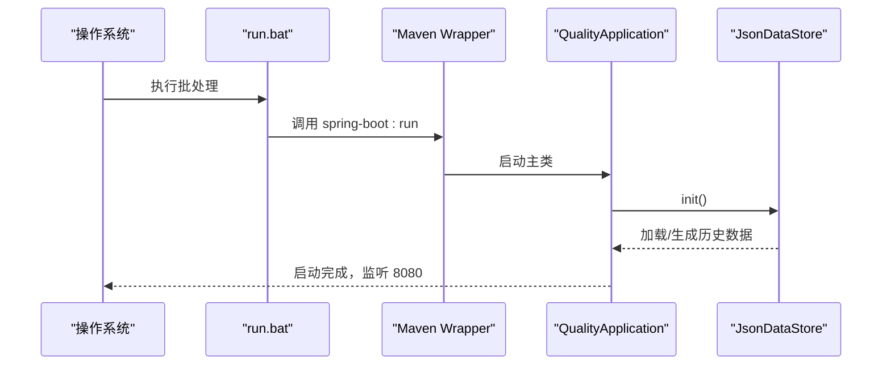
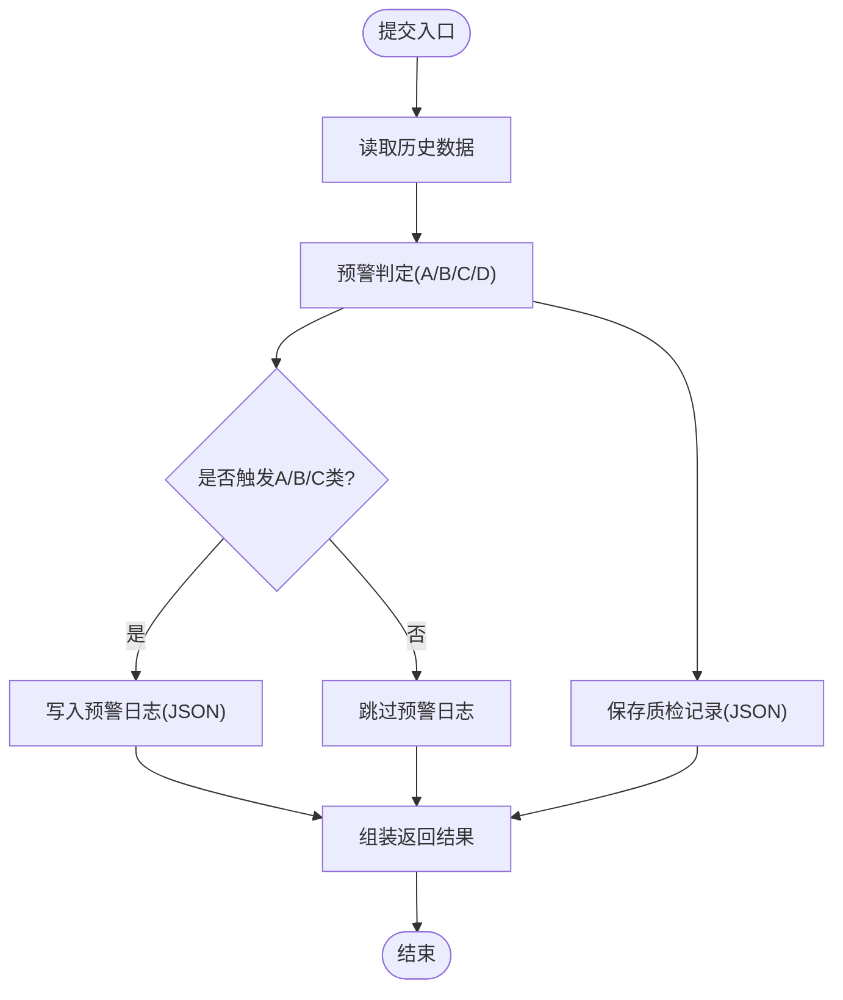
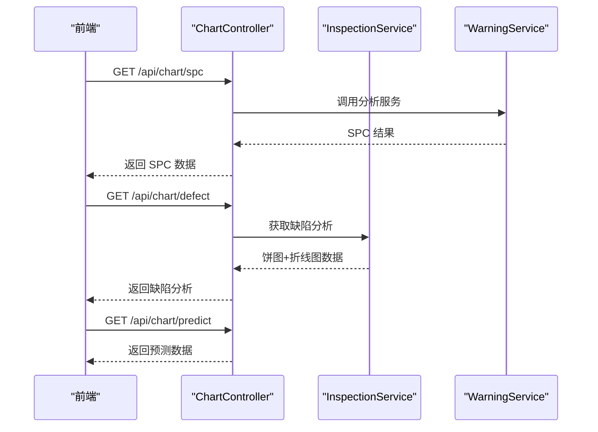
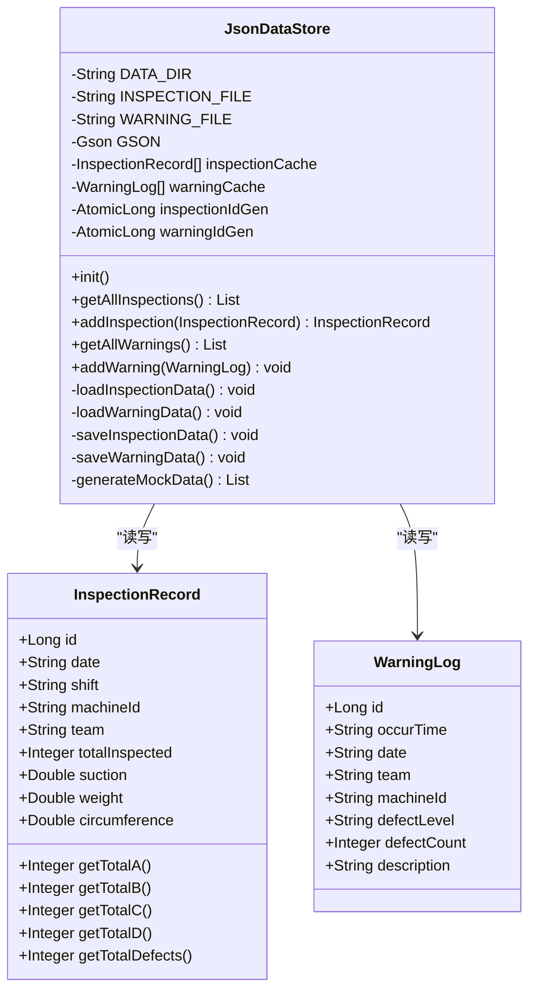
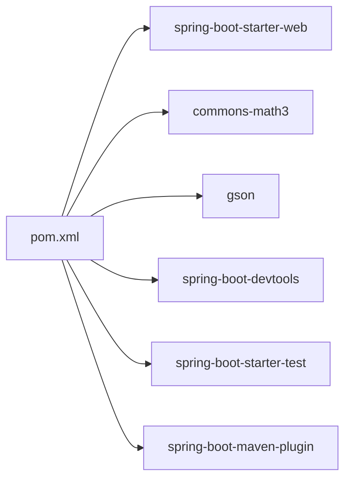

# 部署运维

<cite>
**本文引用的文件**
- [QualityApplication.java](file://src/main/java/com/zjzy/quality/QualityApplication.java)
- [application.yml](file://src/main/resources/application.yml)
- [pom.xml](file://pom.xml)
- [run.bat](file://run.bat)
- [JsonDataStore.java](file://src/main/java/com/zjzy/quality/util/JsonDataStore.java)
- [InspectionController.java](file://src/main/java/com/zjzy/quality/controller/InspectionController.java)
- [ChartController.java](file://src/main/java/com/zjzy/quality/controller/ChartController.java)
- [WarningController.java](file://src/main/java/com/zjzy/quality/controller/WarningController.java)
- [InspectionService.java](file://src/main/java/com/zjzy/quality/service/InspectionService.java)
- [WarningService.java](file://src/main/java/com/zjzy/quality/service/WarningService.java)
- [InspectionRecord.java](file://src/main/java/com/zjzy/quality/entity/InspectionRecord.java)
- [WarningLog.java](file://src/main/java/com/zjzy/quality/entity/WarningLog.java)
</cite>

## 目录
1. [简介](#简介)
2. [项目结构](#项目结构)
3. [核心组件](#核心组件)
4. [架构总览](#架构总览)
5. [详细组件分析](#详细组件分析)
6. [依赖分析](#依赖分析)
7. [性能考虑](#性能考虑)
8. [故障排查指南](#故障排查指南)
9. [结论](#结论)
10. [附录](#附录)

## 简介
本项目为“卷烟全维度质检智能预警预判系统”，采用 Spring Boot 构建，提供 REST 接口以支持质检数据录入、历史查询、SPC 分析、缺陷趋势与 AI 预测，并内置 JSON 文件持久化与 Mock 数据初始化能力。系统默认监听 8080 端口，提供静态页面与前端交互。

## 项目结构
- 后端应用入口与配置
  - 应用入口类负责初始化数据存储并启动 Spring Boot 应用
  - 配置文件定义服务器端口、上下文路径、静态资源映射与日志级别
- 控制器层
  - 质检接口：提交与查询历史
  - 图表接口：SPC 分析、缺陷分析、AI 预测
  - 预警接口：当前风险横幅与预警日志查询
- 服务层
  - 质检服务：提交流程编排、历史查询、缺陷分析
  - 预警服务：A/B/C/D 四级判定、日志写入、横幅状态
- 实体与工具
  - 实体类承载质检与预警日志数据模型
  - JSON 数据存储工具负责本地文件持久化与 Mock 数据生成
- 构建与运行
  - Maven 工程，使用 Spring Boot 插件打包
  - Windows 批处理脚本封装环境检查与启动流程

**图表来源**
- [QualityApplication.java:14-23](file://src/main/java/com/zjzy/quality/QualityApplication.java#L14-L23)
- [application.yml:4-23](file://src/main/resources/application.yml#L4-L23)
- [InspectionController.java:21-33](file://src/main/java/com/zjzy/quality/controller/InspectionController.java#L21-L33)
- [ChartController.java:25-103](file://src/main/java/com/zjzy/quality/controller/ChartController.java#L25-L103)
- [WarningController.java:24-36](file://src/main/java/com/zjzy/quality/controller/WarningController.java#L24-L36)
- [InspectionService.java:19-100](file://src/main/java/com/zjzy/quality/service/InspectionService.java#L19-L100)
- [WarningService.java:23-138](file://src/main/java/com/zjzy/quality/service/WarningService.java#L23-L138)
- [InspectionRecord.java:7-153](file://src/main/java/com/zjzy/quality/entity/InspectionRecord.java#L7-L153)
- [WarningLog.java:7-43](file://src/main/java/com/zjzy/quality/entity/WarningLog.java#L7-L43)
- [JsonDataStore.java:46-149](file://src/main/java/com/zjzy/quality/util/JsonDataStore.java#L46-L149)
- [pom.xml:67-76](file://pom.xml#L67-L76)
- [run.bat:30-34](file://run.bat#L30-L34)

**章节来源**
- [QualityApplication.java:12-23](file://src/main/java/com/zjzy/quality/QualityApplication.java#L12-L23)
- [application.yml:4-23](file://src/main/resources/application.yml#L4-L23)
- [pom.xml:67-76](file://pom.xml#L67-L76)
- [run.bat:9-34](file://run.bat#L9-L34)

## 核心组件
- 应用入口与启动
  - 初始化 JSON 数据存储（加载或生成 Mock 数据）
  - 启动 Spring Boot 应用，默认端口 8080
- 配置管理
  - server.port、context-path、静态资源映射、日志级别
- 数据持久化
  - data 目录下的 inspection_data.json 与 warning_log.json
  - 支持并发安全的读写与自增 ID 生成
- 接口能力
  - /api/inspection 提交与查询
  - /api/chart 提供 SPC、缺陷分析、AI 预测
  - /api/warning 提供横幅与日志

**章节来源**
- [QualityApplication.java:14-23](file://src/main/java/com/zjzy/quality/QualityApplication.java#L14-L23)
- [application.yml:4-23](file://src/main/resources/application.yml#L4-L23)
- [JsonDataStore.java:46-149](file://src/main/java/com/zjzy/quality/util/JsonDataStore.java#L46-L149)
- [InspectionController.java:21-33](file://src/main/java/com/zjzy/quality/controller/InspectionController.java#L21-L33)
- [ChartController.java:25-103](file://src/main/java/com/zjzy/quality/controller/ChartController.java#L25-L103)
- [WarningController.java:24-36](file://src/main/java/com/zjzy/quality/controller/WarningController.java#L24-L36)

## 架构总览
系统采用前后端分离模式：前端静态资源由 Spring Boot 提供，后端通过 REST 接口返回数据；业务逻辑集中在服务层，数据持久化通过 JSON 文件实现。

**图表来源**
- [InspectionController.java:13-34](file://src/main/java/com/zjzy/quality/controller/InspectionController.java#L13-L34)
- [ChartController.java:17-105](file://src/main/java/com/zjzy/quality/controller/ChartController.java#L17-L105)
- [WarningController.java:16-37](file://src/main/java/com/zjzy/quality/controller/WarningController.java#L16-L37)
- [InspectionService.java:12-101](file://src/main/java/com/zjzy/quality/service/InspectionService.java#L12-L101)
- [WarningService.java:15-139](file://src/main/java/com/zjzy/quality/service/WarningService.java#L15-L139)
- [JsonDataStore.java:20-149](file://src/main/java/com/zjzy/quality/util/JsonDataStore.java#L20-L149)

## 详细组件分析

### 组件一：应用启动与初始化
- 启动流程
  - 调用数据存储初始化，确保 data 目录存在并加载/生成历史数据
  - 启动 Spring Boot 应用，打印启动提示
- 配置要点
  - 默认端口 8080，静态资源位于 classpath:/static/
  - 日志级别对业务包输出 INFO，框架输出 WARN

**图表来源**
- [run.bat:30-34](file://run.bat#L30-L34)
- [QualityApplication.java:14-23](file://src/main/java/com/zjzy/quality/QualityApplication.java#L14-L23)
- [JsonDataStore.java:46-62](file://src/main/java/com/zjzy/quality/util/JsonDataStore.java#L46-L62)
- [application.yml:4-17](file://src/main/resources/application.yml#L4-L17)

**章节来源**
- [QualityApplication.java:14-23](file://src/main/java/com/zjzy/quality/QualityApplication.java#L14-L23)
- [run.bat:9-34](file://run.bat#L9-L34)
- [application.yml:4-17](file://src/main/resources/application.yml#L4-L17)

### 组件二：质检数据提交与预警判定
- 提交流程
  - 读取历史数据
  - 调用预警服务进行 A/B/C/D 判定
  - 写入质检记录 JSON
  - 对 A/B/C 类预警写入预警日志
  - 返回结果（含风险等级、横幅文本/颜色、预警明细）
- 预警规则
  - A 类：任意层级 A 类≥阈值 → 高风险
  - B 类：合计≥阈值 → 中度风险
  - C 类：连续 N 班次 C 类总数持续上涨 → 一般风险
  - D 类：仅统计不预警

**图表来源**
- [InspectionService.java:19-44](file://src/main/java/com/zjzy/quality/service/InspectionService.java#L19-L44)
- [WarningService.java:23-99](file://src/main/java/com/zjzy/quality/service/WarningService.java#L23-L99)
- [JsonDataStore.java:66-92](file://src/main/java/com/zjzy/quality/util/JsonDataStore.java#L66-L92)

**章节来源**
- [InspectionService.java:19-44](file://src/main/java/com/zjzy/quality/service/InspectionService.java#L19-L44)
- [WarningService.java:23-99](file://src/main/java/com/zjzy/quality/service/WarningService.java#L23-L99)

### 组件三：图表与预测接口
- SPC 分析
  - 返回吸阻、单支重量、圆周的控制限与异常点
- 缺陷分析
  - 饼图：A/B/C/D 总量
  - 折线图：最近 10 班次趋势
- AI 预测
  - 历史与预测曲线、风险标识与提示

**图表来源**
- [ChartController.java:25-103](file://src/main/java/com/zjzy/quality/controller/ChartController.java#L25-L103)
- [InspectionService.java:56-100](file://src/main/java/com/zjzy/quality/service/InspectionService.java#L56-L100)
- [WarningService.java:101-138](file://src/main/java/com/zjzy/quality/service/WarningService.java#L101-L138)

**章节来源**
- [ChartController.java:25-103](file://src/main/java/com/zjzy/quality/controller/ChartController.java#L25-L103)
- [InspectionService.java:56-100](file://src/main/java/com/zjzy/quality/service/InspectionService.java#L56-L100)

### 组件四：数据持久化与 Mock 数据
- 存储位置
  - data 目录下 inspection_data.json 与 warning_log.json
- 初始化策略
  - 若无历史数据，生成固定 Mock 示例（约 30 条）
  - 从现有文件解析并重建自增 ID
- 并发与一致性
  - 关键方法加锁，保证多线程安全
  - JSON PrettyPrint 便于人工审计

**图表来源**
- [JsonDataStore.java:20-221](file://src/main/java/com/zjzy/quality/util/JsonDataStore.java#L20-L221)
- [InspectionRecord.java:7-153](file://src/main/java/com/zjzy/quality/entity/InspectionRecord.java#L7-L153)
- [WarningLog.java:7-43](file://src/main/java/com/zjzy/quality/entity/WarningLog.java#L7-L43)

**章节来源**
- [JsonDataStore.java:46-220](file://src/main/java/com/zjzy/quality/util/JsonDataStore.java#L46-L220)

## 依赖分析
- 运行时依赖
  - Spring Boot Web：提供嵌入式服务器与 MVC
  - Apache Commons Math3：数学统计与预测算法基础
  - Gson：JSON 序列化/反序列化
  - 开发期 DevTools：热部署（开发环境）
- 构建与打包
  - Spring Boot Maven 插件：生成可执行 JAR

**图表来源**
- [pom.xml:30-65](file://pom.xml#L30-L65)

**章节来源**
- [pom.xml:30-76](file://pom.xml#L30-L76)

## 性能考虑
- 数据规模与内存
  - 历史数据完全驻留内存，建议评估数据量与 JVM 堆大小
  - 大量历史数据可能导致内存压力，需结合容量规划调整
- IO 与并发
  - JSON 文件读写为同步操作，建议在高并发场景下引入缓存或数据库替代
- 预测与分析
  - SPC 与预测计算复杂度较低，但历史窗口越大开销越高
- 静态资源
  - 静态资源位于 classpath:/static/，建议在生产环境由反向代理提供更优缓存与压缩

[本节为通用性能建议，无需特定文件引用]

## 故障排查指南
- 启动失败
  - 检查 Java 环境与版本要求（JDK 1.8），确认 JAVA_HOME 与 PATH
  - 查看控制台输出与日志级别，定位初始化异常
- 端口占用
  - 默认 8080 端口被占用时，修改 application.yml 的 server.port
- 内存不足
  - 增大 JVM 堆大小参数，或减少历史数据规模
- 数据异常
  - inspection_data.json 或 warning_log.json 损坏时，删除对应文件以触发重新生成 Mock 数据
- 权限问题
  - 确保运行用户对 data 目录具有读写权限

**章节来源**
- [run.bat:9-24](file://run.bat#L9-L24)
- [application.yml:4-5](file://src/main/resources/application.yml#L4-L5)
- [JsonDataStore.java:96-149](file://src/main/java/com/zjzy/quality/util/JsonDataStore.java#L96-L149)

## 结论
本系统以轻量级 JSON 文件作为数据存储，结合 Spring Boot 快速搭建了质检数据录入、预警判定、图表展示与 AI 预测的完整能力。生产部署建议配合反向代理、数据库迁移与完善的监控告警体系，以满足高可用与可扩展需求。

[本节为总结性内容，无需特定文件引用]

## 附录

### A. 生产环境部署步骤
- 环境准备
  - 安装 JDK 1.8，配置 JAVA_HOME 与 PATH
  - 准备非 root 用户与独立运行账户
- 构建与打包
  - 使用 Maven 打包生成可执行 JAR
- 运行与守护
  - 在后台运行可执行 JAR，或使用 systemd/systemv 管理进程
- 端口与防火墙
  - 开放应用端口（默认 8080），限制内网访问
- 静态资源与反向代理
  - 将静态资源托管于 Nginx/Tengine，开启 gzip/缓存
- 日志与审计
  - 将 stdout 重定向至日志文件，定期归档与轮转

[本节为通用部署步骤，无需特定文件引用]

### B. Docker 容器化部署方案
- 基础镜像
  - 使用官方 OpenJDK 8 运行时镜像
- 构建镜像
  - 将打包好的 JAR 与静态资源复制进镜像
- 容器运行
  - 映射应用端口与 data 目录到宿主机持久卷
  - 设置时区与语言环境
- 编排建议
  - 使用 docker-compose 管理服务与网络
  - 配置健康检查与重启策略

[本节为通用容器化建议，无需特定文件引用]

### C. 负载均衡配置建议
- 反向代理
  - 使用 Nginx/Tengine 作为前置负载均衡器
  - 配置健康检查与会话保持策略
- 集群与高可用
  - 多实例部署，共享数据库或统一对象存储
  - 使用外部注册中心与配置中心（如需）

[本节为通用负载均衡建议，无需特定文件引用]

### D. 监控与告警机制
- 健康检查
  - 对外暴露健康端点，定期探测
- 性能指标
  - JVM 指标（堆、GC、线程）、应用 QPS/响应时间
- 错误日志
  - 采集应用日志，集中存储与检索
- 告警策略
  - CPU/内存/磁盘/IO 阈值告警，应用异常与接口错误率告警

[本节为通用监控告警建议，无需特定文件引用]

### E. 备份与恢复策略
- 备份范围
  - data 目录下的 inspection_data.json 与 warning_log.json
- 备份方式
  - 增量/全量备份，保留多个时间点快照
  - 建议异地存储与加密传输
- 恢复流程
  - 停机或只读状态下替换目标文件
  - 验证文件完整性与应用可读性
- 灾难恢复
  - 制定 RTO/RPO 指标，演练恢复流程

**章节来源**
- [JsonDataStore.java:22-24](file://src/main/java/com/zjzy/quality/util/JsonDataStore.java#L22-L24)
- [JsonDataStore.java:135-149](file://src/main/java/com/zjzy/quality/util/JsonDataStore.java#L135-L149)

### F. 常见运维问题与解决
- 启动失败
  - 检查 Java 版本与环境变量
- 端口占用
  - 修改 server.port 或释放端口
- 内存不足
  - 调整 JVM 参数或优化数据规模
- 数据损坏
  - 删除 JSON 文件后重启以生成 Mock 数据

**章节来源**
- [run.bat:9-24](file://run.bat#L9-L24)
- [application.yml:4-5](file://src/main/resources/application.yml#L4-L5)
- [JsonDataStore.java:96-149](file://src/main/java/com/zjzy/quality/util/JsonDataStore.java#L96-L149)

### G. 性能优化与容量规划
- 性能优化
  - 引入数据库替代 JSON 文件，提升并发与可靠性
  - 前端静态资源由反向代理缓存与压缩
  - 合理设置 JVM 参数与 GC 策略
- 容量规划
  - 评估历史数据增长速率与峰值并发
  - 预留冗余 CPU/内存/磁盘空间

[本节为通用优化与规划建议，无需特定文件引用]