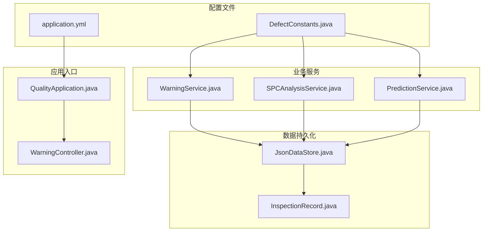
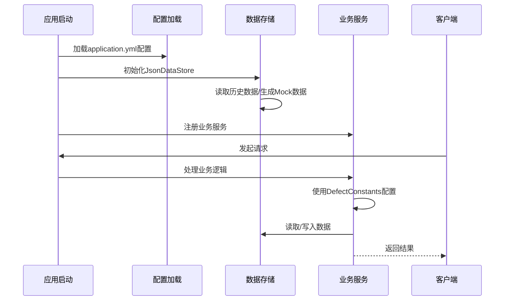
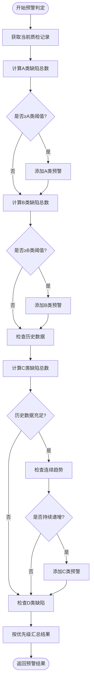
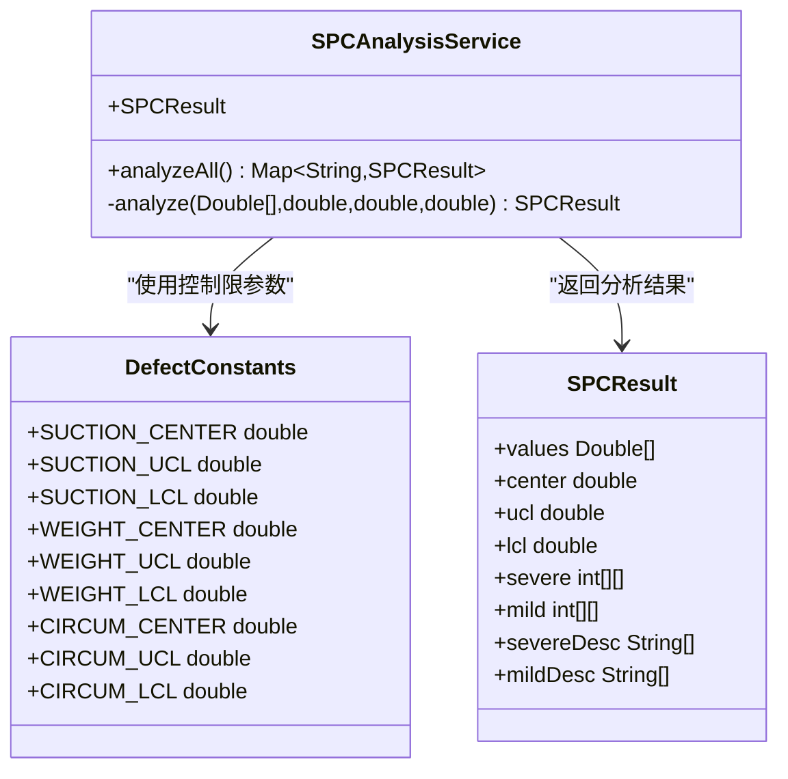
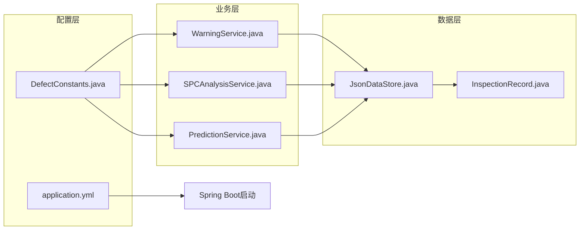

# 配置管理

<cite>
**本文引用的文件**
- [application.yml](file://src/main/resources/application.yml)
- [DefectConstants.java](file://src/main/java/com/zjzy/quality/constant/DefectConstants.java)
- [WarningService.java](file://src/main/java/com/zjzy/quality/service/WarningService.java)
- [SPCAnalysisService.java](file://src/main/java/com/zjzy/quality/service/SPCAnalysisService.java)
- [PredictionService.java](file://src/main/java/com/zjzy/quality/service/PredictionService.java)
- [JsonDataStore.java](file://src/main/java/com/zjzy/quality/util/JsonDataStore.java)
- [InspectionRecord.java](file://src/main/java/com/zjzy/quality/entity/InspectionRecord.java)
- [WarningController.java](file://src/main/java/com/zjzy/quality/controller/WarningController.java)
- [QualityApplication.java](file://src/main/java/com/zjzy/quality/QualityApplication.java)
- [pom.xml](file://pom.xml)
</cite>

## 目录
1. [简介](#简介)
2. [项目结构](#项目结构)
3. [核心组件](#核心组件)
4. [架构概览](#架构概览)
5. [详细组件分析](#详细组件分析)
6. [依赖关系分析](#依赖关系分析)
7. [性能考虑](#性能考虑)
8. [故障排除指南](#故障排除指南)
9. [结论](#结论)
10. [附录](#附录)

## 简介
本配置管理文档详细说明了卷烟全维度质检智能预警预判系统的配置选项和参数设置。系统采用Spring Boot框架，通过application.yml配置服务器端口、静态资源映射和日志级别等基础配置，同时通过DefectConstants常量类定义业务配置参数，包括A/B/C/D四级预警的标准阈值、SPC控制图的参数设置、预测分析的时间窗口配置等。本文档旨在帮助用户正确理解和使用这些配置，以实现预期的系统行为，并提供不同场景下的推荐配置方案以及配置文件的版本管理和变更跟踪方法。

## 项目结构
系统采用标准的Spring Boot项目结构，主要配置文件位于resources目录下，业务配置参数集中在constant包的DefectConstants类中，核心业务逻辑分布在service包中，数据持久化通过util包的JsonDataStore实现。

**图表来源**
- [application.yml:1-24](file://src/main/resources/application.yml#L1-L24)
- [DefectConstants.java:1-76](file://src/main/java/com/zjzy/quality/constant/DefectConstants.java#L1-L76)
- [QualityApplication.java:1-25](file://src/main/java/com/zjzy/quality/QualityApplication.java#L1-L25)

**章节来源**
- [application.yml:1-24](file://src/main/resources/application.yml#L1-L24)
- [pom.xml:1-77](file://pom.xml#L1-L77)

## 核心组件

### Spring Boot基础配置
系统的基础配置主要通过application.yml文件进行管理，涵盖服务器配置、静态资源映射和日志级别设置。

#### 服务器配置
- **端口设置**: 默认监听8080端口，可通过修改server.port调整
- **上下文路径**: 默认根路径"/"，可通过server.servlet.context-path自定义

#### 静态资源配置
- **静态资源位置**: classpath:/static/目录
- **静态路径模式**: /static/**匹配所有静态资源请求

#### 日志级别配置
- **应用日志级别**: com.zjzy.quality包设置为INFO级别
- **框架日志级别**: org.springframework包设置为WARN级别

**章节来源**
- [application.yml:4-24](file://src/main/resources/application.yml#L4-L24)

### 业务配置参数
DefectConstants类集中定义了所有业务相关的配置参数，采用静态常量形式，便于全局访问和统一管理。

#### 缺陷分级阈值配置
- **A类缺陷触发阈值**: 任意层级A类缺陷>=1即触发高风险预警
- **B类缺陷触发阈值**: 所有层级B类缺陷合计>=3触发中度预警  
- **C类缺陷连续班次数**: 连续3班次C类总数严格递增触发一般预警

#### 物测指标内控标准
系统支持三个关键物测指标的内控限设置：
- **吸阻(Pa)**: 中心线1100.0，UCL 1300.0，LCL 900.0
- **单支重量(g)**: 中心线0.900，UCL 0.980，LCL 0.820  
- **圆周(mm)**: 中心线24.50，UCL 24.90，LCL 24.10

#### 预警配色方案
采用苹果风格的配色体系：
- A类严重缺陷: Apple红 (#FF3B30)
- B类较重缺陷: Apple橙 (#FF9500)
- C类一般缺陷: Apple黄 (#FFCC00)
- D类轻微缺陷: Apple灰 (#C7C7CC)
- 无风险安全: Apple绿 (#34C759)

#### 风险等级文本
- 高风险: "高风险"
- 中度风险: "中度风险"
- 一般风险: "一般风险"
- 平稳: "平稳"

#### 外观模块配置
- 模块名称数组: {"cigarette", "boxSmall", "carton", "caseA"}
- 模块标签数组: {"烟支", "小盒", "条盒", "箱装"}
- 等级后缀数组: {"A", "B", "C", "D"}

**章节来源**
- [DefectConstants.java:9-72](file://src/main/java/com/zjzy/quality/constant/DefectConstants.java#L9-L72)

### 预测分析配置
PredictionService类实现了基于Holt双参数指数平滑的时序预测功能，包含以下关键配置：

#### 平滑参数
- **Alpha参数**: 0.3，用于观测值的平滑
- **Beta参数**: 0.1，用于趋势的平滑

#### 时间窗口配置
- **预测天数**: 7天
- **近期平均计算天数**: 最近5天的数据

#### 风险判断阈值
- **风险倍数**: 预测最大值超过近期平均值的1.5倍时触发风险预警
- **A/B类缺陷检查**: 当近期A/B类缺陷率大于0时才进行风险判断

**章节来源**
- [PredictionService.java:16-21](file://src/main/java/com/zjzy/quality/service/PredictionService.java#L16-L21)

## 架构概览
系统采用分层架构设计，配置管理贯穿整个应用生命周期，从启动初始化到业务处理的各个环节都依赖于配置参数。

**图表来源**
- [QualityApplication.java:14-18](file://src/main/java/com/zjzy/quality/QualityApplication.java#L14-L18)
- [JsonDataStore.java:46-62](file://src/main/java/com/zjzy/quality/util/JsonDataStore.java#L46-L62)
- [WarningService.java:23-99](file://src/main/java/com/zjzy/quality/service/WarningService.java#L23-L99)

## 详细组件分析

### 预警判定服务配置
WarningService是系统的核心业务服务，负责根据DefectConstants中的配置参数进行预警判定。

#### 预警判定流程

**图表来源**
- [WarningService.java:23-99](file://src/main/java/com/zjzy/quality/service/WarningService.java#L23-L99)

#### 配置参数影响分析
- **A类阈值(1)**: 影响高风险预警的敏感度，阈值越低越容易触发预警
- **B类阈值(3)**: 影响中度风险预警的触发条件，阈值越高越保守
- **C类连续班次(3)**: 影响一般风险预警的趋势判断，连续性要求越高越严格

**章节来源**
- [WarningService.java:23-99](file://src/main/java/com/zjzy/quality/service/WarningService.java#L23-L99)

### SPC控制图配置
SPCAnalysisService实现了Nelson八条规则的SPC分析，所有控制限参数均来自DefectConstants配置。

#### 控制限计算

**图表来源**
- [SPCAnalysisService.java:45-74](file://src/main/java/com/zjzy/quality/service/SPCAnalysisService.java#L45-L74)
- [DefectConstants.java:23-42](file://src/main/java/com/zjzy/quality/constant/DefectConstants.java#L23-L42)

#### SPC规则实现
系统实现了完整的Nelson八条规则：
1. **单点超出3σ控制限** - 严重异常
2. **连续9点在中心线同侧** - 轻微异常
3. **连续6点递增或递减** - 轻微异常
4. **连续14点交替升降** - 轻微异常
5. **连续3点中2点超出2σ** - 轻微异常
6. **连续5点中4点超出1σ** - 轻微异常
7. **连续15点在1σ内** - 轻微异常
8. **连续8点在1σ外两侧** - 轻微异常

**章节来源**
- [SPCAnalysisService.java:79-239](file://src/main/java/com/zjzy/quality/service/SPCAnalysisService.java#L79-L239)

### 数据持久化配置
JsonDataStore负责数据的持久化存储，采用JSON格式保存在data目录下。

#### 文件存储策略
- **数据目录**: 项目根目录/data/
- **质检数据文件**: inspection_data.json
- **预警日志文件**: warning_log.json
- **Gson配置**: 美化输出，日期格式化

#### Mock数据生成
当无历史数据时，系统会自动生成30条Mock数据用于演示，包含完整的质检记录和风险等级标注。

**章节来源**
- [JsonDataStore.java:22-29](file://src/main/java/com/zjzy/quality/util/JsonDataStore.java#L22-L29)

## 依赖关系分析

### 配置依赖关系
系统配置之间存在明确的依赖关系，确保业务逻辑的正确执行。

**图表来源**
- [application.yml:4-24](file://src/main/resources/application.yml#L4-L24)
- [DefectConstants.java:1-76](file://src/main/java/com/zjzy/quality/constant/DefectConstants.java#L1-L76)

### 组件耦合分析
- **低耦合设计**: 各业务服务通过静态常量访问配置，减少直接依赖
- **集中式配置**: 业务参数集中在DefectConstants中，便于维护
- **数据独立**: JsonDataStore提供独立的数据访问接口

**章节来源**
- [WarningService.java:3-6](file://src/main/java/com/zjzy/quality/service/WarningService.java#L3-L6)
- [SPCAnalysisService.java:3-6](file://src/main/java/com/zjzy/quality/service/SPCAnalysisService.java#L3-L6)

## 性能考虑

### 配置对性能的影响
1. **阈值设置对性能的影响**:
   - 更严格的阈值(更低的触发条件)会增加预警判定频率
   - 更宽松的阈值会减少误报但可能漏报风险

2. **历史数据长度的影响**:
   - C类缺陷趋势分析需要足够的历史数据才能准确判断
   - 数据量越大，SPC分析的准确性越高

3. **预测窗口大小的影响**:
   - 预测天数越多，计算复杂度越高
   - 近期平均天数影响实时响应速度

### 优化建议
- **动态阈值调整**: 根据历史数据统计结果动态调整阈值
- **增量更新**: 仅对新增数据进行SPC分析，避免全量重新计算
- **缓存机制**: 对频繁访问的统计数据建立缓存

## 故障排除指南

### 常见配置问题
1. **端口占用问题**:
   - 症状: 应用启动失败，提示端口被占用
   - 解决: 修改application.yml中的server.port配置

2. **静态资源无法访问**:
   - 症状: 页面样式和脚本加载失败
   - 解决: 检查spring.web.resources.static-locations配置

3. **数据持久化异常**:
   - 症状: 数据无法保存或读取
   - 解决: 检查data目录权限和磁盘空间

### 配置验证方法
1. **启动日志检查**: 查看应用启动时的配置加载信息
2. **接口测试**: 通过API接口验证配置生效情况
3. **数据验证**: 检查历史数据和Mock数据的完整性

**章节来源**
- [JsonDataStore.java:96-149](file://src/main/java/com/zjzy/quality/util/JsonDataStore.java#L96-L149)

## 结论
本配置管理系统通过集中式的配置管理实现了业务参数的灵活调整和统一控制。application.yml提供了基础的系统配置，DefectConstants类集中管理业务参数，各业务服务通过标准化的接口访问配置，确保了系统的可维护性和可扩展性。合理的配置选择能够有效平衡预警的敏感性和准确性，为卷烟质量管控提供可靠的技术支撑。

## 附录

### 不同场景下的推荐配置方案

#### 生产环境配置
- **预警阈值**: A类=1，B类=3，C类连续=3班次
- **SPC控制限**: 使用实际生产数据计算的控制限
- **日志级别**: INFO级别，便于问题追踪
- **预测窗口**: 7天预测，近期5天平均

#### 开发环境配置
- **端口**: 8080或其他空闲端口
- **静态资源**: 开发模式下可使用热部署
- **日志级别**: DEBUG级别，便于调试
- **数据存储**: 使用Mock数据进行快速开发

#### 验收测试配置
- **阈值**: 相对宽松的阈值，便于测试各种场景
- **数据量**: 使用完整的Mock数据集
- **监控**: 启用详细的日志记录

### 配置文件版本管理和变更跟踪

#### 版本管理策略
1. **Git版本控制**: 所有配置文件纳入版本管理
2. **分支管理**: 不同环境使用不同分支
3. **标签管理**: 重要配置变更打标签标记

#### 变更跟踪方法
1. **变更日志**: 记录每次配置变更的原因和影响
2. **回滚机制**: 支持快速回滚到之前的配置版本
3. **影响评估**: 变更前评估对业务逻辑的影响

#### 最佳实践
- **文档同步**: 配置变更时同步更新相关文档
- **测试验证**: 变更后进行全面的功能测试
- **通知机制**: 重要配置变更及时通知相关人员