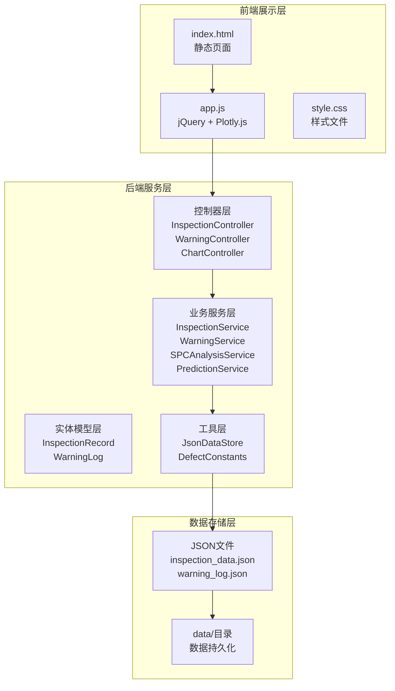
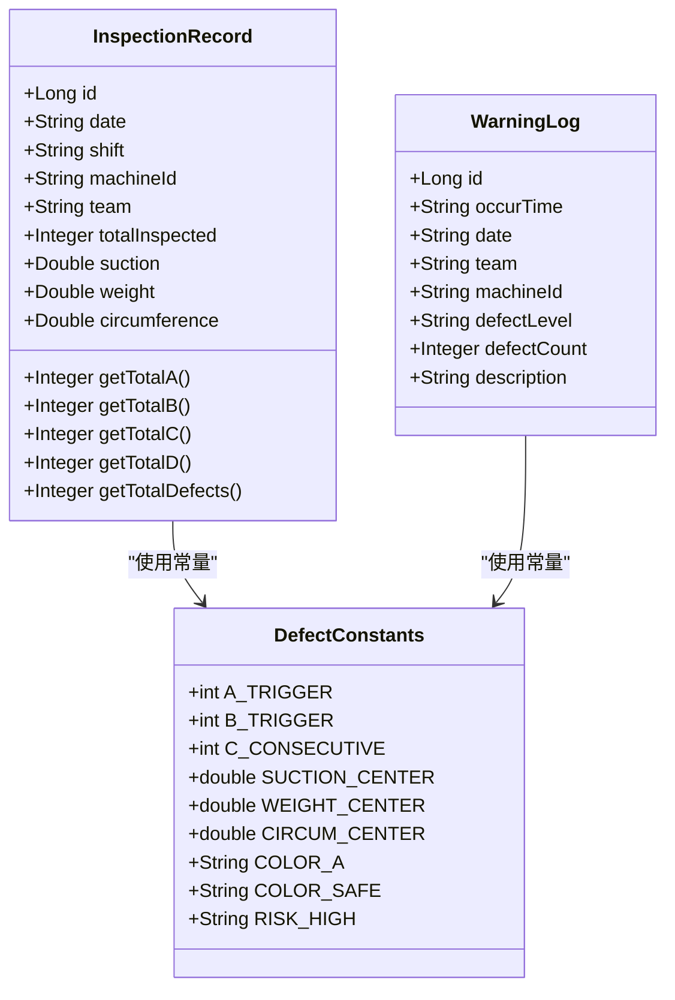
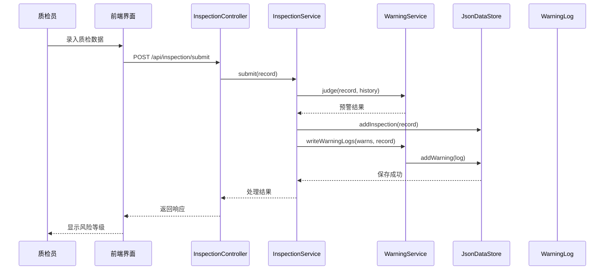
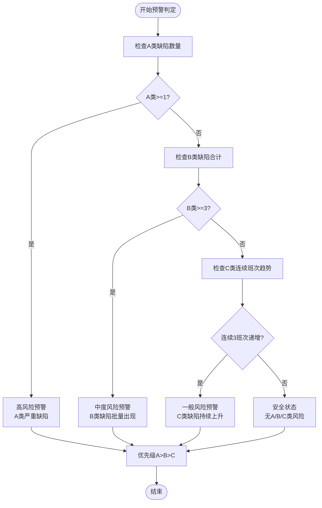
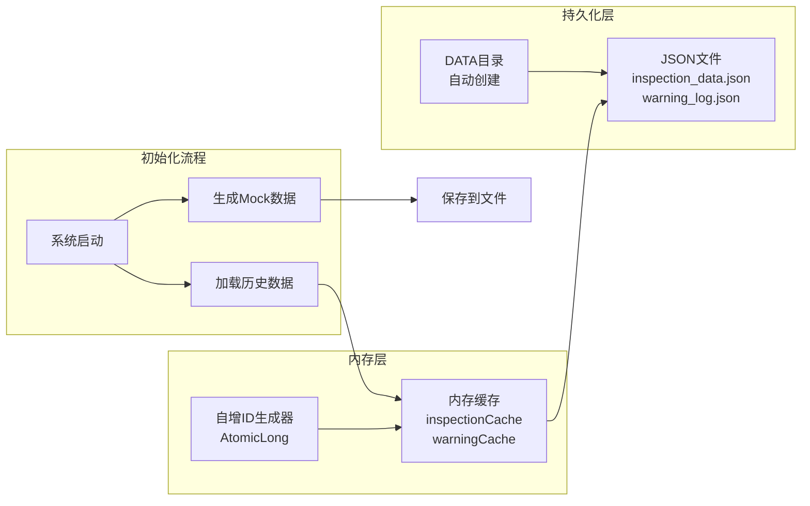
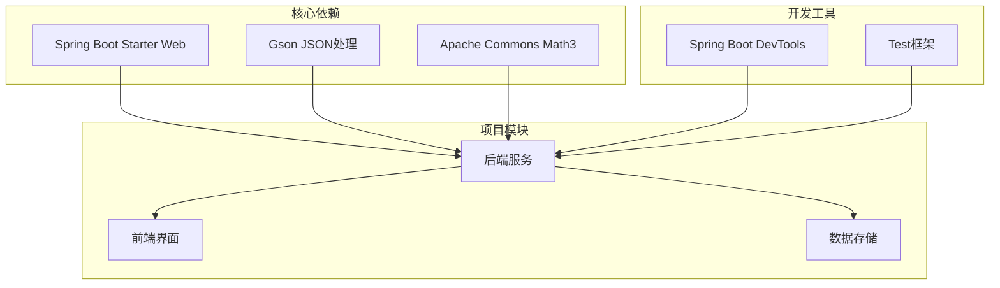

# 项目概述

<cite>
**本文档引用的文件**
- [QualityApplication.java](file://src/main/java/com/zjzy/quality/QualityApplication.java)
- [application.yml](file://src/main/resources/application.yml)
- [InspectionController.java](file://src/main/java/com/zjzy/quality/controller/InspectionController.java)
- [WarningController.java](file://src/main/java/com/zjzy/quality/controller/WarningController.java)
- [ChartController.java](file://src/main/java/com/zjzy/quality/controller/ChartController.java)
- [InspectionService.java](file://src/main/java/com/zjzy/quality/service/InspectionService.java)
- [WarningService.java](file://src/main/java/com/zjzy/quality/service/WarningService.java)
- [PredictionService.java](file://src/main/java/com/zjzy/quality/service/PredictionService.java)
- [SPCAnalysisService.java](file://src/main/java/com/zjzy/quality/service/SPCAnalysisService.java)
- [JsonDataStore.java](file://src/main/java/com/zjzy/quality/util/JsonDataStore.java)
- [InspectionRecord.java](file://src/main/java/com/zjzy/quality/entity/InspectionRecord.java)
- [WarningLog.java](file://src/main/java/com/zjzy/quality/entity/WarningLog.java)
- [DefectConstants.java](file://src/main/java/com/zjzy/quality/constant/DefectConstants.java)
- [app.js](file://src/main/resources/static/js/app.js)
- [style.css](file://src/main/resources/static/css/style.css)
- [pom.xml](file://pom.xml)
</cite>

## 目录
1. [引言](#引言)
2. [项目结构](#项目结构)
3. [核心组件](#核心组件)
4. [架构概览](#架构概览)
5. [详细组件分析](#详细组件分析)
6. [依赖分析](#依赖分析)
7. [性能考虑](#性能考虑)
8. [故障排除指南](#故障排除指南)
9. [结论](#结论)
10. [附录](#附录)

## 引言

卷烟全维度质检智能预警预判系统是一个专为卷烟制造企业设计的质量管理数字化平台。该系统通过整合实时质量监控、智能预警、SPC统计过程控制和AI预测分析四大核心功能，为企业提供全方位的质量保障解决方案。

### 核心价值

- **提升质量管控效率**：通过自动化预警机制，实现质量问题的早期发现和及时处理
- **降低质量成本**：预防性质量管理减少废品率和返工成本
- **增强决策支持**：基于数据分析的可视化报表为管理层提供科学决策依据
- **标准化作业流程**：统一的质检标准和操作规范提升整体质量水平

### 目标用户群体

- **质检员**：负责日常质量检测和数据录入，通过系统获得实时预警提示
- **质量管理员**：监控整体质量趋势，制定质量改进措施
- **生产主管**：基于质量数据分析优化生产流程，预防质量事故发生

### 解决的实际问题

- 传统人工质检效率低下，难以满足大规模生产需求
- 质量问题发现滞后，导致大量不合格产品产生
- 质量数据分散，缺乏有效的统计分析和趋势预测能力
- 质量管理标准化程度不高，存在主观判断偏差

## 项目结构

系统采用前后端分离的架构设计，后端使用Spring Boot提供RESTful API服务，前端使用jQuery和Plotly.js构建交互式可视化界面。



**图表来源**
- [QualityApplication.java:12-23](file://src/main/java/com/zjzy/quality/QualityApplication.java#L12-L23)
- [application.yml:4-17](file://src/main/resources/application.yml#L4-L17)

**章节来源**
- [pom.xml:30-65](file://pom.xml#L30-L65)
- [application.yml:1-24](file://src/main/resources/application.yml#L1-L24)

## 核心组件

### 四大核心功能

#### 1. 实时质量监控
- **功能描述**：提供实时的质检数据录入界面和历史数据查询功能
- **技术实现**：基于Spring MVC的RESTful API，支持JSON格式数据传输
- **用户体验**：直观的表单界面，支持批量数据录入和即时反馈

#### 2. 智能预警
- **功能描述**：根据预设的缺陷分级标准自动判定风险等级并发出预警
- **技术实现**：A/B/C/D四级预警机制，结合历史数据分析
- **预警类型**：高风险（A类）、中度风险（B类）、一般风险（C类）、安全状态

#### 3. SPC统计过程控制
- **功能描述**：运用Nelson八大判异规则对关键质量指标进行统计分析
- **技术实现**：吸阻、单支重量、圆周三项核心指标的SPC控制图
- **异常识别**：自动识别异常波动和趋势变化

#### 4. AI预测分析
- **功能描述**：基于Holt双参数指数平滑算法预测未来质量趋势
- **技术实现**：纯Java实现的时序预测模型，无需外部依赖
- **预测能力**：识别潜在的质量风险，提前发出预警信号

**章节来源**
- [InspectionController.java:17-33](file://src/main/java/com/zjzy/quality/controller/InspectionController.java#L17-L33)
- [WarningController.java:20-36](file://src/main/java/com/zjzy/quality/controller/WarningController.java#L20-L36)
- [ChartController.java:21-104](file://src/main/java/com/zjzy/quality/controller/ChartController.java#L21-L104)

## 架构概览

系统采用分层架构设计，确保各层职责清晰、耦合度低、易于维护和扩展。

```mermaid
graph TB
subgraph "表现层"
UI[用户界面<br/>HTML + CSS + JavaScript]
AJAX[AJAX请求<br/>RESTful API调用]
end
subgraph "应用层"
Controller[控制器<br/>@RestController]
Service[业务服务<br/>核心算法实现]
end
subgraph "数据访问层"
Store[数据存储<br/>JSON文件持久化]
Cache[内存缓存<br/>实时数据缓存]
end
subgraph "基础设施"
Spring[Spring Boot框架]
Gson[Gson序列化]
Plotly[Plotly.js图表]
end
UI --> AJAX
AJAX --> Controller
Controller --> Service
Service --> Store
Store --> Cache
Spring --> Controller
Gson --> Store
Plotly --> UI
```

**图表来源**
- [QualityApplication.java:12-23](file://src/main/java/com/zjzy/quality/QualityApplication.java#L12-L23)
- [JsonDataStore.java:20-62](file://src/main/java/com/zjzy/quality/util/JsonDataStore.java#L20-L62)

### 技术架构特点

- **后端技术栈**：Spring Boot 2.7.x + Java 8，轻量级Web框架，快速开发和部署
- **前端技术栈**：jQuery + Plotly.js + Bootstrap，丰富的可视化图表和交互体验
- **数据存储**：JSON文件存储，支持Mock数据和真实数据无缝切换
- **算法实现**：纯Java实现，无需Python环境依赖，便于部署和维护

**章节来源**
- [pom.xml:8-28](file://pom.xml#L8-L28)
- [app.js:1-8](file://src/main/resources/static/js/app.js#L1-L8)

## 详细组件分析

### 数据模型设计

系统采用简洁高效的数据模型设计，确保数据结构清晰、易于理解和扩展。



**图表来源**
- [InspectionRecord.java:7-154](file://src/main/java/com/zjzy/quality/entity/InspectionRecord.java#L7-L154)
- [WarningLog.java:7-44](file://src/main/java/com/zjzy/quality/entity/WarningLog.java#L7-L44)
- [DefectConstants.java:7-76](file://src/main/java/com/zjzy/quality/constant/DefectConstants.java#L7-L76)

### 业务流程分析

#### 质检数据提交流程



**图表来源**
- [InspectionController.java:21-24](file://src/main/java/com/zjzy/quality/controller/InspectionController.java#L21-L24)
- [InspectionService.java:19-44](file://src/main/java/com/zjzy/quality/service/InspectionService.java#L19-L44)
- [WarningService.java:23-99](file://src/main/java/com/zjzy/quality/service/WarningService.java#L23-L99)

#### 预警判定算法流程



**图表来源**
- [WarningService.java:23-99](file://src/main/java/com/zjzy/quality/service/WarningService.java#L23-L99)
- [DefectConstants.java:11-18](file://src/main/java/com/zjzy/quality/constant/DefectConstants.java#L11-L18)

### 数据存储策略

系统采用JSON文件作为主要数据存储介质，结合内存缓存机制确保数据访问性能。



**图表来源**
- [JsonDataStore.java:20-62](file://src/main/java/com/zjzy/quality/util/JsonDataStore.java#L20-L62)
- [JsonDataStore.java:96-149](file://src/main/java/com/zjzy/quality/util/JsonDataStore.java#L96-L149)

**章节来源**
- [JsonDataStore.java:46-62](file://src/main/java/com/zjzy/quality/util/JsonDataStore.java#L46-L62)
- [InspectionService.java:19-44](file://src/main/java/com/zjzy/quality/service/InspectionService.java#L19-L44)

## 依赖分析

系统依赖关系简单清晰，核心依赖包括Spring Boot Web、Gson和Apache Commons Math3。



**图表来源**
- [pom.xml:30-65](file://pom.xml#L30-L65)

### 外部依赖特性

- **Spring Boot Web**：提供完整的Web开发框架，支持RESTful API和静态资源服务
- **Gson**：高效的JSON序列化和反序列化库，支持复杂对象转换
- **Apache Commons Math3**：强大的数学计算库，支持统计分析和预测算法
- **DevTools**：开发时热部署支持，提升开发效率

**章节来源**
- [pom.xml:30-65](file://pom.xml#L30-L65)

## 性能考虑

### 数据访问优化

系统通过内存缓存机制显著提升数据访问性能，避免频繁的文件I/O操作。

### 算法性能特征

- **预警判定**：O(n)时间复杂度，n为历史记录数量
- **SPC分析**：O(n)时间复杂度，n为数据点数量
- **AI预测**：O(n)时间复杂度，n为历史数据点数量

### 前端性能优化

- 使用jQuery减少DOM操作开销
- Plotly.js优化图表渲染性能
- 响应式布局适配不同设备屏幕

## 故障排除指南

### 常见问题及解决方案

#### 系统启动失败
- **症状**：应用无法正常启动
- **原因**：端口被占用或配置错误
- **解决方案**：检查application.yml中的端口配置，确保8080端口可用

#### 数据加载异常
- **症状**：历史数据无法显示或为空
- **原因**：JSON文件损坏或权限问题
- **解决方案**：检查data/目录下的JSON文件完整性，确保应用程序有读写权限

#### 图表显示异常
- **症状**：图表无法正常渲染
- **原因**：网络连接问题或JavaScript错误
- **解决方案**：检查浏览器控制台错误信息，确认网络连接正常

**章节来源**
- [JsonDataStore.java:96-149](file://src/main/java/com/zjzy/quality/util/JsonDataStore.java#L96-L149)
- [application.yml:4-5](file://src/main/resources/application.yml#L4-L5)

## 结论

卷烟全维度质检智能预警预判系统通过现代化的技术架构和完善的业务功能，为企业提供了高效、准确、可视化的质量管理解决方案。系统具有以下优势：

- **技术先进**：采用Spring Boot + jQuery + Plotly.js的成熟技术栈
- **功能完善**：涵盖实时监控、智能预警、SPC分析、AI预测四大核心功能
- **易于部署**：纯Java实现，无需复杂的环境配置
- **扩展性强**：模块化设计便于功能扩展和定制开发

该系统能够有效提升卷烟企业的质量管理水平，降低质量成本，为企业数字化转型提供有力支撑。

## 附录

### 快速开始指南

#### 环境要求
- JDK 1.8或更高版本
- Maven 3.6+
- 支持HTTP访问的网络环境

#### 启动步骤

1. **克隆项目**
   ```bash
   git clone [项目地址]
   cd quality-inspection
   ```

2. **编译项目**
   ```bash
   mvn clean package
   ```

3. **启动应用**
   ```bash
   mvn spring-boot:run
   ```
   或者
   ```bash
   java -jar target/quality-inspection-1.0.0.jar
   ```

4. **访问系统**
   在浏览器中打开：http://localhost:8080

#### 基本操作流程

1. **数据录入**：在左侧表单中填写质检数据
2. **提交验证**：点击提交按钮，系统自动进行风险评估
3. **查看结果**：右侧面板实时显示SPC控制图和预测分析
4. **历史查询**：通过历史数据表格查看过往质检记录

#### 配置说明

系统配置主要在application.yml中定义，包括：
- 服务器端口设置
- 静态资源路径配置
- 日志级别设置

**章节来源**
- [QualityApplication.java:8-11](file://src/main/java/com/zjzy/quality/QualityApplication.java#L8-L11)
- [application.yml:4-17](file://src/main/resources/application.yml#L4-L17)